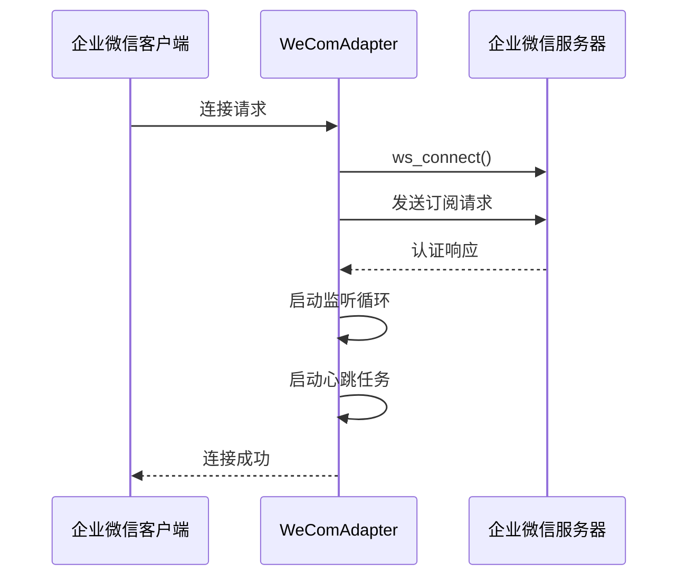
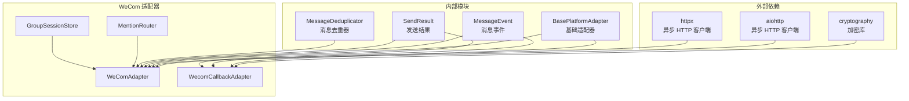

# API 参考

<cite>
**本文档引用的文件**
- [README.md](file://README.md)
- [wecom.py](file://wecom.py)
- [wecom_callback.py](file://wecom_callback.py)
- [wecom_crypto.py](file://wecom_crypto.py)
- [mention_router.py](file://mention_router.py)
- [group_session.py](file://group_session.py)
- [test_mention_fix.py](file://test_mention_fix.py)
- [wecom1.py](file://bk/wecom1.py)
- [wecom_fixed.py](file://bk/wecom_fixed.py)
- [group_session.py](file://bk/group_session.py)
- [mention_router.py](file://bk/mention_router.py)
- [test_mention_fix.py](file://bk/test_mention_fix.py)
</cite>

## 目录
1. [简介](#简介)
2. [项目结构](#项目结构)
3. [核心组件](#核心组件)
4. [架构概览](#架构概览)
5. [详细组件分析](#详细组件分析)
6. [依赖关系分析](#依赖关系分析)
7. [性能考虑](#性能考虑)
8. [故障排除指南](#故障排除指南)
9. [结论](#结论)

## 简介

WeCom 插件是 Hermes Agent 企业微信（WeCom）网关插件，提供了两种不同的集成模式：

1. **WebSocket 模式**：通过持久化的 WebSocket 连接与企业微信 AI Bot 网关通信
2. **HTTP 回调模式**：通过 HTTP 端点接收企业微信的加密回调消息

该插件支持多 Agent 群聊功能，允许在群聊中通过 @mention 机制触发不同的 Agent，实现复杂的对话路由和链式交互。

## 项目结构

项目采用模块化设计，主要包含以下核心文件：

```mermaid
graph TB
subgraph "核心适配器"
A[wecom.py<br/>WebSocket 适配器]
B[wecom_callback.py<br/>HTTP 回调适配器]
end
subgraph "加密模块"
C[wecom_crypto.py<br/>消息加解密]
end
subgraph "多 Agent 支持"
D[mention_router.py<br/>@mention 解析器]
E[group_session.py<br/>群聊会话管理]
end
subgraph "测试文件"
F[test_mention_fix.py<br/>@mention 测试]
end
A --> D
A --> E
B --> C
A --> F
```

**图表来源**
- [wecom.py:1-1774](file://wecom.py#L1-L1774)
- [wecom_callback.py:1-388](file://wecom_callback.py#L1-L388)
- [wecom_crypto.py:1-143](file://wecom_crypto.py#L1-L143)
- [mention_router.py:1-155](file://mention_router.py#L1-L155)
- [group_session.py:1-188](file://group_session.py#L1-L188)

**章节来源**
- [README.md:1-43](file://README.md#L1-L43)

## 核心组件

### WeComAdapter 类

WeComAdapter 是 WebSocket 模式的主适配器类，负责与企业微信 AI Bot 网关建立持久化连接并处理消息。

**主要特性：**
- 持久化 WebSocket 连接管理
- 消息去重和批处理
- 多 Agent @mention 解析
- 媒体文件下载和缓存
- 心跳保活机制

**关键配置参数：**
- `bot_id`: 企业微信机器人的唯一标识
- `secret`: 用于身份验证的密钥
- `websocket_url`: WebSocket 服务器地址
- `dm_policy`: 私聊策略（open/allowlist/disabled/pairing）
- `group_policy`: 群聊策略（open/allowlist/disabled）

**章节来源**
- [wecom.py:160-207](file://wecom.py#L160-L207)
- [wecom.py:171-185](file://wecom.py#L171-L185)

### WecomCallbackAdapter 类

WecomCallbackAdapter 是 HTTP 回调模式的适配器，处理企业微信的 HTTP POST 回调请求。

**主要特性：**
- HTTP 服务器监听
- XML 消息加解密
- 访问令牌管理
- 异步消息队列处理

**关键配置参数：**
- `host`: HTTP 服务器监听地址
- `port`: HTTP 服务器端口
- `path`: 回调端点路径
- `apps`: 应用配置列表

**章节来源**
- [wecom_callback.py:55-72](file://wecom_callback.py#L55-L72)
- [wecom_callback.py:58-97](file://wecom_callback.py#L58-L97)

## 架构概览

```mermaid
graph TB
subgraph "企业微信客户端"
A[用户]
B[企业微信应用]
end
subgraph "WeCom 插件"
C[WebSocket 适配器]
D[HTTP 回调适配器]
E[@mention 解析器]
F[群聊会话管理]
end
subgraph "企业微信服务器"
G[AI Bot 网关]
H[HTTP 回调服务]
end
A --> B
B --> G
B --> H
G --> C
H --> D
C --> E
C --> F
D --> E
D --> F
```

**图表来源**
- [wecom.py:212-246](file://wecom.py#L212-L246)
- [wecom_callback.py:103-149](file://wecom_callback.py#L103-L149)

## 详细组件分析

### WebSocket API 接口

#### 连接建立

WebSocket 模式通过以下步骤建立连接：

1. **初始化连接参数**
   - 从配置或环境变量读取 bot_id 和 secret
   - 设置 WebSocket URL 和超时参数
   - 初始化消息去重器和会话管理器

2. **建立 WebSocket 连接**
   - 使用 aiohttp 建立持久化连接
   - 发送订阅请求进行身份验证
   - 等待认证响应确认连接有效性

3. **启动后台任务**
   - 启动消息监听循环
   - 启动心跳保活任务
   - 初始化消息批处理机制



**图表来源**
- [wecom.py:290-327](file://wecom.py#L290-L327)
- [wecom.py:338-377](file://wecom.py#L338-L377)

#### 消息发送接口

WebSocket 模式支持多种消息发送方式：

1. **普通文本消息**
   - 使用 `aibot_send_msg` 命令发送
   - 支持 Markdown 格式
   - 自动处理消息长度限制

2. **媒体文件上传**
   - 分块上传机制 (`aibot_upload_media_init/chunk/finish`)
   - 支持图片、视频、音频和文档
   - 自动文件类型检测和大小限制

3. **回复消息**
   - 使用 `aibot_respond_msg` 命令
   - 维护消息关联性
   - 支持引用回复

**章节来源**
- [wecom.py:444-483](file://wecom.py#L444-L483)
- [wecom.py:82-85](file://wecom.py#L82-L85)

#### 事件处理方法

WebSocket 适配器处理以下类型的事件：

1. **消息回调事件**
   - 解析企业微信消息格式
   - 提取消息内容和元数据
   - 触发相应的业务处理

2. **系统事件**
   - 心跳响应 (`ping`)
   - 事件通知 (`aibot_event_callback`)
   - 连接状态变化

3. **响应事件**
   - 处理异步操作的响应
   - 管理请求-响应关联
   - 错误处理和重试机制

**章节来源**
- [wecom.py:398-430](file://wecom.py#L398-L430)
- [wecom.py:495-586](file://wecom.py#L495-L586)

### HTTP 回调 API 接口

#### 端点规范

HTTP 回调模式提供以下端点：

1. **URL 验证端点**
   - 方法: GET
   - 路径: `/wecomcallback`
   - 参数: `msg_signature`, `timestamp`, `nonce`, `echostr`
   - 功能: 验证企业微信服务器的 URL

2. **消息回调端点**
   - 方法: POST
   - 路径: `/wecomcallback`
   - 内容: 加密的 XML 消息
   - 功能: 接收企业微信推送的消息

3. **健康检查端点**
   - 方法: GET
   - 路径: `/wecomcallback/health`
   - 功能: 检查服务运行状态

**章节来源**
- [wecom_callback.py:229-276](file://wecom_callback.py#L229-L276)
- [wecom_callback.py:124-136](file://wecom_callback.py#L124-L136)

#### 请求格式

HTTP 回调请求采用以下格式：

**URL 验证请求:**
```
GET /wecomcallback?msg_signature=xxx&timestamp=xxx&nonce=xxx&echostr=xxx
```

**消息回调请求:**
```
POST /wecomcallback
Content-Type: text/plain

<xml>
    <Encrypt>...</Encrypt>
    <MsgSignature>...</MsgSignature>
    <TimeStamp>...</TimeStamp>
    <Nonce>...</Nonce>
</xml>
```

**响应结构:**
- 成功响应: `"success"`
- 验证失败: `403` 状态码
- 无效负载: `400` 状态码

**章节来源**
- [wecom_callback.py:232-276](file://wecom_callback.py#L232-L276)

#### 响应结构

HTTP 回调适配器的响应遵循以下结构：

**成功响应:**
```json
{
    "status": "ok",
    "platform": "wecom_callback"
}
```

**错误响应:**
```json
{
    "error": "signature verification failed",
    "code": 403
}
```

**章节来源**
- [wecom_callback.py:229-230](file://wecom_callback.py#L229-L230)
- [wecom_callback.py:245](file://wecom_callback.py#L245)

### 多 Agent 群聊支持

#### @mention 解析器

MentionRouter 类负责解析群聊中的 @mention 标记：

**配置结构:**
```yaml
multi_agent:
  enabled: true
  default_agent: alpha
  agents:
    alpha:
      name: Alpha助手
      mention_patterns: ["@Alpha", "@Alpha助手"]
    beta:
      name: Beta助手
      mention_patterns: ["@Beta", "@Beta助手"]
  cross_agent:
    enabled: true
    max_chain_length: 5
    chain_cooldown_seconds: 3
```

**解析规则:**
- 支持多种 @mention 格式
- 多 Agent 触发按出现顺序排列
- 自动去除 @mention 标记
- 支持默认 Agent 回退

**章节来源**
- [mention_router.py:46-101](file://mention_router.py#L46-L101)
- [mention_router.py:102-126](file://mention_router.py#L102-L126)

#### 群聊会话管理

GroupSessionStore 类管理多 Agent 对话链的状态：

**会话状态:**
- `original_message`: 原始用户消息
- `triggered_agents`: 已触发的 Agent 列表
- `chain_depth`: 当前链深度
- `max_chain_length`: 最大链长度
- `cooldown_seconds`: 冷却时间

**控制机制:**
- 防止重复触发同一 Agent
- 限制最大链长度
- 实现冷却时间防止频繁触发
- 支持会话中断和清理

**章节来源**
- [group_session.py:96-157](file://group_session.py#L96-L157)
- [group_session.py:104-127](file://group_session.py#L104-L127)

## 依赖关系分析



**图表来源**
- [wecom.py:46-70](file://wecom.py#L46-L70)
- [wecom_callback.py:22-42](file://wecom_callback.py#L22-L42)

**章节来源**
- [wecom.py:46-70](file://wecom.py#L46-L70)
- [wecom_callback.py:22-42](file://wecom_callback.py#L22-L42)

## 性能考虑

### 连接管理

- **连接池**: 使用 aiohttp 的连接池减少连接开销
- **自动重连**: 实现指数退避重连机制
- **心跳保活**: 定期发送 ping 消息维持连接活跃
- **超时控制**: 合理设置连接和请求超时时间

### 消息处理

- **消息批处理**: 合并连续的文本消息减少处理开销
- **去重机制**: 防止重复消息影响性能
- **异步处理**: 使用 asyncio 实现非阻塞消息处理
- **内存管理**: 及时清理临时数据和缓存

### 媒体文件处理

- **分块上传**: 支持大文件分块上传
- **并发限制**: 控制同时处理的媒体文件数量
- **缓存策略**: 本地缓存常用媒体文件
- **大小限制**: 防止过大文件占用过多资源

## 故障排除指南

### 常见错误和解决方案

**连接失败**
- 检查 bot_id 和 secret 配置
- 验证网络连接和防火墙设置
- 确认 WebSocket URL 正确性
- 查看日志获取详细错误信息

**认证失败**
- 确认企业微信应用配置正确
- 检查密钥是否过期
- 验证权限范围设置
- 确认时间同步（签名验证敏感）

**消息丢失**
- 检查消息去重配置
- 验证消息批处理设置
- 确认网络稳定性
- 查看连接状态日志

**@mention 识别问题**
- 检查 mention_patterns 配置
- 验证多 Agent 配置
- 确认群聊策略设置
- 查看解析器日志

**章节来源**
- [wecom.py:214-246](file://wecom.py#L214-L246)
- [wecom_callback.py:107-149](file://wecom_callback.py#L107-L149)

### 调试技巧

1. **启用详细日志**: 设置日志级别为 DEBUG 获取完整调试信息
2. **监控连接状态**: 定期检查连接和消息处理统计
3. **测试网络延迟**: 使用 ping 命令测试网络质量
4. **验证配置**: 使用配置验证工具检查配置正确性

## 结论

WeCom 插件提供了完整的企业微信集成解决方案，支持两种不同的集成模式以满足不同场景需求。其设计具有以下特点：

**优势:**
- 模块化设计便于维护和扩展
- 支持多 Agent 群聊的复杂交互
- 完善的错误处理和重试机制
- 良好的性能优化和资源管理

**适用场景:**
- 企业内部智能客服系统
- 多 Agent 协作平台
- 自动化工作流集成
- 智能问答和知识管理

**未来发展:**
- 支持更多企业微信功能
- 优化性能和可扩展性
- 增强安全性和可靠性
- 提供更丰富的配置选项

该插件为 Hermes Agent 生态系统提供了强大的企业微信集成能力，能够满足各种复杂的企业级应用场景需求。