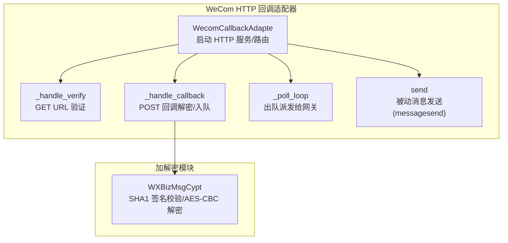
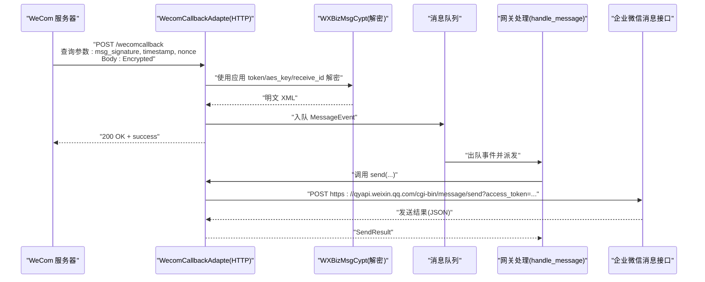
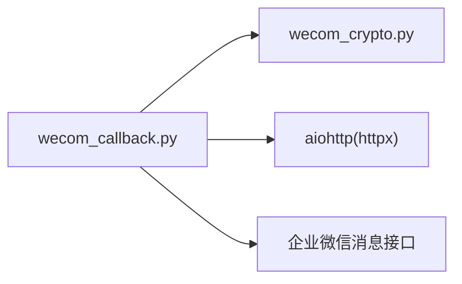

# HTTP 回调 API

<cite>
**本文引用的文件**
- [wecom_callback.py](file://wecom_callback.py)
- [wecom_crypto.py](file://wecom_crypto.py)
- [README.md](file://README.md)
- [group_session.py](file://group_session.py)
- [mention_router.py](file://mention_router.py)
- [test_mention_fix.py](file://test_mention_fix.py)
</cite>

## 目录
1. [简介](#简介)
2. [项目结构](#项目结构)
3. [核心组件](#核心组件)
4. [架构总览](#架构总览)
5. [详细组件分析](#详细组件分析)
6. [依赖分析](#依赖分析)
7. [性能考量](#性能考量)
8. [故障排查指南](#故障排查指南)
9. [结论](#结论)
10. [附录](#附录)

## 简介
本文件面向使用 WeCom HTTP 回调模式的企业自建应用，系统性说明回调端点、请求格式、签名验证、时间戳与重放防护、消息数据结构、事件类型处理、请求与响应示例、与 WebSocket 模式的差异与选型建议，以及部署与安全注意事项。该实现基于本地 HTTP 服务接收加密 XML，解密后入队并立即确认，后续通过被动消息接口发送回复。

## 项目结构
- wecom_callback.py：HTTP 回调适配器，负责启动本地 HTTP 服务、处理 GET 验签与 POST 回调、解密与事件构建、出站消息发送。
- wecom_crypto.py：与官方 WXBizMsgCrypt 兼容的消息加解密工具，实现 SHA1 签名、AES-CBC 加密与 PKCS7 填充。
- group_session.py：群聊会话状态管理（用于 WebSocket 模式，但与回调模式可并存）。
- mention_router.py：群聊 @mention 解析与路由（用于 WebSocket 模式，但与回调模式可并存）。
- test_mention_fix.py：测试脚本，演示企业微信群聊 @ 提及检测逻辑（用于 WebSocket 模式，但与回调模式可并存）。
- README.md：项目说明与多 Agent 群聊能力概述。

图表来源
- [wecom_callback.py:124-127](file://wecom_callback.py#L124-L127)
- [wecom_callback.py:232-276](file://wecom_callback.py#L232-L276)
- [wecom_callback.py:278-288](file://wecom_callback.py#L278-L288)
- [wecom_callback.py:178-210](file://wecom_callback.py#L178-L210)
- [wecom_crypto.py:66-112](file://wecom_crypto.py#L66-L112)

章节来源
- [wecom_callback.py:124-127](file://wecom_callback.py#L124-L127)
- [wecom_callback.py:232-276](file://wecom_callback.py#L232-L276)
- [wecom_callback.py:278-288](file://wecom_callback.py#L278-L288)
- [wecom_callback.py:178-210](file://wecom_callback.py#L178-L210)
- [wecom_crypto.py:66-112](file://wecom_crypto.py#L66-L112)

## 核心组件
- HTTP 服务器与路由
  - 监听地址与端口默认为 0.0.0.0:8645，路径默认为 /wecomcallback。
  - 注册健康检查 GET /health、URL 验证 GET /wecomcallback、回调入口 POST /wecomcallback。
- 应用配置与多应用支持
  - 支持通过 extra.apps 或 cop_id/token/encoding_aes_key/agent_id 等参数配置多个应用，按 cop_id:use_id 作用域隔离。
- 回调解密与事件构建
  - 从查询参数提取 msg_signature、timestamp、nonce，从请求体提取 Encrypted 字段，使用对应应用的 token、encoding_aes_key、receive_id 进行解密。
  - 构造 MessageEvent，过滤生命周期事件，仅保留 text/event 类型。
- 出站消息发送
  - 使用 access_token 主动调用企业微信消息发送接口，支持文本消息。
- 访问令牌缓存与刷新
  - 缓存 access_token，过期前 60 秒自动刷新。

章节来源
- [wecom_callback.py:55-72](file://wecom_callback.py#L55-L72)
- [wecom_callback.py:103-149](file://wecom_callback.py#L103-L149)
- [wecom_callback.py:232-276](file://wecom_callback.py#L232-L276)
- [wecom_callback.py:293-336](file://wecom_callback.py#L293-L336)
- [wecom_callback.py:357-387](file://wecom_callback.py#L357-L387)

## 架构总览
下图展示 WeCom HTTP 回调模式的关键交互：WeCom 服务器向本地 HTTP 端点推送加密 XML，适配器解密后入队，随后由网关异步处理；回复通过被动消息接口发送。

图表来源
- [wecom_callback.py:247-276](file://wecom_callback.py#L247-L276)
- [wecom_callback.py:293-300](file://wecom_callback.py#L293-L300)
- [wecom_callback.py:178-210](file://wecom_callback.py#L178-L210)
- [wecom_callback.py:364-387](file://wecom_callback.py#L364-L387)

## 详细组件分析

### HTTP 端点与请求格式
- 健康检查
  - 方法: GET
  - 路径: /health
  - 返回: {"status":"ok","platform":"wecom_callback"}
- URL 验证（GET）
  - 方法: GET
  - 路径: /wecomcallback
  - 查询参数:
    - msg_signature: SHA1 签名
    - timestamp: 时间戳
    - nonce: 随机数
    - echostr: 加密回显串
  - 行为: 使用各应用的 token/aes_key/receive_id 验证签名，成功则返回明文 echostr，失败返回 403。
- 回调入口（POST）
  - 方法: POST
  - 路径: /wecomcallback
  - 查询参数:
    - msg_signature: SHA1 签名
    - timestamp: 时间戳
    - nonce: 随机数
  - 请求体: Encrypted 字段的加密内容（XML 字符串），内部包含明文 XML。
  - 行为: 尝试用每个应用的密钥解密，成功后构建事件入队并立即返回 "success"。

章节来源
- [wecom_callback.py:124-127](file://wecom_callback.py#L124-L127)
- [wecom_callback.py:229-246](file://wecom_callback.py#L229-L246)
- [wecom_callback.py:247-276](file://wecom_callback.py#L247-L276)

### 回调消息验证机制
- 签名验证
  - 使用 SHA1 对 token、timestamp、nonce、Encrypted 按字典序拼接后计算摘要，与 msg_signature 比较。
- AES-CBC 解密
  - 使用 encoding_aes_key 解码为 32 字节密钥与 16 字节 IV。
  - Base64 解码 Encrypted，AES-CBC 解密，PKCS7 去填充。
  - 跳过 16 字节随机前缀，解析 4 字节长度字段，提取明文 XML，并校验 receive_id。
- 时间戳检查与重放防护
  - 当前实现未直接校验 timestamp 与当前时间差，也未内置去重表（见“消息去重”部分）。
  - 建议在企业微信后台开启“重放防护”或在业务侧增加时间窗口与消息去重策略。

章节来源
- [wecom_crypto.py:88-112](file://wecom_crypto.py#L88-L112)
- [wecom_callback.py:293-300](file://wecom_callback.py#L293-L300)

### 回调消息数据结构
- 请求体（Encrypted 内容解密后）
  - XML 结构包含以下关键字段：
    - MsgType: 文本或事件
    - Content: 文本内容（当 MsgType=text）
    - Event: 事件名称（当 MsgType=event）
    - FromUserName/ToUserName: 发送方/接收方标识
    - MsgId: 消息 ID
    - CreateTime: 创建时间
- 事件过滤
  - 仅处理 MsgType 为 text 或 event 的消息；event 中的 enter_agent、subscribe 等生命周期事件会被静默忽略。
- 事件构建
  - 构造 MessageEvent，其中 chat_id 采用 cop_id:use_id 作用域，确保多企业/多应用隔离。
  - 若为 event 且无 Content，则以 "stat" 填充文本。

章节来源
- [wecom_callback.py:302-336](file://wecom_callback.py#L302-L336)

### 不同类型事件处理
- 文本消息
  - 直接入队，交由网关处理。
- 生命周期事件
  - enter_agent、subscribe 等事件被忽略，不入队。
- 其他类型
  - 非 text/event 的消息被忽略。

章节来源
- [wecom_callback.py:306-311](file://wecom_callback.py#L306-L311)

### 出站消息发送（被动消息）
- 接口: POST https://qyapi.weixin.qq.com/cgi-bin/message/send?access_token={token}
- 参数:
  - touser: 接收者 ID（来自 chat_id 的 use_id 部分）
  - msgtype: text
  - agentid: 应用 agent_id
  - text.content: 文本内容（最多 2048 字符）
  - safe: 0
- 返回:
  - 成功: {"errcode":0,"msgid":"..."}
  - 失败: {"errcode":N,...}

章节来源
- [wecom_callback.py:178-210](file://wecom_callback.py#L178-L210)
- [wecom_callback.py:364-387](file://wecom_callback.py#L364-L387)

### 请求与响应示例（路径参考）
- URL 验证请求
  - GET /wecomcallback?msg_signature=...&timestamp=...&nonce=...&echostr=...
  - 成功响应: 200 OK + 明文 echostr
  - 失败响应: 403 Forbidden + "signature verification failed"
- 回调请求
  - POST /wecomcallback?msg_signature=...&timestamp=...&nonce=...
  - Body: Encrypted=...
  - 成功响应: 200 OK + "success"
  - 失败响应: 400 Bad Request + "invalid callback payload"
- 被动消息发送
  - POST https://qyapi.weixin.qq.com/cgi-bin/message/send?access_token={token}
  - 请求体: {"touser":"...","msgtype":"text","agentid":...,"text":{"content":"..."},"safe":0}
  - 响应: {"errcode":0,"msgid":"..."}

章节来源
- [wecom_callback.py:229-246](file://wecom_callback.py#L229-L246)
- [wecom_callback.py:247-276](file://wecom_callback.py#L247-L276)
- [wecom_callback.py:178-210](file://wecom_callback.py#L178-L210)

### 与 WebSocket 模式的区别与选型
- WebSocket 模式
  - 通过持久 WebSocket 连接接收实时回调，支持更丰富的消息类型与媒体下载。
  - 适合需要低延迟、复杂消息处理与多 Agent 群聊场景。
- HTTP 回调模式
  - 通过 HTTP 端点接收加密回调，解密后入队，回复通过被动消息接口发送。
  - 适合简单场景、防火墙限制或希望减少长连接维护成本的部署。

章节来源
- [README.md:7-11](file://README.md#L7-L11)
- [wecom.py:1-28](file://wecom.py#L1-L28)

## 依赖分析
- 组件耦合
  - WecomCallbackAdapte 依赖 WXBizMsgCypt 完成加解密。
  - 依赖 aiohttp(httpx) 提供 HTTP 服务与异步客户端。
- 外部依赖
  - 企业微信消息发送接口（被动消息）。
- 可能的循环依赖
  - 代码中未发现循环导入；模块职责清晰。

图表来源
- [wecom_callback.py:23-36](file://wecom_callback.py#L23-L36)
- [wecom_callback.py:338-343](file://wecom_callback.py#L338-L343)
- [wecom_callback.py:196-199](file://wecom_callback.py#L196-L199)

章节来源
- [wecom_callback.py:23-36](file://wecom_callback.py#L23-L36)
- [wecom_callback.py:338-343](file://wecom_callback.py#L338-L343)
- [wecom_callback.py:196-199](file://wecom_callback.py#L196-L199)

## 性能考量
- 异步处理
  - 使用 asyncio 队列与任务派发，避免阻塞回调确认。
- 并发与资源
  - 单实例可承载多应用，但需注意 HTTP 端口占用与访问令牌并发刷新。
- 延迟与吞吐
  - 解密与入队为 CPU 密集与 IO 密集混合操作，建议合理设置队列容量与并发度。

[本节为通用指导，无需特定文件来源]

## 故障排查指南
- 无法启动 HTTP 服务
  - 检查端口占用与依赖安装（aiohttp/httpx）。
- URL 验证失败
  - 确认 token、encoding_aes_key、receive_id 配置正确；核对后台回调 URL 设置。
- 回调解密失败
  - 核对 msg_signature、timestamp、nonce 是否随请求传递；检查编码与字符集。
- 被动消息发送失败
  - 检查 access_token 获取与有效期；确认 agent_id 与 touser 正确。
- 重复消息或未收到消息
  - 当前实现未内置时间戳校验与去重；可在业务层增加去重策略。

章节来源
- [wecom_callback.py:103-149](file://wecom_callback.py#L103-L149)
- [wecom_callback.py:232-246](file://wecom_callback.py#L232-L246)
- [wecom_callback.py:293-300](file://wecom_callback.py#L293-L300)
- [wecom_callback.py:364-387](file://wecom_callback.py#L364-L387)

## 结论
WeCom HTTP 回调适配器提供了简洁可靠的回调接入方式：快速 URL 验证、标准加解密、事件入队与被动消息回复。对于需要低延迟与丰富消息能力的场景，可结合 WebSocket 模式使用；对于简单部署与防火墙受限环境，HTTP 回调模式是高效选择。

[本节为总结，无需特定文件来源]

## 附录

### 部署配置要点
- 网络与端口
  - 确保 0.0.0.0:8645 可访问；若使用反向代理，请透传查询参数与请求体。
- 证书与域名
  - 企业微信回调 URL 需为公网可访问地址；如使用 HTTPS，需配置有效证书。
- 应用配置
  - 在企业微信后台配置回调 URL 与加密参数；在适配器中配置 token、encoding_aes_key、receive_id、agent_id。

[本节为通用指导，无需特定文件来源]

### 安全考虑
- 传输安全
  - 建议使用 HTTPS；在反向代理层启用 TLS。
- 参数完整性
  - 确保 msg_signature、timestamp、nonce 与 Encrypted 完整传递。
- 重放防护
  - 当前实现未内置时间戳校验与去重；建议在企业微信后台启用重放防护或在业务层增加去重策略。
- 最小权限
  - 仅授予必要的 agent 权限；定期轮换密钥与 access_token。

[本节为通用指导，无需特定文件来源]