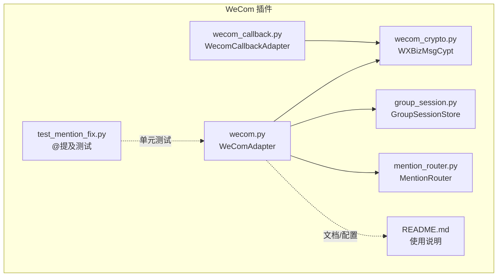
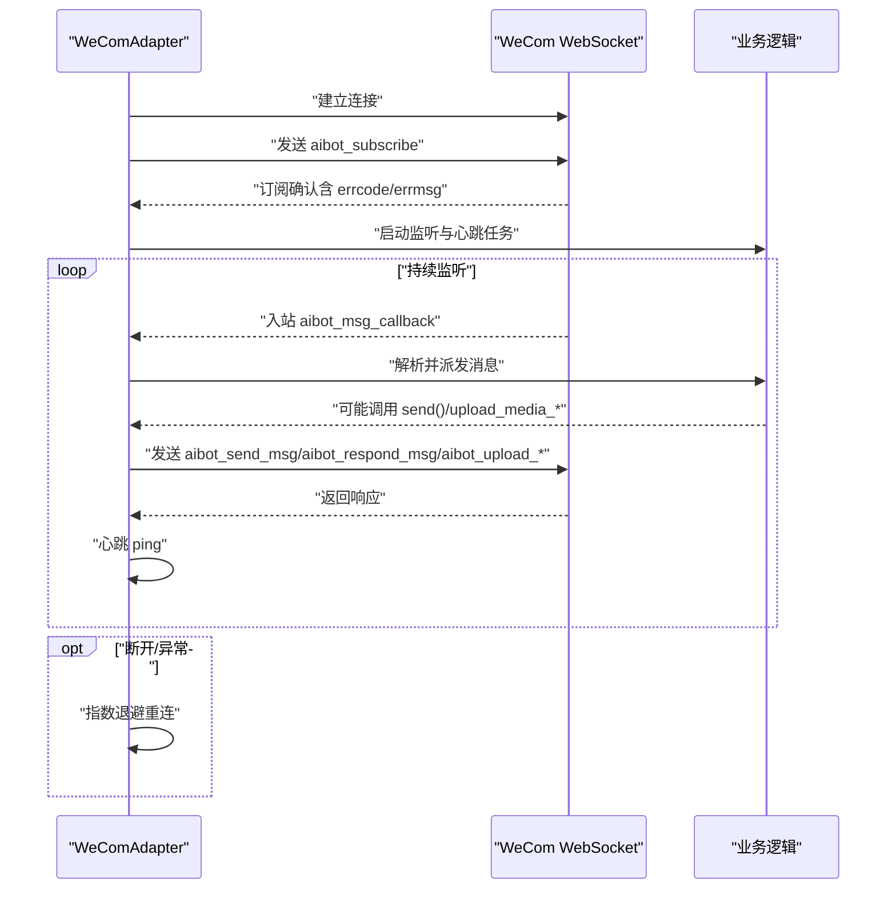
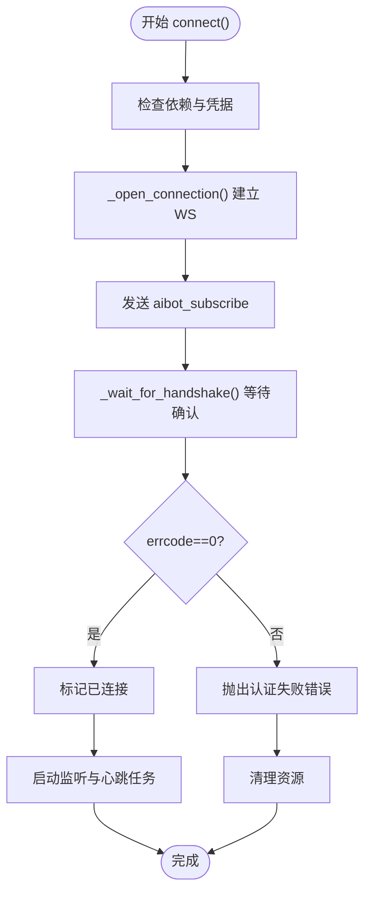
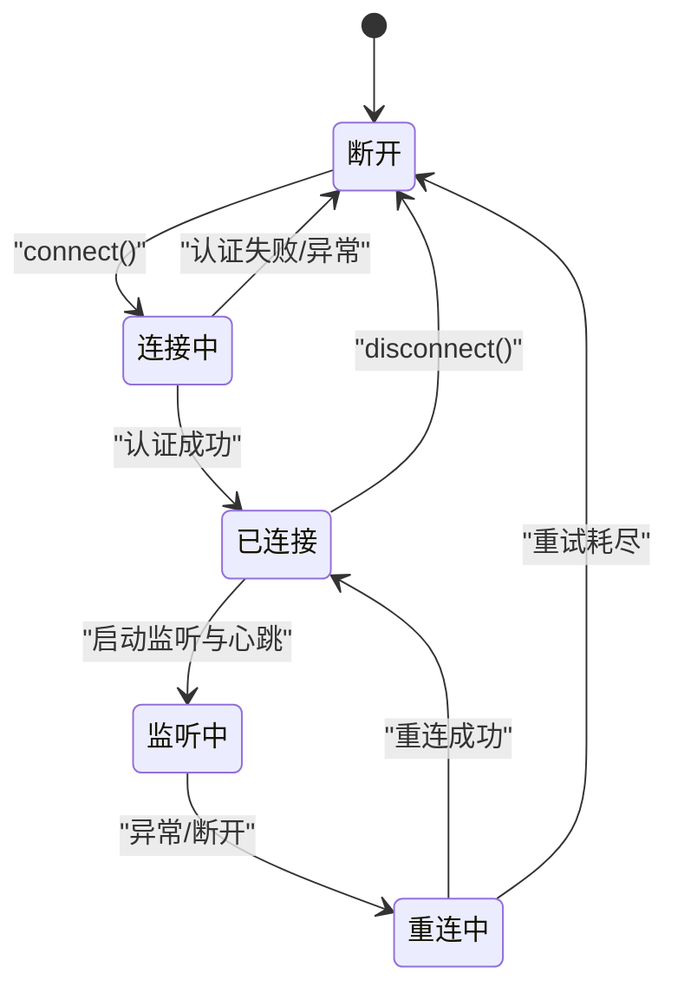
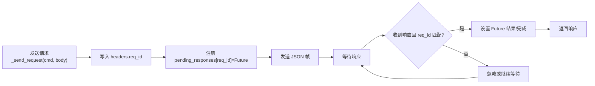
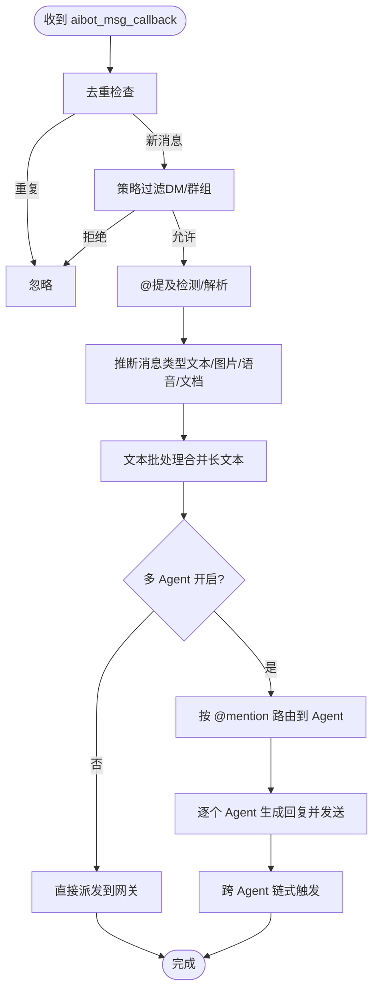
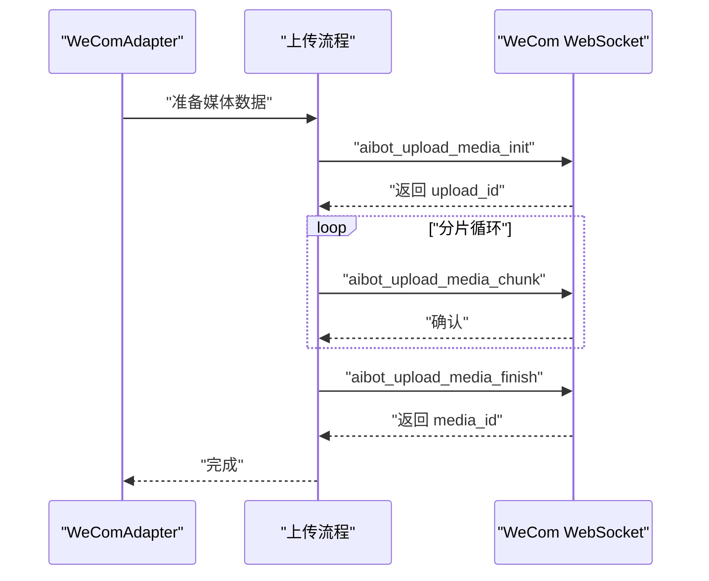
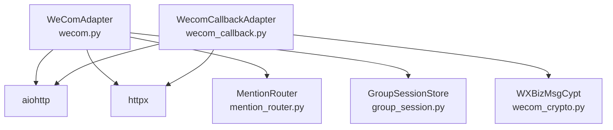

# WebSocket API

<cite>
**本文引用的文件**
- [wecom.py](file://wecom.py)
- [wecom_callback.py](file://wecom_callback.py)
- [wecom_crypto.py](file://wecom_crypto.py)
- [group_session.py](file://group_session.py)
- [mention_router.py](file://mention_router.py)
- [test_mention_fix.py](file://test_mention_fix.py)
- [README.md](file://README.md)
</cite>

## 目录
1. [简介](#简介)
2. [项目结构](#项目结构)
3. [核心组件](#核心组件)
4. [架构总览](#架构总览)
5. [详细组件分析](#详细组件分析)
6. [依赖关系分析](#依赖关系分析)
7. [性能考虑](#性能考虑)
8. [故障排查指南](#故障排查指南)
9. [结论](#结论)
10. [附录](#附录)

## 简介
本文件面向 WeCom WebSocket 模式适配器，系统化阐述其连接建立、认证与握手协议、消息格式规范、命令类型、连接生命周期管理、错误处理与重连策略，并给出消息发送与回调处理的完整流程图与最佳实践。该适配器基于持久化 WebSocket 连接，使用 WeCom AI Bot WebSocket 网关进行双向通信，支持：
- 认证订阅：aibot_subscribe
- 入站回调：aibot_msg_callback（含兼容旧版 aibot_callback）
- 出站消息：aibot_send_msg（Markdown/媒体）
- 响应回执：aibot_respond_msg（用于回复入站消息流）
- 媒体上传：aibot_upload_media_*（init/chunk/finish）
- 心跳保活：ping
- 事件回调：aibot_event_callback

同时，适配器内置去重、消息批处理、多 Agent 群聊路由、媒体下载与缓存、安全校验等能力，满足企业微信场景下的高可用与高性能需求。

## 项目结构
- 主要适配器：wecom.py（WeComAdapter）
- HTTP Callback 模式适配器：wecom_callback.py（WecomCallbackAdapter）
- 加解密工具：wecom_crypto.py（WXBizMsgCypt）
- 群聊会话与多 Agent 支持：group_session.py、mention_router.py
- 测试与说明：test_mention_fix.py、README.md

图表来源
- [wecom.py:160-210](file://wecom.py#L160-L210)
- [wecom_callback.py:55-150](file://wecom_callback.py#L55-L150)
- [wecom_crypto.py:66-143](file://wecom_crypto.py#L66-L143)
- [group_session.py:96-188](file://group_session.py#L96-L188)
- [mention_router.py:46-155](file://mention_router.py#L46-L155)
- [test_mention_fix.py:8-78](file://test_mention_fix.py#L8-L78)
- [README.md:1-43](file://README.md#L1-L43)

章节来源
- [README.md:1-43](file://README.md#L1-L43)

## 核心组件
- WeComAdapter：WebSocket 模式适配器，负责连接、认证、消息收发、媒体上传、心跳、重连与多 Agent 群聊路由。
- WecomCallbackAdapter：HTTP Callback 模式适配器，接收企业微信推送的加密 XML，解密后转交网关处理。
- WXBizMsgCypt：与企业微信官方 SDK 兼容的加解密工具，用于 Callback 模式的签名验证与消息解密。
- MentionRouter：解析群聊 @mention，支持多 Agent 触发与跨 Agent 链式对话。
- GroupSessionStore：维护群聊多 Agent 讨论链状态，控制链深度、冷却时间与中断。

章节来源
- [wecom.py:160-210](file://wecom.py#L160-L210)
- [wecom_callback.py:55-150](file://wecom_callback.py#L55-L150)
- [wecom_crypto.py:66-143](file://wecom_crypto.py#L66-L143)
- [mention_router.py:46-155](file://mention_router.py#L46-L155)
- [group_session.py:96-188](file://group_session.py#L96-L188)

## 架构总览
WebSocket 模式下，WeComAdapter 通过 aiohttp 建立持久连接，向 wss://openws.work.weixin.qq.com 发起订阅请求，等待认证响应。随后进入监听循环，处理入站回调与出站请求，周期性发送 ping 保活，并在异常时按指数退避重连。

图表来源
- [wecom.py:289-313](file://wecom.py#L289-L313)
- [wecom.py:338-377](file://wecom.py#L338-L377)
- [wecom.py:378-396](file://wecom.py#L378-L396)
- [wecom.py:430-470](file://wecom.py#L430-L470)

## 详细组件分析

### 连接与认证流程
- 连接参数
  - WebSocket 地址：默认 wss://openws.work.weixin.qq.com，可通过配置覆盖。
  - 心跳间隔：默认 30 秒，底层 aiohttp 心跳超时为 2 倍心跳。
  - 连接超时：20 秒；请求超时：15 秒。
- 认证流程
  - 建立连接后立即发送 aibot_subscribe，携带 headers.req_id 与 body.bot_id、secret。
  - 等待订阅确认，若 errcode 非 0/None 则抛出错误。
- 握手协议
  - 以 req_id 关联请求与响应，忽略 ping 类型帧，直到收到目标 req_id 的确认帧。

图表来源
- [wecom.py:212-247](file://wecom.py#L212-L247)
- [wecom.py:289-313](file://wecom.py#L289-L313)
- [wecom.py:314-337](file://wecom.py#L314-L337)

章节来源
- [wecom.py:74-94](file://wecom.py#L74-L94)
- [wecom.py:212-247](file://wecom.py#L212-L247)
- [wecom.py:289-313](file://wecom.py#L289-L313)
- [wecom.py:314-337](file://wecom.py#L314-L337)

### 连接生命周期管理
- connect()：初始化依赖、打开连接、认证、启动监听与心跳任务。
- disconnect()：取消任务、失败挂起请求、关闭 WS 与会话、清理去重表。
- _open_connection()：清理旧连接、建立新连接、发送订阅、等待确认。
- _listen_loop()：读取事件，异常时按 [2, 5, 10, 30, 60] 秒指数退避重连。
- _heartbeat_loop()：周期发送 ping 保活，失败静默记录日志。
- _read_events()：循环读取帧，遇到关闭/错误则抛出异常触发重连。

图表来源
- [wecom.py:212-278](file://wecom.py#L212-L278)
- [wecom.py:289-313](file://wecom.py#L289-L313)
- [wecom.py:338-377](file://wecom.py#L338-L377)
- [wecom.py:378-396](file://wecom.py#L378-L396)

章节来源
- [wecom.py:212-278](file://wecom.py#L212-L278)
- [wecom.py:289-313](file://wecom.py#L289-L313)
- [wecom.py:338-377](file://wecom.py#L338-L377)
- [wecom.py:378-396](file://wecom.py#L378-L396)

### 消息格式规范与 req_id 关联机制
- 通用结构
  - cmd：命令类型
  - headers：包含 req_id（字符串），用于请求-响应关联
  - body：具体载荷
- req_id 关联
  - _new_req_id() 生成前缀+UUID 的 req_id
  - _payload_req_id() 从 payload.headers 提取 req_id
  - _send_request() 将 req_id 写入 headers 并注册 Future 等待响应
  - _send_reply_request() 使用入站回调 req_id 作为响应 req_id
  - _dispatch_payload() 根据 req_id 与 cmd 分发到对应 Future 或回调

图表来源
- [wecom.py:430-470](file://wecom.py#L430-L470)
- [wecom.py:471-481](file://wecom.py#L471-L481)
- [wecom.py:398-423](file://wecom.py#L398-L423)

章节来源
- [wecom.py:430-470](file://wecom.py#L430-L470)
- [wecom.py:471-481](file://wecom.py#L471-L481)
- [wecom.py:398-423](file://wecom.py#L398-L423)

### 命令类型与用途
- aibot_subscribe
  - 作用：首次认证订阅，需提供 bot_id 与 secret
  - 请求：headers.req_id + body.{bot_id, secret}
  - 响应：errcode/errmsg，非 0/None 表示认证失败
- aibot_msg_callback / aibot_callback
  - 作用：入站消息回调，包含 msgid、chatid、from、content、msgtype 等
  - 处理：去重、策略过滤（DM/群组白名单）、@提及解析、媒体提取、聚合长文本、派发给网关
- aibot_send_msg
  - 作用：主动发送 Markdown/媒体消息
  - 支持：markdown.content、mentioned_list（API 级 @）、reply_to 引用
- aibot_respond_msg
  - 作用：对入站回调流进行响应（回复）
  - 使用：_send_reply_request()，req_id 来自入站回调
- aibot_upload_media_init / aibot_upload_media_chunk / aibot_upload_media_finish
  - 作用：分片上传媒体，完成后返回 media_id
  - 参数：type/filename/total_size/total_chunks/md5（init）；upload_id/chunk_index/base64_data（chunk）；upload_id（finish）

章节来源
- [wecom.py:76-88](file://wecom.py#L76-L88)
- [wecom.py:289-313](file://wecom.py#L289-L313)
- [wecom.py:430-470](file://wecom.py#L430-L470)
- [wecom.py:1422-1478](file://wecom.py#L1422-L1478)

### 入站消息处理与多 Agent 群聊
- 去重与策略
  - 基于 msgid 去重，支持 DM/群组白名单策略
- @提及与多 Agent
  - _is_bot_mentioned() 检测 mentioned_userid_list
  - MentionRouter 解析 @Alpha/@Beta 等模式，支持默认 Agent 与跨 Agent 链式
- 文本批处理
  - 针对 WeCom 客户端 4000 字符拆分，合并相邻文本块
- 媒体提取
  - 支持 image/file/appmsg（PDF/Word/Excel），优先本地缓存，否则下载并解密

图表来源
- [wecom.py:495-586](file://wecom.py#L495-L586)
- [wecom.py:590-656](file://wecom.py#L590-L656)
- [wecom.py:909-1050](file://wecom.py#L909-L1050)
- [wecom.py:1051-1181](file://wecom.py#L1051-L1181)

章节来源
- [wecom.py:495-586](file://wecom.py#L495-L586)
- [wecom.py:590-656](file://wecom.py#L590-L656)
- [wecom.py:909-1050](file://wecom.py#L909-L1050)
- [wecom.py:1051-1181](file://wecom.py#L1051-L1181)
- [mention_router.py:102-147](file://mention_router.py#L102-L147)

### 出站消息与媒体上传
- send()
  - 支持 Markdown，自动注入 @nickname 标记；可附加 mentioned_list 实现 API 级 @
  - reply_to 使用入站回调 req_id，走 aibot_respond_msg
- send_image/send_document/send_voice/send_video
  - 统一通过 _send_media_source() 加载/校验/降级，再调用上传与发送流程
- 上传流程
  - init：计算 md5、分片数，返回 upload_id
  - chunk：按序发送 base64 数据
  - finish：返回 media_id

图表来源
- [wecom.py:1406-1478](file://wecom.py#L1406-L1478)
- [wecom.py:1480-1521](file://wecom.py#L1480-L1521)
- [wecom.py:1616-1673](file://wecom.py#L1616-L1673)

章节来源
- [wecom.py:1406-1478](file://wecom.py#L1406-L1478)
- [wecom.py:1480-1521](file://wecom.py#L1480-L1521)
- [wecom.py:1616-1673](file://wecom.py#L1616-L1673)

### 错误处理与重连策略
- 认证失败：抛出错误并清理资源
- 运行期异常：失败挂起请求 Future，按 [2, 5, 10, 30, 60] 秒指数退避重连
- 心跳失败：静默记录日志，不影响主流程
- 响应错误：统一解析 errcode/errmsg 并抛出

章节来源
- [wecom.py:212-247](file://wecom.py#L212-L247)
- [wecom.py:338-377](file://wecom.py#L338-L377)
- [wecom.py:378-396](file://wecom.py#L378-L396)
- [wecom.py:1281-1293](file://wecom.py#L1281-L1293)

### 代码示例（路径指引）
- 建立连接
  - 参考：[connect():212-247](file://wecom.py#L212-L247)
- 认证与握手
  - 参考：[_open_connection():289-313](file://wecom.py#L289-L313)、[_wait_for_handshake():314-337](file://wecom.py#L314-L337)
- 发送消息（Markdown）
  - 参考：[send():1616-1673](file://wecom.py#L1616-L1673)
- 发送媒体
  - 参考：[send_image()/send_document()/send_voice()/send_video():1675-1746](file://wecom.py#L1675-L1746)
- 响应回调
  - 参考：[_send_reply_request():445-470](file://wecom.py#L445-L470)
- 媒体上传
  - 参考：[_upload_media_bytes():1422-1478](file://wecom.py#L1422-L1478)

## 依赖关系分析
- WeComAdapter 依赖
  - aiohttp（WebSocket 客户端）
  - httpx（HTTP 下载/令牌刷新）
  - MentionRouter、GroupSessionStore（多 Agent 群聊）
  - WXBizMsgCypt（回调模式加解密，但 WebSocket 模式不直接使用）
- WecomCallbackAdapter 依赖
  - aiohttp（HTTP 服务）
  - httpx（HTTP 请求）
  - WXBizMsgCypt（签名验证与解密）

图表来源
- [wecom.py:46-58](file://wecom.py#L46-L58)
- [wecom_callback.py:22-36](file://wecom_callback.py#L22-L36)
- [wecom_crypto.py:18-20](file://wecom_crypto.py#L18-L20)

章节来源
- [wecom.py:46-58](file://wecom.py#L46-L58)
- [wecom_callback.py:22-36](file://wecom_callback.py#L22-L36)
- [wecom_crypto.py:18-20](file://wecom_crypto.py#L18-L20)

## 性能考虑
- 文本批处理：针对 WeCom 客户端 4000 字符拆分，合并相邻文本块，减少派发次数。
- 去重与会话键：基于会话键聚合文本，避免重复处理。
- 媒体降级：超限自动降级为文件发送并提示，避免失败重试。
- 心跳保活：轻量 ping，降低网络波动影响。
- 指数退避：快速恢复连接，避免频繁抖动。

章节来源
- [wecom.py:590-656](file://wecom.py#L590-L656)
- [wecom.py:1217-1278](file://wecom.py#L1217-L1278)
- [wecom.py:378-396](file://wecom.py#L378-L396)

## 故障排查指南
- 依赖缺失
  - 现象：connect() 返回失败并记录缺失 aiohttp/httpx
  - 处理：安装依赖后重试
- 凭据缺失
  - 现象：缺少 bot_id/secret，认证失败
  - 处理：在配置中补齐或设置环境变量
- 认证失败
  - 现象：订阅确认 errcode 非 0
  - 处理：核对 bot_id/secret，检查企业微信侧权限
- 连接中断
  - 现象：监听循环捕获异常并指数退避重连
  - 处理：检查网络、防火墙、WebSocket 地址可达性
- 响应错误
  - 现象：send/upload 等返回 errcode/errmsg
  - 处理：根据错误码定位问题（如媒体格式/大小限制）

章节来源
- [wecom.py:212-247](file://wecom.py#L212-L247)
- [wecom.py:289-313](file://wecom.py#L289-L313)
- [wecom.py:338-377](file://wecom.py#L338-L377)
- [wecom.py:1281-1293](file://wecom.py#L1281-L1293)

## 结论
WeComAdapter 通过标准化的 WebSocket 命令与 req_id 关联机制，实现了稳定可靠的双向通信。其内置的去重、批处理、多 Agent 群聊与媒体上传能力，使其能够高效处理复杂的企业微信场景。配合指数退避重连与错误码解析，整体具备良好的鲁棒性与可维护性。

## 附录

### 命令与字段速查
- aibot_subscribe
  - headers.req_id
  - body.bot_id, body.secret
- aibot_msg_callback
  - body.msgid, body.chatid, body.chattype, body.from.userid
  - body.content, body.msgtype, body.mixed/text/image/file/appmsg/voice/quote
- aibot_send_msg
  - body.chatid, body.msgtype
  - body.markdown.content 或具体媒体字段
  - body.mentioned_list（API 级 @）
- aibot_respond_msg
  - headers.req_id 与入站回调一致
  - body.msgtype/stream/stream.id/stream.finish/stream.content
- aibot_upload_media_init
  - body.type, body.filename, body.total_size, body.total_chunks, body.md5
- aibot_upload_media_chunk
  - body.upload_id, body.chunk_index, body.base64_data
- aibot_upload_media_finish
  - body.upload_id

章节来源
- [wecom.py:76-88](file://wecom.py#L76-L88)
- [wecom.py:495-586](file://wecom.py#L495-L586)
- [wecom.py:1422-1478](file://wecom.py#L1422-L1478)

### @提及修复与测试
- 修复逻辑：检测 mentioned_userid_list，支持字符串/列表/空值场景
- 测试覆盖：多种边界条件与流程验证

章节来源
- [test_mention_fix.py:8-78](file://test_mention_fix.py#L8-L78)