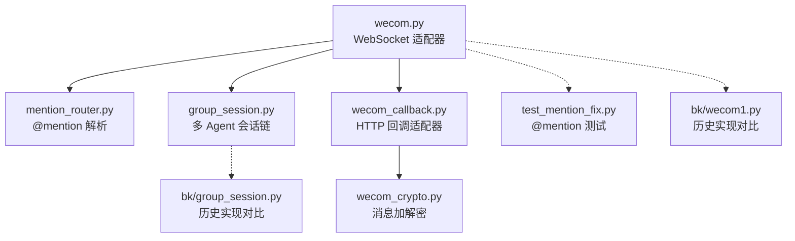
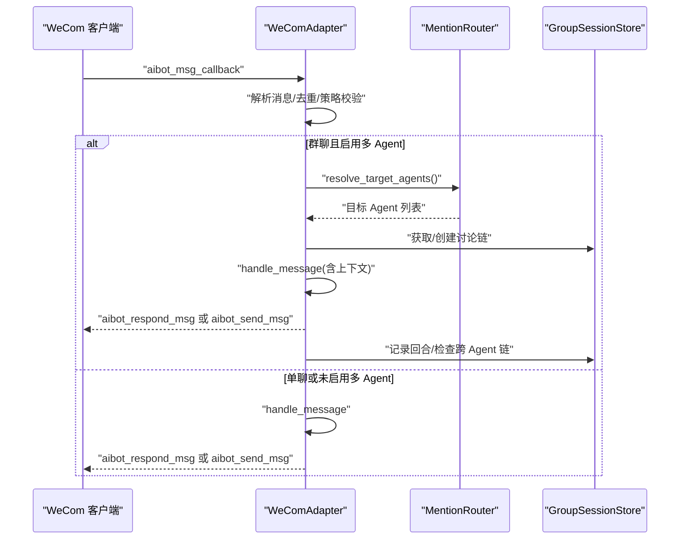
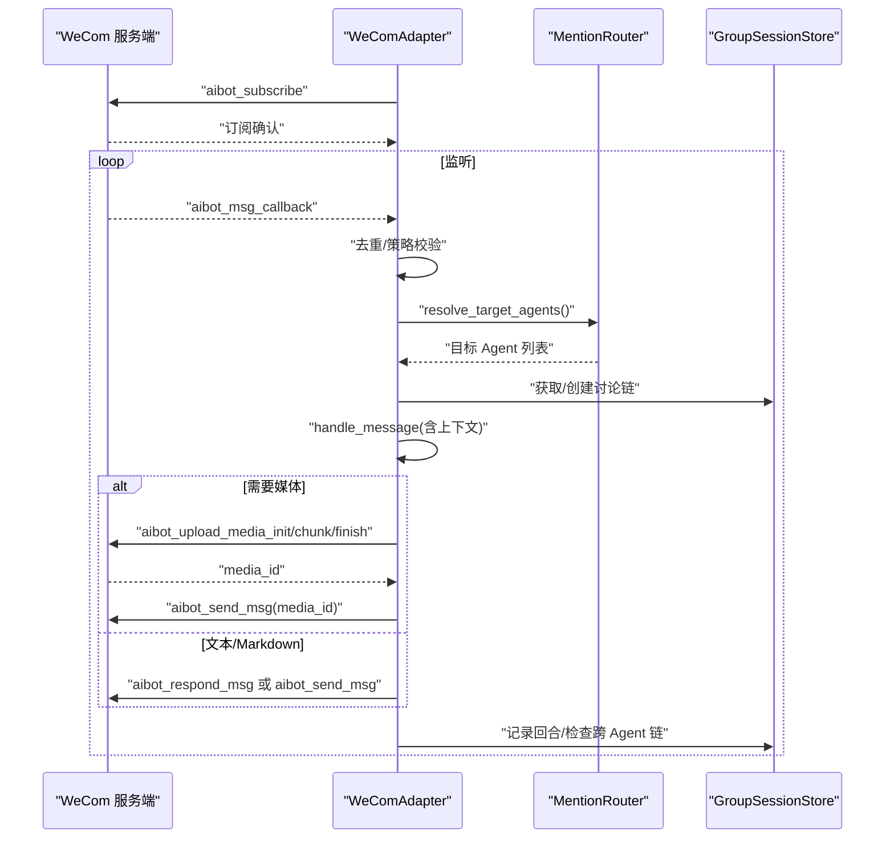
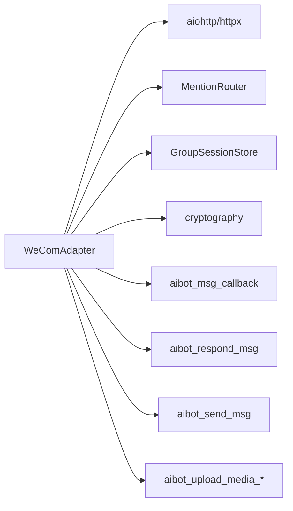
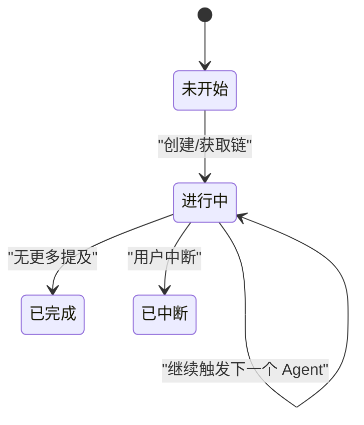

# 命令参考

<cite>
**本文引用的文件**
- [README.md](file://README.md)
- [wecom.py](file://wecom.py)
- [wecom_callback.py](file://wecom_callback.py)
- [wecom_crypto.py](file://wecom_crypto.py)
- [mention_router.py](file://mention_router.py)
- [group_session.py](file://group_session.py)
- [test_mention_fix.py](file://test_mention_fix.py)
- [bk/wecom1.py](file://bk/wecom1.py)
- [bk/group_session.py](file://bk/group_session.py)
</cite>

## 目录
1. [简介](#简介)
2. [项目结构](#项目结构)
3. [核心组件](#核心组件)
4. [架构总览](#架构总览)
5. [详细组件分析](#详细组件分析)
6. [依赖分析](#依赖分析)
7. [性能考虑](#性能考虑)
8. [故障排除指南](#故障排除指南)
9. [结论](#结论)
10. [附录](#附录)

## 简介
本文件为 WeCom WebSocket 命令的完整参考文档，聚焦于企业微信 AI Bot WebSocket 网关中的关键命令与交互流程，覆盖以下命令族：
- 认证与心跳：aibot_subscribe、ping
- 入站事件：aibot_msg_callback、aibot_callback、aibot_event_callback
- 出站消息：aibot_send_msg（Markdown/文本/回复流）、aibot_respond_msg（基于回调 req_id 的回复）
- 媒体上传：aibot_upload_media_init、aibot_upload_media_chunk、aibot_upload_media_finish

文档将逐条说明各命令的用途、请求/响应格式、参数定义、执行顺序、错误码与异常处理，并提供时序图、状态转换图与最佳实践建议。

## 项目结构
该仓库包含 WeCom 适配器、回调模式适配器、消息加解密模块、多 Agent 群聊路由与会话管理等模块，其中与 WebSocket 命令直接相关的核心文件如下：
- wecom.py：WebSocket 模式适配器，定义并实现所有命令的发送与接收逻辑
- mention_router.py：群聊 @mention 解析与多 Agent 路由
- group_session.py：多 Agent 讨论链的会话状态管理
- wecom_callback.py / wecom_crypto.py：HTTP 回调模式（非本次重点），但与加密相关
- test_mention_fix.py：@mention 修复逻辑的单元测试样例
- bk/：备份版本的旧实现，便于对比理解演进

图表来源
- [wecom.py:160-1774](file://wecom.py#L160-L1774)
- [mention_router.py:1-155](file://mention_router.py#L1-155)
- [group_session.py:1-188](file://group_session.py#L1-L188)
- [wecom_callback.py:1-388](file://wecom_callback.py#L1-L388)
- [wecom_crypto.py:1-143](file://wecom_crypto.py#L1-L143)
- [test_mention_fix.py:1-133](file://test_mention_fix.py#L1-L133)
- [bk/wecom1.py:1-576](file://bk/wecom1.py#L1-L576)
- [bk/group_session.py:1-188](file://bk/group_session.py#L1-L188)

章节来源
- [README.md:1-43](file://README.md#L1-L43)
- [wecom.py:160-1774](file://wecom.py#L160-L1774)

## 核心组件
- WeComAdapter：负责 WebSocket 连接、认证、事件分发、请求/响应编排、媒体上传与发送、心跳与重连等
- MentionRouter：解析群聊 @mention，决定目标 Agent 列表，支持默认 Agent 与跨 Agent 链式触发
- GroupSessionStore：维护多 Agent 讨论链的状态，控制链深度、冷却时间与中断标记
- 加密模块：用于 HTTP 回调模式的消息加解密（与 WebSocket 命令同属 WeCom 生态）

章节来源
- [wecom.py:160-1774](file://wecom.py#L160-L1774)
- [mention_router.py:46-155](file://mention_router.py#L46-L155)
- [group_session.py:96-188](file://group_session.py#L96-L188)
- [wecom_callback.py:55-388](file://wecom_callback.py#L55-L388)
- [wecom_crypto.py:66-143](file://wecom_crypto.py#L66-L143)

## 架构总览
WebSocket 命令在适配器中的生命周期与交互关系如下：

图表来源
- [wecom.py:398-470](file://wecom.py#L398-L470)
- [wecom.py:909-1181](file://wecom.py#L909-L1181)
- [mention_router.py:120-146](file://mention_router.py#L120-L146)
- [group_session.py:104-158](file://group_session.py#L104-L158)

## 详细组件分析

### 命令总览与执行顺序
- 认证与连接
  - aibot_subscribe：首次建立连接时发送，携带 bot_id 与 secret
  - ping：应用层心跳，周期性发送
- 入站事件
  - aibot_msg_callback：入站消息回调
  - aibot_callback：兼容旧版回调
  - aibot_event_callback：事件类回调
- 出站消息
  - aibot_respond_msg：对入站回调 req_id 的回复（流式/媒体）
  - aibot_send_msg：主动发送 Markdown/文本/媒体消息
- 媒体上传
  - aibot_upload_media_init：初始化上传，返回 upload_id
  - aibot_upload_media_chunk：分片上传
  - aibot_upload_media_finish：完成上传，返回 media_id

章节来源
- [wecom.py:76-88](file://wecom.py#L76-L88)
- [wecom.py:303-327](file://wecom.py#L303-L327)
- [wecom.py:412-429](file://wecom.py#L412-L429)
- [wecom.py:1422-1478](file://wecom.py#L1422-L1478)

### aibot_subscribe（认证）
- 作用：建立 WebSocket 连接后进行身份认证
- 请求格式
  - cmd: "aibot_subscribe"
  - headers.req_id: 字符串，唯一请求标识
  - body.bot_id: 字符串，机器人 ID
  - body.secret: 字符串，机器人密钥
- 响应格式
  - errcode: 整数，0 表示成功
  - errmsg: 字符串，错误信息
- 执行顺序
  - 连接建立后立即发送
  - 等待订阅确认，超时或错误即断开
- 错误与异常
  - errcode 非 0：抛出运行时异常
  - 超时：抛出超时异常
- 最佳实践
  - 确保 bot_id 与 secret 配置正确
  - 使用独立 req_id，避免重复

章节来源
- [wecom.py:303-327](file://wecom.py#L303-L327)
- [wecom.py:328-351](file://wecom.py#L328-L351)

### aibot_msg_callback（入站消息）
- 作用：接收来自 WeCom 的入站消息回调
- 请求格式
  - cmd: "aibot_msg_callback"
  - headers.req_id: 字符串，回调 req_id
  - body.msgid: 字符串，消息唯一 ID
  - body.chatid: 字符串，聊天 ID
  - body.chattype: 字符串，"group" 或 "single"
  - body.from.userid: 字符串，发送者 ID
  - body.content: 字符串，消息正文
  - body.mixed/text/voice/appmsg/image/file/quote 等字段按消息类型存在
  - body.mentioned_userid_list: 数组，被 @ 的用户 ID 列表（群聊）
- 响应格式
  - 对于非响应类命令，通常无需显式响应（内部通过 _dispatch_payload 处理）
  - 若需回复，使用 aibot_respond_msg，其 req_id 与回调 req_id 关联
- 执行顺序
  - 解析消息体，去重，策略校验（DM/群组白名单）
  - 群聊：优先检查 mentioned_userid_list，否则走 @mention 解析
  - 多 Agent：构建讨论链上下文，依次调用目标 Agent
  - 发送回复：aibot_respond_msg 或 aibot_send_msg
- 最佳实践
  - 群聊必须被 @ 或命中 @mention 才处理
  - 使用去重器避免重复处理
  - 文本批处理合并 WeCom 客户端侧拆分

章节来源
- [wecom.py:398-470](file://wecom.py#L398-L470)
- [wecom.py:495-586](file://wecom.py#L495-L586)
- [wecom.py:590-656](file://wecom.py#L590-L656)
- [wecom.py:909-1181](file://wecom.py#L909-L1181)

### aibot_respond_msg（回复）
- 作用：对入站回调 req_id 的回复，支持流式与媒体
- 请求格式
  - cmd: "aibot_respond_msg"
  - headers.req_id: 字符串，必须与入站回调 req_id 一致
  - body.msgtype: "stream" 或媒体类型
  - body.stream.id: 字符串，流式消息唯一 ID
  - body.stream.finish: 布尔，是否结束
  - body.stream.content: 字符串，回复内容（受长度限制）
  - 或 body.<media_type>.media_id: 媒体 ID
- 响应格式
  - errcode: 整数，0 表示成功
  - errmsg: 字符串
- 执行顺序
  - 通过 _send_reply_request 将请求与回调 req_id 绑定
  - 等待响应，失败则抛错
- 最佳实践
  - 必须使用正确的回调 req_id
  - 流式回复可多次发送，最后 finish=true

章节来源
- [wecom.py:459-483](file://wecom.py#L459-L483)
- [wecom.py:1492-1521](file://wecom.py#L1492-L1521)

### aibot_send_msg（主动发送）
- 作用：主动向指定聊天发送 Markdown/文本/媒体消息
- 请求格式
  - cmd: "aibot_send_msg"
  - body.chatid: 字符串，目标聊天 ID
  - body.msgtype: "markdown"、"text"、"image"、"file"、"voice" 等
  - body.markdown.content: 字符串，Markdown 内容（受长度限制）
  - body.text.content: 字符串，文本内容
  - body.image/file/voice.media_id: 媒体 ID
  - body.mentioned_list: 数组，API 层面 @ 提及的用户昵称列表（群聊）
- 响应格式
  - errcode: 整数，0 表示成功
  - errmsg: 字符串
- 执行顺序
  - send()：根据 metadata 注入 @mention 标记，选择流式或普通发送
  - _send_media_source：准备媒体，上传后发送
- 最佳实践
  - Markdown 长度不超过 MAX_MESSAGE_LENGTH
  - 群聊 @mention 使用 mentioned_list 或内容注入
  - 媒体发送前进行尺寸与类型检查

章节来源
- [wecom.py:1616-1673](file://wecom.py#L1616-L1673)
- [wecom.py:1536-1614](file://wecom.py#L1536-L1614)

### aibot_upload_media_*（媒体上传）
- 作用：将本地/远程媒体分片上传至 WeCom，完成后返回 media_id
- 请求格式
  - aibot_upload_media_init
    - body.type: "image"|"file"|"voice"|"video"
    - body.filename: 字符串，文件名
    - body.total_size: 整数，总字节数
    - body.total_chunks: 整数，分片总数
    - body.md5: 字符串，MD5
  - aibot_upload_media_chunk
    - body.upload_id: 字符串，初始化返回
    - body.chunk_index: 整数，分片索引（从 0 开始）
    - body.base64_data: 字符串，分片 Base64
  - aibot_upload_media_finish
    - body.upload_id: 字符串
- 响应格式
  - init/finish.body.upload_id/media_id/type/created_at
- 执行顺序
  - 初始化 -> 多次分片 -> 完成
  - _upload_media_bytes：封装上述流程
- 最佳实践
  - 分片大小与最大分片数限制
  - 严格校验文件类型与大小，必要时降级为文件类型

章节来源
- [wecom.py:1422-1478](file://wecom.py#L1422-L1478)
- [wecom.py:1217-1278](file://wecom.py#L1217-L1278)

### ping（心跳）
- 作用：应用层心跳，维持连接活跃
- 请求格式
  - cmd: "ping"
  - headers.req_id: 字符串
  - body: 空对象
- 响应格式
  - 无特定响应体
- 执行顺序
  - 心跳循环定时发送
- 最佳实践
  - 心跳间隔与服务器保持一致

章节来源
- [wecom.py:382-396](file://wecom.py#L382-L396)

### 命令之间的关联关系与时序
- 认证与事件
  - 连接后立即发送 aibot_subscribe，收到确认后进入监听
  - 监听期间收到 aibot_msg_callback，按策略处理并回复
- 回复与媒体
  - 入站消息通过 aibot_respond_msg 回复
  - 媒体通过 aibot_upload_media_* 流程后以 aibot_send_msg 发送
- 多 Agent 链式
  - 群聊 @mention 解析后，按 Agent 顺序依次处理
  - 每个 Agent 的回复可能再次触发其他 Agent

图表来源
- [wecom.py:303-327](file://wecom.py#L303-L327)
- [wecom.py:398-470](file://wecom.py#L398-L470)
- [wecom.py:909-1181](file://wecom.py#L909-L1181)
- [wecom.py:1422-1478](file://wecom.py#L1422-L1478)
- [wecom.py:1616-1673](file://wecom.py#L1616-L1673)

## 依赖分析
- WeComAdapter 依赖
  - aiohttp/httpx：WebSocket 与 HTTP 下载
  - MentionRouter：群聊 @mention 解析
  - GroupSessionStore：多 Agent 会话链
  - 媒体下载与解密：httpx、cryptography
- 命令依赖关系
  - aibot_msg_callback 依赖去重与策略
  - aibot_respond_msg 依赖回调 req_id 关联
  - aibot_upload_media_* 依赖分片与 MD5 校验
  - aibot_send_msg 依赖媒体准备与尺寸检查

图表来源
- [wecom.py:160-1774](file://wecom.py#L160-L1774)
- [mention_router.py:46-155](file://mention_router.py#L46-L155)
- [group_session.py:96-188](file://group_session.py#L96-L188)

章节来源
- [wecom.py:160-1774](file://wecom.py#L160-L1774)

## 性能考虑
- 文本批处理：对接近 4000 字符的长消息进行合并，减少往返
- 心跳与重连：固定心跳间隔，指数退避重连
- 媒体上传：分片上传，限制最大分片数与单次分片大小
- 去重与策略：避免重复处理与越权消息

章节来源
- [wecom.py:590-656](file://wecom.py#L590-L656)
- [wecom.py:378-410](file://wecom.py#L378-L410)
- [wecom.py:1422-1478](file://wecom.py#L1422-L1478)

## 故障排除指南
- 认证失败
  - 检查 bot_id 与 secret 是否正确
  - 查看 errcode/errmsg，定位具体错误
- 连接中断
  - 观察心跳是否持续
  - 指数退避重连日志
- 媒体上传失败
  - 检查分片大小与总数限制
  - 校验文件类型与大小，必要时降级
- 回复丢失
  - 确认使用正确的回调 req_id
  - 检查 _dispatch_payload 是否将响应结果写回 Future
- @mention 未生效
  - 群聊必须被 @ 或命中 @mention
  - 检查 MentionRouter 配置与边界正则

章节来源
- [wecom.py:328-351](file://wecom.py#L328-L351)
- [wecom.py:352-377](file://wecom.py#L352-L377)
- [wecom.py:1217-1278](file://wecom.py#L1217-L1278)
- [wecom.py:412-429](file://wecom.py#L412-L429)
- [test_mention_fix.py:8-77](file://test_mention_fix.py#L8-L77)

## 结论
本文系统梳理了 WeCom WebSocket 命令族及其在适配器中的实现与交互，明确了各命令的请求/响应格式、执行顺序、错误处理与最佳实践。结合多 Agent 群聊与会话链机制，可实现复杂的企业微信消息流转与自动回复场景。

## 附录

### 命令参数与格式速查
- aibot_subscribe
  - 请求：body.bot_id, body.secret
  - 响应：errcode, errmsg
- aibot_msg_callback
  - 请求：body.msgid, body.chatid, body.chattype, body.from.userid, body.content, body.mixed/text/voice/appmsg/image/file/quote, body.mentioned_userid_list
  - 响应：无（内部处理）
- aibot_respond_msg
  - 请求：body.msgtype="stream" 或媒体类型，body.stream.* 或 body.<media_type>.media_id
  - 响应：errcode, errmsg
- aibot_send_msg
  - 请求：body.chatid, body.msgtype, body.markdown/content/media_id, body.mentioned_list
  - 响应：errcode, errmsg
- aibot_upload_media_init
  - 请求：body.type, body.filename, body.total_size, body.total_chunks, body.md5
  - 响应：body.upload_id
- aibot_upload_media_chunk
  - 请求：body.upload_id, body.chunk_index, body.base64_data
  - 响应：无
- aibot_upload_media_finish
  - 请求：body.upload_id
  - 响应：body.media_id, body.type, body.created_at

章节来源
- [wecom.py:76-88](file://wecom.py#L76-L88)
- [wecom.py:303-327](file://wecom.py#L303-L327)
- [wecom.py:495-586](file://wecom.py#L495-L586)
- [wecom.py:1422-1478](file://wecom.py#L1422-L1478)
- [wecom.py:1616-1673](file://wecom.py#L1616-L1673)

### 状态转换（多 Agent 讨论链）

图表来源
- [group_session.py:104-158](file://group_session.py#L104-L158)
- [wecom.py:1051-1181](file://wecom.py#L1051-L1181)