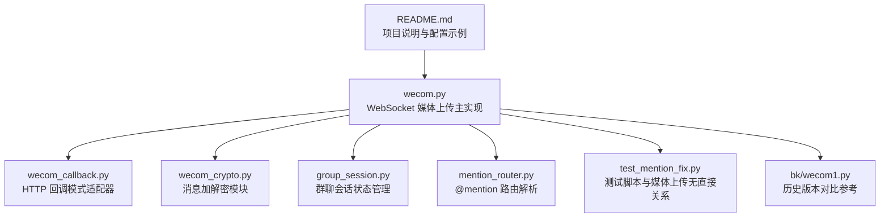
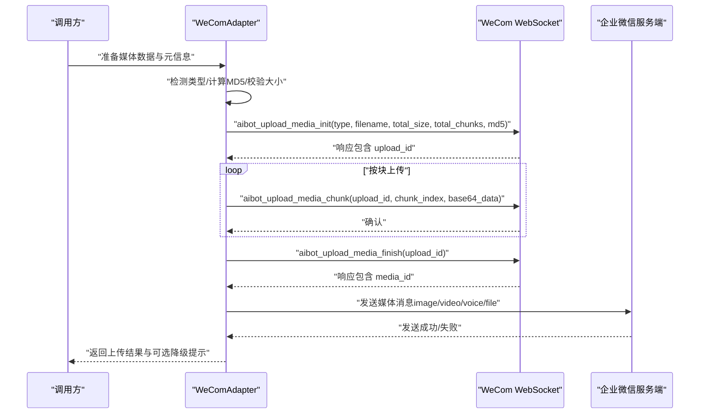
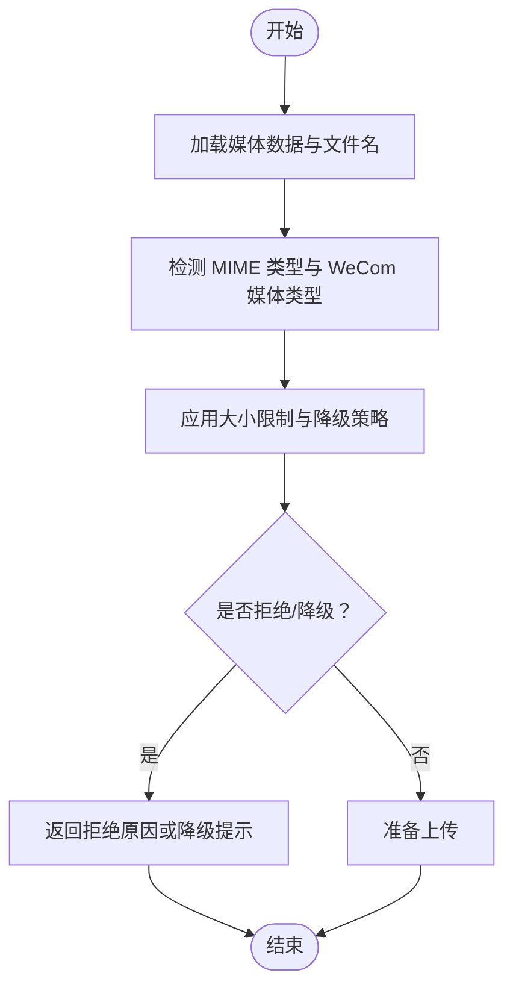
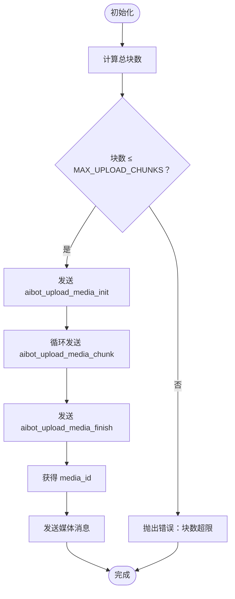
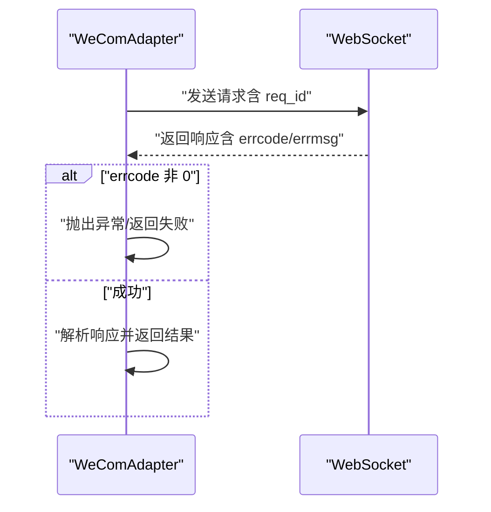
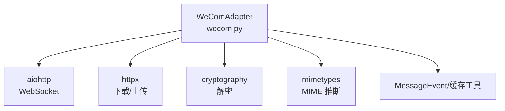

# 媒体上传

<cite>
**本文引用的文件**
- [README.md](file://README.md)
- [wecom.py](file://wecom.py)
- [wecom_callback.py](file://wecom_callback.py)
- [wecom_crypto.py](file://wecom_crypto.py)
- [group_session.py](file://group_session.py)
- [mention_router.py](file://mention_router.py)
- [test_mention_fix.py](file://test_mention_fix.py)
- [bk/wecom1.py](file://bk/wecom1.py)
</cite>

## 目录
1. [简介](#简介)
2. [项目结构](#项目结构)
3. [核心组件](#核心组件)
4. [架构总览](#架构总览)
5. [详细组件分析](#详细组件分析)
6. [依赖关系分析](#依赖关系分析)
7. [性能考量](#性能考量)
8. [故障排查指南](#故障排查指南)
9. [结论](#结论)
10. [附录](#附录)

## 简介
本文件面向 WeCom（企业微信）WebSocket 模式下的“媒体上传”能力，系统性梳理并说明以下内容：
- 完整的媒体上传流程：aibot_upload_media_init、aibot_upload_media_chunk、aibot_upload_media_finish 三步法
- 媒体文件大小限制与降级策略：IMAGE_MAX_BYTES、VIDEO_MAX_BYTES、VOICE_MAX_BYTES、FILE_MAX_BYTES
- 分块上传机制：UPLOAD_CHUNK_SIZE 与 MAX_UPLOAD_CHUNKS 的作用与边界
- 媒体类型支持与 MIME 要求：语音文件的 MIME 类型限制
- 状态管理与错误处理：请求关联、超时、失败回退与降级提示
- 实战示例路径：如何上传图片、视频、音频与文档
- 性能优化与最佳实践：大文件上传建议

## 项目结构
该仓库包含 WeCom 适配器、回调模式适配器、加密模块、会话与路由等子模块。与媒体上传直接相关的核心文件是 wecom.py，其中定义了媒体上传的完整流程与限制参数。

图表来源
- [README.md:1-43](file://README.md#L1-L43)
- [wecom.py:1-120](file://wecom.py#L1-L120)

章节来源
- [README.md:1-43](file://README.md#L1-L43)
- [wecom.py:1-120](file://wecom.py#L1-L120)

## 核心组件
- WeComAdapter：负责连接、认证、消息收发与媒体上传的主类
- 媒体上传三步法：
  - 初始化：aibot_upload_media_init
  - 分块上传：aibot_upload_media_chunk（循环）
  - 完成：aibot_upload_media_finish
- 上传参数与限制：
  - 上传类型：image、video、voice、file
  - 上传块大小：UPLOAD_CHUNK_SIZE
  - 最大分块数：MAX_UPLOAD_CHUNKS
  - 绝对上限：FILE_MAX_BYTES（20MB），以及各类型独立上限
- MIME 类型与语音格式：
  - 语音仅支持 audio/amr
  - 其他类型自动推断 MIME 或按扩展名判定

章节来源
- [wecom.py:98-106](file://wecom.py#L98-L106)
- [wecom.py:1217-1279](file://wecom.py#L1217-L1279)
- [wecom.py:1422-1479](file://wecom.py#L1422-L1479)

## 架构总览
下图展示了媒体上传从准备到发送的端到端流程，包括初始化、分块上传与完成阶段，以及错误处理与降级提示。

图表来源
- [wecom.py:1422-1479](file://wecom.py#L1422-L1479)
- [wecom.py:1480-1490](file://wecom.py#L1480-L1490)

## 详细组件分析

### 1) 媒体准备与类型检测
- 加载媒体来源：支持本地路径、URL、file:// 协议
- 推断 MIME 类型：优先使用 Content-Type，其次根据扩展名或 .amr 特判
- 检测 WeCom 媒体类型：image、video、voice、file
- 应用大小限制与降级策略：超过类型上限则降级为 file；超过绝对上限则拒绝

图表来源
- [wecom.py:1371-1421](file://wecom.py#L1371-L1421)
- [wecom.py:1217-1279](file://wecom.py#L1217-L1279)

章节来源
- [wecom.py:1186-1215](file://wecom.py#L1186-L1215)
- [wecom.py:1217-1279](file://wecom.py#L1217-L1279)
- [wecom.py:1371-1421](file://wecom.py#L1371-L1421)

### 2) 分块上传机制
- 计算总块数：向上取整
- 校验最大块数：超过 MAX_UPLOAD_CHUNKS 则报错
- 初始化：携带 type、filename、total_size、total_chunks、md5
- 循环上传：按索引顺序发送 base64 数据
- 完成：提交 upload_id 获取 media_id

图表来源
- [wecom.py:1422-1479](file://wecom.py#L1422-L1479)

章节来源
- [wecom.py:103-104](file://wecom.py#L103-L104)
- [wecom.py:1422-1479](file://wecom.py#L1422-L1479)

### 3) 错误处理与状态管理
- 请求关联：每个请求生成唯一 req_id，等待对应响应
- 超时控制：统一 REQUEST_TIMEOUT_SECONDS
- 错误映射：errcode/errmsg 映射为异常
- 降级提示：当媒体被降级为 file 时，自动发送提示消息
- 连接重连：WebSocket 断开后按指数退避重连

图表来源
- [wecom.py:444-458](file://wecom.py#L444-L458)
- [wecom.py:1288-1293](file://wecom.py#L1288-L1293)

章节来源
- [wecom.py:444-458](file://wecom.py#L444-L458)
- [wecom.py:1288-1293](file://wecom.py#L1288-L1293)
- [wecom.py:352-377](file://wecom.py#L352-L377)

### 4) 发送媒体消息
- 普通发送：aibot_send_msg
- 回复发送：aibot_respond_msg（基于 reply_req_id）
- 支持回复文本与媒体混合场景

章节来源
- [wecom.py:1480-1521](file://wecom.py#L1480-L1521)

### 5) API 使用示例（路径指引）
以下为不同媒体类型的上传入口与调用方式（以路径代替具体代码）：
- 图片上传
  - [send_image:1675-1696](file://wecom.py#L1675-L1696)
  - [send_image_file:1698-1712](file://wecom.py#L1698-L1712)
- 视频上传
  - [send_video:1748-1762](file://wecom.py#L1748-L1762)
- 音频上传（AMR）
  - [send_voice:1732-1746](file://wecom.py#L1732-L1746)
- 文档上传
  - [send_document:1714-1730](file://wecom.py#L1714-L1730)

章节来源
- [wecom.py:1675-1762](file://wecom.py#L1675-L1762)

## 依赖关系分析
- WeComAdapter 依赖：
  - aiohttp/httpx：WebSocket 与 HTTP 下载
  - cryptography：媒体解密（AES-CBC）
  - mimetypes：MIME 类型推断
- 与回调模式适配器、加密模块、会话与路由模块的耦合度较低，媒体上传逻辑集中在 wecom.py 内部

图表来源
- [wecom.py:30-70](file://wecom.py#L30-L70)

章节来源
- [wecom.py:30-70](file://wecom.py#L30-L70)

## 性能考量
- 分块大小与并发：默认 512KB 块大小，适合中小文件；大文件建议预切分或分批上传
- 最大块数限制：100 块，避免过长的上传时间窗口
- 绝对上限：20MB，超出直接拒绝，减少无效网络传输
- 降级策略：图片/视频超限时自动降级为文件，避免丢失内容
- 连接稳定性：心跳与指数退避重连，提升长任务成功率

## 故障排查指南
- 常见错误
  - 未安装依赖：aiohttp/httpx 缺失
  - 认证失败：bot_id/secret 缺失或错误
  - 上传失败：errcode/errmsg 映射为异常
  - 媒体过大：超过类型或绝对上限，触发拒绝或降级
  - 语音格式不支持：非 audio/amr
- 排查步骤
  - 确认依赖安装与环境变量
  - 检查媒体类型与大小
  - 查看日志中的 errcode/errmsg
  - 对于 URL 媒体，确认可达性与 Content-Length
  - 对于加密文件，确认 AES Key 合法

章节来源
- [wecom.py:212-246](file://wecom.py#L212-L246)
- [wecom.py:1288-1293](file://wecom.py#L1288-L1293)
- [wecom.py:1322-1365](file://wecom.py#L1322-L1365)
- [wecom.py:1295-1321](file://wecom.py#L1295-L1321)

## 结论
WeComAdapter 在 wecom.py 中实现了完整的 WebSocket 媒体上传流程，具备明确的大小限制、分块上传机制与完善的错误处理与降级策略。通过统一的 prepare/upload/send 流程，开发者可稳定地上传图片、视频、音频与文档，并在超限或格式不支持时获得清晰的反馈与降级提示。

## 附录

### A. 媒体上传参数与限制一览
- 类型与上限
  - 图片：最多 10MB
  - 视频：最多 10MB
  - 语音：最多 2MB，且仅支持 audio/amr
  - 文档：最多 20MB（绝对上限）
- 分块参数
  - 块大小：512KB
  - 最大块数：100
- 语音 MIME 要求
  - 仅支持 audio/amr

章节来源
- [wecom.py:98-106](file://wecom.py#L98-L106)
- [wecom.py:103-104](file://wecom.py#L103-L104)
- [wecom.py:1252-1262](file://wecom.py#L1252-L1262)

### B. 上传流程关键函数路径
- 准备与检测：[prepare_outbound_media:1406-1421](file://wecom.py#L1406-L1421)
- 加载媒体：[_load_outbound_media:1371-1405](file://wecom.py#L1371-L1405)
- 下载远程媒体：[_download_remote_bytes:1322-1365](file://wecom.py#L1322-L1365)
- 初始化上传：[_upload_media_bytes:1422-1479](file://wecom.py#L1422-L1479)
- 发送媒体消息：[_send_media_message:1480-1490](file://wecom.py#L1480-L1490)
- 回复媒体消息：[_send_reply_media_message:1507-1521](file://wecom.py#L1507-L1521)

章节来源
- [wecom.py:1406-1521](file://wecom.py#L1406-L1521)