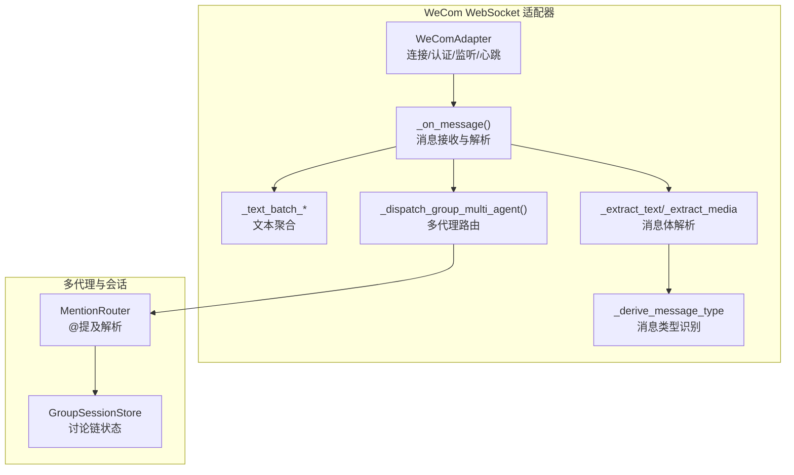
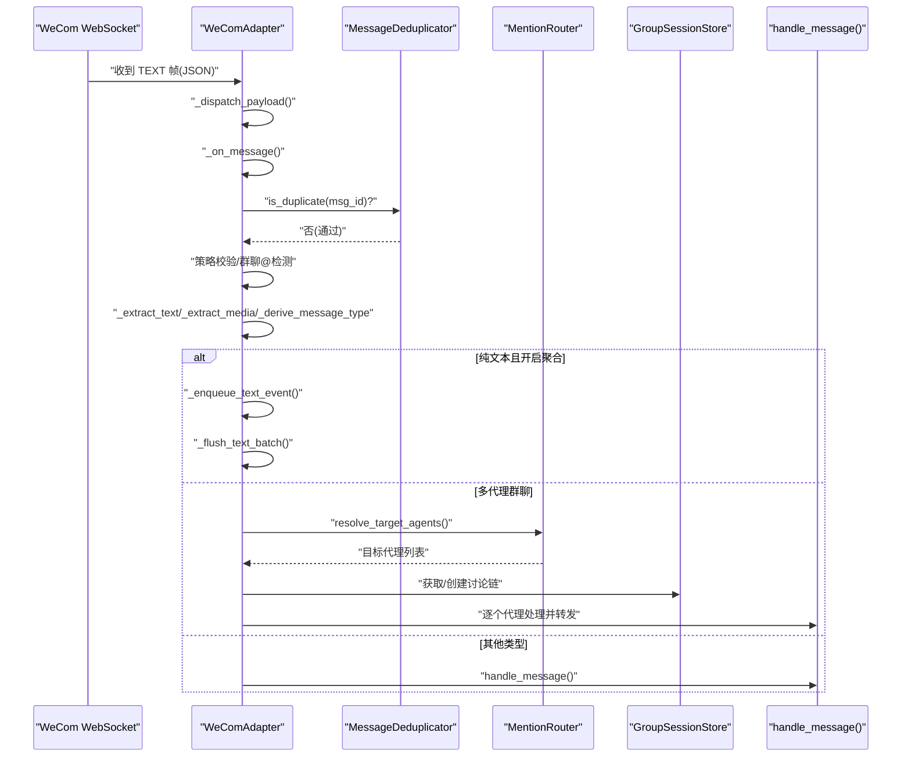
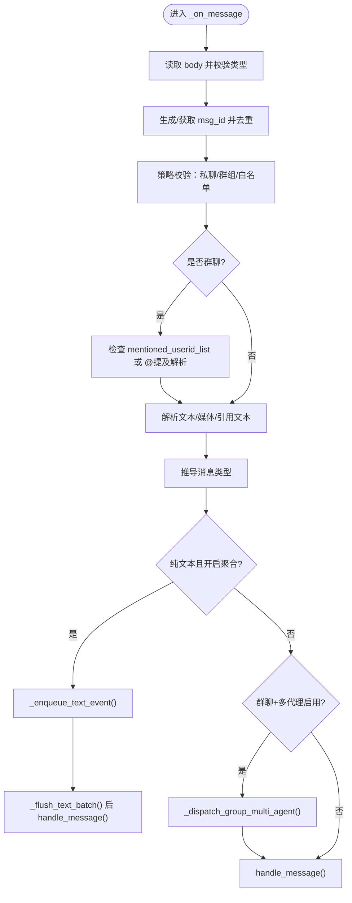
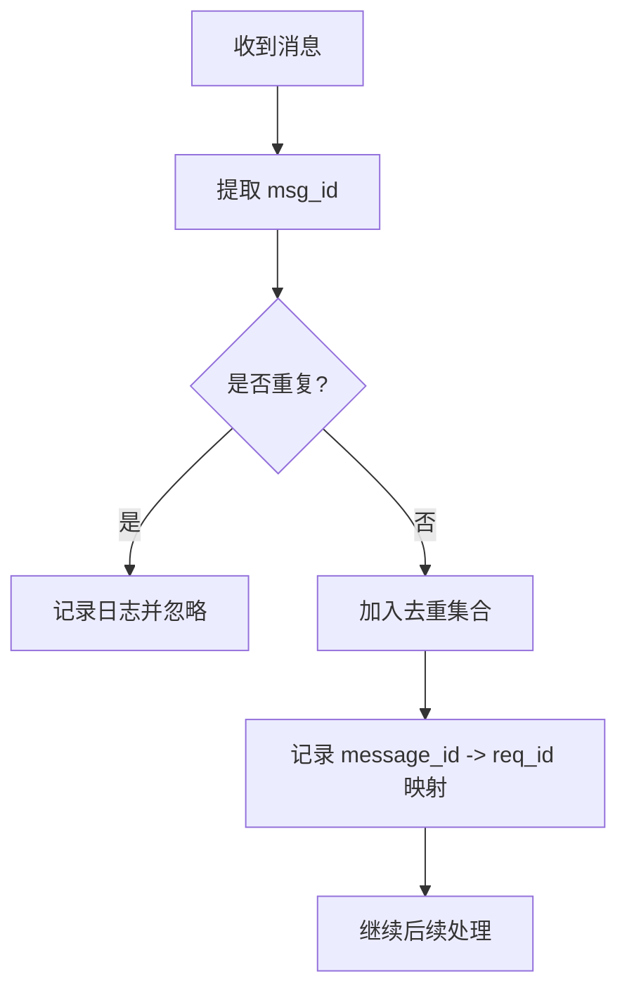
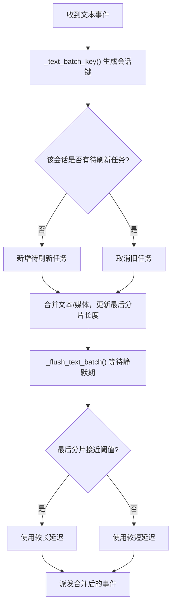
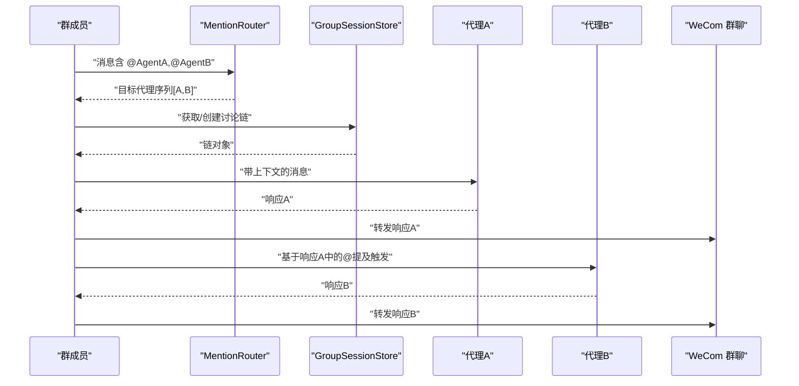
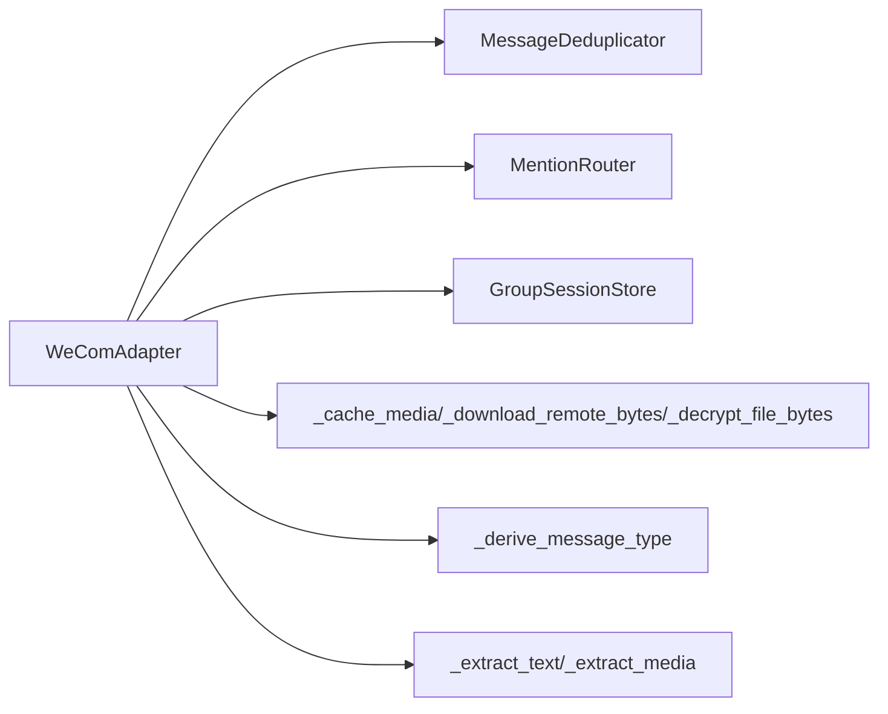

# 消息处理

<cite>
**本文引用的文件**
- [wecom.py](file://wecom.py)
- [mention_router.py](file://mention_router.py)
- [group_session.py](file://group_session.py)
- [wecom_callback.py](file://wecom_callback.py)
- [wecom_crypto.py](file://wecom_crypto.py)
</cite>

## 目录
1. [简介](#简介)
2. [项目结构](#项目结构)
3. [核心组件](#核心组件)
4. [架构总览](#架构总览)
5. [详细组件分析](#详细组件分析)
6. [依赖分析](#依赖分析)
7. [性能考量](#性能考量)
8. [故障排查指南](#故障排查指南)
9. [结论](#结论)
10. [附录](#附录)

## 简介
本文件面向 WeCom WebSocket 消息处理，系统性阐述以下主题：
- 消息接收与解析流程，重点分析 _on_message() 的实现、消息去重机制与重复消息过滤
- 消息格式规范：headers、body 结构与 req_id 关联机制
- 消息类型识别：纯文本、混合消息、语音消息、图片消息等的处理方式
- 文本聚合：_text_batch_key() 与 _enqueue_text_event() 的文本分片合并机制
- 消息路由与转发：单代理与多代理场景下的消息处理差异
- 提供完整流程图与时序图，帮助快速理解与落地最佳实践

## 项目结构
WeCom 适配器采用“WebSocket + 请求/响应”模式，核心文件如下：
- wecom.py：WeCom WebSocket 适配器，负责连接、认证、消息接收与派发、文本聚合、多代理路由、媒体上传与回复等
- mention_router.py：@提及解析与多代理路由配置
- group_session.py：群组讨论链状态管理（用于多代理链式流转）
- wecom_callback.py：WeCom 回调模式适配器（HTTP 接收回调，非本文重点，但与消息去重策略相关）
- wecom_crypto.py：回调模式加密解密工具（与本文重点不直接相关）

图表来源
- [wecom.py:212-396](file://wecom.py#L212-L396)
- [wecom.py:495-586](file://wecom.py#L495-L586)
- [wecom.py:591-656](file://wecom.py#L591-L656)
- [wecom.py:909-1181](file://wecom.py#L909-L1181)
- [mention_router.py:46-155](file://mention_router.py#L46-L155)
- [group_session.py:96-188](file://group_session.py#L96-L188)

章节来源
- [wecom.py:160-206](file://wecom.py#L160-L206)
- [wecom.py:212-396](file://wecom.py#L212-L396)

## 核心组件
- WeComAdapter：WebSocket 连接、认证、消息派发、文本聚合、多代理路由、媒体处理与回复
- MentionRouter：从群聊文本中解析 @提及，决定目标代理与顺序
- GroupSessionStore：维护群组讨论链状态，支持链式触发与冷却控制

章节来源
- [wecom.py:160-206](file://wecom.py#L160-L206)
- [mention_router.py:46-155](file://mention_router.py#L46-L155)
- [group_session.py:96-188](file://group_session.py#L96-L188)

## 架构总览
WebSocket 入站消息通过 _dispatch_payload() 分发至 _on_message()，随后进行去重、策略校验、类型识别与聚合，再根据消息类型与上下文决定是直接处理还是进入多代理链式路由。

图表来源
- [wecom.py:398-423](file://wecom.py#L398-L423)
- [wecom.py:495-586](file://wecom.py#L495-L586)
- [wecom.py:591-656](file://wecom.py#L591-L656)
- [wecom.py:909-1181](file://wecom.py#L909-L1181)
- [mention_router.py:102-127](file://mention_router.py#L102-L127)
- [group_session.py:104-128](file://group_session.py#L104-L128)

## 详细组件分析

### 消息接收与解析：_on_message()
- 输入：WebSocket 文本帧解析后的 JSON payload
- 关键步骤：
  - 提取 msg_id（优先使用 body.msgid，否则回退到 req_id），去重后记录 req_id 映射
  - 解析发送者、聊天类型与聊天 ID，执行策略校验（私聊/群组白名单/禁用策略）
  - 群聊中优先检查 mentioned_userid_list 是否包含机器人；若未 @，则通过 MentionRouter 解析 @提及，决定目标代理
  - 解析文本与引用文本（reply_text），提取媒体（图片/文件/appmsg），推导消息类型
  - 若为纯文本且开启文本聚合，则入队等待刷新；否则进入多代理路由或直接处理

图表来源
- [wecom.py:495-586](file://wecom.py#L495-L586)
- [wecom.py:591-656](file://wecom.py#L591-L656)
- [wecom.py:909-1181](file://wecom.py#L909-L1181)

章节来源
- [wecom.py:495-586](file://wecom.py#L495-L586)

### 消息去重与重复消息过滤
- 去重依据：msg_id（来自 body.msgid 或 req_id），使用 MessageDeduplicator 判断重复
- 记录 req_id 映射：_remember_reply_req_id() 将 message_id 与 req_id 绑定，便于后续回复
- 重复消息处理：若重复，直接忽略，避免重复处理与回复风暴

图表来源
- [wecom.py:501-505](file://wecom.py#L501-L505)
- [wecom.py:890-898](file://wecom.py#L890-L898)

章节来源
- [wecom.py:501-505](file://wecom.py#L501-L505)
- [wecom.py:890-898](file://wecom.py#L890-L898)

### 消息格式规范：headers/body 与 req_id 关联
- 通用结构：cmd、headers、body
- headers.req_id：请求/响应关联标识，用于回复 Correlation
- body：具体业务载荷，如 WeCom 回调中的 msgid、from、chatid、chattype、msgtype、content、mixed、image、file、appmsg、quote 等
- req_id 关联：_payload_req_id() 从 headers 中提取；_send_request/_send_reply_request 使用 req_id 实现请求与响应的配对

章节来源
- [wecom.py:476-489](file://wecom.py#L476-L489)
- [wecom.py:430-470](file://wecom.py#L430-L470)
- [wecom.py:1492-1521](file://wecom.py#L1492-L1521)

### 消息类型识别：纯文本/混合/语音/图片/文档
- 文本：默认类型；当存在引用文本且无其他媒体时，可回填引用文本作为正文
- 图片：当媒体类型为 image 且存在文本时，视为 TEXT；仅图片时视为 PHOTO
- 文档：当媒体类型为 application/ 或 text/ 时，视为 DOCUMENT
- 语音：当 msgtype 为 voice 时，视为 VOICE
- 混合：mixed.msg_item 中包含多种子项时，按子项类型分别提取文本与媒体

章节来源
- [wecom.py:844-853](file://wecom.py#L844-L853)
- [wecom.py:658-703](file://wecom.py#L658-L703)
- [wecom.py:705-748](file://wecom.py#L705-L748)

### 文本聚合：_text_batch_key() 与 _enqueue_text_event()
- 聚合目的：WeCom 客户端在长文本处约 4000 字符处分割，短时间内到达，需合并后再处理
- 聚合键：_text_batch_key() 基于会话键（聊天维度）构建，确保同一会话内的分片合并
- 入队与刷新：_enqueue_text_event() 合并文本与媒体，并取消之前的刷新任务，重新启动定时器；_flush_text_batch() 在静默期结束后统一派发

图表来源
- [wecom.py:591-598](file://wecom.py#L591-L598)
- [wecom.py:600-628](file://wecom.py#L600-L628)
- [wecom.py:630-656](file://wecom.py#L630-L656)

章节来源
- [wecom.py:591-656](file://wecom.py#L591-L656)

### 消息路由与转发：单代理 vs 多代理
- 单代理：非群聊或未启用多代理时，直接调用 handle_message() 处理
- 多代理（群聊）：
  - 通过 MentionRouter.resolve_target_agents() 解析 @提及，确定目标代理序列
  - 通过 GroupSessionStore 获取/创建讨论链，构建上下文并逐个代理处理
  - 代理返回内容后，自动转发到群聊，并扫描响应中的 @提及以链式触发下一个代理
  - 支持最大链长与冷却时间控制，防止无限循环与频繁触发

图表来源
- [wecom.py:909-1181](file://wecom.py#L909-L1181)
- [mention_router.py:102-127](file://mention_router.py#L102-L127)
- [group_session.py:104-128](file://group_session.py#L104-L128)

章节来源
- [wecom.py:580-586](file://wecom.py#L580-L586)
- [wecom.py:909-1181](file://wecom.py#L909-L1181)
- [mention_router.py:102-127](file://mention_router.py#L102-L127)
- [group_session.py:104-128](file://group_session.py#L104-L128)

### 消息发送与回复：Markdown/媒体/流式回复
- 发送 Markdown：send() 支持 mention_names 注入 @ 标记，并在群聊中附加 mentioned_list
- 发送媒体：_send_media_source() 预处理媒体（下载/本地路径/远程 URL），按类型与大小限制转换为 image/file/voice，并上传后发送
- 流式回复：_send_reply_stream() 用于对回调 req_id 的流式回复，配合 _reply_req_id_for_message() 与 _remember_reply_req_id()

章节来源
- [wecom.py:1616-1673](file://wecom.py#L1616-L1673)
- [wecom.py:1536-1614](file://wecom.py#L1536-L1614)
- [wecom.py:1492-1521](file://wecom.py#L1492-L1521)
- [wecom.py:890-903](file://wecom.py#L890-L903)

## 依赖分析
- WeComAdapter 依赖：
  - MessageDeduplicator：去重
  - MentionRouter：@提及解析与多代理配置
  - GroupSessionStore：群组讨论链状态
  - 媒体处理：缓存、下载、AES 解密、MIME 推断、大小限制
- 内部耦合：
  - _on_message() 与 _derive_message_type()、_extract_text()、_extract_media() 紧密协作
  - 文本聚合与多代理路由互斥（纯文本走聚合，其他类型直接处理）

图表来源
- [wecom.py:193-206](file://wecom.py#L193-L206)
- [wecom.py:844-853](file://wecom.py#L844-L853)
- [wecom.py:705-798](file://wecom.py#L705-L798)

章节来源
- [wecom.py:193-206](file://wecom.py#L193-L206)
- [wecom.py:844-853](file://wecom.py#L844-L853)
- [wecom.py:705-798](file://wecom.py#L705-L798)

## 性能考量
- 文本聚合延迟：通过短延迟与长延迟区分（接近阈值时延长），平衡实时性与完整性
- 媒体大小限制：对图片/视频/语音/文件设置上限，超限降级为文件或拒绝发送
- 去重窗口：限制映射表大小，避免内存膨胀
- 心跳与重连：应用层 ping 与指数退避重连，提升稳定性

章节来源
- [wecom.py:198-201](file://wecom.py#L198-L201)
- [wecom.py:1217-1278](file://wecom.py#L1217-L1278)
- [wecom.py:896-897](file://wecom.py#L896-L897)
- [wecom.py:378-396](file://wecom.py#L378-L396)

## 故障排查指南
- 连接失败：检查依赖（aiohttp/httpx）、凭证（bot_id/secret）、URL 可达性
- 认证失败：确认 headers.req_id 与订阅响应匹配，errcode/errmsg 日志
- 去重导致消息丢失：确认 msg_id 来源与去重策略
- 多代理未触发：检查 @提及解析与目标代理配置
- 媒体发送失败：查看大小限制与格式支持，关注降级提示与错误码

章节来源
- [wecom.py:212-246](file://wecom.py#L212-L246)
- [wecom.py:314-337](file://wecom.py#L314-L337)
- [wecom.py:1281-1293](file://wecom.py#L1281-L1293)
- [wecom.py:1555-1561](file://wecom.py#L1555-L1561)

## 结论
本文系统梳理了 WeCom WebSocket 消息处理的关键流程与机制，涵盖去重、格式规范、类型识别、文本聚合、多代理路由与媒体处理。通过合理的配置与监控，可在保证消息完整性的同时，实现高效稳定的多代理群聊体验。

## 附录
- 最佳实践建议：
  - 开启文本聚合以提升长文本体验
  - 合理设置多代理链长与冷却时间，避免风暴
  - 对媒体严格控制大小与格式，必要时降级为文件
  - 记录 req_id 映射以便问题定位与审计