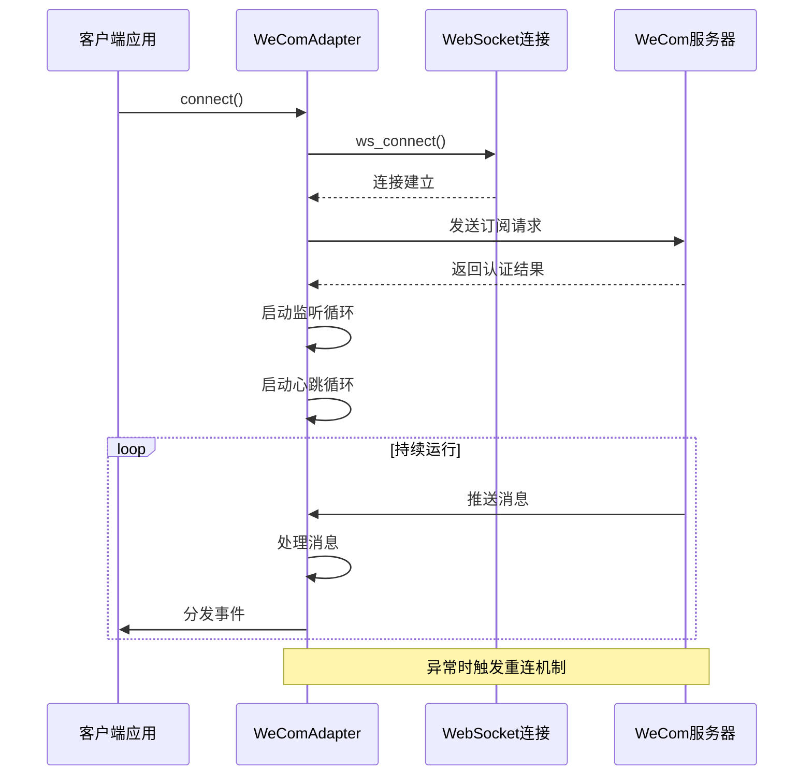
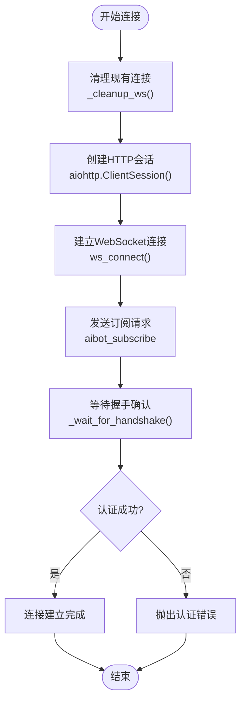
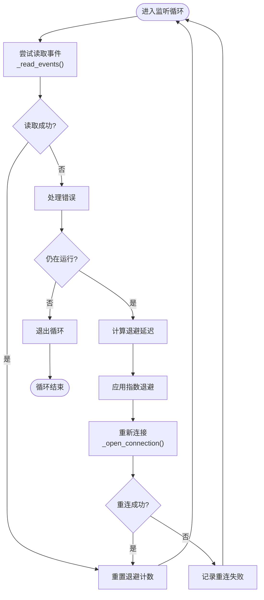
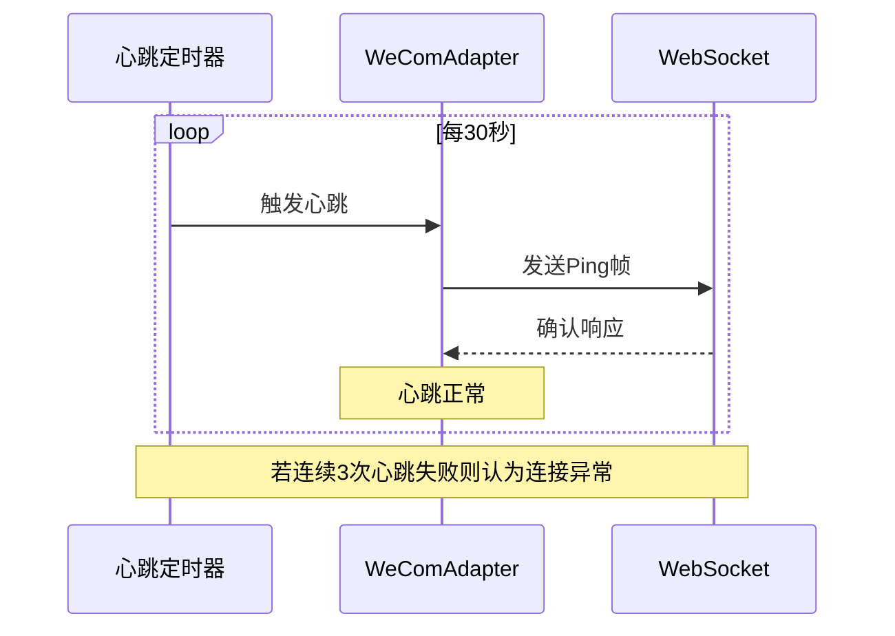
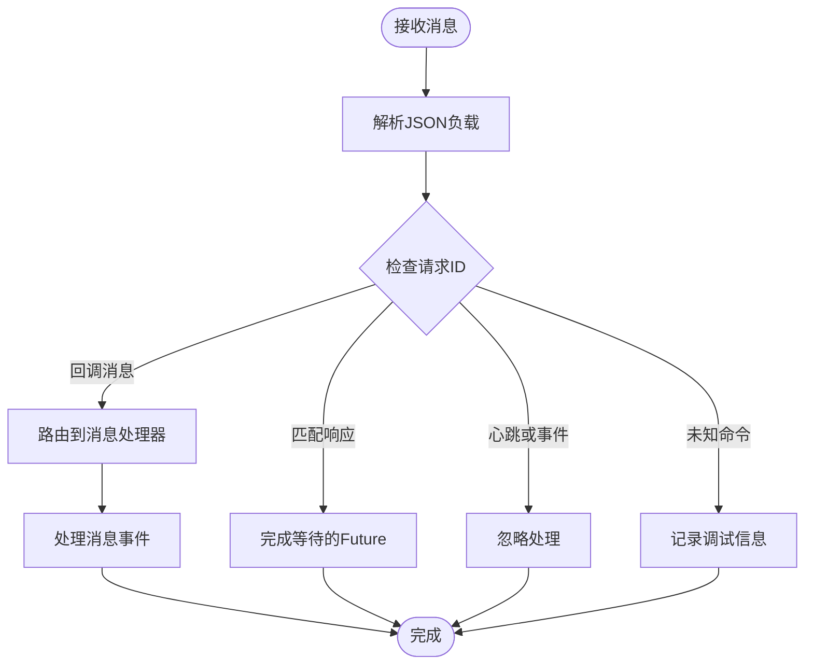

# 连接管理

<cite>
**本文档引用的文件**
- [wecom.py](file://wecom.py)
- [wecom_callback.py](file://wecom_callback.py)
- [group_session.py](file://group_session.py)
- [mention_router.py](file://mention_router.py)
- [wecom_crypto.py](file://wecom_crypto.py)
</cite>

## 目录
1. [简介](#简介)
2. [项目结构](#项目结构)
3. [核心组件](#核心组件)
4. [架构概览](#架构概览)
5. [详细组件分析](#详细组件分析)
6. [依赖关系分析](#依赖关系分析)
7. [性能考虑](#性能考虑)
8. [故障排除指南](#故障排除指南)
9. [结论](#结论)

## 简介

WeCom WebSocket 连接管理是企业微信平台适配器的核心功能模块，负责建立和维护与 WeCom AI Bot WebSocket 网关的持久化连接。该模块实现了完整的连接生命周期管理、认证握手、消息路由、重连机制和健康检查等功能。

本模块基于 aiohttp 异步客户端库构建，提供了高可用的企业级 WebSocket 连接管理能力，支持自动重连、心跳保活、请求响应关联等关键特性。

## 项目结构

该项目采用模块化设计，主要包含以下核心文件：

```mermaid
graph TB
subgraph "核心适配器模块"
A[wecom.py<br/>主适配器实现]
B[group_session.py<br/>群组会话管理]
C[mention_router.py<br/>@提及路由]
end
subgraph "回调模式模块"
D[wecom_callback.py<br/>HTTP回调适配器]
E[wecom_crypto.py<br/>加密解密工具]
end
subgraph "外部依赖"
F[aiohttp<br/>异步HTTP客户端]
G[httpx<br/>异步HTTP客户端]
H[asyncio<br/>异步任务管理]
end
A --> F
A --> G
A --> H
A --> B
A --> C
D --> F
D --> G
D --> E
```

**图表来源**
- [wecom.py:160-200](file://wecom.py#L160-L200)
- [wecom_callback.py:55-72](file://wecom_callback.py#L55-L72)

**章节来源**
- [wecom.py:1-100](file://wecom.py#L1-L100)
- [wecom_callback.py:1-50](file://wecom_callback.py#L1-L50)

## 核心组件

### WeComAdapter 类

WeComAdapter 是整个连接管理系统的核心类，继承自 BasePlatformAdapter，提供了完整的 WebSocket 连接管理功能。

#### 关键配置参数

| 参数名称 | 默认值 | 描述 |
|---------|--------|------|
| bot_id | 从环境变量获取 | WeCom 机器人标识符 |
| secret | 从环境变量获取 | WeCom 认证密钥 |
| websocket_url | wss://openws.work.weixin.qq.com | WebSocket 服务器地址 |
| dm_policy | open | 私聊策略 (open/allowlist/disabled) |
| group_policy | open | 群聊策略 (open/allowlist/disabled) |
| HEARTBEAT_INTERVAL_SECONDS | 30.0 | 心跳间隔秒数 |
| CONNECT_TIMEOUT_SECONDS | 20.0 | 连接超时秒数 |
| REQUEST_TIMEOUT_SECONDS | 15.0 | 请求超时秒数 |

#### 主要方法

1. **connect()** - 建立 WebSocket 连接
2. **disconnect()** - 断开连接并清理资源
3. **_open_connection()** - 打开并认证连接
4. **_listen_loop()** - 主监听循环
5. **_heartbeat_loop()** - 心跳保活循环

**章节来源**
- [wecom.py:160-200](file://wecom.py#L160-L200)
- [wecom.py:212-278](file://wecom.py#L212-L278)

## 架构概览



**图表来源**
- [wecom.py:212-246](file://wecom.py#L212-L246)
- [wecom.py:289-313](file://wecom.py#L289-L313)
- [wecom.py:338-363](file://wecom.py#L338-L363)

## 详细组件分析

### 连接建立过程

#### _open_connection() 方法实现

_open_connection() 方法负责建立 WebSocket 连接并完成认证握手：



**图表来源**
- [wecom.py:289-313](file://wecom.py#L289-L313)
- [wecom.py:314-337](file://wecom.py#L314-L337)

#### 握手协议和认证流程

认证流程遵循 WeCom AI Bot 协议规范：

1. **连接初始化**: 清理旧连接，创建新的 aiohttp 会话
2. **WebSocket 连接**: 使用指定的超时和心跳参数建立连接
3. **订阅请求**: 发送包含 bot_id 和 secret 的订阅消息
4. **认证验证**: 等待服务器返回的认证结果
5. **错误处理**: 处理认证失败和连接中断情况

**章节来源**
- [wecom.py:289-337](file://wecom.py#L289-L337)

### 连接生命周期管理

#### connect() 方法

connect() 方法是连接管理的入口点，负责完整的连接建立流程：

```mermaid
flowchart TD
ConnectStart([connect()调用]) --> CheckDeps{"检查依赖"}
CheckDeps --> |缺失| SetFatalError["设置致命错误"]
CheckDeps --> |存在| CreateHTTP["创建HTTP客户端"]
CreateHTTP --> OpenConn["_open_connection()"]
OpenConn --> MarkConnected["标记连接状态"]
MarkConnected --> StartTasks["启动监听和心跳任务"]
StartTasks --> LogSuccess["记录连接成功"]
LogSuccess --> ConnectEnd([返回True])
SetFatalError --> CleanupOnError["清理资源"]
CleanupOnError --> ReturnFalse([返回False])
```

**图表来源**
- [wecom.py:212-246](file://wecom.py#L212-L246)

#### disconnect() 方法

disconnect() 方法负责优雅断开连接：

```mermaid
flowchart TD
DisconnectStart([disconnect()调用]) --> StopRunning["停止运行标志"]
StopRunning --> MarkDisconnected["标记断开状态"]
MarkDisconnected --> CancelTasks["取消监听和心跳任务"]
CancelTasks --> FailPending["失败未完成的响应"]
FailPending --> CleanupWS["_cleanup_ws()"]
CleanupWS --> CloseHTTP["关闭HTTP客户端"]
CloseHTTP --> ClearDedup["清理去重缓存"]
ClearDedup --> LogDisconnect["记录断开日志"]
LogDisconnect --> DisconnectEnd([完成])
```

**图表来源**
- [wecom.py:248-278](file://wecom.py#L248-L278)

#### _cleanup_ws() 方法

_cleanup_ws() 方法确保所有 WebSocket 资源得到正确清理：

- 关闭活跃的 WebSocket 连接
- 关闭底层 HTTP 会话
- 清理连接状态引用

**章节来源**
- [wecom.py:248-288](file://wecom.py#L248-L288)

### 连接重连机制

#### _listen_loop() 方法

_listen_loop() 实现了智能重连机制，采用指数退避策略：



**图表来源**
- [wecom.py:338-363](file://wecom.py#L338-L363)

#### 指数退避策略

重连延迟采用预定义的时间序列：
- 2 秒 (第一次重连)
- 5 秒 (第二次重连)  
- 10 秒 (第三次重连)
- 30 秒 (第四次重连)
- 60 秒 (后续重连)

这种策略平衡了快速恢复和避免过度重试的需求。

**章节来源**
- [wecom.py:338-363](file://wecom.py#L338-L363)

### 连接状态监控和健康检查

#### 应用层心跳机制

系统实现了双重心跳保护机制：

1. **底层 WebSocket 心跳**: 由 aiohttp 提供的内置心跳检测
2. **应用层 Ping 帧**: 自定义的心跳保活机制



**图表来源**
- [wecom.py:378-396](file://wecom.py#L378-L396)

#### 错误恢复逻辑

当检测到连接异常时，系统执行以下恢复步骤：

1. **标记连接中断**: 更新内部状态
2. **失败未完成响应**: 取消所有等待中的请求
3. **启动重连流程**: 应用指数退避策略
4. **重新认证**: 重新建立 WebSocket 连接
5. **恢复服务**: 继续正常的消息处理

**章节来源**
- [wecom.py:378-396](file://wecom.py#L378-L396)

### 数据流处理

#### _dispatch_payload() 方法

消息分发器负责将收到的 WebSocket 消息路由到相应的处理器：



**图表来源**
- [wecom.py:398-423](file://wecom.py#L398-L423)

#### 请求-响应关联

系统使用请求 ID 实现请求-响应的精确关联：

1. **生成唯一ID**: 每个请求都分配唯一的 req_id
2. **存储等待映射**: 将 req_id 映射到 Future 对象
3. **响应匹配**: 收到响应时根据 req_id 完成对应的 Future
4. **超时处理**: 超时后自动清理等待队列

**章节来源**
- [wecom.py:424-470](file://wecom.py#L424-L470)

## 依赖关系分析

```mermaid
graph TB
subgraph "WeComAdapter 依赖图"
A[BasePlatformAdapter<br/>基础平台适配器]
B[aiohttp.ClientSession<br/>异步HTTP会话]
C[httpx.AsyncClient<br/>异步HTTP客户端]
D[asyncio.Task<br/>异步任务]
E[MessageDeduplicator<br/>消息去重器]
F[MentionRouter<br/>@提及路由器]
end
subgraph "外部系统"
G[WeCom WebSocket服务器]
H[企业微信API]
end
A --> B
A --> C
A --> D
A --> E
A --> F
A --> G
A --> H
```

**图表来源**
- [wecom.py:60-70](file://wecom.py#L60-L70)
- [wecom.py:187-206](file://wecom.py#L187-L206)

### 外部依赖

| 依赖库 | 版本要求 | 用途 |
|-------|----------|------|
| aiohttp | >=3.0 | WebSocket 连接和 HTTP 通信 |
| httpx | >=0.18 | 异步 HTTP 客户端 |
| cryptography | >=3.0 | 加密解密操作 |
| typing_extensions | >=3.7 | 类型注解支持 |

**章节来源**
- [wecom.py:46-58](file://wecom.py#L46-L58)

## 性能考虑

### 连接池优化

系统采用单连接管理模式，避免了连接池管理的复杂性，同时通过以下机制保证性能：

1. **连接复用**: 同一适配器实例复用同一个 WebSocket 连接
2. **批量处理**: 文本消息支持批量聚合处理
3. **异步非阻塞**: 全面使用 asyncio 实现非阻塞 I/O

### 内存管理

- **消息去重**: 使用 MessageDeduplicator 防止重复消息处理
- **响应缓存**: 有限大小的响应等待队列
- **会话清理**: 断开连接时彻底清理所有资源

### 网络优化

- **心跳保活**: 30秒心跳间隔平衡网络占用和连接稳定性
- **超时控制**: 20秒连接超时和15秒请求超时
- **指数退避**: 最长60秒重连间隔避免网络拥塞

## 故障排除指南

### 常见连接问题及解决方案

#### 认证失败

**症状**: 连接建立后立即断开，日志显示认证错误

**可能原因**:
- bot_id 或 secret 配置错误
- 服务器时间不同步
- 网络防火墙阻止连接

**解决步骤**:
1. 验证 bot_id 和 secret 配置
2. 检查服务器时间同步
3. 测试网络连通性
4. 查看详细错误日志

#### 连接超时

**症状**: 连接在 20 秒内超时

**可能原因**:
- 网络延迟过高
- 服务器负载过重
- 防火墙规则限制

**解决步骤**:
1. 检查网络延迟和带宽
2. 降低并发连接数
3. 调整超时参数
4. 检查服务器状态

#### 心跳失败

**症状**: 连续多次心跳失败后自动重连

**可能原因**:
- 网络不稳定
- 代理服务器中断
- 服务器端主动断开

**解决步骤**:
1. 检查网络稳定性
2. 配置可靠的代理
3. 监控服务器状态
4. 实施更积极的重连策略

### 调试技巧

#### 日志级别设置

建议在开发环境中使用 DEBUG 级别，在生产环境中使用 INFO 级别：

```python
# 设置日志级别
import logging
logging.getLogger('wecom').setLevel(logging.DEBUG)
```

#### 连接状态监控

可以通过以下方式监控连接状态：

```python
# 检查连接状态
if adapter.connected:
    print("连接正常")
else:
    print("连接异常")

# 获取连接统计信息
print(f"已处理消息: {adapter.message_count}")
print(f"当前等待响应: {len(adapter.pending_responses)}")
```

**章节来源**
- [wecom.py:212-246](file://wecom.py#L212-L246)
- [wecom.py:338-363](file://wecom.py#L338-L363)

## 结论

WeCom WebSocket 连接管理系统提供了企业级的实时通信能力，具有以下特点：

1. **高可靠性**: 完善的重连机制和错误恢复策略
2. **高性能**: 异步非阻塞架构，支持高并发处理
3. **易维护**: 清晰的代码结构和完善的文档
4. **可扩展**: 模块化设计支持功能扩展

该系统适用于需要与企业微信实时交互的应用场景，如智能客服、消息推送、状态通知等。通过合理的配置和监控，可以确保系统的稳定运行和良好的用户体验。