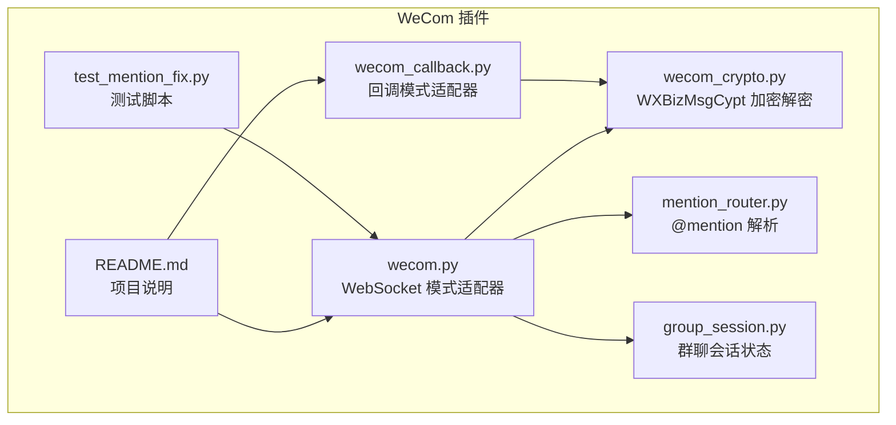
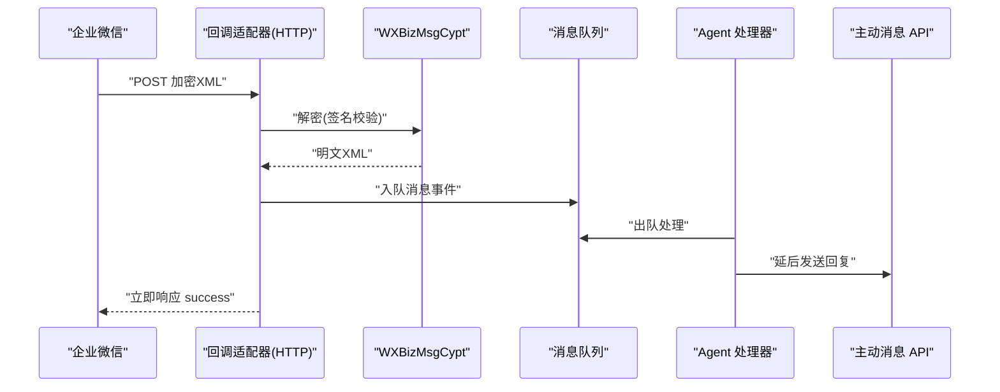
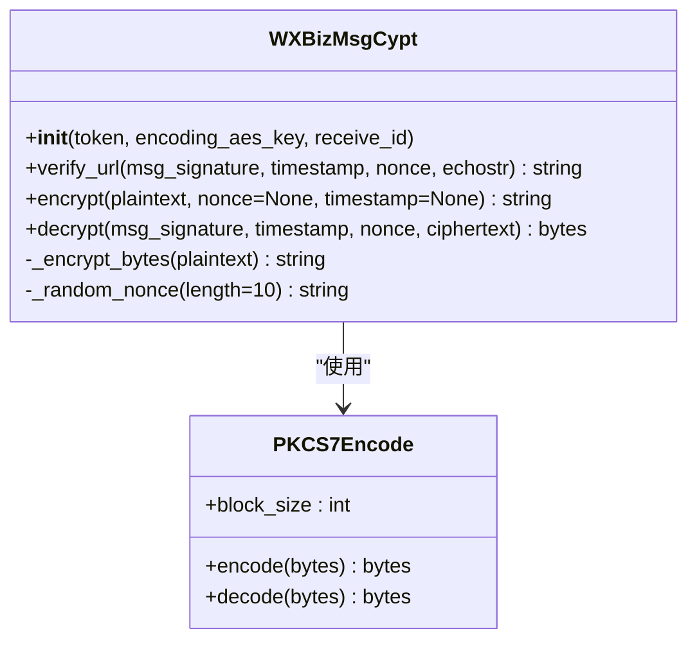
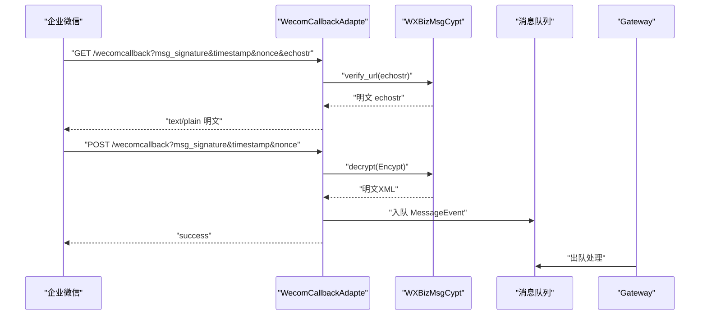
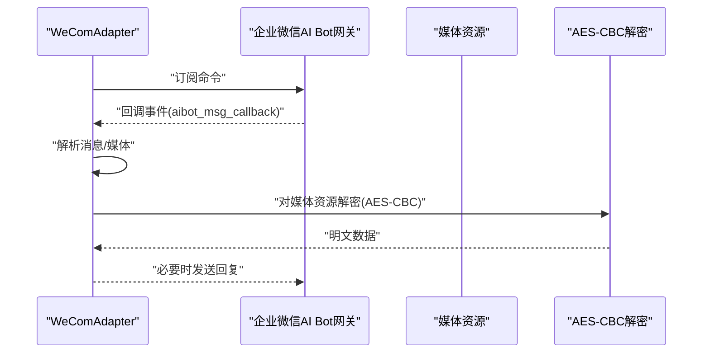
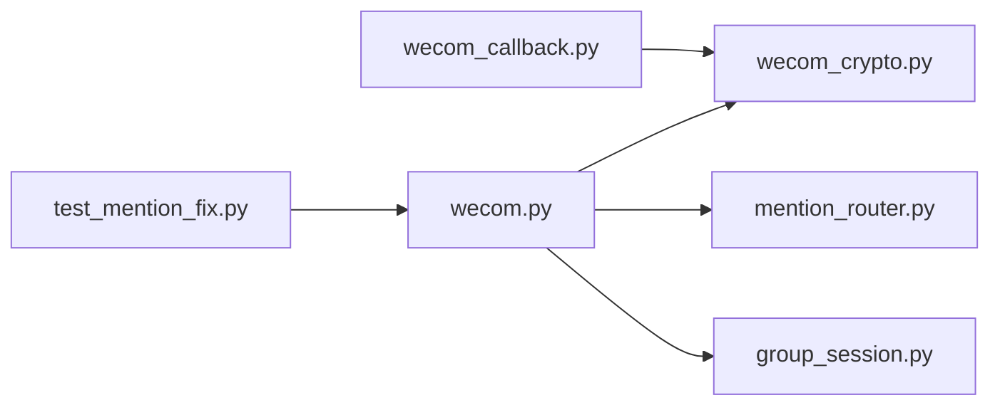

# 加密解密 API

<cite>
**本文引用的文件**
- [wecom_crypto.py](file://wecom_crypto.py)
- [wecom_callback.py](file://wecom_callback.py)
- [wecom.py](file://wecom.py)
- [README.md](file://README.md)
- [mention_router.py](file://mention_router.py)
- [group_session.py](file://group_session.py)
- [test_mention_fix.py](file://test_mention_fix.py)
- [bk/wecom_crypto.py](file://bk/wecom_crypto.py)
- [bk/wecom_callback.py](file://bk/wecom_callback.py)
</cite>

## 目录
1. [简介](#简介)
2. [项目结构](#项目结构)
3. [核心组件](#核心组件)
4. [架构总览](#架构总览)
5. [详细组件分析](#详细组件分析)
6. [依赖关系分析](#依赖关系分析)
7. [性能与安全考量](#性能与安全考量)
8. [故障排查指南](#故障排查指南)
9. [结论](#结论)
10. [附录](#附录)

## 简介
本文件面向 WeCom（企业微信）加密解密 API 的技术文档，重点围绕 WXBizMsgCypt 类的实现原理与使用方法，系统性梳理消息加密、解密、签名生成与验证流程，详解 AES-CBC 加密算法的密钥管理、初始化向量与 PKCS7 填充机制，说明 SHA1 签名算法的实现细节与应用场景，并给出回调模式与 WebSocket 模式下的不同应用差异。同时提供安全最佳实践与常见问题解决方案，帮助开发者在生产环境中稳定集成 WeCom 加解密能力。

## 项目结构
本仓库包含 WeCom 加密解密模块、回调适配器、WebSocket 适配器及配套工具模块：
- 加密解密模块：wecom_crypto.py
- 回调模式适配器：wecom_callback.py
- WebSocket 模式适配器：wecom.py
- 群聊 @mention 解析与多 Agent 支持：mention_router.py、group_session.py
- 测试与修复脚本：test_mention_fix.py
- 历史备份文件：bk/wecom_crypto.py、bk/wecom_callback.py

图表来源
- [wecom_crypto.py](file://wecom_crypto.py)
- [wecom_callback.py](file://wecom_callback.py)
- [wecom.py](file://wecom.py)
- [mention_router.py](file://mention_router.py)
- [group_session.py](file://group_session.py)
- [test_mention_fix.py](file://test_mention_fix.py)
- [README.md](file://README.md)

章节来源
- [README.md](file://README.md)

## 核心组件
- WXBizMsgCypt：实现与企业微信官方 WXBizMsgCypt 兼容的消息加解密与签名校验，支持回调模式。
- WecomCallbackAdapte：基于 aiohttp 的 HTTP 服务端，负责接收 WeCom 回调请求，完成解密与事件派发。
- WeComAdapter：基于 WebSocket 的客户端适配器，负责与企业微信 AI Bot 网关建立连接、收发消息、媒体下载与解密等。
- PKCS7Encode：实现 PKCS7 填充与去填充，确保明文按块对齐。
- SHA1 签名辅助函数：用于生成与校验消息签名。
- 多 Agent 群聊支持：mention_router 与 group_session 提供 @mention 解析与讨论链管理。

章节来源
- [wecom_crypto.py](file://wecom_crypto.py)
- [wecom_callback.py](file://wecom_callback.py)
- [wecom.py](file://wecom.py)
- [mention_router.py](file://mention_router.py)
- [group_session.py](file://group_session.py)

## 架构总览
WeCom 加密解密在两种模式下工作：
- 回调模式（HTTP）：WeCom 将加密后的 XML 推送到企业自建服务器，服务器使用 WXBizMsgCypt 解密后入队，异步处理后再通过主动消息 API 发送回复。
- WebSocket 模式：客户端通过 WebSocket 与企业微信 AI Bot 网关通信，接收/发送消息，部分媒体资源可能采用 AES-CBC 解密。

图表来源
- [wecom_callback.py](file://wecom_callback.py)
- [wecom_crypto.py](file://wecom_crypto.py)

## 详细组件分析

### WXBizMsgCypt 类与加密解密流程
WXBizMsgCypt 实现了与企业微信官方 SDK 兼容的消息加解密与签名校验，关键点如下：
- 密钥与 IV：从编码后的 AES Key（Base64，长度应为 43）解码得到 32 字节密钥，前 16 字节作为 IV。
- 明文结构：随机前缀（16 字节）+ 文本长度（4 字节，网络字节序）+ 文本 + 接收方标识（receive_id）。
- 填充：使用 PKCS7 填充至 32 字节块。
- 加密：AES-CBC 模式，IV 来自密钥前 16 字节。
- 签名：SHA1(token + timestamp + nonce + ciphertext)，用于校验消息来源与完整性。
- 解密：先校验签名，再执行解密与去填充，提取明文 XML 并校验 receive_id。

图表来源
- [wecom_crypto.py](file://wecom_crypto.py)

章节来源
- [wecom_crypto.py](file://wecom_crypto.py)

#### 加密流程（客户端/服务端生成加密负载）
- 生成随机前缀（16 字节）。
- 计算明文长度（4 字节，网络字节序）。
- 组合明文：随机前缀 + 长度 + 明文 + receive_id。
- 使用 PKCS7 填充至 32 字节块。
- 使用 AES-CBC（IV=密钥前 16 字节）加密。
- Base64 编码密文。
- 生成 SHA1 签名（token + timestamp + nonce + ciphertext）。
- 组装 XML 返回。

章节来源
- [wecom_crypto.py](file://wecom_crypto.py)

#### 解密流程（服务端接收回调）
- 校验 SHA1 签名（token + timestamp + nonce + ciphertext）。
- Base64 解码密文。
- AES-CBC 解密并去 PKCS7 填充。
- 跳过随机前缀（16 字节），解析长度字段，提取 XML 内容。
- 校验 receive_id 是否匹配。
- 返回明文 XML。

章节来源
- [wecom_crypto.py](file://wecom_crypto.py)

#### 签名生成与验证
- 签名输入：token、timestamp、nonce、ciphertext。
- 对上述参数排序拼接后计算 SHA1。
- 验证时比较期望值与 msg_signature。

章节来源
- [wecom_crypto.py](file://wecom_crypto.py)

#### PKCS7 填充与去填充
- 填充长度为 block_size - (len % block_size)，若余数为 0 则填充一个完整块。
- 去填充时检查尾部字节值与重复长度，确保合法且完整。

章节来源
- [wecom_crypto.py](file://wecom_crypto.py)

### 回调模式适配器（WecomCallbackAdapte）
- 提供健康检查、URL 校验握手、回调接收三个 HTTP 端点。
- 支持多应用配置，按 cop_id:use_id 作用域隔离。
- 接收回调后解密并构建消息事件，入队后立即返回 success，异步处理。
- 主动消息通过 access_token API 发送。

图表来源
- [wecom_callback.py](file://wecom_callback.py)
- [wecom_crypto.py](file://wecom_crypto.py)

章节来源
- [wecom_callback.py](file://wecom_callback.py)

### WebSocket 模式适配器（WeComAdapter）
- 通过订阅命令建立与企业微信 AI Bot 网关的持久 WebSocket 连接。
- 解析回调事件，支持文本、语音、图片、文件等类型，自动去重与批处理长文本。
- 支持多 Agent 群聊：@mention 解析与讨论链管理，跨 Agent 自动链式触发。
- 媒体下载与解密：对带 AES Key 的媒体资源进行 AES-CBC 解密。

图表来源
- [wecom.py](file://wecom.py)

章节来源
- [wecom.py](file://wecom.py)

### 多 Agent 群聊支持
- MentionRouter：解析 @mention，支持多种模式与边界控制，返回目标 Agent 列表。
- GroupSessionStore：维护群聊讨论链状态，控制链深度、冷却时间与中断标记。

章节来源
- [mention_router.py](file://mention_router.py)
- [group_session.py](file://group_session.py)

## 依赖关系分析
- wecom_callback.py 依赖 wecom_crypto.py 提供的 WXBizMsgCypt 与异常类型。
- wecom.py 依赖 cryptography 库进行 AES-CBC 解密，用于下载媒体资源的解密。
- mention_router.py 与 group_session.py 为多 Agent 群聊提供解析与状态管理。
- 测试脚本 test_mention_fix.py 验证 @mention 识别逻辑。

图表来源
- [wecom_callback.py](file://wecom_callback.py)
- [wecom_crypto.py](file://wecom_crypto.py)
- [wecom.py](file://wecom.py)
- [mention_router.py](file://mention_router.py)
- [group_session.py](file://group_session.py)
- [test_mention_fix.py](file://test_mention_fix.py)

章节来源
- [wecom_callback.py](file://wecom_callback.py)
- [wecom_crypto.py](file://wecom_crypto.py)
- [wecom.py](file://wecom.py)
- [mention_router.py](file://mention_router.py)
- [group_session.py](file://group_session.py)
- [test_mention_fix.py](file://test_mention_fix.py)

## 性能与安全考量
- AES-CBC 性能：加密/解密为 CPU 密集型操作，建议在高并发场景下合理设置线程/进程与缓存策略。
- PKCS7 填充：确保填充长度与尾部字节一致，避免错误填充导致解密失败。
- SHA1 签名：签名顺序固定，需严格保证 token、timestamp、nonce、ciphertext 的拼接顺序与编码。
- 密钥管理：encoding_aes_key 必须为 43 字符 Base64，且 receive_id 与实际接收方一致。
- WebSocket 模式媒体解密：下载媒体时若携带 AES Key，需使用 32 字节密钥与 16 字节 IV 进行解密。
- 安全最佳实践
  - 严格校验 receive_id，防止跨应用混淆。
  - 对回调请求进行签名校验，拒绝伪造消息。
  - 对敏感日志进行脱敏，避免泄露密钥与明文。
  - 使用 HTTPS 与强密码学套件，避免中间人攻击。
  - 限制回调端点访问来源与速率，降低重放与暴力破解风险。

[本节为通用指导，无需特定文件来源]

## 故障排查指南
- 解密失败（SignatureMismatch）
  - 检查 token、timestamp、nonce、ciphertext 拼接顺序与编码。
  - 确认 receive_id 与配置一致。
- Base64 解码异常
  - 确认密文为有效 Base64，长度符合预期。
- PKCS7 填充错误
  - 检查填充长度与尾部字节一致性，确认未被截断。
- WebSocket 媒体解密失败
  - 确认 AES Key 为 32 字节，IV 为前 16 字节。
  - 检查媒体下载是否成功与内容长度限制。
- 回调端点不可用
  - 检查端口占用、依赖安装与网络连通性。
  - 确认 aiohttp/httpx 可用。

章节来源
- [wecom_crypto.py](file://wecom_crypto.py)
- [wecom_callback.py](file://wecom_callback.py)
- [wecom.py](file://wecom.py)

## 结论
本仓库提供了与企业微信官方 SDK 兼容的回调模式加解密实现，并在 WebSocket 模式下补充了媒体资源解密与多 Agent 群聊支持。通过 WXBizMsgCypt 的标准化加解密流程与严格的签名校验，能够满足企业微信回调的安全要求。结合回调适配器与 WebSocket 适配器，开发者可灵活选择模式并快速集成企业微信能力。

[本节为总结，无需特定文件来源]

## 附录

### AES-CBC 与 PKCS7 填充要点
- 密钥长度：32 字节（256 位），IV 为前 16 字节。
- 块大小：32 字节。
- 填充方式：PKCS7，填充长度为 block_size - (len % block_size)，若余数为 0 则填充一个完整块。
- 字节序：长度字段使用网络字节序（大端）。

章节来源
- [wecom_crypto.py](file://wecom_crypto.py)
- [wecom.py](file://wecom.py)

### SHA1 签名输入顺序
- 输入参数：token、timestamp、nonce、ciphertext。
- 排序后拼接，计算 SHA1，结果为 40 字符十六进制字符串。

章节来源
- [wecom_crypto.py](file://wecom_crypto.py)

### 回调模式与 WebSocket 模式的差异
- 回调模式：由企业微信主动推送加密 XML，服务端解密后入队异步处理，适合被动接收与统一调度。
- WebSocket 模式：客户端主动连接企业微信网关，实时收发消息，适合高交互场景与主动推送。

章节来源
- [wecom_callback.py](file://wecom_callback.py)
- [wecom.py](file://wecom.py)

### 历史变更与修复参考
- 备份文件显示早期版本存在拼写错误与变量命名不规范，现已修正为更清晰的实现。
- 测试脚本验证 @mention 识别逻辑，确保群聊多 Agent 场景下的正确路由。

章节来源
- [bk/wecom_crypto.py](file://bk/wecom_crypto.py)
- [bk/wecom_callback.py](file://bk/wecom_callback.py)
- [test_mention_fix.py](file://test_mention_fix.py)