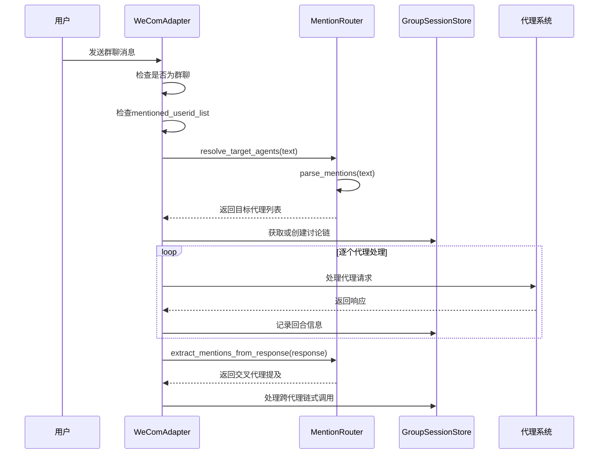
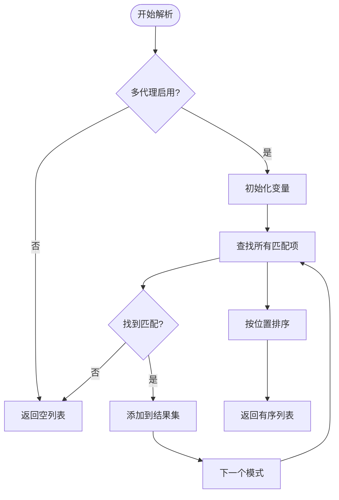
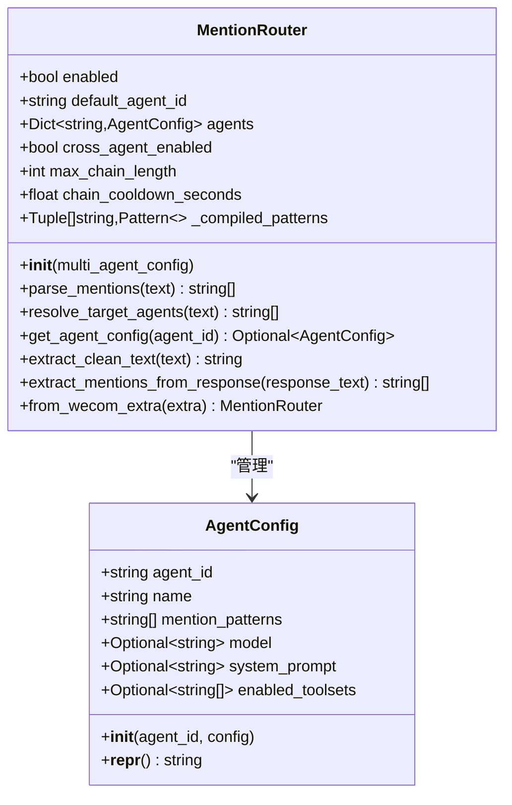
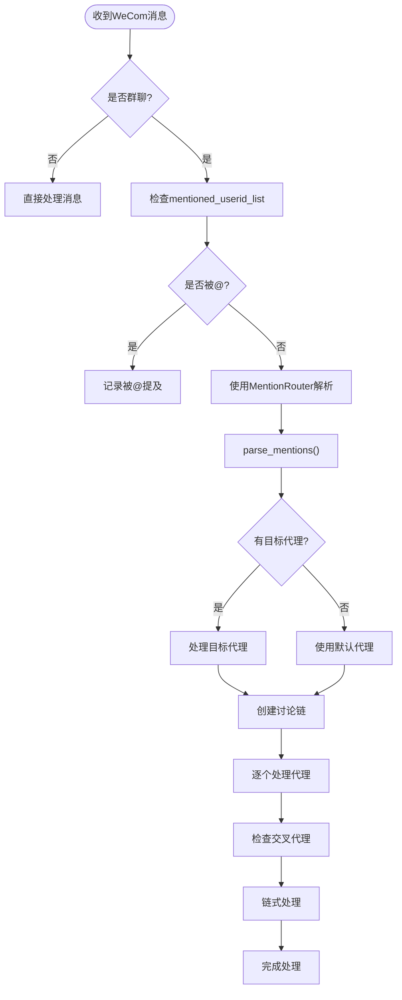
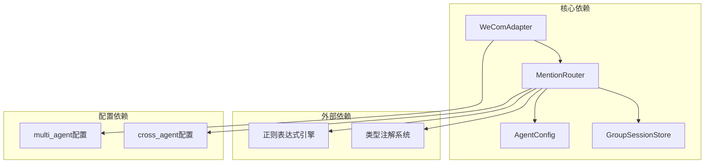
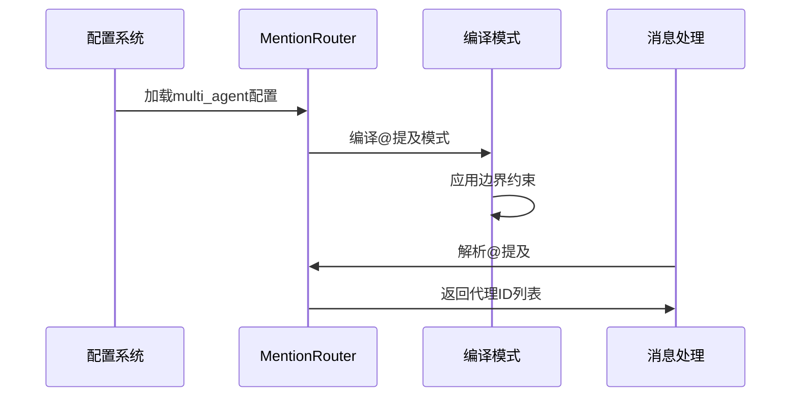
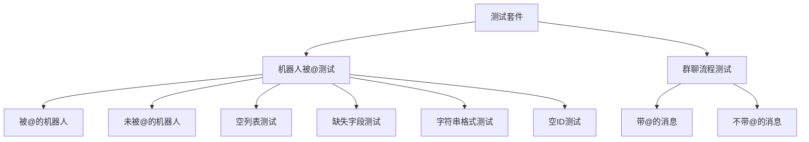

# @提及解析机制

<cite>
**本文档引用的文件**
- [mention_router.py](file://mention_router.py)
- [bk/mention_router.py](file://bk/mention_router.py)
- [wecom.py](file://wecom.py)
- [test_mention_fix.py](file://test_mention_fix.py)
- [bk/test_mention_fix.py](file://bk/test_mention_fix.py)
- [group_session.py](file://group_session.py)
- [README.md](file://README.md)
</cite>

## 目录
1. [简介](#简介)
2. [项目结构](#项目结构)
3. [核心组件](#核心组件)
4. [架构概览](#架构概览)
5. [详细组件分析](#详细组件分析)
6. [依赖关系分析](#依赖关系分析)
7. [性能考虑](#性能考虑)
8. [故障排除指南](#故障排除指南)
9. [结论](#结论)
10. [附录](#附录)

## 简介
本文档深入解析企业微信（WeCom）群聊中的@提及解析机制，重点阐述MentionRouter类的核心实现原理。该机制支持：
- 多种@提及模式的识别与解析
- 大小写不敏感的匹配机制
- ASCII字符与CJK全角标点符号的处理
- 多代理提及模式的配置与动态生成
- 性能优化策略与边界情况处理
- 实际使用场景演示

## 项目结构
该项目围绕WeCom网关插件构建，包含以下关键文件：
- mention_router.py：@提及解析器的核心实现
- wecom.py：WeCom适配器，集成@提及解析功能
- group_session.py：群聊会话管理，支持多代理讨论链
- test_mention_fix.py：@提及修复测试脚本
- README.md：项目说明与配置示例

```mermaid
graph TB
subgraph "WeCom插件核心"
MR[MentionRouter<br/>@提及解析器]
WC[WeComAdapter<br/>适配器]
GS[GroupSessionStore<br/>会话存储]
end
subgraph "配置与测试"
CFG[配置文件<br/>multi_agent配置]
TEST[测试脚本<br/>@提及修复测试]
end
WC --> MR
MR --> GS
CFG --> WC
TEST --> WC
```

**图表来源**
- [wecom.py:205](file://wecom.py#L205)
- [mention_router.py:46](file://mention_router.py#L46)
- [group_session.py:96](file://group_session.py#L96)

**章节来源**
- [README.md:1-43](file://README.md#L1-L43)

## 核心组件
MentionRouter类是@提及解析机制的核心，负责：
- 编译正则表达式模式进行@提及匹配
- 解析群聊消息中的代理标识符
- 提供多代理配置管理
- 支持跨代理链式调用

AgentConfig类管理单个代理的配置信息，包括：
- 代理ID与名称
- @提及模式列表
- 可选的模型覆盖配置

**章节来源**
- [mention_router.py:23](file://mention_router.py#L23-L44)
- [mention_router.py:46](file://mention_router.py#L46-L155)

## 架构概览
@提及解析机制在WeCom适配器中实现，形成完整的消息处理流水线：



**图表来源**
- [wecom.py:524](file://wecom.py#L524-L586)
- [wecom.py:909](file://wecom.py#L909-L1050)
- [wecom.py:1051](file://wecom.py#L1051-L1181)

## 详细组件分析

### MentionRouter类实现详解

#### 正则表达式模式设计
MentionRouter使用精心设计的正则表达式模式来确保准确的@提及识别：



**图表来源**
- [mention_router.py:102](file://mention_router.py#L102-L118)

#### 边界条件处理机制
系统实现了完善的边界条件处理：

1. **左边界约束**：使用负向先行断言确保@符号前不能是单词字符或点号
2. **右边界约束**：支持ASCII标点和CJK全角标点作为@提及的结束标志
3. **大小写不敏感**：通过正则表达式标志实现不区分大小写的匹配
4. **重复提及去重**：使用集合跟踪已见代理ID，避免重复处理

#### 多语言支持策略
系统通过以下方式支持多语言环境：
- CJK全角标点符号的完整支持
- Unicode字符集的兼容性处理
- 大小写不敏感匹配机制
- 动态模式生成适应不同语言环境

**章节来源**
- [mention_router.py:17](file://mention_router.py#L17-L21)
- [mention_router.py:91](file://mention_router.py#L91-L100)

### AgentConfig配置管理

AgentConfig类提供灵活的代理配置能力：



**图表来源**
- [mention_router.py:23](file://mention_router.py#L23-L44)
- [mention_router.py:46](file://mention_router.py#L46-L155)

**章节来源**
- [mention_router.py:23](file://mention_router.py#L23-L44)

### WeComAdapter集成实现

WeComAdapter将@提及解析机制无缝集成到消息处理流程中：



**图表来源**
- [wecom.py:524](file://wecom.py#L524-L586)
- [wecom.py:909](file://wecom.py#L909-L1050)

**章节来源**
- [wecom.py:524](file://wecom.py#L524-L586)
- [wecom.py:909](file://wecom.py#L909-L1050)

## 依赖关系分析

### 组件间依赖关系
@提及解析机制涉及多个组件的协作：



**图表来源**
- [mention_router.py:13](file://mention_router.py#L13-L14)
- [wecom.py:62](file://wecom.py#L62)

### 数据流依赖
系统内部的数据流依赖关系：



**图表来源**
- [mention_router.py:91](file://mention_router.py#L91-L100)
- [wecom.py:531](file://wecom.py#L531)

**章节来源**
- [mention_router.py:91](file://mention_router.py#L91-L100)
- [wecom.py:531](file://wecom.py#L531)

## 性能考虑

### 正则表达式优化策略
系统采用多种策略优化@提及解析性能：

1. **预编译模式**：所有@提及模式在初始化时预编译，避免运行时重复编译
2. **边界断言优化**：使用高效的先行断言减少回溯
3. **早期终止**：一旦找到匹配立即停止搜索，提高效率
4. **内存管理**：使用集合跟踪已见代理ID，避免重复处理

### 时间复杂度分析
- **单次解析**：O(n*m)，其中n为消息长度，m为@提及模式数量
- **批量处理**：O(k*n*m)，其中k为消息数量
- **空间复杂度**：O(m+u)，其中u为唯一代理ID数量

### 内存优化措施
- 模式缓存：预编译的正则表达式对象缓存
- 结果去重：使用集合避免重复存储
- 延迟加载：仅在需要时解析消息内容

## 故障排除指南

### 常见问题诊断

#### @提及未被识别
可能原因及解决方案：
1. **模式配置错误**：检查multi_agent配置中的mention_patterns
2. **大小写问题**：确认@提及模式的大小写设置
3. **边界字符问题**：验证消息中@符号周围的标点符号

#### 多代理冲突
当多个代理被同时@提及：
- 系统按首次出现顺序处理代理
- 使用resolve_target_agents()获取处理顺序
- 检查代理配置中的优先级设置

#### 性能问题
如果@提及解析变慢：
- 检查正则表达式模式的复杂度
- 优化mention_patterns配置
- 监控内存使用情况

**章节来源**
- [test_mention_fix.py:26](file://test_mention_fix.py#L26-L77)
- [test_mention_fix.py:80](file://test_mention_fix.py#L80-L117)

### 测试用例分析

系统提供了全面的测试用例验证@提及解析功能：



**图表来源**
- [test_mention_fix.py:26](file://test_mention_fix.py#L26-L77)
- [test_mention_fix.py:80](file://test_mention_fix.py#L80-L117)

**章节来源**
- [test_mention_fix.py:26](file://test_mention_fix.py#L26-L117)

## 结论
@提及解析机制通过MentionRouter类实现了高效、准确的多代理@提及识别。系统的关键优势包括：

1. **精确的边界处理**：通过精心设计的正则表达式确保@提及的准确定位
2. **多语言支持**：完整支持ASCII和CJK字符集
3. **性能优化**：预编译模式和智能缓存机制
4. **可扩展性**：灵活的配置系统支持动态生成@提及模式
5. **稳定性**：完善的测试覆盖和错误处理机制

该机制为WeCom群聊中的多代理协作提供了坚实的技术基础，支持复杂的业务场景需求。

## 附录

### 配置示例
多Agent群聊配置示例：
```yaml
# ~/.hermes/config.yaml
gateway:
  platforms:
    wecom:
      botId: "your-bot-id"
      secret: "your-secret"
      
  # 多Agent群聊配置
  multiAgent:
    enabled: true
    crossAgent:
      enabled: true
      maxChainLength: 5
      chainCooldownSeconds: 3
```

### 使用场景演示
在群聊消息中准确提取代理标识符的实际应用：
1. **多代理协作**：@Alpha @Beta同时触发多个代理
2. **链式对话**：代理回复中@其他代理实现自动链式调用
3. **默认代理**：无人@时使用默认代理处理消息
4. **会话管理**：维护多代理讨论链的状态信息

**章节来源**
- [README.md:21](file://README.md#L21-L38)