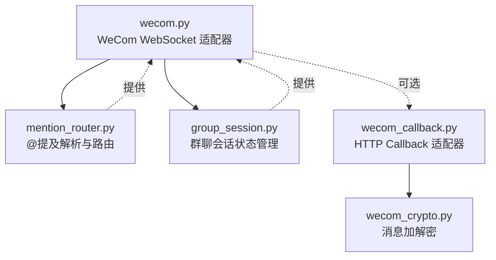
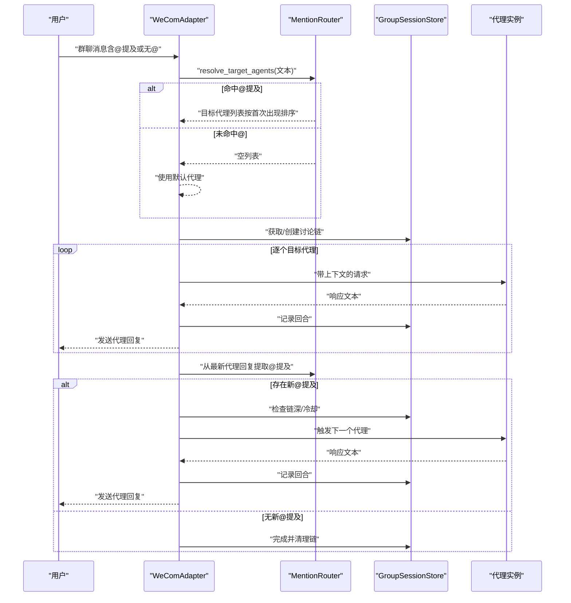
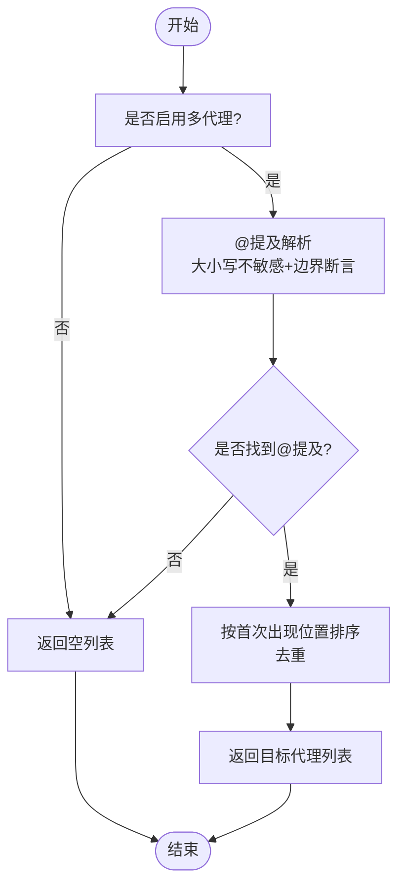
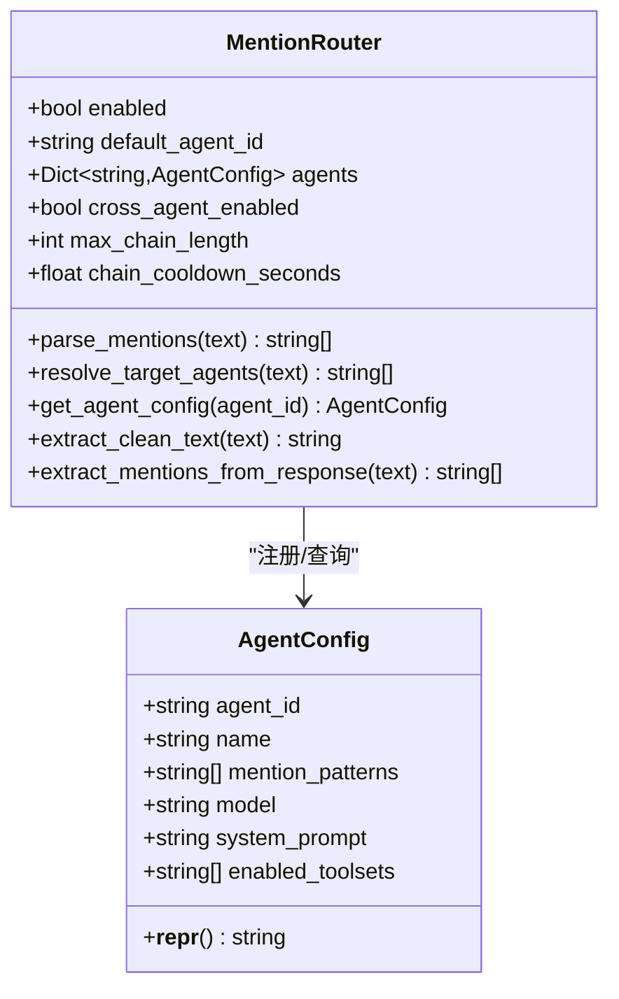
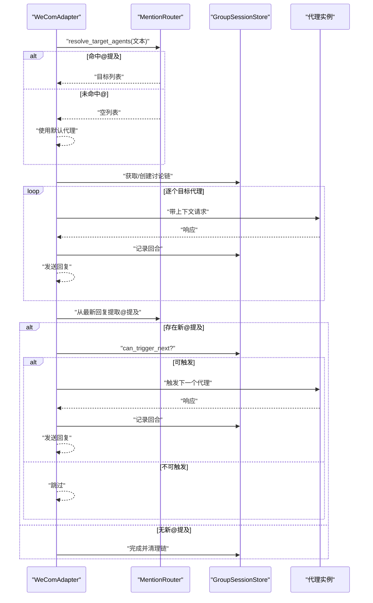
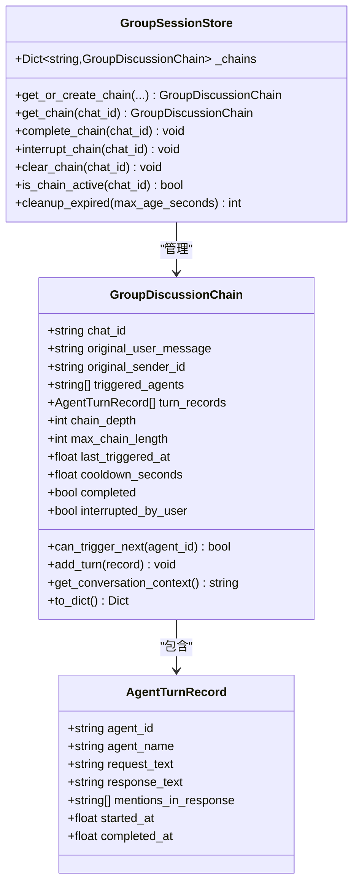
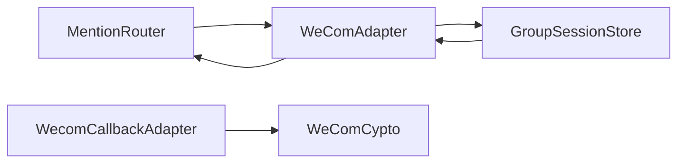

# 代理路由策略

<cite>
**本文引用的文件**
- [mention_router.py](file://mention_router.py)
- [group_session.py](file://group_session.py)
- [wecom.py](file://wecom.py)
- [wecom_callback.py](file://wecom_callback.py)
- [wecom_crypto.py](file://wecom_crypto.py)
- [test_mention_fix.py](file://test_mention_fix.py)
- [README.md](file://README.md)
</cite>

## 目录
1. [简介](#简介)
2. [项目结构](#项目结构)
3. [核心组件](#核心组件)
4. [架构总览](#架构总览)
5. [详细组件分析](#详细组件分析)
6. [依赖关系分析](#依赖关系分析)
7. [性能考量](#性能考量)
8. [故障排查指南](#故障排查指南)
9. [结论](#结论)
10. [附录](#附录)

## 简介
本文件系统性阐述企业微信（WeCom）群聊中的“代理路由策略”，涵盖三类代理触发模式：
- 单代理触发：通过 @某代理名或代理标识触发单一代理
- 多代理并行触发：在同一消息中 @多个代理，按出现顺序并行触发
- 链式对话机制：代理回复中可再次 @其他代理，形成跨代理自动串联

同时，文档深入解析路由决策算法（提及顺序优先级、默认代理回退、冲突解决）、代理配置管理（AgentConfig 设计与动态注册）、跨代理协作（消息传递、状态同步、循环检测），并提供配置模板与实际路由示例，帮助快速搭建复杂代理协作场景。

## 项目结构
该仓库围绕 WeCom 平台适配器与多代理路由能力展开，核心文件如下：
- mention_router.py：@提及解析与代理路由决策
- group_session.py：群聊会话状态管理（讨论链）
- wecom.py：WeCom WebSocket 模式适配器，集成多代理路由与链式处理
- wecom_callback.py：WeCom HTTP Callback 模式适配器（与多代理路由配合使用）
- wecom_crypto.py：回调模式的消息加解密工具
- test_mention_fix.py：@提及检测与群聊流程测试
- README.md：多代理群聊能力概览与配置示例

图表来源
- [wecom.py](file://wecom.py)
- [mention_router.py](file://mention_router.py)
- [group_session.py](file://group_session.py)
- [wecom_callback.py](file://wecom_callback.py)
- [wecom_crypto.py](file://wecom_crypto.py)

章节来源
- [README.md](file://README.md)
- [wecom.py](file://wecom.py)
- [mention_router.py](file://mention_router.py)
- [group_session.py](file://group_session.py)
- [wecom_callback.py](file://wecom_callback.py)
- [wecom_crypto.py](file://wecom_crypto.py)

## 核心组件
- MentionRouter：负责从群聊文本中解析 @提及，生成目标代理列表，并提供清理文本、提取响应中 @提及的能力。支持大小写不敏感匹配与边界断言，确保精准识别。
- AgentConfig：封装单个代理的配置项，如名称、提及模式、模型覆盖、系统提示词、启用工具集等，便于动态注册与查询。
- WeComAdapter：在 WebSocket 模式下接收群聊消息，结合 MentionRouter 决策目标代理，按顺序调用代理并发送结果；支持跨代理链式触发与冷却控制。
- GroupSessionStore：维护群聊讨论链的状态，记录已触发代理、回合记录、链深度、冷却时间等，保障链式流程有序进行与循环检测。
- WecomCallbackAdapter：在 HTTP Callback 模式下接收企业微信回调，解密后入队处理，与多代理路由配合使用。
- WeComCypto：实现与官方 BizMsgCrypt 兼容的加解密，保证回调数据安全。

章节来源
- [mention_router.py](file://mention_router.py)
- [wecom.py](file://wecom.py)
- [group_session.py](file://group_session.py)
- [wecom_callback.py](file://wecom_callback.py)
- [wecom_crypto.py](file://wecom_crypto.py)

## 架构总览
多代理路由在 WeCom 群聊中的工作流如下：
- 入站消息到达后，若为群聊且启用了多代理，则优先通过 MentionRouter 解析 @提及；若未命中 @，则回落到默认代理
- 对每个目标代理，构建上下文并调用代理，将各代理的回复按顺序发送至群聊
- 在代理回复中扫描 @提及，形成跨代理链式触发，受最大链长与冷却时间限制
- 会话状态由 GroupSessionStore 维护，避免重复触发与无限循环

图表来源
- [wecom.py](file://wecom.py)
- [mention_router.py](file://mention_router.py)
- [group_session.py](file://group_session.py)

## 详细组件分析

### MentionRouter：@提及解析与路由决策
- 动态注册与配置
  - 支持在 multi_agent 配置中声明 agents，每个代理可定义 name 与 mention_patterns（默认自动生成 @名称/@标识）
  - 支持 per-agent 的模型覆盖、系统提示词、工具集启用等配置
- 路由决策算法
  - parse_mentions：对文本进行大小写不敏感匹配，基于左右边界断言，按首次出现位置排序，去重后返回代理ID列表
  - resolve_target_agents：若解析到 @提及则返回列表；否则返回空列表，调用方应使用默认代理
  - extract_clean_text：移除 @标记后的干净文本，便于下游处理
  - extract_mentions_from_response：从代理回复中提取新的 @提及，用于链式触发
- 默认代理回退与冲突解决
  - 当未命中 @提及时，返回空列表，调用方使用 default_agent_id
  - 已触发过的代理不会重复触发（链式阶段过滤已触发集合）

图表来源
- [mention_router.py](file://mention_router.py)

章节来源
- [mention_router.py](file://mention_router.py)

### AgentConfig：代理配置管理
- 字段与职责
  - agent_id：代理唯一标识
  - name：显示名称，默认与 agent_id 相同
  - mention_patterns：提及模式列表（默认包含 @名称 与 @标识）
  - model/system_prompt/enabled_toolsets：可选的 per-agent 覆盖项
- 动态注册与查询
  - MentionRouter 在初始化时遍历 agents 配置，构建 AgentConfig 映射
  - 提供 get_agent_config(agent_id) 查询配置

图表来源
- [mention_router.py](file://mention_router.py)

章节来源
- [mention_router.py](file://mention_router.py)

### WeComAdapter：多代理路由与链式处理
- 群聊消息入口
  - 在群聊中优先检查 WeCom 的 mentioned_userid_list，若未命中再通过 MentionRouter 解析文本中的 @提及
  - 若启用多代理且 cross_agent_enabled，则进入多代理处理流程
- 多代理并行触发
  - resolve_target_agents 返回的目标代理按顺序逐一调用
  - 为每个代理构建“当前讨论上下文”（历史对话摘要），并发送其回复
- 链式对话机制
  - 在所有目标代理回复完成后，扫描最新代理回复中的 @提及
  - 过滤掉已触发代理，按链深与冷却时间判断是否继续触发
  - 递归扫描最新回复中的 @提及，直至无新代理或达到最大链深
- 默认代理回退
  - 若 resolve_target_agents 返回空列表，则使用 default_agent_id

图表来源
- [wecom.py](file://wecom.py)
- [mention_router.py](file://mention_router.py)
- [group_session.py](file://group_session.py)

章节来源
- [wecom.py](file://wecom.py)

### GroupSessionStore：跨代理协作与状态同步
- 讨论链状态
  - chat_id、原始用户消息、发起者、已触发代理序列、回合记录、链深、最大链深、冷却时间、最后触发时间、完成/中断标志
- 关键方法
  - get_or_create_chain：按 chat_id 获取或创建讨论链，支持传入最大链深与冷却秒数
  - add_turn：记录回合（代理ID、名称、请求/响应文本、提及列表、时间戳）
  - get_conversation_context：生成“当前讨论上下文”字符串，供后续代理使用
  - can_trigger_next：检查是否允许触发下一个代理（链深上限、冷却时间、重复触发）
  - complete_chain/clear_chain/interrupt_chain：生命周期管理
  - is_chain_active：判断链是否处于活跃状态
  - cleanup_expired：清理过期链
- 循环检测与冲突解决
  - can_trigger_next 会阻止同一代理在同一条链中重复触发
  - 通过 max_chain_length 限制链深，避免无限循环
  - 通过 chain_cooldown_seconds 控制触发频率，缓解抖动

图表来源
- [group_session.py](file://group_session.py)

章节来源
- [group_session.py](file://group_session.py)

### WecomCallbackAdapter 与 WeComCypto：回调模式支持
- WecomCallbackAdapter
  - 提供 HTTP 回调端点，接收企业微信加密 XML，解密后转换为消息事件入队处理
  - 支持多应用配置，按企业ID与用户ID映射应用，异步轮询队列并派发给网关
  - 通过 access_token 定期刷新，使用消息发送 API 异步回复
- WeComCypto
  - 实现与官方 BizMsgCrypt 兼容的加解密与签名验证，确保回调数据的机密性与完整性

章节来源
- [wecom_callback.py](file://wecom_callback.py)
- [wecom_crypto.py](file://wecom_crypto.py)

## 依赖关系分析
- MentionRouter 依赖正则表达式与配置字典，提供纯函数式的解析与路由能力
- WeComAdapter 依赖 MentionRouter 与 GroupSessionStore，负责消息分发与链式触发
- GroupSessionStore 为内存态，按 chat_id 维度隔离，避免跨会话污染
- WecomCallbackAdapter 与 WeComCypto 独立于多代理路由，但可与之配合使用

图表来源
- [wecom.py](file://wecom.py)
- [mention_router.py](file://mention_router.py)
- [group_session.py](file://group_session.py)
- [wecom_callback.py](file://wecom_callback.py)
- [wecom_crypto.py](file://wecom_crypto.py)

章节来源
- [wecom.py](file://wecom.py)
- [mention_router.py](file://mention_router.py)
- [group_session.py](file://group_session.py)
- [wecom_callback.py](file://wecom_callback.py)
- [wecom_crypto.py](file://wecom_crypto.py)

## 性能考量
- 正则编译与缓存
  - MentionRouter 在初始化时编译所有代理的提及模式正则，避免运行时重复编译
- 文本清理与上下文拼接
  - 上下文构建采用高效字符串拼接；建议在上游控制上下文长度，避免超长消息导致性能下降
- 冷却与链深限制
  - 通过 chain_cooldown_seconds 与 max_chain_length 控制链式触发速率与深度，降低并发压力
- 会话存储
  - GroupSessionStore 使用内存字典与锁保护，适合短期讨论链；建议定期清理过期链以释放内存

[本节为通用指导，无需特定文件来源]

## 故障排查指南
- @提及未生效
  - 检查 multi_agent.enabled 与 cross_agent.enabled 是否开启
  - 确认 mention_patterns 是否包含正确的 @前缀与边界断言
  - 群聊中若 WeCom 的 mentioned_userid_list 未包含机器人ID，需依赖文本 @解析
- 默认代理未触发
  - 确认 resolve_target_agents 返回空列表时，调用方是否正确使用 default_agent_id
- 链式触发异常
  - 检查 max_chain_length 与 chain_cooldown_seconds 设置是否合理
  - 确认代理回复中 @提及是否指向已配置的代理ID
- 回调模式无法接收消息
  - 确认回调端点路径、签名验证通过、access_token 刷新成功
- 测试验证
  - 使用 test_mention_fix.py 验证 _is_bot_mentioned 与群聊消息流程

章节来源
- [test_mention_fix.py](file://test_mention_fix.py)
- [wecom.py](file://wecom.py)
- [mention_router.py](file://mention_router.py)
- [group_session.py](file://group_session.py)
- [wecom_callback.py](file://wecom_callback.py)

## 结论
本项目通过 MentionRouter、AgentConfig、GroupSessionStore 与 WeComAdapter 的协同，实现了灵活而稳健的多代理路由策略。其核心特性包括：
- 精准的 @提及解析与顺序优先级
- 默认代理回退与冲突规避
- 可配置的最大链深与冷却时间，保障链式触发的稳定性
- 清晰的会话状态管理，支持跨代理协作与循环检测

通过合理的配置与最佳实践，可在企业微信群聊中构建复杂而高效的多代理协作场景。

[本节为总结，无需特定文件来源]

## 附录

### 配置模板与示例
- WeCom WebSocket 模式（多代理群聊）
  - 开启 multi_agent.enabled 与 cross_agent.enabled
  - 配置 agents：为每个代理提供 name 与可选的 mention_patterns
  - 设置 default_agent 作为未命中 @提及时的回退代理
  - 调整 max_chain_length 与 chain_cooldown_seconds 控制链式行为
- WeCom Callback 模式
  - 配置回调端点、token、encoding_aes_key、receive_id
  - 多应用配置按 cop_id:use_id 隔离
  - access_token 定期刷新，使用消息发送 API 异步回复

章节来源
- [README.md](file://README.md)
- [wecom.py](file://wecom.py)
- [wecom_callback.py](file://wecom_callback.py)

### 实际路由示例
- 单代理触发
  - 用户消息：“@Alpha 帮我查一下”
  - 路由：命中 Alpha，直接触发 Alpha
- 多代理并行触发
  - 用户消息：“@Beta @Gamma 一起看下”
  - 路由：按出现顺序触发 Beta、Gamma
- 链式对话机制
  - Alpha 回复：“@Gamma 你来补充技术细节”
  - 路由：检测到 @Gamma，若未重复触发且链深未达上限，则触发 Gamma
  - 依此类推，直至无新 @提及或达到最大链深

章节来源
- [wecom.py](file://wecom.py)
- [mention_router.py](file://mention_router.py)
- [group_session.py](file://group_session.py)