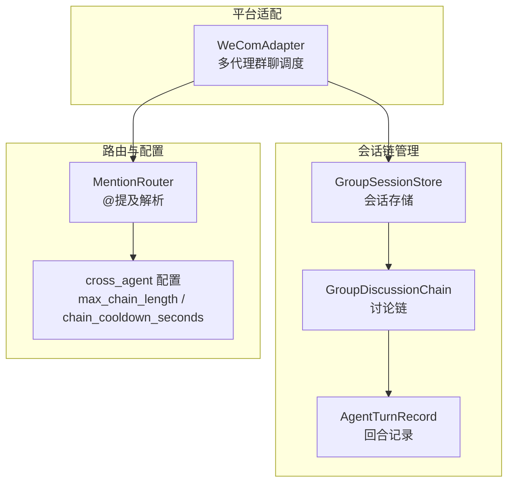
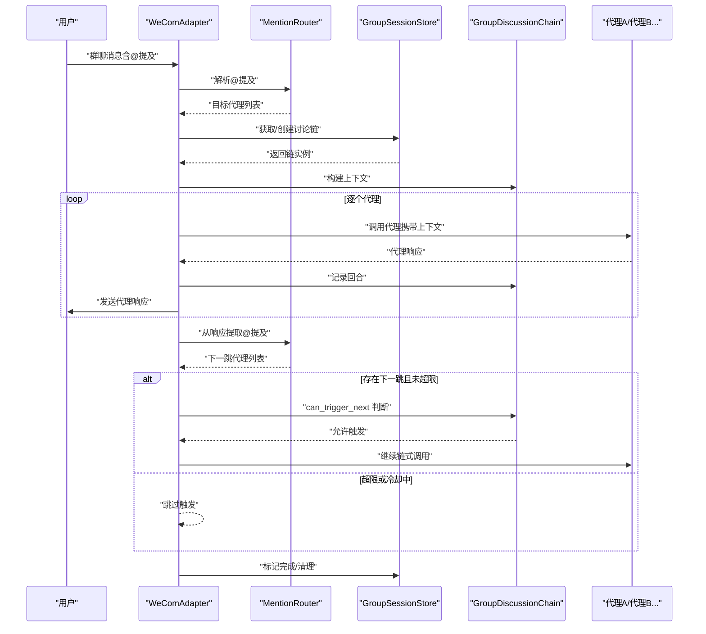
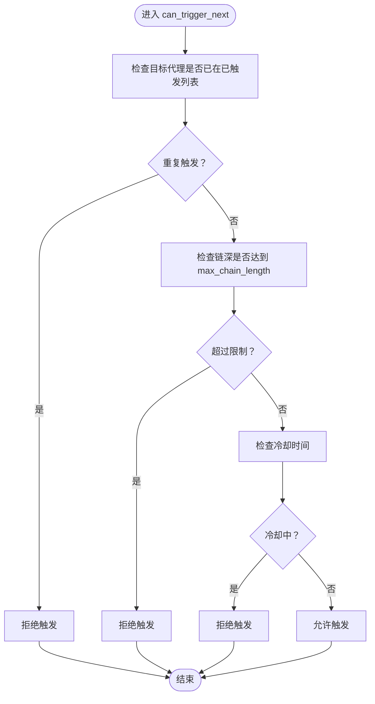
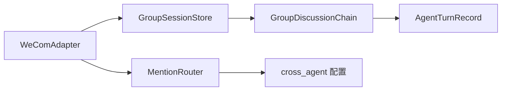

# 会话链管理

<cite>
**本文引用的文件**
- [group_session.py](file://group_session.py)
- [bk/group_session.py](file://bk/group_session.py)
- [mention_router.py](file://mention_router.py)
- [bk/mention_router.py](file://bk/mention_router.py)
- [wecom.py](file://wecom.py)
- [README.md](file://README.md)
</cite>

## 目录
1. [简介](#简介)
2. [项目结构](#项目结构)
3. [核心组件](#核心组件)
4. [架构总览](#架构总览)
5. [详细组件分析](#详细组件分析)
6. [依赖关系分析](#依赖关系分析)
7. [性能考量](#性能考量)
8. [故障排查指南](#故障排查指南)
9. [结论](#结论)
10. [附录](#附录)

## 简介
本文件面向“会话链管理系统”，聚焦于多智能体群聊中的“讨论链”管理与控制。系统通过会话存储与讨论链模型，实现：
- 会话状态跟踪：记录链路深度、已触发代理、回合记录等
- 消息历史管理：构建上下文，供后续代理使用
- 上下文维护机制：按回合顺序组织对话历史
- 最大链长度限制：防止无限扩展
- 冷却时间机制：限制快速连续触发同一代理
- 循环检测算法：避免代理间无限循环调用
- 会话生命周期管理：创建、活跃性判断、超时清理、完成与中断标记

## 项目结构
本仓库与会话链管理直接相关的文件如下：
- group_session.py：会话链与存储的核心实现
- mention_router.py：@提及解析与跨代理链配置
- wecom.py：WeCom 适配器，负责多代理群聊调度与链式触发
- README.md：配置示例与功能说明

图表来源
- [group_session.py:96-188](file://group_session.py#L96-L188)
- [mention_router.py:46-155](file://mention_router.py#L46-L155)
- [wecom.py:909-1181](file://wecom.py#L909-L1181)

章节来源
- [README.md:13-38](file://README.md#L13-L38)

## 核心组件
- GroupSessionStore：内存中的讨论链存储，提供链的创建、查询、完成、中断、清理与活跃性判断
- GroupDiscussionChain：一次群聊讨论链的状态载体，包含原始消息、已触发代理、回合记录、链深、冷却时间等
- AgentTurnRecord：单个代理回合的记录，包含请求/响应文本、提及列表、时间戳等
- MentionRouter：解析@提及、提取目标代理、提取响应中的@提及，以及跨代理链配置（最大链长、冷却秒数）

章节来源
- [group_session.py:21-94](file://group_session.py#L21-L94)
- [group_session.py:96-188](file://group_session.py#L96-L188)
- [mention_router.py:23-155](file://mention_router.py#L23-L155)

## 架构总览
会话链管理在 WeCom 多代理群聊中的工作流如下：
- 用户在群聊中发送消息，@一个或多个代理
- MentionRouter 解析@提及，确定目标代理序列
- WeComAdapter 获取/创建讨论链，构建上下文并依次调用各代理
- 代理响应中可再次@其他代理，形成跨代理链式调用
- 系统根据最大链长与冷却时间进行限制，并在合适时机标记完成与清理

图表来源
- [wecom.py:909-1181](file://wecom.py#L909-L1181)
- [group_session.py:96-188](file://group_session.py#L96-L188)
- [mention_router.py:102-146](file://mention_router.py#L102-L146)

## 详细组件分析

### GroupSessionStore（会话存储）
- 职责
  - 维护 chat_id 到 GroupDiscussionChain 的映射
  - 提供异步安全的链操作：获取/创建、查询、完成、中断、清理、活跃性判断、过期清理
- 关键方法
  - get_or_create_chain：若链存在且未完成/未被用户中断则复用，否则新建
  - get_chain：按 chat_id 查询链
  - complete_chain/interrupt_chain/clear_chain：标记完成/中断/移除
  - is_chain_active：判断链是否处于活跃状态
  - cleanup_expired：按最大年龄清理过期链
- 并发与锁
  - 使用 asyncio.Lock 保护内部字典访问，保证多协程安全

章节来源
- [group_session.py:96-188](file://group_session.py#L96-L188)

### GroupDiscussionChain（讨论链）
- 职责
  - 记录一次群聊讨论链的完整状态
  - 提供触发判断、回合记录、上下文构建、序列化导出
- 关键属性
  - chat_id、original_user_message、original_sender_id：链标识与起始信息
  - triggered_agents：已触发代理列表（去重顺序）
  - turn_records：回合记录列表
  - chain_depth：当前链深（use→A=1，A→B=2…）
  - max_chain_length：最大链长限制
  - stated_at：链创建时间
  - completed/interrupted_by_user：完成/中断标记
  - last_triggered_at/cooldown_seconds：冷却时间控制
- 关键方法
  - can_trigger_next：综合“已触发代理去重”、“链深限制”、“冷却时间”三要素判断
  - add_turn：记录回合、更新链深与冷却时间
  - get_conversation_context：基于回合记录构建上下文字符串
  - to_dict：导出链状态用于持久化/调试

图表来源
- [group_session.py:50-64](file://group_session.py#L50-L64)

章节来源
- [group_session.py:21-94](file://group_session.py#L21-L94)

### AgentTurnRecord（回合记录）
- 职责
  - 记录单个代理的一次调用与响应
- 关键字段
  - agent_id、agent_name、request_text、response_text、mentions_in_response、started_at、completed_at

章节来源
- [group_session.py:22-31](file://group_session.py#L22-L31)

### MentionRouter（@提及解析与跨代理链配置）
- 职责
  - 解析群聊消息中的@提及，返回目标代理顺序
  - 从响应文本中提取@提及，用于自动链式触发
  - 提供跨代理链配置：max_chain_length、chain_cooldown_seconds
- 关键方法
  - resolve_target_agents：解析消息中的@提及
  - extract_mentions_from_response：从代理响应中提取@提及
  - 其他辅助：编译正则模式、提取干净文本等

章节来源
- [mention_router.py:46-155](file://mention_router.py#L46-L155)

### WeComAdapter（多代理群聊调度）
- 职责
  - 在群聊中根据@提及路由到相应代理
  - 基于讨论链构建上下文，依次调用代理
  - 从代理响应中提取@提及，自动触发下一代理，形成链式调用
  - 控制链深与冷却，避免无限循环与过快触发
- 关键流程
  - _dispatch_group_multi_agent：解析@提及、获取/创建链、依次调用代理、记录回合、发送响应
  - _process_cross_agent_chain：扫描最新代理响应中的@提及，递归触发下一代理，直至无新代理或达到限制

章节来源
- [wecom.py:909-1181](file://wecom.py#L909-L1181)

## 依赖关系分析
- GroupSessionStore 依赖 GroupDiscussionChain 与 AgentTurnRecord
- WeComAdapter 依赖 MentionRouter 与 GroupSessionStore
- MentionRouter 依赖配置（cross_agent）提供最大链长与冷却秒数

图表来源
- [wecom.py:909-1181](file://wecom.py#L909-L1181)
- [group_session.py:96-188](file://group_session.py#L96-L188)
- [mention_router.py:46-89](file://mention_router.py#L46-L89)

## 性能考量
- 内存存储：讨论链保存在内存中，适合短期群聊会话，避免跨节点共享
- 异步锁：使用 asyncio.Lock 保证并发安全，避免竞态条件
- 过期清理：cleanup_expired 支持按最大年龄批量清理，降低内存占用
- 冷却时间：通过 last_triggered_at 与 cooldown_seconds 控制触发频率，避免热点代理被频繁调用
- 链深限制：max_chain_length 限制链长度，防止无限扩展导致资源耗尽

## 故障排查指南
- 问题：代理未被触发
  - 检查 MentionRouter 是否正确解析@提及
  - 检查 GroupDiscussionChain.can_trigger_next 是否因链深或冷却而拒绝
- 问题：链未结束或重复触发
  - 检查是否正确调用 complete_chain 或 interrupt_chain
  - 检查 cleanup_expired 是否定期清理过期链
- 问题：循环调用
  - 确认 triggered_agents 已去重，避免同一代理重复触发
  - 确认 max_chain_length 设置合理，必要时降低以减少循环风险

章节来源
- [group_session.py:134-170](file://group_session.py#L134-L170)
- [wecom.py:1051-1181](file://wecom.py#L1051-L1181)

## 结论
会话链管理系统通过 GroupSessionStore 与 GroupDiscussionChain 实现了对多智能体群聊讨论链的精细化控制，结合 MentionRouter 的@提及解析与跨代理链配置，提供了链深限制、冷却时间与循环检测等关键机制，确保在复杂群聊场景下的稳定性与可控性。

## 附录

### 会话生命周期管理
- 创建：通过 get_or_create_chain 获取或创建链
- 活跃性：is_chain_active 判断链是否未完成且未被用户中断
- 更新：add_turn 记录回合，更新链深与冷却时间
- 完成：complete_chain 标记完成，随后可清理
- 中断：interrupt_chain 标记被用户中断
- 清理：clear_chain 移除链；cleanup_expired 按最大年龄清理

章节来源
- [group_session.py:104-158](file://group_session.py#L104-L158)

### 最大链长度限制与冷却时间
- 最大链长度：max_chain_length 限制链深，防止无限扩展
- 冷却时间：cooldown_seconds 与 last_triggered_at 控制触发频率，避免热点代理被频繁调用

章节来源
- [group_session.py:42-48](file://group_session.py#L42-L48)
- [group_session.py:50-64](file://group_session.py#L50-L64)

### 循环检测算法
- 去重触发：triggered_agents 记录已触发代理，避免重复触发
- 链深限制：chain_depth 与 max_chain_length 配合，防止无限扩展
- 响应中@提及过滤：仅触发尚未触发过的代理

章节来源
- [group_session.py:39-41](file://group_session.py#L39-L41)
- [group_session.py:50-64](file://group_session.py#L50-L64)
- [wecom.py:1077-1098](file://wecom.py#L1077-L1098)

### 配置参数说明
- multi_agent.cross_agent.enabled：启用跨代理链
- multi_agent.cross_agent.max_chain_length：最大链长度
- multi_agent.cross_agent.chain_cooldown_seconds：冷却秒数

章节来源
- [README.md:32-37](file://README.md#L32-L37)
- [mention_router.py:82-89](file://mention_router.py#L82-L89)

### 实际会话管理示例（步骤说明）
- 步骤1：用户在群聊中发送消息并@代理A与代理B
- 步骤2：WeComAdapter 解析@提及，获取/创建讨论链
- 步骤3：依次调用代理A与代理B，记录回合并发送响应
- 步骤4：从代理B的响应中提取@提及，自动触发代理C
- 步骤5：当无新@提及或达到链深/冷却限制时，标记完成并清理链

章节来源
- [wecom.py:909-1181](file://wecom.py#L909-L1181)