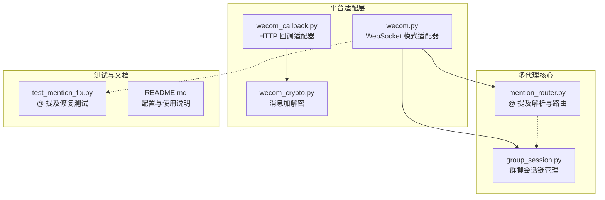
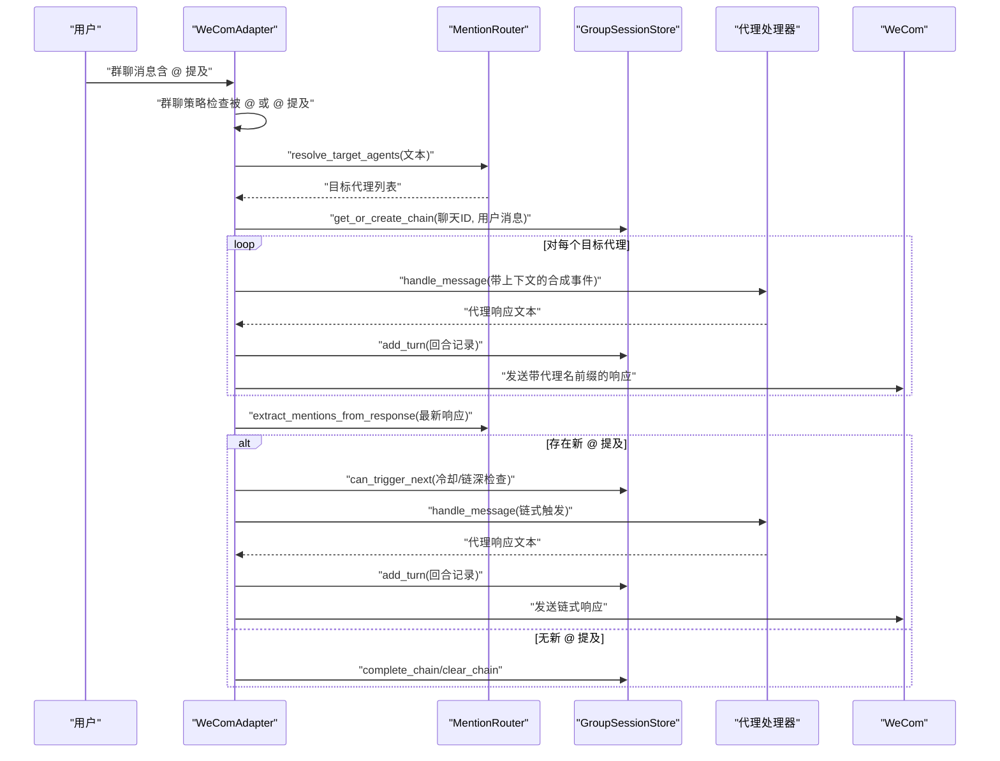
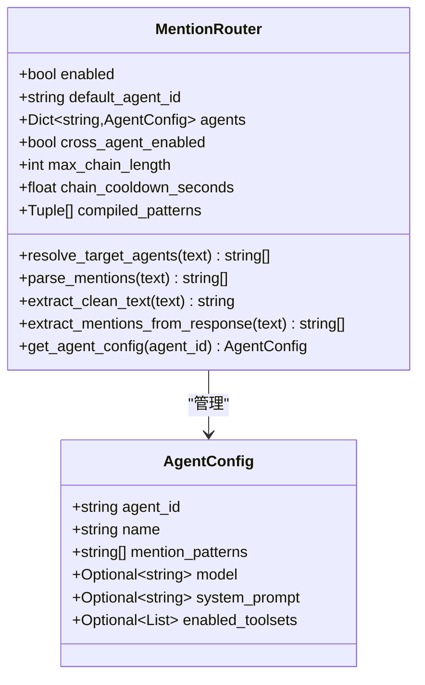
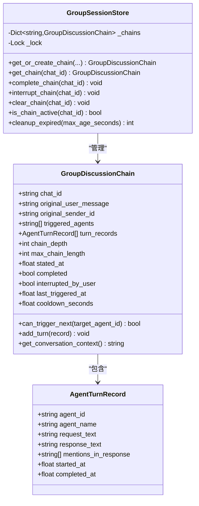
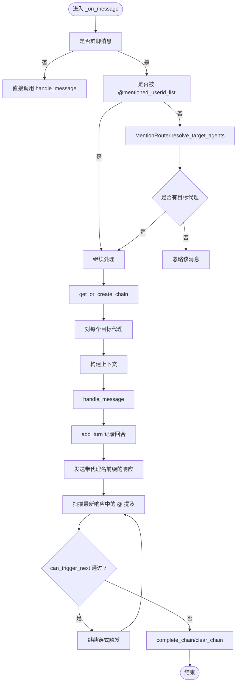
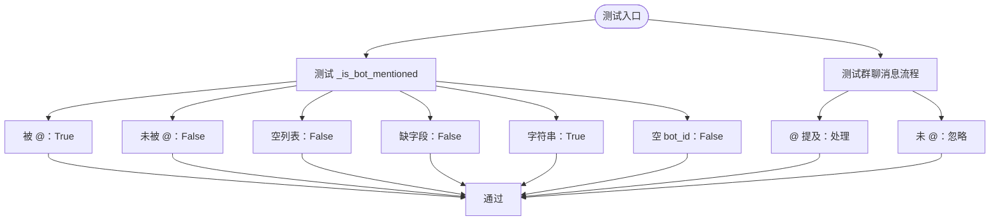
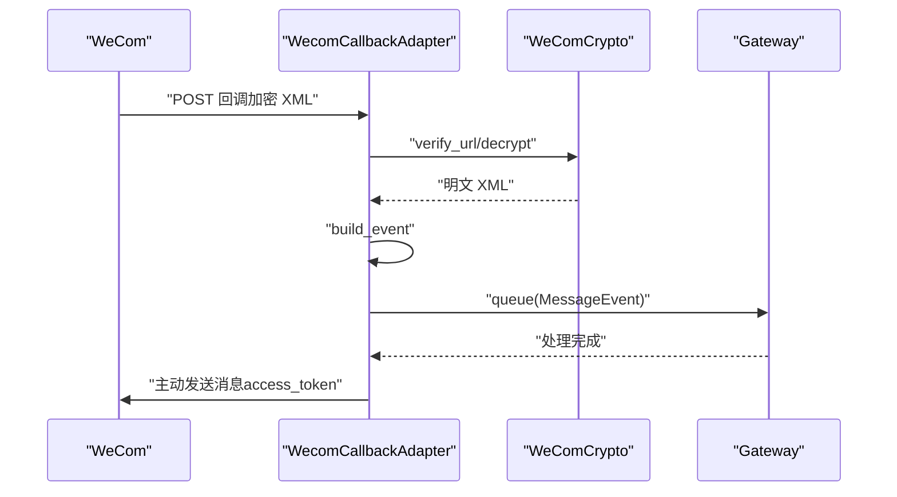
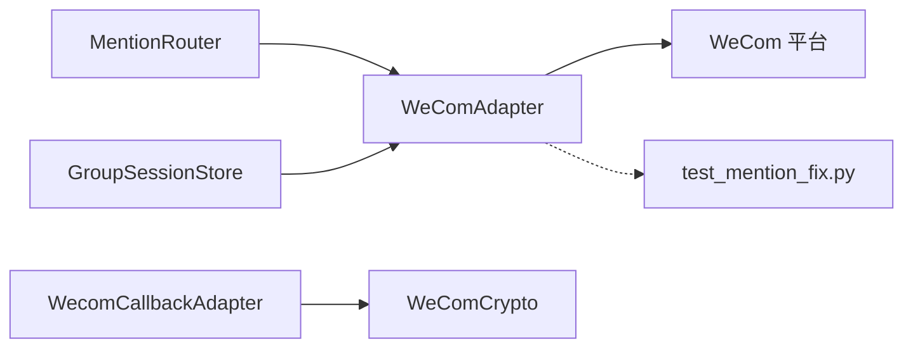

# 多代理协作系统

<cite>
**本文引用的文件**
- [README.md](file://README.md)
- [mention_router.py](file://mention_router.py)
- [group_session.py](file://group_session.py)
- [test_mention_fix.py](file://test_mention_fix.py)
- [wecom.py](file://wecom.py)
- [wecom_callback.py](file://wecom_callback.py)
- [wecom_crypto.py](file://wecom_crypto.py)
</cite>

## 目录
1. [简介](#简介)
2. [项目结构](#项目结构)
3. [核心组件](#核心组件)
4. [架构总览](#架构总览)
5. [详细组件分析](#详细组件分析)
6. [依赖关系分析](#依赖关系分析)
7. [性能与可扩展性](#性能与可扩展性)
8. [故障排查指南](#故障排查指南)
9. [结论](#结论)
10. [附录](#附录)

## 简介
本项目是 Hermes Agent 的企业微信（WeCom）网关插件，专为多代理协作而设计。其核心能力包括：
- 在群聊中通过 @ 提及解析，支持单代理触发、多代理并行触发与链式对话
- 基于会话链的跨代理自动触发与循环防护
- 会话状态管理与冷却时间控制
- 企业微信回调模式与 WebSocket 模式的适配
- @ 提及修复与测试用例

系统通过 MentionRouter 实现消息中的 @ 提及解析与代理路由，通过 GroupSessionStore 管理群聊会话链，结合 WeComAdapter 完成消息接收、路由与响应发送。

**章节来源**
- [README.md:1-43](file://README.md#L1-L43)

## 项目结构
- 平台适配层：wecom.py（WebSocket 模式）、wecom_callback.py（HTTP 回调模式）
- 多代理解析与路由：mention_router.py
- 会话链管理：group_session.py
- 加解密模块：wecom_crypto.py
- 测试与修复：test_mention_fix.py
- 文档与配置示例：README.md

**图表来源**
- [wecom.py:160-207](file://wecom.py#L160-L207)
- [mention_router.py:46-155](file://mention_router.py#L46-L155)
- [group_session.py:96-188](file://group_session.py#L96-L188)
- [wecom_callback.py:55-388](file://wecom_callback.py#L55-L388)
- [wecom_crypto.py:66-143](file://wecom_crypto.py#L66-L143)
- [test_mention_fix.py:1-133](file://test_mention_fix.py#L1-L133)
- [README.md:5-43](file://README.md#L5-L43)

**章节来源**
- [README.md:5-43](file://README.md#L5-L43)

## 核心组件
- MentionRouter：负责从群聊消息中解析 @ 提及，构建代理配置注册表，支持默认代理、跨代理链式触发、清理文本中的 @ 标记等。
- GroupSessionStore：维护群聊讨论链的状态，包括已触发代理、回合记录、链深度、冷却时间与超时清理。
- WeComAdapter：WebSocket 模式下的消息入口，负责群聊 @ 提及检测、多代理路由、链式触发与响应发送。
- WecomCallbackAdapter：HTTP 回调模式适配器，负责解密回调、入队消息、主动发送回复。
- WeComCrypto：兼容官方 BizMsgCrypt 的加解密工具，用于回调模式的消息安全。

**章节来源**
- [mention_router.py:23-155](file://mention_router.py#L23-L155)
- [group_session.py:21-188](file://group_session.py#L21-L188)
- [wecom.py:160-207](file://wecom.py#L160-L207)
- [wecom_callback.py:55-388](file://wecom_callback.py#L55-L388)
- [wecom_crypto.py:66-143](file://wecom_crypto.py#L66-L143)

## 架构总览
系统采用“平台适配层 + 多代理解析 + 会话链管理”的分层设计。WebSocket 模式下，WeComAdapter 在收到群聊消息后，优先判断是否被 @ 或通过 @ 提及触发目标代理；随后根据会话链状态进行并行或链式触发，并在每轮结束后扫描最新回复中的 @ 提及以继续链式触发，直到达到最大链长度或冷却时间生效。

**图表来源**
- [wecom.py:524-586](file://wecom.py#L524-L586)
- [wecom.py:909-1181](file://wecom.py#L909-L1181)
- [mention_router.py:102-146](file://mention_router.py#L102-L146)
- [group_session.py:96-188](file://group_session.py#L96-L188)

## 详细组件分析

### @ 提及解析与代理路由（MentionRouter）
- 功能要点
  - 支持多种 @ 提及模式（大小写不敏感、边界断言），并按首次出现顺序返回目标代理列表
  - 默认代理回退：当未检测到 @ 提及时，返回默认代理
  - 清理文本：移除 @ 标记，便于下游处理
  - 跨代理链式触发：从代理回复中提取新的 @ 提及，形成链式对话
  - 配置化代理：支持按代理 ID 注册名称、模型、系统提示与工具集覆盖
- 关键接口
  - resolve_target_agents：解析消息中的 @ 提及，返回目标代理列表
  - extract_clean_text：清理文本中的 @ 标记
  - extract_mentions_from_response：从代理回复中提取 @ 提及
  - get_agent_config：按代理 ID 获取配置
- 性能与复杂度
  - 编译正则表达式一次，后续匹配为线性复杂度
  - 解析顺序基于首次出现位置，避免重复匹配

**图表来源**
- [mention_router.py:23-155](file://mention_router.py#L23-L155)

**章节来源**
- [mention_router.py:46-155](file://mention_router.py#L46-L155)

### 群聊会话链管理（GroupSessionStore）
- 功能要点
  - 讨论链状态：原始用户消息、已触发代理序列、回合记录、链深度、冷却时间、创建时间、完成/中断标记
  - 冷却与循环防护：同一代理在冷却时间内不可重复触发；链深度超过阈值停止触发
  - 上下文构建：根据历史回合生成对话上下文，供后续代理推理
  - 生命周期管理：创建、查询、完成、中断、清理、过期清理
- 关键接口
  - get_or_create_chain：获取或创建会话链
  - add_turn：记录回合
  - can_trigger_next：冷却与链深检查
  - get_conversation_context：构建上下文
  - complete_chain/interrupt_chain/clear_chain：生命周期控制
  - cleanup_expired：按超时清理

**图表来源**
- [group_session.py:21-188](file://group_session.py#L21-L188)

**章节来源**
- [group_session.py:96-188](file://group_session.py#L96-L188)

### WeComAdapter（WebSocket 模式）
- 群聊 @ 提及修复
  - 优先通过 mentioned_userid_list 判断是否被 @
  - 若未被 @，再通过 MentionRouter 解析文本中的 @ 提及
  - 未命中任何 @ 的群聊消息直接忽略
- 多代理调度
  - resolve_target_agents 获取目标代理列表
  - 为每个目标代理构建带上下文的合成事件并调用 handle_message
  - 发送带代理名前缀的响应
  - 链式触发：扫描最新回合响应中的 @ 提及，按冷却与链深规则继续触发
- 会话链集成
  - 使用 get_group_session_store 获取/创建会话链
  - 记录回合、更新链状态、清理与完成

**图表来源**
- [wecom.py:524-586](file://wecom.py#L524-L586)
- [wecom.py:909-1181](file://wecom.py#L909-L1181)
- [group_session.py:96-188](file://group_session.py#L96-L188)

**章节来源**
- [wecom.py:524-586](file://wecom.py#L524-L586)
- [wecom.py:909-1181](file://wecom.py#L909-L1181)

### @ 提及修复与测试（test_mention_fix.py）
- 功能说明
  - 检测 mentioned_userid_list 是否包含机器人的用户 ID
  - 支持多种输入形态（列表、字符串、缺失字段、空列表、空 bot_id）
  - 验证群聊消息处理流程：被 @ 与未被 @ 的消息应分别被处理与忽略
- 测试覆盖
  - 机器人在 mentioned_userid_list 中
  - 机器人不在 mentioned_userid_list 中
  - mentioned_userid_list 为空
  - 缺少 mentioned_userid_list 字段
  - mentioned_userid_list 为字符串
  - bot_id 为空
  - 群聊消息流程验证

**图表来源**
- [test_mention_fix.py:8-133](file://test_mention_fix.py#L8-L133)

**章节来源**
- [test_mention_fix.py:1-133](file://test_mention_fix.py#L1-L133)

### HTTP 回调适配器与加解密（wecom_callback.py, wecom_crypto.py）
- WecomCallbackAdapter
  - 支持多应用配置，按企业 ID 与用户 ID 组合区分聊天域
  - 解密回调消息，构建 MessageEvent 并入队
  - 主动发送消息：通过 access_token 调用企业微信消息发送接口
- WeComCrypto
  - 兼容官方 BizMsgCrypt 的加解密流程，支持签名验证、AES-CBC 解密与填充校验

**图表来源**
- [wecom_callback.py:247-277](file://wecom_callback.py#L247-L277)
- [wecom_callback.py:302-337](file://wecom_callback.py#L302-L337)
- [wecom_crypto.py:88-113](file://wecom_crypto.py#L88-L113)

**章节来源**
- [wecom_callback.py:55-388](file://wecom_callback.py#L55-L388)
- [wecom_crypto.py:66-143](file://wecom_crypto.py#L66-L143)

## 依赖关系分析
- MentionRouter 依赖正则表达式与配置字典，提供解析与清理能力
- WeComAdapter 依赖 MentionRouter 与 GroupSessionStore，负责消息入口与链式触发
- WecomCallbackAdapter 依赖 WeComCrypto 进行回调消息解密
- 测试文件独立验证 @ 提及修复逻辑

**图表来源**
- [wecom.py:205-206](file://wecom.py#L205-L206)
- [group_session.py:176-188](file://group_session.py#L176-L188)
- [wecom_callback.py:40-40](file://wecom_callback.py#L40-L40)
- [wecom_crypto.py:66-143](file://wecom_crypto.py#L66-L143)
- [test_mention_fix.py:1-133](file://test_mention_fix.py#L1-L133)

**章节来源**
- [wecom.py:205-206](file://wecom.py#L205-L206)
- [group_session.py:176-188](file://group_session.py#L176-L188)
- [wecom_callback.py:40-40](file://wecom_callback.py#L40-L40)
- [wecom_crypto.py:66-143](file://wecom_crypto.py#L66-L143)
- [test_mention_fix.py:1-133](file://test_mention_fix.py#L1-L133)

## 性能与可扩展性
- 正则编译与缓存
  - MentionRouter 在初始化时编译正则表达式，避免重复编译开销
- 会话链并发与锁
  - GroupSessionStore 使用异步锁保护状态变更，适合高并发群聊场景
- 冷却与链深限制
  - 通过冷却时间与最大链长度限制，有效防止风暴式链式触发
- 扩展建议
  - 将会话链持久化至外部存储（如 Redis）以支持多实例部署
  - 引入速率限制与队列缓冲，避免上游突发流量冲击
  - 代理配置支持动态热加载，减少重启成本
  - 增加链式触发的白名单/黑名单策略，提升安全性

[本节为通用指导，无需特定文件引用]

## 故障排查指南
- 群聊消息未被处理
  - 检查 mentioned_userid_list 是否包含机器人 ID
  - 若未被 @，确认文本中是否存在有效的 @ 提及模式
  - 参考测试用例验证修复逻辑
- 链式触发异常
  - 检查 max_chain_length 与 chain_cooldown_seconds 配置
  - 确认代理回复中未出现循环 @ 提及
- 会话链状态异常
  - 查看 is_chain_active、interrupt_chain、complete_chain 的调用时机
  - 使用 cleanup_expired 清理长时间未完成的链
- 回调模式问题
  - 核对 token、encoding_aes_key、receive_id 配置
  - 检查签名验证与解密流程

**章节来源**
- [test_mention_fix.py:26-117](file://test_mention_fix.py#L26-L117)
- [wecom.py:524-586](file://wecom.py#L524-L586)
- [group_session.py:159-170](file://group_session.py#L159-L170)

## 结论
本系统通过 MentionRouter 与 GroupSessionStore 的协同，实现了企业微信群聊中的多代理协作：既能按需触发单/多代理，也能在代理回复中自动链式联动，同时具备冷却与链深限制等防护机制。配合 WebSocket 与 HTTP 回调两种适配模式，满足不同部署场景的需求。建议在生产环境中引入持久化与限流策略，进一步提升稳定性与可扩展性。

[本节为总结，无需特定文件引用]

## 附录
- 配置示例参考
  - multiAgent.enabled、crossAgent.enabled、maxChainLength、chainCooldownSeconds
- 使用场景示例
  - 用户在群聊中 @AgentA @AgentB，系统并行触发两者并汇总回复
  - AgentA 在回复中 @AgentC，系统自动链式触发并继续回复
  - 当链深达到上限或冷却时间未到时，系统自动停止链式触发

**章节来源**
- [README.md:21-38](file://README.md#L21-L38)