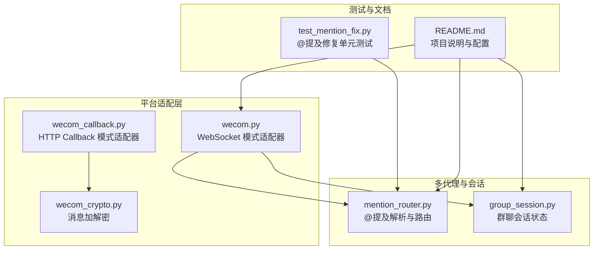
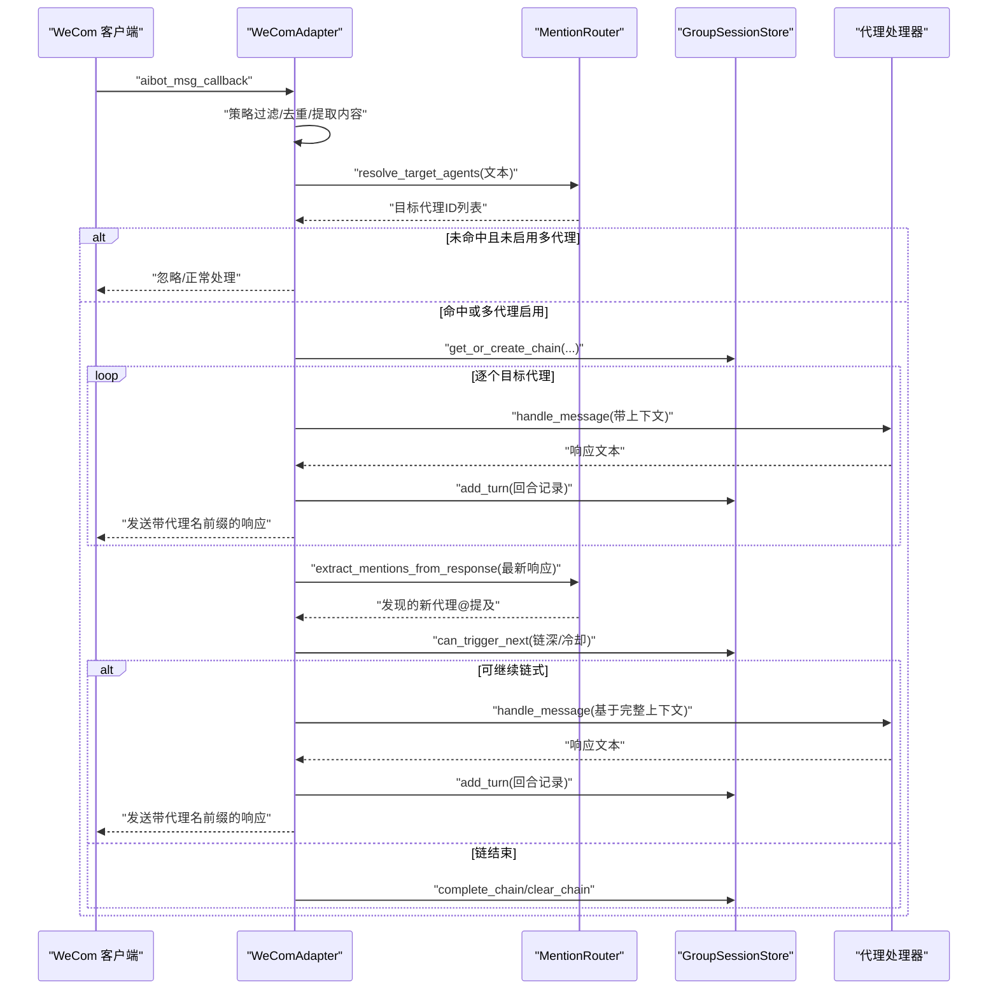
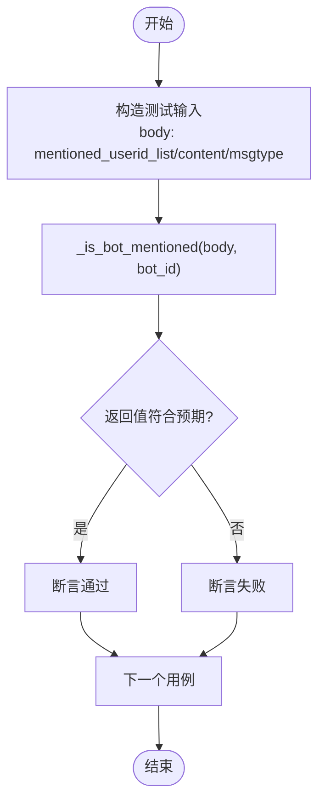
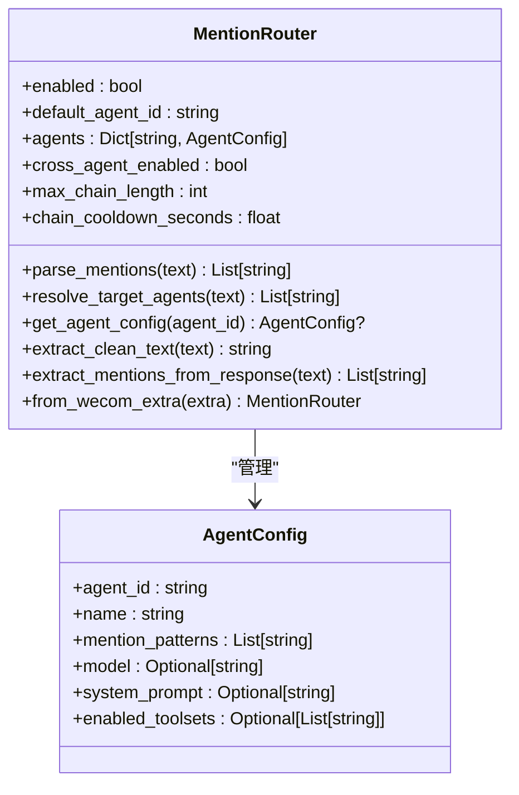
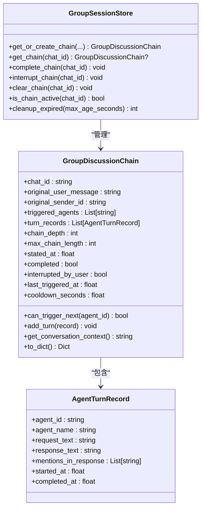
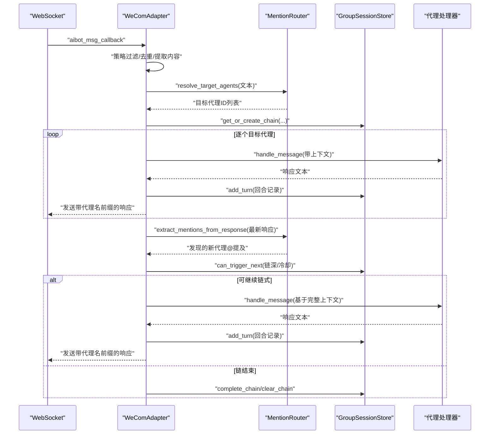
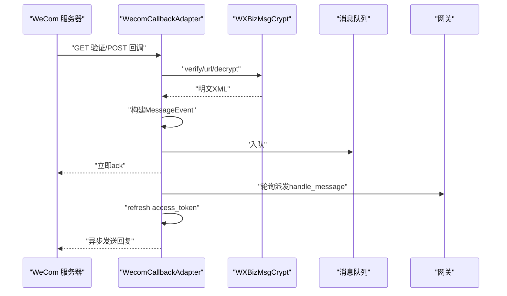
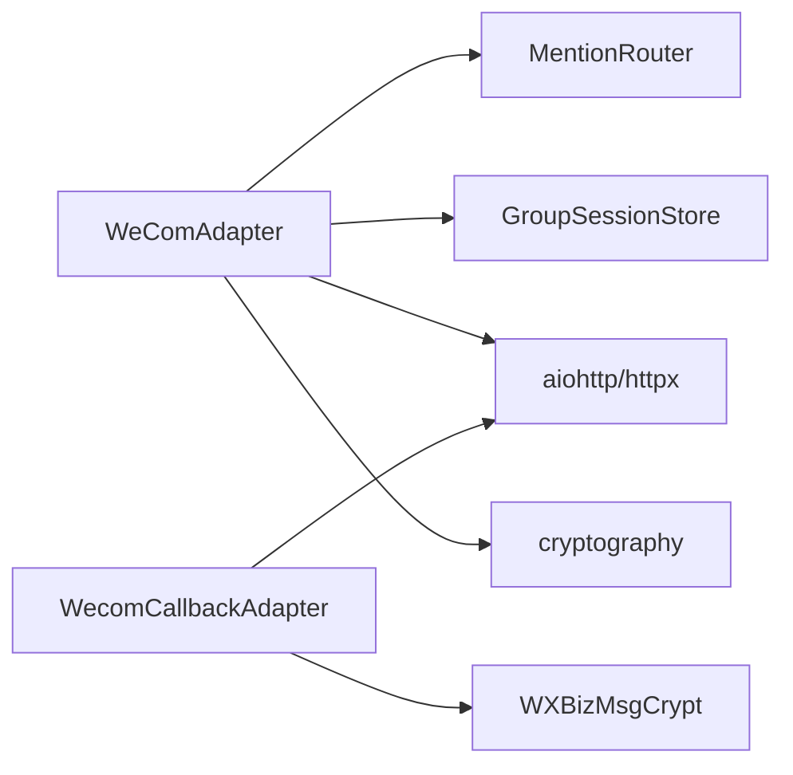

# 测试与验证

<cite>
**本文引用的文件**
- [README.md](file://README.md)
- [test_mention_fix.py](file://test_mention_fix.py)
- [bk/test_mention_fix.py](file://bk/test_mention_fix.py)
- [mention_router.py](file://mention_router.py)
- [group_session.py](file://group_session.py)
- [wecom.py](file://wecom.py)
- [wecom_callback.py](file://wecom_callback.py)
- [wecom_crypto.py](file://wecom_crypto.py)
- [bk/wecom1.py](file://bk/wecom1.py)
- [bk/wecom_fixed.py](file://bk/wecom_fixed.py)
</cite>

## 目录
1. [简介](#简介)
2. [项目结构](#项目结构)
3. [核心组件](#核心组件)
4. [架构总览](#架构总览)
5. [详细组件分析](#详细组件分析)
6. [依赖分析](#依赖分析)
7. [性能考虑](#性能考虑)
8. [故障排查指南](#故障排查指南)
9. [结论](#结论)
10. [附录](#附录)

## 简介
本测试与验证文档面向“多代理协作系统”（WeCom 网关插件），聚焦于以下目标：
- 设计并验证 @提及修复功能的测试用例，覆盖边界与异常场景
- 说明测试框架使用方法：单元测试、集成测试与性能测试
- 提供完整测试案例集合，覆盖 @提及解析、代理路由、会话管理等模块
- 说明测试数据准备与管理策略（模拟消息、代理配置、会话状态）
- 给出测试报告生成与持续集成配置建议
- 提供调试技巧与常见问题解决方案

## 项目结构
该仓库包含 WeCom 平台适配器、@提及解析器、群聊会话管理、回调模式适配器与加解密模块，以及若干历史版本文件。核心文件如下：
- mention_router.py：@提及解析与多代理路由
- group_session.py：群聊会话状态管理
- wecom.py：WebSocket 模式主适配器（含 @提及检测、多代理调度）
- wecom_callback.py：HTTP Callback 模式适配器
- wecom_crypto.py：消息加解密工具
- test_mention_fix.py：@提及修复功能的单元测试脚本
- README.md：项目说明与配置示例

图表来源
- [wecom.py:160-1050](file://wecom.py#L160-L1050)
- [wecom_callback.py:55-388](file://wecom_callback.py#L55-L388)
- [wecom_crypto.py:66-143](file://wecom_crypto.py#L66-L143)
- [mention_router.py:46-155](file://mention_router.py#L46-L155)
- [group_session.py:96-188](file://group_session.py#L96-L188)
- [test_mention_fix.py:1-133](file://test_mention_fix.py#L1-L133)
- [README.md:1-43](file://README.md#L1-L43)

章节来源
- [README.md:1-43](file://README.md#L1-L43)

## 核心组件
- @提及解析与路由（MentionRouter）
  - 功能：从群聊文本中解析 @提及，按首次出现顺序返回目标代理 ID 列表；支持提取干净文本（去除 @标记）
  - 关键接口：parse_mentions、resolve_target_agents、extract_clean_text、from_wecom_extra
- 群聊会话状态（GroupSessionStore）
  - 功能：维护群聊讨论链（DiscussionChain），记录触发代理、回合记录、冷却与最大链长控制
  - 关键接口：get_or_create_chain、add_turn、get_conversation_context、complete_chain、clear_chain、is_chain_active、cleanup_expired
- WeCom 适配器（WeComAdapter）
  - 功能：连接 WebSocket、接收回调、解析消息、策略过滤、@提及检测、多代理调度、跨代理链式触发、媒体上传与发送
  - 关键流程：_on_message、_dispatch_group_multi_agent、_process_cross_agent_chain
- 回调适配器（WecomCallbackAdapter）
  - 功能：HTTP 接收加密回调、解密、入队、令牌刷新、异步发送回复
- 加解密模块（WXBizMsgCrypt）
  - 功能：兼容官方 BizMsgCrypt 语义，实现签名验证、AES-CBC 加解密

章节来源
- [mention_router.py:46-155](file://mention_router.py#L46-L155)
- [group_session.py:96-188](file://group_session.py#L96-L188)
- [wecom.py:160-1181](file://wecom.py#L160-L1181)
- [wecom_callback.py:55-388](file://wecom_callback.py#L55-L388)
- [wecom_crypto.py:66-143](file://wecom_crypto.py#L66-L143)

## 架构总览
下图展示多代理群聊在 WeCom 适配器中的端到端流程：消息到达后进行策略与 @提及检测，若启用多代理则解析目标代理并依次调用，随后扫描响应中的 @提及以自动链式触发其他代理。

图表来源
- [wecom.py:509-1181](file://wecom.py#L509-L1181)
- [mention_router.py:102-146](file://mention_router.py#L102-L146)
- [group_session.py:96-188](file://group_session.py#L96-L188)

## 详细组件分析

### @提及修复功能测试
目标：验证群聊消息中 @提及检测逻辑的健壮性，覆盖多种边界与异常场景。

- 测试范围
  - mentioned_userid_list 类型：列表、字符串、缺失、空列表
  - bot_id 为空与非空
  - 文本中存在/不存在 @mention 的情形
  - 群聊消息与私聊消息的差异处理
- 测试用例设计要点
  - 输入构造：模拟 WeCom 回调体（body），包含 mentioned_userid_list、content、msgtype 等字段
  - 断言：_is_bot_mentioned 返回值与预期一致
  - 边界：空值、None、类型不匹配、字段缺失
- 单元测试执行
  - 直接运行脚本入口，输出每条用例结果与最终汇总

图表来源
- [test_mention_fix.py:8-77](file://test_mention_fix.py#L8-L77)
- [bk/test_mention_fix.py:8-77](file://bk/test_mention_fix.py#L8-L77)

章节来源
- [test_mention_fix.py:1-133](file://test_mention_fix.py#L1-L133)
- [bk/test_mention_fix.py:1-133](file://bk/test_mention_fix.py#L1-L133)

### @提及解析与路由（MentionRouter）
- 功能点
  - 解析 @mention：支持多代理、大小写不敏感、边界断言
  - 清洗文本：移除 @标记，保留原始消息
  - 默认代理与跨代理链：可配置默认代理与链长度、冷却时间
- 关键算法
  - 遍历每个代理的提及模式，使用正则匹配并按首次出现位置排序
  - 提取响应中的 @提及用于链式触发

图表来源
- [mention_router.py:23-155](file://mention_router.py#L23-L155)

章节来源
- [mention_router.py:1-155](file://mention_router.py#L1-L155)

### 群聊会话管理（GroupSessionStore）
- 功能点
  - 讨论链：记录原始用户消息、触发代理序列、回合记录、链深、冷却、完成状态
  - 上下文构建：基于历史回合生成系统提示与上下文
  - 并发安全：使用 asyncio.Lock 保护状态
- 关键接口
  - get_or_create_chain：获取或创建链
  - add_turn：记录回合
  - get_conversation_context：构建上下文
  - complete_chain/clear_chain：完成与清理
  - is_chain_active：判断活跃状态
  - cleanup_expired：清理过期链

图表来源
- [group_session.py:21-188](file://group_session.py#L21-L188)

章节来源
- [group_session.py:1-188](file://group_session.py#L1-L188)

### WeCom 适配器（WeComAdapter）
- 连接与生命周期：WebSocket 认证、心跳、重连、去重
- 入站消息处理：策略过滤、@提及检测、文本与媒体提取、批处理长文本
- 多代理调度：根据 @提及解析结果，按序调用代理，构建上下文并发送带代理名前缀的响应
- 跨代理链式触发：扫描最新代理响应中的 @提及，自动触发后续代理，受链深与冷却限制

图表来源
- [wecom.py:509-1181](file://wecom.py#L509-L1181)
- [mention_router.py:102-146](file://mention_router.py#L102-L146)
- [group_session.py:96-188](file://group_session.py#L96-L188)

章节来源
- [wecom.py:160-1181](file://wecom.py#L160-L1181)

### 回调适配器（WecomCallbackAdapter）
- 功能：HTTP 接收加密回调、解密、入队、令牌刷新、异步发送回复
- 关键流程：URL 验证、解密、事件构建、入队、轮询派发、访问令牌管理

图表来源
- [wecom_callback.py:247-388](file://wecom_callback.py#L247-L388)
- [wecom_crypto.py:66-143](file://wecom_crypto.py#L66-L143)

章节来源
- [wecom_callback.py:1-388](file://wecom_callback.py#L1-L388)
- [wecom_crypto.py:1-143](file://wecom_crypto.py#L1-L143)

## 依赖分析
- 组件耦合
  - WeComAdapter 依赖 MentionRouter 与 GroupSessionStore 实现多代理与会话管理
  - WecomCallbackAdapter 依赖 WXBizMsgCrypt 实现加解密
- 外部依赖
  - aiohttp/httpx：WebSocket 与 HTTP 异步客户端
  - cryptography：AES-CBC 解密
- 潜在风险
  - 依赖缺失导致启动失败
  - 多代理链过长或冷却不足可能引发风暴
  - 回调模式下令牌失效需及时刷新

图表来源
- [wecom.py:108-111](file://wecom.py#L108-L111)
- [wecom_callback.py:51-53](file://wecom_callback.py#L51-L53)
- [wecom_crypto.py:18-20](file://wecom_crypto.py#L18-L20)

章节来源
- [wecom.py:108-111](file://wecom.py#L108-L111)
- [wecom_callback.py:51-53](file://wecom_callback.py#L51-L53)
- [wecom_crypto.py:18-20](file://wecom_crypto.py#L18-L20)

## 性能考虑
- 文本批处理
  - WeCom 客户端在接近 4000 字符处拆分消息，适配器通过短延迟合并，减少重复处理与网络开销
- 会话清理
  - GroupSessionStore 支持过期清理，避免内存膨胀
- 限流与冷却
  - 跨代理链式触发受 max_chain_length 与 chain_cooldown_seconds 控制，防止风暴
- 媒体上传
  - 分块上传与大小限制检查，避免超限失败与资源浪费

章节来源
- [wecom.py:600-656](file://wecom.py#L600-L656)
- [group_session.py:159-170](file://group_session.py#L159-L170)
- [wecom.py:1217-1278](file://wecom.py#L1217-L1278)

## 故障排查指南
- 启动失败
  - 缺少 aiohttp/httpx 或 WECOM_BOT_ID/WECOM_SECRET 未配置
  - 检查依赖安装与环境变量
- 连接问题
  - WebSocket 认证失败、连接中断、心跳失败
  - 查看日志与重连退避策略
- 多代理不生效
  - 未启用 multi_agent 或 cross_agent
  - @mention 文本模式未匹配
  - 目标代理未配置
- 回调模式异常
  - URL 验证失败、解密异常、令牌刷新失败
  - 检查 token/encoding_aes_key/receive_id 一致性
- 媒体发送失败
  - 超过大小限制、格式不支持、下载超时
  - 使用降级策略与错误提示

章节来源
- [wecom.py:212-247](file://wecom.py#L212-L247)
- [wecom.py:308-337](file://wecom.py#L308-L337)
- [wecom_callback.py:232-277](file://wecom_callback.py#L232-L277)
- [wecom_callback.py:357-388](file://wecom_callback.py#L357-L388)
- [wecom.py:1217-1293](file://wecom.py#L1217-L1293)

## 结论
本测试与验证文档围绕 @提及修复、@提及解析与路由、群聊会话管理、WeCom 适配器与回调适配器等核心模块，提供了系统化的测试设计与实施建议。通过覆盖边界与异常场景的单元测试、结合集成与性能测试，可有效保障多代理协作在群聊中的稳定性与可用性。

## 附录

### 测试用例设计清单（按模块）
- @提及修复（test_mention_fix.py）
  - 覆盖 mentioned_userid_list 为列表/字符串/空/缺失
  - 覆盖 bot_id 为空与非空
  - 覆盖群聊消息带/不带 @ 的处理流程
- @提及解析与路由（mention_router.py）
  - 多代理提及顺序、大小写不敏感、边界断言
  - 清洗文本、默认代理与跨代理链配置
- 群聊会话管理（group_session.py）
  - 链深控制、冷却时间、回合记录、上下文构建、清理策略
- WeCom 适配器（wecom.py）
  - 策略过滤、@提及检测、多代理调度、跨代理链式触发、媒体处理
- 回调适配器（wecom_callback.py）
  - URL 验证、解密、入队、令牌刷新、异步发送

章节来源
- [test_mention_fix.py:26-117](file://test_mention_fix.py#L26-L117)
- [mention_router.py:102-146](file://mention_router.py#L102-L146)
- [group_session.py:96-188](file://group_session.py#L96-L188)
- [wecom.py:509-1181](file://wecom.py#L509-L1181)
- [wecom_callback.py:247-388](file://wecom_callback.py#L247-L388)

### 测试数据准备与管理
- 模拟消息数据
  - WeCom 回调体：包含 msgid、chatid、chattype、from、content、mentioned_userid_list、msgtype 等字段
  - 响应文本：包含 @mention 以触发跨代理链式
- 代理配置
  - multi_agent 配置：enabled、default_agent、agents、cross_agent（max_chain_length、chain_cooldown_seconds）
- 会话状态
  - 初始化 GroupSessionStore，构造 DiscussionChain 与 TurnRecord
  - 设置 max_chain_length 与 cooldown_seconds 以验证链式行为

章节来源
- [wecom.py:142-157](file://wecom.py#L142-L157)
- [mention_router.py:49-89](file://mention_router.py#L49-L89)
- [group_session.py:96-128](file://group_session.py#L96-L128)

### 测试报告生成与持续集成
- 单元测试
  - 使用 Python 内置 unittest 或 pytest 执行 test_mention_fix.py
  - 输出断言结果与覆盖率统计
- 集成测试
  - 搭建 WeComAdapter 与 MentionRouter 的最小化测试环境
  - 使用 mock 消息与代理响应，验证多代理调度与链式触发
- 性能测试
  - 生成大量消息样本，测量批处理、链式触发与媒体上传的吞吐与延迟
- CI 配置建议
  - 在 CI 中安装依赖（aiohttp/httpx/cryptography），运行单元与集成测试
  - 对关键路径（@提及解析、会话管理、媒体上传）设置性能回归阈值

[本节为通用实践建议，无需特定文件引用]