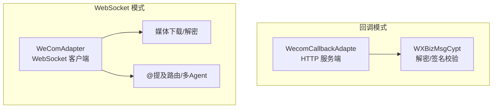
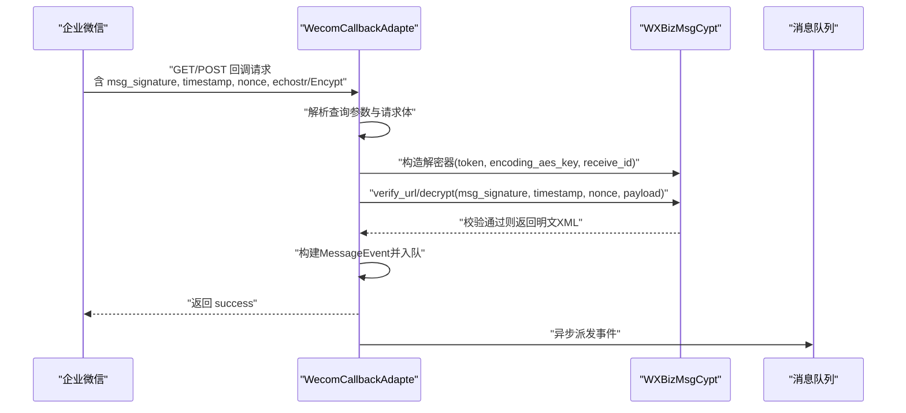
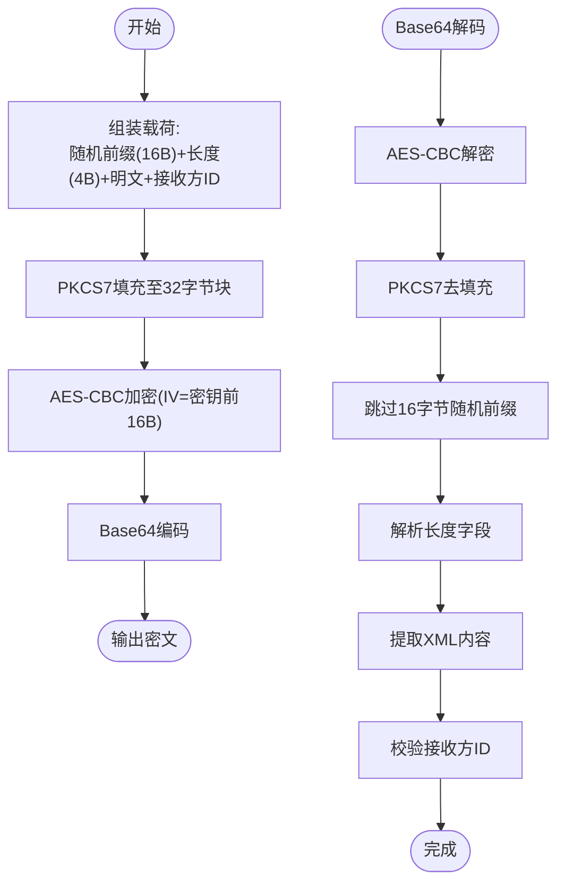
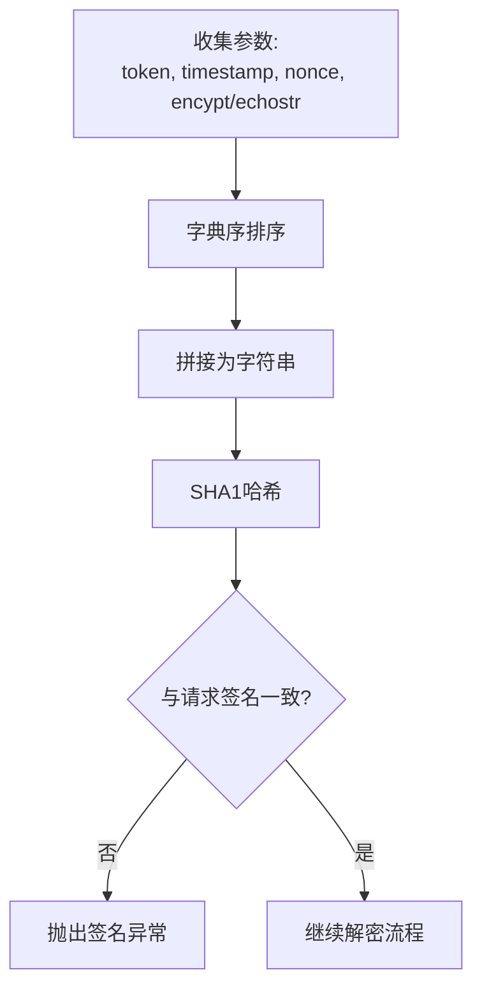
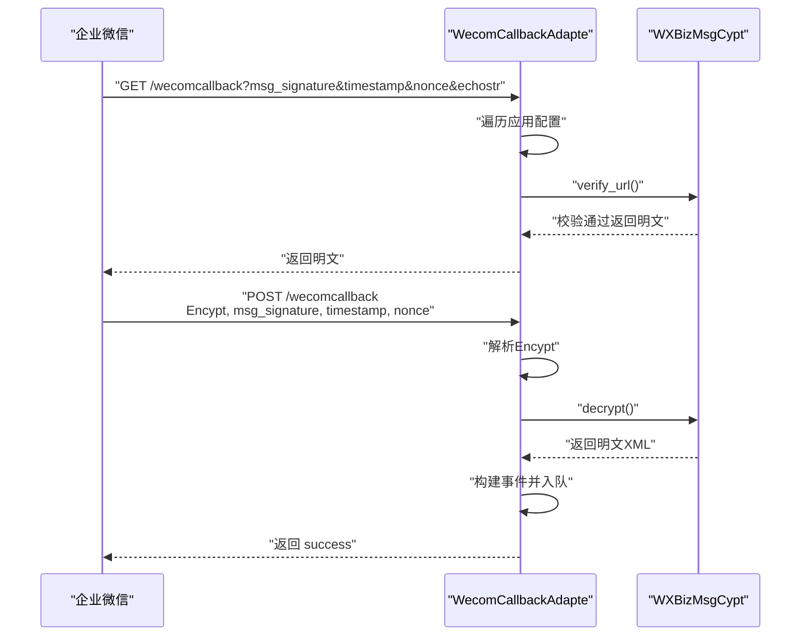
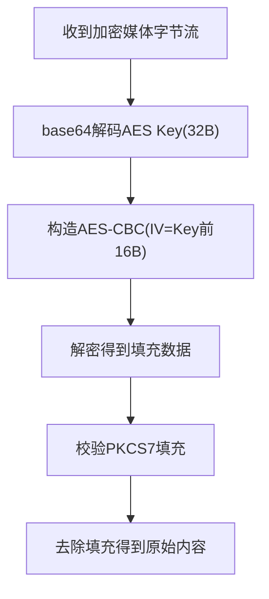
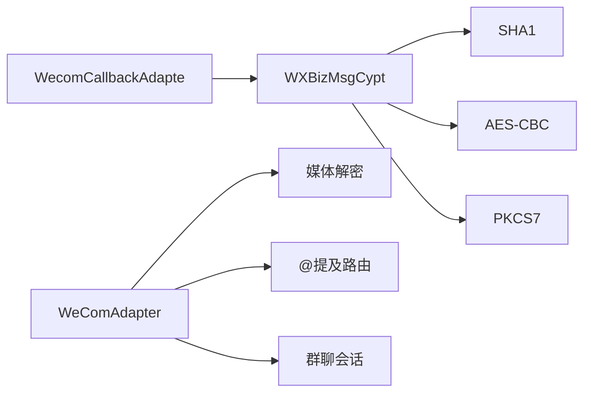

# 安全与加密

<cite>
**本文引用的文件**
- [wecom_crypto.py](file://wecom_crypto.py)
- [wecom_callback.py](file://wecom_callback.py)
- [wecom.py](file://wecom.py)
- [group_session.py](file://group_session.py)
- [mention_router.py](file://mention_router.py)
- [test_mention_fix.py](file://test_mention_fix.py)
- [README.md](file://README.md)
</cite>

## 目录
1. [简介](#简介)
2. [项目结构](#项目结构)
3. [核心组件](#核心组件)
4. [架构总览](#架构总览)
5. [详细组件分析](#详细组件分析)
6. [依赖关系分析](#依赖关系分析)
7. [性能考量](#性能考量)
8. [故障排查指南](#故障排查指南)
9. [结论](#结论)
10. [附录](#附录)

## 简介
本文件面向企业微信回调消息的安全与加密模块，系统化梳理 AES-CBC 加密、SHA1 签名验证、PKCS7 填充、密钥管理与轮换、威胁与防护、回调验证流程、性能优化与错误处理等关键主题。文档以仓库现有实现为依据，结合代码级图示与分层讲解，帮助读者快速掌握安全要点与最佳实践。

## 项目结构
本项目围绕“回调模式”与“WebSocket 模式”两条主线展开：
- 回调模式：HTTP 接收企业微信推送的加密 XML，进行解密与签名校验，解析消息后入队并立即确认。
- WebSocket 模式：通过持久连接接收/发送消息，包含媒体下载解密、@提及路由与多 Agent 群聊编排。

图表来源
- [wecom_callback.py:55-149](file://wecom_callback.py#L55-L149)
- [wecom_crypto.py:66-143](file://wecom_crypto.py#L66-L143)
- [wecom.py:160-278](file://wecom.py#L160-L278)

章节来源
- [README.md:1-43](file://README.md#L1-L43)
- [wecom_callback.py:55-149](file://wecom_callback.py#L55-L149)
- [wecom_crypto.py:66-143](file://wecom_crypto.py#L66-L143)
- [wecom.py:160-278](file://wecom.py#L160-L278)

## 核心组件
- AES-CBC 加密与 PKCS7 填充：用于回调消息体的加解密与填充校验。
- SHA1 签名：对 token、时间戳、随机数与密文进行排序拼接后计算签名，确保完整性与来源可信。
- 回调适配器：负责 HTTP 入口、URL 校验握手、回调解密、事件构建与消息队列派发。
- 媒体解密：针对企业微信上传的加密媒体数据进行 AES-CBC 解密与 PKCS7 去填充。
- @提及路由与群聊会话：在 WebSocket 模式下实现多 Agent 群聊与交叉链路。

章节来源
- [wecom_crypto.py:38-143](file://wecom_crypto.py#L38-L143)
- [wecom_callback.py:232-276](file://wecom_callback.py#L232-L276)
- [wecom.py:1295-1321](file://wecom.py#L1295-L1321)
- [mention_router.py:46-155](file://mention_router.py#L46-L155)
- [group_session.py:96-188](file://group_session.py#L96-L188)

## 架构总览
回调消息从企业微信到应用的完整路径如下：
- 企业微信向回调地址发起 HTTP 请求，携带签名、时间戳、随机数与加密负载。
- 应用侧回调适配器解析请求参数，选择对应应用配置，构造解密器。
- 解密器执行 SHA1 签名校验与 AES-CBC 解密，剥离 PKCS7 填充与随机前缀，提取 XML 内容与目标接收方标识。
- 将解析后的消息封装为事件入队，立即返回成功响应，后续由业务链路异步处理。

图表来源
- [wecom_callback.py:232-276](file://wecom_callback.py#L232-L276)
- [wecom_crypto.py:84-112](file://wecom_crypto.py#L84-L112)

章节来源
- [wecom_callback.py:232-276](file://wecom_callback.py#L232-L276)
- [wecom_crypto.py:84-112](file://wecom_crypto.py#L84-L112)

## 详细组件分析

### AES-CBC 加密与 PKCS7 填充
- 密钥与 IV 来源：编码后的 AES 密钥经 base64 解码得到 32 字节密钥，IV 取前 16 字节。
- 加密流程：随机前缀 + 明文长度 + 明文 + 接收方标识，按 PKCS7 填充至 32 字节块，使用 AES-CBC 加密，再 base64 编码。
- 解密流程：base64 解码后按 AES-CBC 解密，去 PKCS7 填充，跳过 16 字节随机前缀，解析长度字段与 XML 内容，最后比对接收方标识。
- 填充校验：严格校验填充长度与填充字节一致性，避免填充攻击与畸形输入。

图表来源
- [wecom_crypto.py:126-137](file://wecom_crypto.py#L126-L137)
- [wecom_crypto.py:88-112](file://wecom_crypto.py#L88-L112)

章节来源
- [wecom_crypto.py:38-143](file://wecom_crypto.py#L38-L143)

### SHA1 签名验证机制
- 签名输入：token、timestamp、nonce、密文（或回显串）。
- 计算方式：将上述四元组按字典序排序后拼接，计算 SHA1 哈希值。
- 校验时机：回调解密前先比较签名，失败即拒绝处理。
- 安全要点：签名必须与请求参数一致，且密文必须来自企业微信原始推送，防止中间人篡改。

图表来源
- [wecom_crypto.py:61-63](file://wecom_crypto.py#L61-L63)
- [wecom_crypto.py:88-91](file://wecom_crypto.py#L88-L91)

章节来源
- [wecom_crypto.py:61-91](file://wecom_crypto.py#L61-L91)

### 回调消息安全验证流程
- URL 校验握手：GET 请求携带签名参数，回调适配器遍历应用配置，使用对应解密器进行 URL 验证，成功即返回回显明文。
- 回调解密：POST 请求携带加密负载，解析 Encypt 字段，执行签名校验与 AES-CBC 解密，构建消息事件并入队，立即返回 success。
- 异常处理：捕获解密器自定义异常与通用异常，记录日志并返回相应状态码。

图表来源
- [wecom_callback.py:232-276](file://wecom_callback.py#L232-L276)
- [wecom_callback.py:293-300](file://wecom_callback.py#L293-L300)

章节来源
- [wecom_callback.py:232-276](file://wecom_callback.py#L232-L276)
- [wecom_callback.py:293-300](file://wecom_callback.py#L293-L300)

### 媒体解密（WebSocket 模式）
- 适用场景：企业微信上传的加密媒体资源，需使用 AES-CBC 与 PKCS7 去填充还原原始内容。
- 输入：加密字节流与 AES Key（base64 解码后应为 32 字节）。
- 校验：严格校验填充长度与填充字节，避免伪造填充导致的数据损坏。

图表来源
- [wecom.py:1295-1321](file://wecom.py#L1295-L1321)

章节来源
- [wecom.py:1295-1321](file://wecom.py#L1295-L1321)

### 密钥管理与轮换策略
- 密钥类型与长度
  - 回调加密密钥：Base64 编码的 43 字符密钥，解码后为 32 字节，IV 为前 16 字节。
  - 媒体解密密钥：Base64 编码的 32 字节密钥。
- 配置与存储
  - 回调模式：通过应用配置注入 token、encoding_aes_key、receive_id。
  - 多应用隔离：按 cop_id:use_id 维度区分不同应用实例，避免跨应用冲突。
- 轮换建议
  - 采用“双密钥并行期”：新旧密钥同时生效一段时间，逐步切换流量，最后回收旧密钥。
  - 严格最小权限：仅授予回调与媒体解密所需密钥，避免泄露面扩大。
  - 定期审计：对密钥使用日志与异常进行审计，发现异常及时处置。

章节来源
- [wecom_callback.py:77-97](file://wecom_callback.py#L77-L97)
- [wecom_callback.py:338-343](file://wecom_callback.py#L338-L343)
- [wecom.py:1295-1303](file://wecom.py#L1295-L1303)

### 安全威胁与防护
- 主要威胁
  - 中间人篡改：通过伪造签名或修改密文绕过校验。
  - 填充攻击：构造无效填充破坏解密流程。
  - 密钥泄露：密钥落入攻击者之手可解密历史与实时消息。
- 防护措施
  - 严格的签名校验与异常处理，拒绝任何不匹配的请求。
  - 严格的 PKCS7 填充校验，拒绝异常填充。
  - HTTPS 传输与最小暴露面，避免敏感信息落盘。
  - 多应用隔离与访问控制，降低横向移动风险。

章节来源
- [wecom_crypto.py:54-58](file://wecom_crypto.py#L54-L58)
- [wecom_crypto.py:88-112](file://wecom_crypto.py#L88-L112)
- [wecom_callback.py:271-276](file://wecom_callback.py#L271-L276)

### 性能优化与错误处理
- 性能优化
  - 异步处理：回调解密后立即返回，事件入队与后续处理异步进行，降低首包延迟。
  - 连接池与超时：HTTP 客户端设置合理超时与重试，避免阻塞。
  - 压缩与分片：媒体下载采用流式处理，避免一次性加载大文件。
- 错误处理
  - 解密器自定义异常：签名不匹配、填充错误、接收方不一致等。
  - 通用异常捕获：解码失败、加密失败等，统一包装为可识别错误并记录日志。
  - 回调端返回：签名失败返回 403，无效负载返回 400，成功返回 200。

章节来源
- [wecom_callback.py:271-276](file://wecom_callback.py#L271-L276)
- [wecom_callback.py:121-149](file://wecom_callback.py#L121-L149)
- [wecom.py:1322-1364](file://wecom.py#L1322-L1364)

## 依赖关系分析
- 回调模式依赖
  - 回调适配器依赖解密器进行签名校验与解密。
  - 解密器依赖 SHA1、AES-CBC、PKCS7 实现。
- WebSocket 模式依赖
  - 媒体下载与解密依赖 cryptography 库。
  - @提及路由与群聊会话用于多 Agent 场景。

图表来源
- [wecom_callback.py:338-343](file://wecom_callback.py#L338-L343)
- [wecom_crypto.py:61-143](file://wecom_crypto.py#L61-L143)
- [wecom.py:1295-1321](file://wecom.py#L1295-L1321)
- [mention_router.py:46-155](file://mention_router.py#L46-L155)
- [group_session.py:96-188](file://group_session.py#L96-L188)

章节来源
- [wecom_callback.py:338-343](file://wecom_callback.py#L338-L343)
- [wecom_crypto.py:61-143](file://wecom_crypto.py#L61-L143)
- [wecom.py:1295-1321](file://wecom.py#L1295-L1321)
- [mention_router.py:46-155](file://mention_router.py#L46-L155)
- [group_session.py:96-188](file://group_session.py#L96-L188)

## 性能考量
- 回调模式
  - 解密与签名校验在内存中完成，返回成功响应的时间短，适合高并发场景。
  - 异步队列派发事件，避免阻塞回调线程。
- WebSocket 模式
  - 媒体下载采用流式处理，避免大文件占用过多内存。
  - 多 Agent 群聊会话为内存态，避免持久化开销。

章节来源
- [wecom_callback.py:278-288](file://wecom_callback.py#L278-L288)
- [wecom.py:1322-1364](file://wecom.py#L1322-L1364)
- [group_session.py:96-188](file://group_session.py#L96-L188)

## 故障排查指南
- 常见问题
  - 签名不匹配：核对 token、timestamp、nonce 与密文是否与企业微信一致。
  - Base64 解码失败：确认密文编码格式与长度。
  - PKCS7 填充错误：检查填充长度与填充字节是否一致。
  - 接收方不一致：确认 receive_id 与企业微信配置一致。
  - 回调未生效：检查回调地址、端口占用与网络连通性。
- 诊断步骤
  - 开启详细日志，定位异常抛出位置与错误类型。
  - 对照企业微信回调参数与本地解密器输入，逐项核对。
  - 使用测试脚本验证 @提及解析逻辑，确保群聊场景正常。

章节来源
- [wecom_crypto.py:94-108](file://wecom_crypto.py#L94-L108)
- [wecom_callback.py:232-276](file://wecom_callback.py#L232-L276)
- [test_mention_fix.py:8-23](file://test_mention_fix.py#L8-L23)

## 结论
本项目在回调模式下实现了与企业微信兼容的 AES-CBC 加密与 SHA1 签名验证，并通过严格的 PKCS7 填充校验保障数据完整性。配合异步队列与多应用隔离，既满足高并发需求，又具备良好的可维护性。建议在生产环境中强化密钥轮换与访问控制，持续监控异常日志，确保系统安全稳定运行。

## 附录
- 相关文件
  - 回调解密器与签名校验：[wecom_crypto.py:66-143](file://wecom_crypto.py#L66-L143)
  - 回调适配器与事件派发：[wecom_callback.py:55-149](file://wecom_callback.py#L55-L149)
  - 媒体解密与下载：[wecom.py:1295-1364](file://wecom.py#L1295-L1364)
  - @提及路由与群聊会话：[mention_router.py:46-155](file://mention_router.py#L46-L155)、[group_session.py:96-188](file://group_session.py#L96-L188)
  - @提及修复测试：[test_mention_fix.py:8-23](file://test_mention_fix.py#L8-L23)