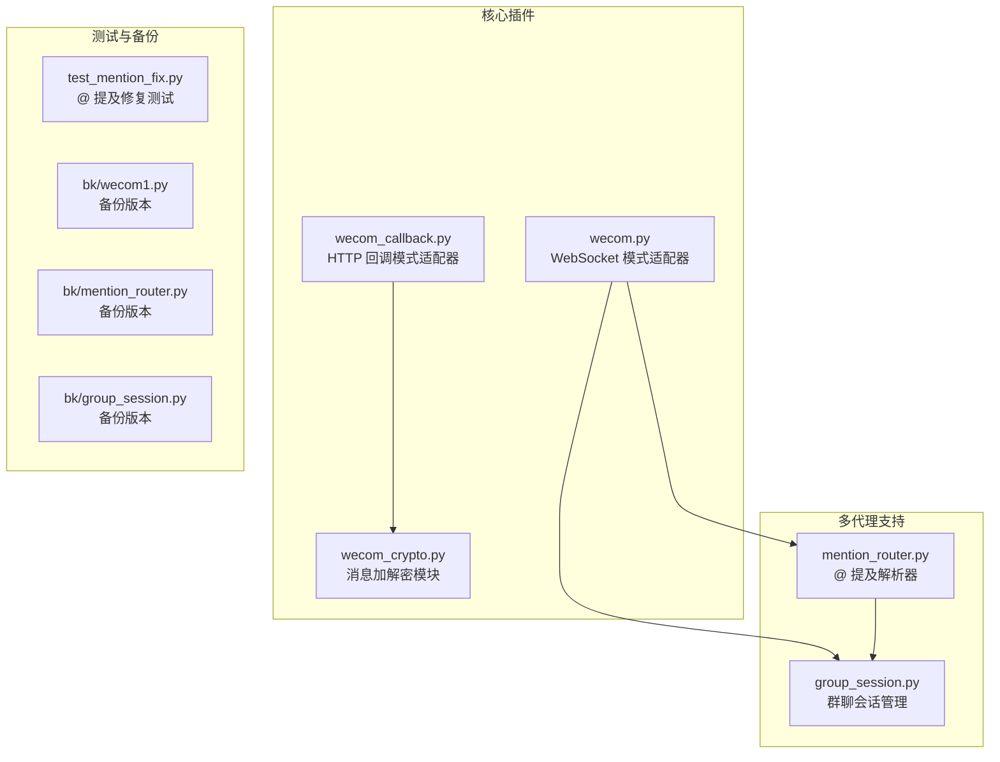
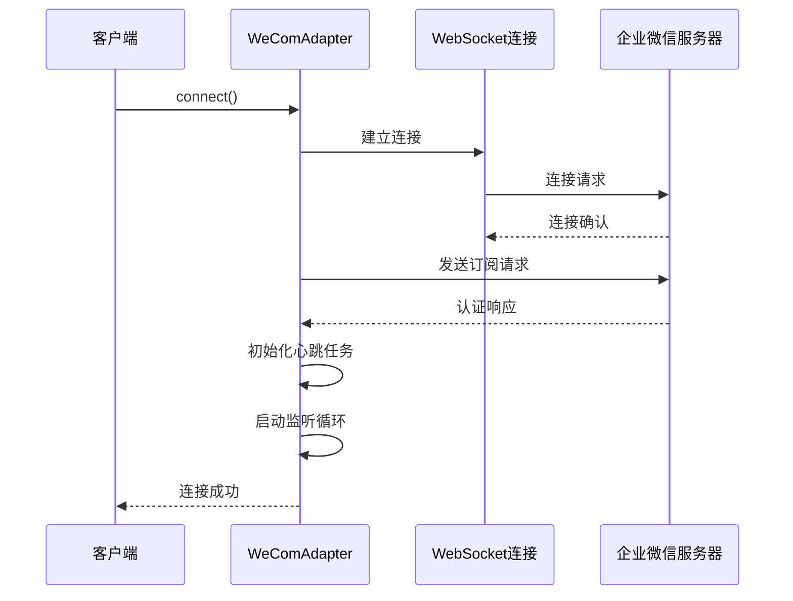
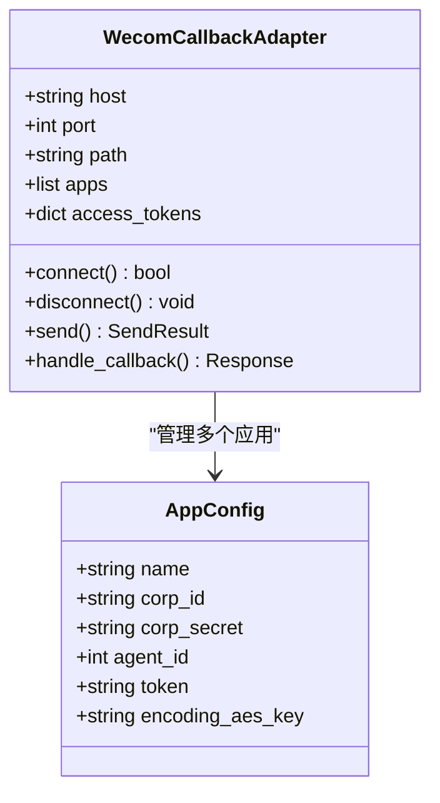
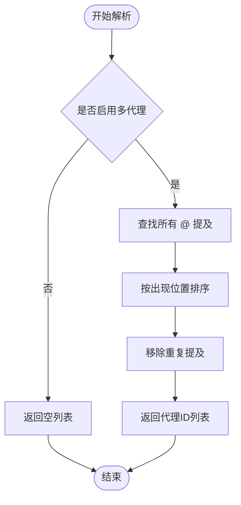
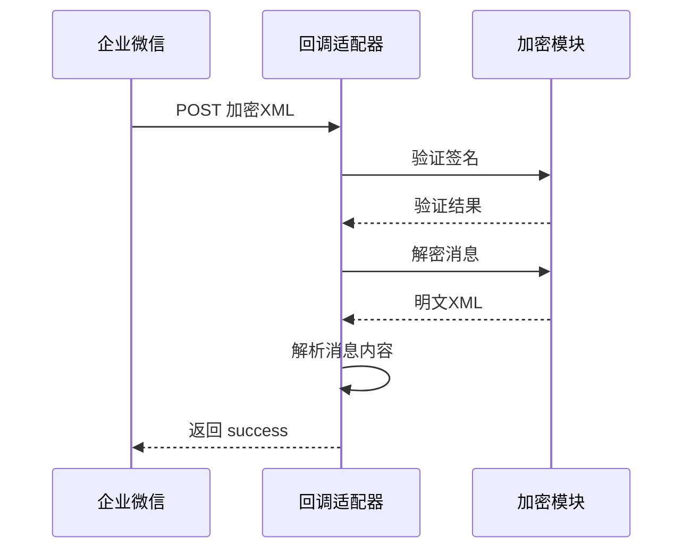
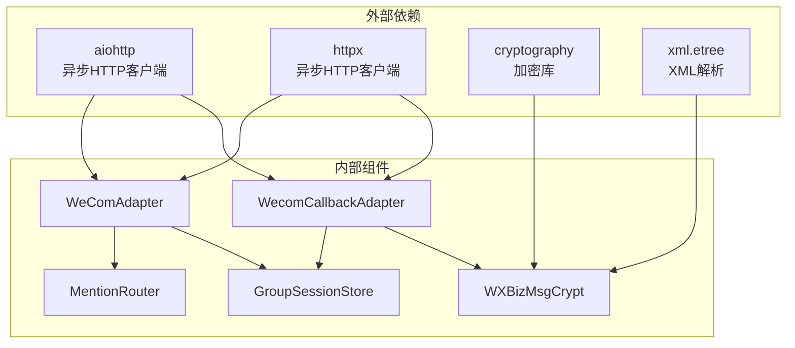
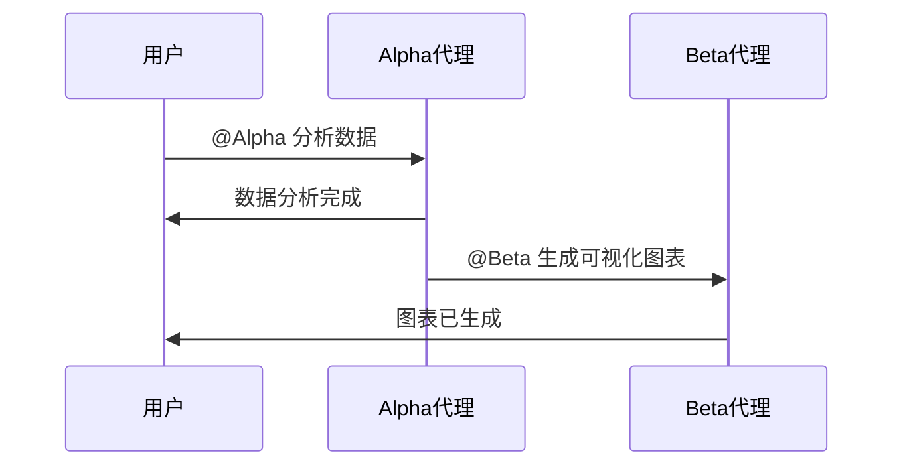

# 快速开始

<cite>
**本文档引用的文件**
- [README.md](file://README.md)
- [wecom.py](file://wecom.py)
- [wecom_callback.py](file://wecom_callback.py)
- [wecom_crypto.py](file://wecom_crypto.py)
- [mention_router.py](file://mention_router.py)
- [group_session.py](file://group_session.py)
- [test_mention_fix.py](file://test_mention_fix.py)
- [bk/wecom1.py](file://bk/wecom1.py)
- [bk/mention_router.py](file://bk/mention_router.py)
- [bk/group_session.py](file://bk/group_session.py)
</cite>

## 目录
1. [简介](#简介)
2. [项目结构](#项目结构)
3. [核心组件](#核心组件)
4. [架构概览](#架构概览)
5. [详细组件分析](#详细组件分析)
6. [依赖关系分析](#依赖关系分析)
7. [性能考虑](#性能考虑)
8. [故障排除指南](#故障排除指南)
9. [结论](#结论)
10. [附录](#附录)

## 简介

WeCom 插件是 Hermes Agent 企业微信（WeCom）网关插件，提供了企业微信与 AI 代理之间的无缝集成。该插件支持两种工作模式：WebSocket 模式和 HTTP 回调模式，能够处理群聊 @ 提及、多代理协作、消息去重、媒体文件处理等高级功能。

### 主要特性

- **双模式支持**：同时支持 WebSocket 和 HTTP 回调两种接入方式
- **多代理群聊**：支持在群聊中 @ 不同的 AI 代理，实现链式对话
- **智能消息路由**：基于 @ 提及的自动代理选择机制
- **消息去重**：防止重复消息的处理
- **媒体文件支持**：图片、文件、语音等多媒体内容处理
- **安全加密**：企业微信回调消息的加解密支持

## 项目结构



**图表来源**
- [wecom.py:1-1774](file://wecom.py#L1-L1774)
- [wecom_callback.py:1-388](file://wecom_callback.py#L1-L388)
- [wecom_crypto.py:1-143](file://wecom_crypto.py#L1-L143)
- [mention_router.py:1-155](file://mention_router.py#L1-L155)
- [group_session.py:1-188](file://group_session.py#L1-L188)

**章节来源**
- [README.md:1-43](file://README.md#L1-L43)

## 核心组件

### WeCom WebSocket 适配器

WeCom WebSocket 适配器是插件的核心组件，负责与企业微信 AI Bot 网关建立持久连接，处理双向通信。

#### 关键配置参数

| 参数名 | 类型 | 默认值 | 描述 |
|--------|------|--------|------|
| bot_id | string | 无 | 企业微信机器人 ID |
| secret | string | 无 | 企业微信机器人密钥 |
| websocket_url | string | wss://openws.work.weixin.qq.com | WebSocket 服务器地址 |
| dm_policy | string | open | 私聊策略 (open/allowlist/disabled/pairing) |
| group_policy | string | open | 群聊策略 (open/allowlist/disabled) |

#### 连接生命周期管理



**图表来源**
- [wecom.py:212-247](file://wecom.py#L212-L247)
- [wecom.py:289-327](file://wecom.py#L289-L327)

### WeCom HTTP 回调适配器

HTTP 回调适配器用于处理企业微信的主动推送消息，支持多应用配置和访问令牌管理。

#### 应用配置结构



**图表来源**
- [wecom_callback.py:55-98](file://wecom_callback.py#L55-L98)
- [wecom_callback.py:345-351](file://wecom_callback.py#L345-L351)

**章节来源**
- [wecom.py:160-207](file://wecom.py#L160-L207)
- [wecom_callback.py:55-72](file://wecom_callback.py#L55-L72)

## 架构概览

```mermaid
graph TB
subgraph "企业微信平台"
A[企业微信客户端]
B[企业微信服务器]
end
subgraph "Hermes Agent 网关"
C[WeComAdapter<br/>WebSocket模式]
D[WecomCallbackAdapter<br/>HTTP回调模式]
E[MentionRouter<br/>@提及解析]
F[GroupSessionStore<br/>会话管理]
end
subgraph "AI 代理系统"
G[Agent A]
H[Agent B]
I[Agent C]
end
A --> B
B --> C
B --> D
C --> E
C --> F
D --> F
E --> G
E --> H
E --> I
F --> G
F --> H
F --> I
```

**图表来源**
- [wecom.py:160-167](file://wecom.py#L160-L167)
- [wecom_callback.py:55-57](file://wecom_callback.py#L55-L57)
- [mention_router.py:46-90](file://mention_router.py#L46-L90)
- [group_session.py:96-102](file://group_session.py#L96-L102)

## 详细组件分析

### @ 提及路由器

MentionRouter 组件负责解析群聊中的 @ 提及，支持多代理协作和链式对话。

#### 提及解析算法



**图表来源**
- [mention_router.py:102-118](file://mention_router.py#L102-L118)

#### 代理配置结构

| 配置项 | 类型 | 描述 |
|--------|------|------|
| enabled | boolean | 是否启用多代理功能 |
| default_agent | string | 默认代理ID |
| agents | dict | 代理配置字典 |
| cross_agent.enabled | boolean | 是否启用跨代理链式调用 |
| cross_agent.max_chain_length | int | 最大链式长度 |
| cross_agent.chain_cooldown_seconds | float | 链式调用冷却时间 |

**章节来源**
- [mention_router.py:46-90](file://mention_router.py#L46-L90)
- [mention_router.py:148-155](file://mention_router.py#L148-L155)

### 群聊会话管理

GroupSessionStore 负责管理多代理群聊中的对话状态，防止无限循环和管理代理调用顺序。

#### 会话状态机

```mermaid
stateDiagram-v2
[*] --> Active
Active --> Completed : "链式对话完成"
Active --> Interrupted : "用户中断"
Completed --> [*]
Interrupted --> [*]
note right of Active : "链式深度 : 0\n最后调用时间 : now\n活跃状态 : True"
note right of Completed : "链式深度 : n\n最后调用时间 : t\n活跃状态 : False"
note right of Interrupted : "链式深度 : m\n最后调用时间 : t\n活跃状态 : False"
```

**图表来源**
- [group_session.py:34-49](file://group_session.py#L34-L49)
- [group_session.py:104-127](file://group_session.py#L104-L127)

### 消息加解密

WXBizMsgCrypt 类实现了企业微信回调消息的加解密功能，确保消息传输的安全性。

#### 加密流程



**图表来源**
- [wecom_callback.py:247-276](file://wecom_callback.py#L247-L276)
- [wecom_crypto.py:88-112](file://wecom_crypto.py#L88-L112)

**章节来源**
- [wecom_crypto.py:66-83](file://wecom_crypto.py#L66-L83)
- [wecom_callback.py:293-301](file://wecom_callback.py#L293-L301)

## 依赖关系分析



**图表来源**
- [wecom.py:46-58](file://wecom.py#L46-L58)
- [wecom_callback.py:22-36](file://wecom_callback.py#L22-L36)
- [wecom_crypto.py:18-20](file://wecom_crypto.py#L18-L20)

### 环境要求

| 依赖项 | 版本要求 | 安装命令 |
|--------|----------|----------|
| Python | >= 3.7 | - |
| aiohttp | >= 3.0 | pip install aiohttp |
| httpx | >= 0.18 | pip install httpx |
| cryptography | >= 3.0 | pip install cryptography |
| xml.etree | 内置 | - |

**章节来源**
- [wecom.py:108-110](file://wecom.py#L108-L110)
- [wecom_callback.py:51-53](file://wecom_callback.py#L51-L53)

## 性能考虑

### 消息批处理

WeCom 客户端会在长文本消息处进行分割，插件实现了智能的消息批处理机制：

- **普通批处理延迟**：默认 0.6 秒
- **分割点批处理延迟**：默认 2.0 秒（当消息接近 4000 字符时）
- **最大批处理大小**：1000 条消息

### 连接管理

- **心跳间隔**：30 秒
- **重连退避**：2, 5, 10, 30, 60 秒
- **消息去重窗口**：1000 条消息

## 故障排除指南

### 常见配置问题

#### 1. 缺少认证信息

**问题症状**：
```
WeCom startup failed: WECOM_BOT_ID and WECOM_SECRET are required
```

**解决方案**：
- 在配置文件中设置 `bot_id` 和 `secret`
- 或者设置环境变量 `WECOM_BOT_ID` 和 `WECOM_SECRET`

#### 2. 依赖包缺失

**问题症状**：
```
WeCom startup failed: aiohttp not installed
WeCom startup failed: httpx not installed
```

**解决方案**：
```bash
pip install aiohttp httpx cryptography
```

#### 3. 网络连接问题

**问题症状**：
```
Timed out waiting for WeCom subscribe acknowledgement
```

**解决方案**：
- 检查网络连接
- 验证 WebSocket URL 可访问性
- 检查防火墙设置

### @ 提及功能测试

插件包含专门的测试脚本来验证 @ 提及修复功能：

```python
# 测试被 @ 的消息
body1 = {
    "content": "大家好 @my_bot_123",
    "mentioned_userid_list": ["user1", "my_bot_123", "user2"]
}
assert _is_bot_mentioned(body1, "my_bot_123") == True

# 测试未被 @ 的消息
body2 = {
    "content": "大家好 @other_bot",
    "mentioned_userid_list": ["user1", "other_bot"]
}
assert _is_bot_mentioned(body2, "my_bot_123") == False
```

**章节来源**
- [test_mention_fix.py:26-77](file://test_mention_fix.py#L26-L77)
- [wecom.py:224-228](file://wecom.py#L224-L228)

## 结论

WeCom 插件为 Hermes Agent 提供了完整的企业微信集成解决方案。通过双模式支持、智能 @ 提及解析、多代理协作和安全的消息处理，该插件能够满足企业级应用的需求。

### 主要优势

1. **灵活性**：支持 WebSocket 和 HTTP 回调两种模式
2. **可扩展性**：多代理群聊支持和链式对话
3. **安全性**：完整的消息加解密和签名验证
4. **可靠性**：智能重连、消息去重和错误处理

## 附录

### 完整配置示例

#### 基础配置

```yaml
gateway:
  platforms:
    wecom:
      enabled: true
      extra:
        bot_id: "your-bot-id"
        secret: "your-secret"
        websocket_url: "wss://openws.work.weixin.qq.com"
        dm_policy: "open"
        group_policy: "open"
```

#### 多代理群聊配置

```yaml
gateway:
  platforms:
    wecom:
      enabled: true
      extra:
        bot_id: "your-bot-id"
        secret: "your-secret"
        
        # 多代理配置
        multi_agent:
          enabled: true
          default_agent: "default"
          agents:
            alpha:
              name: "Alpha助手"
              mention_patterns: ["@Alpha", "@Alpha助手"]
            beta:
              name: "Beta助手"
              mention_patterns: ["@Beta", "@Beta助手"]
          
          cross_agent:
            enabled: true
            max_chain_length: 5
            chain_cooldown_seconds: 3
```

### 使用示例

#### 基本交互

用户可以在群聊中这样与 AI 代理交互：

```
@Alpha 请帮我分析这个数据
@Beta 请查看这个报告
```

#### 链式对话



**图表来源**
- [README.md:13-20](file://README.md#L13-L20)