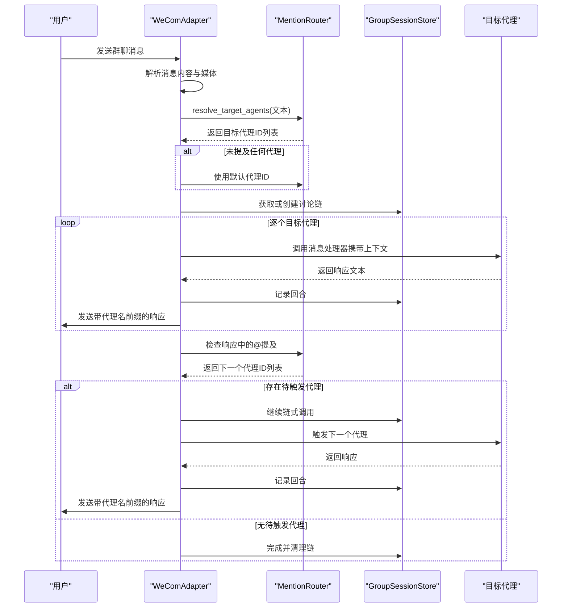
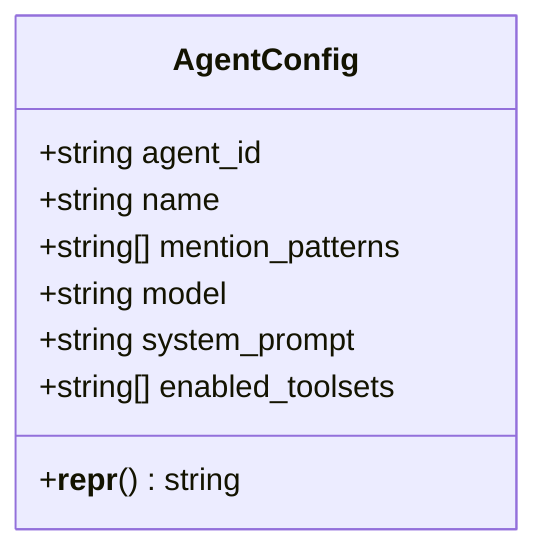
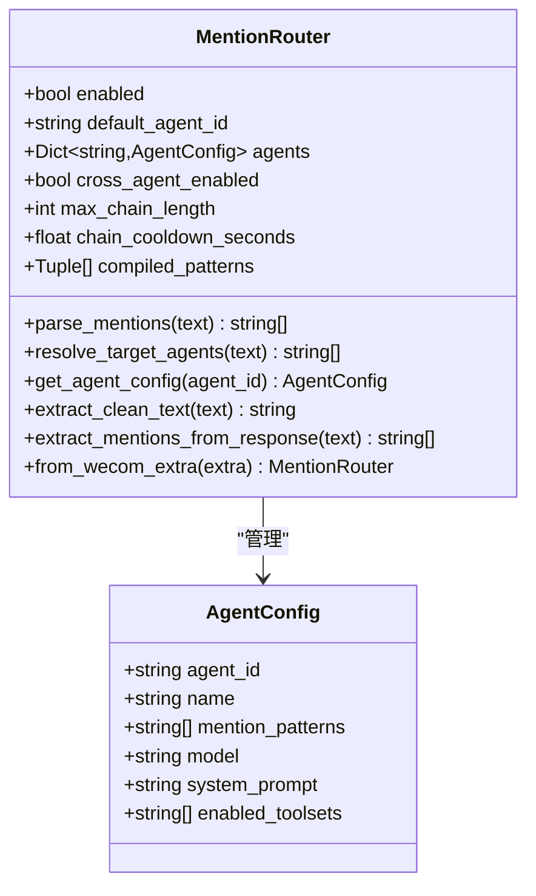
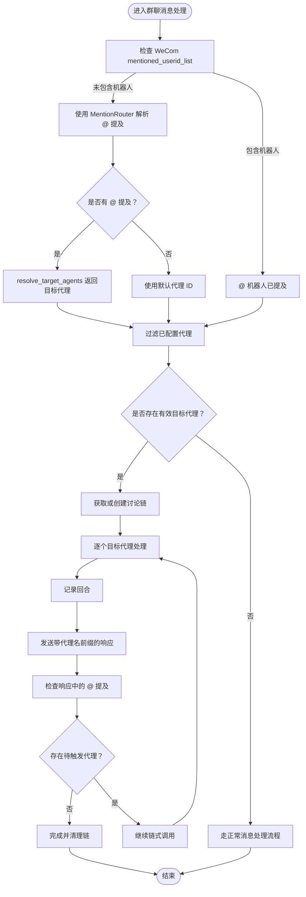
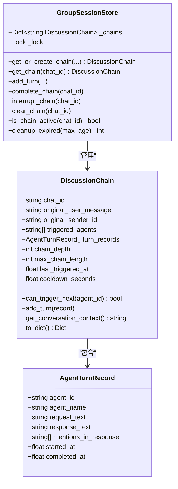
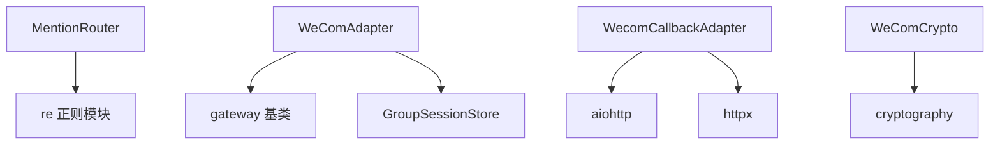

# 代理扩展开发

<cite>
**本文档引用的文件**
- [README.md](file://README.md)
- [mention_router.py](file://mention_router.py)
- [group_session.py](file://group_session.py)
- [wecom.py](file://wecom.py)
- [test_mention_fix.py](file://test_mention_fix.py)
- [wecom_callback.py](file://wecom_callback.py)
- [wecom_crypto.py](file://wecom_crypto.py)
</cite>

## 目录
1. [简介](#简介)
2. [项目结构](#项目结构)
3. [核心组件](#核心组件)
4. [架构概览](#架构概览)
5. [详细组件分析](#详细组件分析)
6. [依赖分析](#依赖分析)
7. [性能考虑](#性能考虑)
8. [故障排除指南](#故障排除指南)
9. [结论](#结论)
10. [附录](#附录)

## 简介
本指南面向需要扩展多代理能力的开发者，详细说明如何通过 AgentConfig 类添加新的 AI 代理配置。文档涵盖代理 ID、名称、提及模式的配置方法，自定义提及模式的编写规则与正则表达式使用示例，代理的系统提示词、模型选择和工具集配置，以及代理启用/禁用控制和默认代理设置。同时提供最佳实践、常见配置模式、测试方法和验证流程。

## 项目结构
该项目是一个基于 Hermes Agent 框架的企业微信（WeCom）网关插件，支持在群聊中通过 @ 提及路由到不同代理，实现多代理协作与链式对话。

```mermaid
graph TB
subgraph "WeCom 网关插件"
A[wecom.py<br/>WebSocket 适配器]
B[mention_router.py<br/>@ 提及解析器]
C[group_session.py<br/>群聊会话管理]
D[wecom_callback.py<br/>HTTP 回调适配器]
E[wecom_crypto.py<br/>消息加解密模块]
F[test_mention_fix.py<br/>@ 提及修复测试]
end
A --> B
A --> C
D --> E
B --> F
```

**图表来源**
- [wecom.py:1-1774](file://wecom.py#L1-L1774)
- [mention_router.py:1-155](file://mention_router.py#L1-L155)
- [group_session.py:1-188](file://group_session.py#L1-L188)
- [wecom_callback.py:1-388](file://wecom_callback.py#L1-L388)
- [wecom_crypto.py:1-143](file://wecom_crypto.py#L1-L143)
- [test_mention_fix.py:1-133](file://test_mention_fix.py#L1-L133)

**章节来源**
- [README.md:1-43](file://README.md#L1-L43)
- [wecom.py:1-1774](file://wecom.py#L1-L1774)

## 核心组件
本节重点介绍与代理扩展直接相关的核心组件：AgentConfig 和 MentionRouter。

- AgentConfig：封装单个代理的配置信息，包括代理 ID、名称、提及模式、可选的模型覆盖、系统提示词和启用的工具集。
- MentionRouter：负责解析群聊消息中的 @ 提及，将其路由到对应的代理配置，并支持跨代理链式调用。

关键特性：
- 支持多种 @ 提及模式（如 @代理名、@代理ID），并可自定义模式
- 支持大小写不敏感匹配与边界断言，避免误匹配
- 支持默认代理回退机制
- 支持跨代理链式调用，防止无限循环

**章节来源**
- [mention_router.py:23-44](file://mention_router.py#L23-L44)
- [mention_router.py:46-155](file://mention_router.py#L46-L155)

## 架构概览
下图展示了多代理群聊的端到端工作流，从消息接收、@ 提及解析、代理路由到响应发送与跨代理链式调用。



**图表来源**
- [wecom.py:909-1181](file://wecom.py#L909-L1181)
- [mention_router.py:102-146](file://mention_router.py#L102-L146)
- [group_session.py:96-188](file://group_session.py#L96-L188)

## 详细组件分析

### AgentConfig 类详解
AgentConfig 是代理配置的核心数据结构，负责存储每个代理的标识、名称、提及模式以及可选的模型覆盖、系统提示词和工具集。

- 代理 ID（agent_id）：唯一标识符，用于在路由表中查找代理配置
- 名称（name）：代理显示名称，默认与代理 ID 相同
- 提及模式（mention_patterns）：支持多个正则模式，用于识别 @ 提及
- 可选配置：
  - 模型（model）：每代理可覆盖全局模型选择
  - 系统提示词（system_prompt）：每代理可覆盖系统提示
  - 工具集（enabled_toolsets）：每代理可启用特定工具集



**图表来源**
- [mention_router.py:23-44](file://mention_router.py#L23-L44)

**章节来源**
- [mention_router.py:23-44](file://mention_router.py#L23-L44)

### MentionRouter 类详解
MentionRouter 负责解析 @ 提及并路由到对应代理配置，支持默认代理回退与跨代理链式调用。

- 初始化参数 multi_agent_config：
  - enabled：是否启用多代理群聊
  - default_agent：默认代理 ID
  - agents：代理注册表（键为 agent_id，值为 AgentConfig）
  - cross_agent：跨代理链式调用配置（启用开关、最大链长度、冷却时间）

- 关键方法：
  - parse_mentions(text)：解析文本中的 @ 提及，按首次出现顺序返回代理 ID 列表
  - resolve_target_agents(text)：根据 @ 提及解析目标代理，若无 @ 提及则返回空列表（由调用方使用默认代理）
  - get_agent_config(agent_id)：按代理 ID 获取配置
  - extract_clean_text(text)：移除 @ 提及标记，返回干净的消息文本
  - extract_mentions_from_response(response_text)：从代理响应中扫描 @ 提及，用于链式调用
  - from_wecom_extra(extra)：从 WeCom 适配器的 extra 配置字典创建 MentionRouter 实例

- 提及模式编译：
  - 对每个代理的每个提及模式进行转义
  - 添加大小写不敏感标志与左右边界断言
  - 编译为正则表达式对象，按代理 ID 与正则对象的元组保存



**图表来源**
- [mention_router.py:46-155](file://mention_router.py#L46-L155)
- [mention_router.py:23-44](file://mention_router.py#L23-L44)

**章节来源**
- [mention_router.py:46-155](file://mention_router.py#L46-L155)

### WeComAdapter 中的多代理集成
WeComAdapter 在群聊消息处理中集成 MentionRouter，实现 @ 提及解析与代理路由。

- 连接与初始化：
  - 从 extra 配置中提取 bot_id、secret、websocket_url 等参数
  - 创建 MentionRouter 实例（from_wecom_extra）

- 群聊消息处理：
  - 首先检查 WeCom 的 mentioned_userid_list 是否包含机器人 ID
  - 若未被 @，则使用 MentionRouter.resolve_target_agents 解析 @ 提及
  - 若无 @ 提及且多代理启用，则使用默认代理 ID
  - 将消息分发给目标代理，代理响应中可再次 @ 其他代理，形成链式调用

- 跨代理链式调用：
  - 在所有目标代理响应后，检查最后一个代理的响应文本
  - 从响应中提取新的 @ 提及，过滤已触发代理
  - 按冷却时间与最大链长度限制继续触发新代理



**图表来源**
- [wecom.py:495-586](file://wecom.py#L495-L586)
- [wecom.py:909-1181](file://wecom.py#L909-L1181)
- [mention_router.py:102-126](file://mention_router.py#L102-L126)

**章节来源**
- [wecom.py:495-586](file://wecom.py#L495-L586)
- [wecom.py:909-1181](file://wecom.py#L909-L1181)

### GroupSessionStore 会话状态管理
GroupSessionStore 负责维护群聊讨论链的状态，确保跨代理链式调用的有序性与防循环。

- 核心概念：
  - DiscussionChain：表示一次群聊讨论链的状态，包含原始用户消息、触发代理序列、回合记录、链深度、最大链长度、冷却时间等
  - AgentTurnRecord：记录单个代理的一轮对话，包含代理 ID/名称、请求文本、响应文本、响应中的 @ 提及、开始与完成时间
  - 会话存储：按 chat_id 管理 DiscussionChain，支持并发安全访问

- 关键方法：
  - get_or_create_chain：获取现有链或创建新链
  - add_turn：记录代理回合
  - get_conversation_context：构建后续代理的对话上下文
  - complete_chain/clear_chain：标记链完成并清理
  - is_chain_active：检查链是否处于活动状态
  - cleanup_expired：清理过期链



**图表来源**
- [group_session.py:21-188](file://group_session.py#L21-L188)

**章节来源**
- [group_session.py:21-188](file://group_session.py#L21-L188)

### HTTP 回调适配器与消息加解密
项目还提供了 HTTP 回调模式的适配器与消息加解密模块，用于企业自建应用的回调场景。

- WecomCallbackAdapter：处理 WeCom 的 HTTP 回调，支持多应用配置、签名验证、消息去重、异步轮询与延迟发送
- WeComCrypto/WXBizMsgCrypt：实现与官方 SDK 兼容的 AES-CBC 加解密，支持签名验证与随机前缀处理

**章节来源**
- [wecom_callback.py:55-388](file://wecom_callback.py#L55-L388)
- [wecom_crypto.py:66-143](file://wecom_crypto.py#L66-L143)

## 依赖分析
- MentionRouter 依赖 Python 标准库 re 模块进行正则匹配
- WeComAdapter 依赖 gateway 平台基类与会话管理模块
- GroupSessionStore 依赖 asyncio 与 time 模块进行并发与时间管理
- HTTP 回调适配器依赖 aiohttp 与 httpx 进行网络通信
- 加解密模块依赖 cryptography 库进行 AES-CBC 加解密



**图表来源**
- [mention_router.py:13-14](file://mention_router.py#L13-L14)
- [wecom.py:60-70](file://wecom.py#L60-L70)
- [wecom_callback.py:23-36](file://wecom_callback.py#L23-L36)
- [wecom_crypto.py:18-19](file://wecom_crypto.py#L18-L19)

**章节来源**
- [mention_router.py:13-14](file://mention_router.py#L13-L14)
- [wecom.py:60-70](file://wecom.py#L60-L70)
- [wecom_callback.py:23-36](file://wecom_callback.py#L23-L36)
- [wecom_crypto.py:18-19](file://wecom_crypto.py#L18-L19)

## 性能考虑
- 正则编译缓存：MentionRouter 在初始化时编译所有提及模式的正则表达式，避免重复编译开销
- 文本批处理：WeComAdapter 对长文本消息进行批处理合并，减少客户端分割带来的多次处理
- 冷却时间：GroupSessionStore 为链式调用设置冷却时间，防止代理被频繁触发
- 最大链长度：限制链式调用深度，防止无限循环与资源耗尽
- 媒体上传优化：对超限媒体进行降级处理，避免发送失败

## 故障排除指南
- @ 提及未生效
  - 检查 multi_agent.enabled 是否为 true
  - 确认 mention_patterns 是否正确配置，包含 @ 符号
  - 验证 MentionRouter 是否从 extra 配置正确创建
  - 参考测试用例验证 @ 提及解析逻辑

- 默认代理未触发
  - 检查 default_agent 是否设置且存在于 agents 中
  - 确认 resolve_target_agents 返回空列表时调用方是否正确使用默认代理

- 跨代理链式调用异常
  - 检查 cross_agent.enabled、max_chain_length、chain_cooldown_seconds 配置
  - 确认响应文本中的 @ 提及格式正确
  - 查看 GroupSessionStore 的链状态与冷却时间

- 群聊消息被忽略
  - 检查 mentioned_userid_list 是否包含机器人 ID
  - 确认消息类型与内容解析是否正确

**章节来源**
- [test_mention_fix.py:26-133](file://test_mention_fix.py#L26-L133)
- [wecom.py:523-542](file://wecom.py#L523-L542)

## 结论
通过 AgentConfig 与 MentionRouter 的设计，本项目实现了灵活的多代理群聊能力。开发者只需在 multi_agent 配置中添加新的代理条目，即可快速扩展代理生态。配合 GroupSessionStore 的会话管理与冷却机制，能够稳定地支持跨代理链式调用。建议遵循本文档的最佳实践与测试方法，确保配置正确与行为可预期。

## 附录

### 代理配置最佳实践
- 代理 ID 建议使用简短、稳定的标识符
- 提及模式应包含至少一个明确的 @ 前缀，避免与其他文本冲突
- 为每个代理设置清晰的系统提示词与工具集，确保职责边界明确
- 合理设置默认代理与最大链长度，平衡交互体验与资源消耗
- 在生产环境中启用冷却时间，防止代理被频繁触发

### 常见配置模式
- 基础 @ 提及：使用 @代理名 或 @代理ID
- 多语言支持：为中文场景添加 @代理助手 等变体
- 大小写不敏感：利用 MentionRouter 的大小写不敏感匹配特性
- 默认代理回退：当无 @ 提及时自动路由到默认代理
- 跨代理链式：在代理响应中 @ 其他代理，形成协作对话

### 代理扩展测试方法
- 单元测试：验证 @ 提及解析函数的行为
- 集成测试：模拟群聊消息，验证多代理路由与链式调用
- 边界测试：测试空提及、重复提及、超长链等边界情况
- 性能测试：评估正则匹配与链式调用的性能表现

**章节来源**
- [test_mention_fix.py:26-133](file://test_mention_fix.py#L26-L133)
- [README.md:21-38](file://README.md#L21-L38)