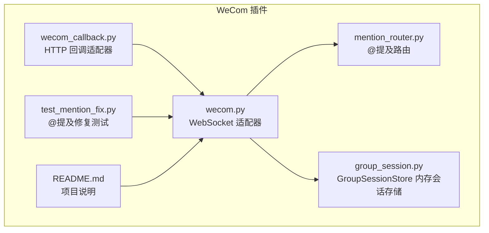
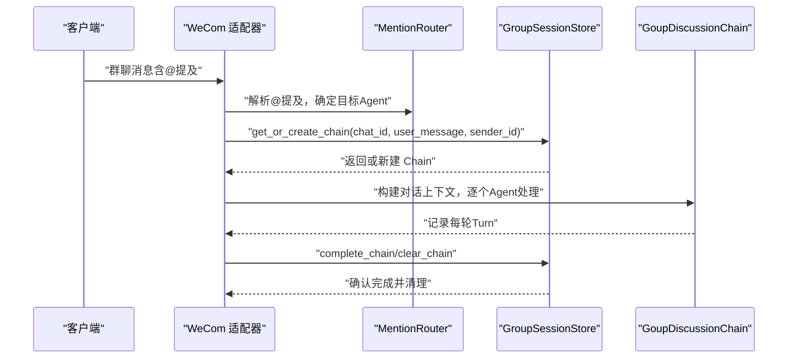
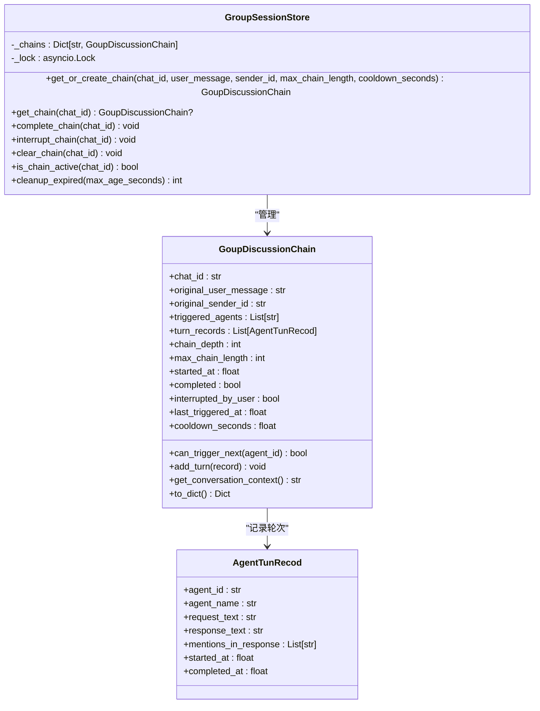
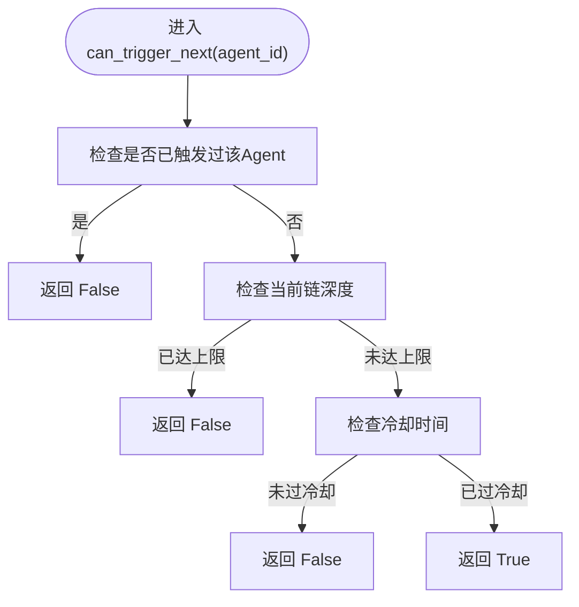
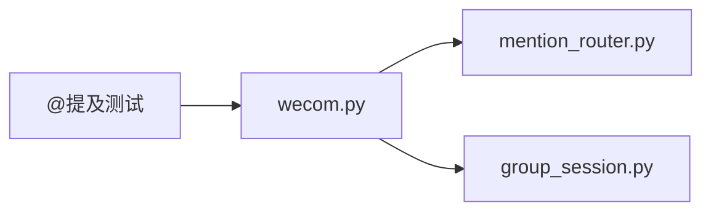

# 会话存储扩展

<cite>
**本文档引用的文件**
- [group_session.py](file://group_session.py)
- [bk/group_session.py](file://bk/group_session.py)
- [wecom.py](file://wecom.py)
- [mention_router.py](file://mention_router.py)
- [README.md](file://README.md)
- [wecom_callback.py](file://wecom_callback.py)
- [test_mention_fix.py](file://test_mention_fix.py)
</cite>

## 目录
1. [简介](#简介)
2. [项目结构](#项目结构)
3. [核心组件](#核心组件)
4. [架构总览](#架构总览)
5. [详细组件分析](#详细组件分析)
6. [依赖分析](#依赖分析)
7. [性能考虑](#性能考虑)
8. [故障排查指南](#故障排查指南)
9. [结论](#结论)
10. [附录](#附录)

## 简介
本指南围绕会话存储扩展展开，重点解析 GroupSessionStore 类的会话管理机制与存储接口设计，说明其在多智能体群聊场景下的作用与实现方式。内容涵盖：
- 会话状态的内存存储与并发控制
- 讨论链的生命周期管理与过期清理
- 自定义存储后端的适配思路
- 分布式一致性与序列化/反序列化的建议
- 性能监控与故障恢复的实践要点
- 测试验证与性能基准测试方法

## 项目结构
该仓库提供了 WeCom 平台适配器与多智能体群聊支持，其中会话存储扩展位于独立模块中，供适配器在多 Agent 群聊模式下使用。

**图表来源**
- [wecom.py:160-207](file://wecom.py#L160-L207)
- [mention_router.py:46-90](file://mention_router.py#L46-L90)
- [group_session.py:96-188](file://group_session.py#L96-L188)
- [wecom_callback.py:55-72](file://wecom_callback.py#L55-L72)
- [test_mention_fix.py:8-24](file://test_mention_fix.py#L8-L24)

**章节来源**
- [README.md:1-43](file://README.md#L1-L43)
- [wecom.py:160-207](file://wecom.py#L160-L207)

## 核心组件
- GroupSessionStore：基于内存的多智能体讨论链存储，提供并发安全的增删改查与过期清理能力。
- GoupDiscussionChain：记录一次群聊讨论链的状态，包括触发智能体、轮次记录、深度与冷却时间等。
- AgentTunRecod：记录某一轮智能体交互的输入输出与提及信息。
- MentionRouter：解析群聊消息中的 @提及，确定目标智能体与交叉链路规则。

关键特性
- 内存存储：以进程内字典保存讨论链，适合临时性、易失性的群聊讨论。
- 并发安全：使用异步锁保护共享状态，避免竞态条件。
- 生命周期管理：支持获取/创建、完成标记、中断标记、清理与活跃状态查询。
- 过期清理：按最大存活时间批量移除陈旧链，释放内存。

**章节来源**
- [group_session.py:21-94](file://group_session.py#L21-L94)
- [group_session.py:96-188](file://group_session.py#L96-L188)
- [mention_router.py:46-90](file://mention_router.py#L46-L90)

## 架构总览
多智能体群聊的会话存储扩展在 WeCom 适配器中被调用，形成如下交互：

**图表来源**
- [wecom.py:909-1050](file://wecom.py#L909-L1050)
- [group_session.py:104-158](file://group_session.py#L104-L158)
- [mention_router.py:102-127](file://mention_router.py#L102-L127)

## 详细组件分析

### GroupSessionStore 组件
职责与接口
- get_or_create_chain：按群聊 ID 获取现有链或创建新链，受活跃状态与中断状态约束。
- get_chain：查询链对象。
- complete_chain/interrupt_chain：标记链完成或被用户中断。
- clear_chain：从存储中移除链。
- is_chain_active：判断链是否处于未完成且未被中断状态。
- cleanup_expired：按最大存活时间批量清理过期链，返回清理数量。

并发与线程安全
- 使用异步锁保护内部字典访问，确保多协程并发安全。

过期清理策略
- 基于链创建时间与阈值比较，批量删除超时链，避免阻塞主流程。

**图表来源**
- [group_session.py:96-188](file://group_session.py#L96-L188)
- [group_session.py:21-94](file://group_session.py#L21-L94)

**章节来源**
- [group_session.py:96-188](file://group_session.py#L96-L188)

### GoupDiscussionChain 组件
功能要点
- 触发控制：防重复触发同一 Agent，限制链长度，冷却时间控制。
- 上下文构建：根据历史轮次生成面向下一个 Agent 的对话上下文。
- 序列化：导出关键字段用于外部持久化（如需）。

**图表来源**
- [group_session.py:50-64](file://group_session.py#L50-L64)

**章节来源**
- [group_session.py:34-94](file://group_session.py#L34-L94)

### MentionRouter 组件
- 支持多 Agent 的 @提及解析，按首次出现顺序返回目标 Agent 列表。
- 提供默认 Agent 回退策略与交叉链参数（最大长度、冷却秒数）。
- 提供响应文本中再次 @提及的提取，支撑跨 Agent 链式触发。

**章节来源**
- [mention_router.py:46-155](file://mention_router.py#L46-L155)

### WeCom 适配器中的会话集成
- 在群聊消息到达时，若启用多 Agent，则通过 MentionRouter 解析目标 Agent，并调用 GroupSessionStore 获取/创建讨论链。
- 逐个 Agent 处理请求，记录轮次，随后检查最新回复中的 @提及进行交叉链处理。
- 完成后标记链完成并清理，释放内存。

**章节来源**
- [wecom.py:909-1050](file://wecom.py#L909-L1050)
- [wecom.py:1051-1181](file://wecom.py#L1051-L1181)

## 依赖分析
- GroupSessionStore 与 GoupDiscussionChain 为纯内存数据结构，无外部依赖。
- WeCom 适配器依赖 MentionRouter 与 GroupSessionStore 实现多 Agent 群聊。
- 测试脚本对 @提及检测逻辑进行验证，确保群聊消息处理路径正确。

**图表来源**
- [wecom.py:922-926](file://wecom.py#L922-L926)
- [group_session.py:176-188](file://group_session.py#L176-L188)
- [mention_router.py:149-155](file://mention_router.py#L149-L155)
- [test_mention_fix.py:8-24](file://test_mention_fix.py#L8-L24)

**章节来源**
- [wecom.py:922-926](file://wecom.py#L922-L926)
- [test_mention_fix.py:8-24](file://test_mention_fix.py#L8-L24)

## 性能考虑
- 内存占用控制
  - 使用过期清理函数按阈值批量删除链，避免无限增长。
  - 可结合业务配置调整最大链长与冷却时间，降低并发压力。
- 并发与锁粒度
  - 异步锁保护整个字典访问，简单可靠；若链数量巨大，可考虑分片或更细粒度的锁策略。
- 清理频率
  - 建议在空闲时段或周期任务中调用清理函数，减少对实时路径的影响。
- 序列化与持久化
  - 当前为内存存储，如需持久化，可在导出/导入时使用轻量序列化方案（如 JSON），并配合增量更新策略。

[本节为通用指导，无需具体文件引用]

## 故障排查指南
常见问题与定位
- 会话未清理导致内存增长
  - 检查是否定期调用清理函数，确认过期阈值设置合理。
- 并发写入冲突
  - 确认所有访问均通过异步锁包裹，避免直接操作内部字典。
- 交叉链未触发
  - 检查响应文本中 @提及是否被正确解析，以及链深度与冷却时间是否限制了触发。
- 单例初始化异常
  - 若需重置测试环境，使用重置函数重建全局实例。

**章节来源**
- [group_session.py:159-170](file://group_session.py#L159-L170)
- [group_session.py:176-188](file://group_session.py#L176-L188)
- [wecom.py:1051-1181](file://wecom.py#L1051-L1181)

## 结论
GroupSessionStore 为多智能体群聊提供轻量、高效的内存会话存储，具备完善的生命周期管理与过期清理能力。通过与 MentionRouter 的协作，实现了灵活的跨 Agent 链式交互。对于需要持久化与分布式部署的场景，可在此基础上扩展自定义存储后端与一致性保障机制。

[本节为总结性内容，无需具体文件引用]

## 附录

### 自定义存储后端适配方法
- 接口设计建议
  - 保持与现有接口一致的方法签名：获取/创建、完成、中断、清理、活跃状态查询、过期清理。
  - 提供序列化/反序列化工具，便于与数据库或缓存系统对接。
- 适配步骤
  - 将 GroupSessionStore 的方法映射到外部存储（Redis、数据库等）。
  - 在应用启动阶段初始化存储实例，并替换全局获取函数返回值。
  - 在清理与过期策略上，优先采用批量操作以降低网络开销。
- 一致性与容错
  - 使用事务或幂等写入，确保状态变更原子性。
  - 对外层调用增加重试与降级策略，避免单点故障影响主流程。

[本节为概念性内容，无需具体文件引用]

### 分布式会话存储与一致性
- 数据模型
  - 以 chat_id 为主键，存储 GoupDiscussionChain 的序列化表示。
  - 为每个链维护版本号或时间戳，支持乐观并发控制。
- 一致性策略
  - 读写分离：读取走缓存，写入走主存储；写入成功后再回填缓存。
  - 分布式锁：在高并发场景下，使用 Redlock 或租约锁控制写入。
- 一致性保证
  - 通过幂等键与事件溯源，实现最终一致性与可审计性。

[本节为概念性内容，无需具体文件引用]

### 会话数据的序列化与反序列化
- 导出
  - 使用链对象的导出方法生成字典，再进行序列化（如 JSON）。
- 导入
  - 从存储读取后反序列化为字典，再重建链对象。
- 注意事项
  - 时间戳与浮点精度需统一处理。
  - 列表/字典等可变类型在导入后应深拷贝，避免外部修改影响缓存。

**章节来源**
- [group_session.py:83-94](file://group_session.py#L83-L94)

### 性能监控与故障恢复
- 监控指标
  - 存储容量、链数量、平均轮次长度、清理频率与回收数量。
  - 并发写入延迟、锁等待时间、序列化耗时。
- 告警与限流
  - 当链数量超过阈值或清理频率过低时触发告警。
  - 对外部存储增加超时与熔断策略。
- 故障恢复
  - 存储不可用时，降级为本地内存存储并记录日志。
  - 恢复后进行增量同步，避免全量重建。

[本节为通用指导，无需具体文件引用]

### 测试验证与性能基准
- 单元测试
  - 验证 @提及解析的正确性与边界情况（空列表、字符串、大小写等）。
  - 验证 GroupSessionStore 的并发安全与过期清理行为。
- 集成测试
  - 模拟多 Agent 交叉链路，验证链长度限制与冷却时间生效。
- 压力测试
  - 生成大量并发链，测量清理与写入延迟，评估锁竞争与内存占用。
- 基准测试
  - 对比不同序列化方案与存储后端的吞吐与延迟，选择最优组合。

**章节来源**
- [test_mention_fix.py:26-77](file://test_mention_fix.py#L26-L77)
- [test_mention_fix.py:80-117](file://test_mention_fix.py#L80-L117)