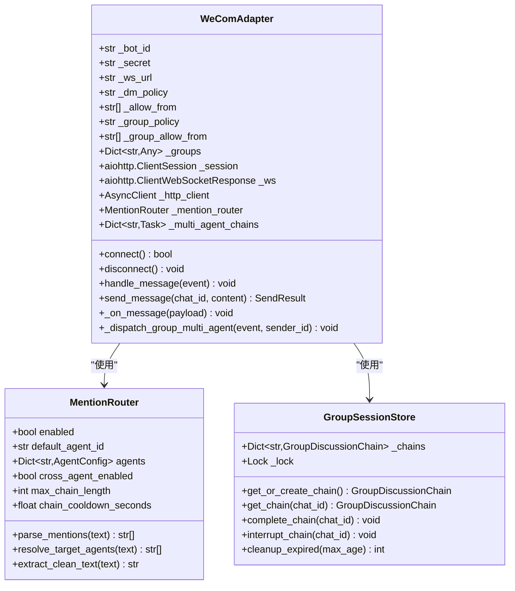
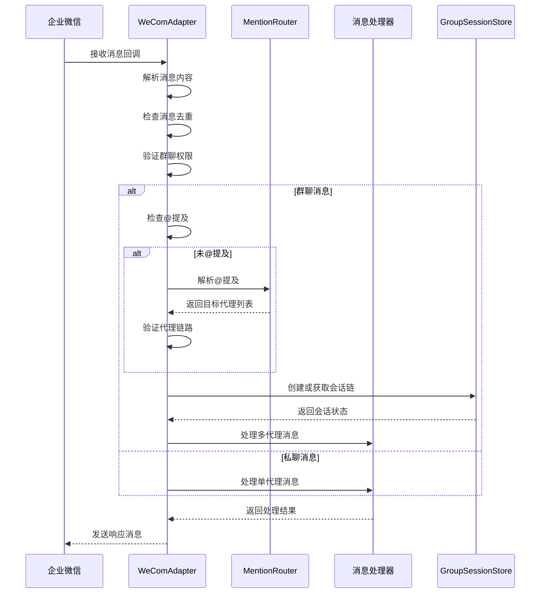
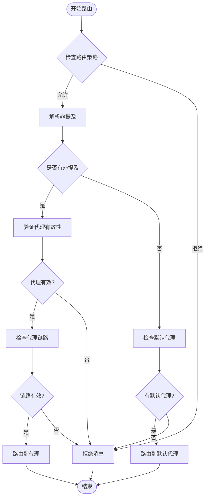
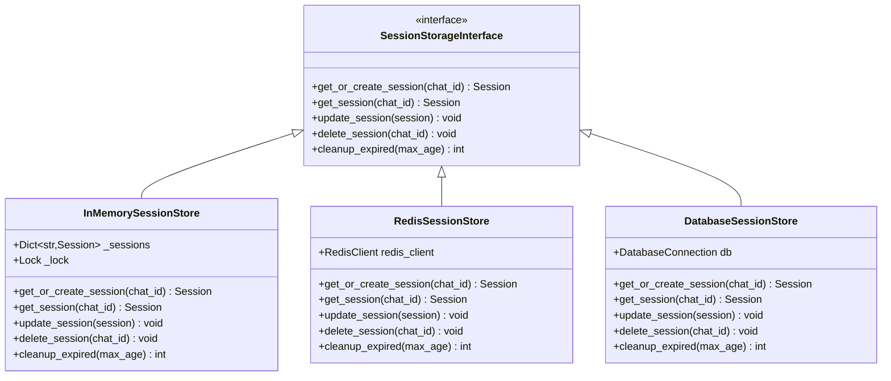
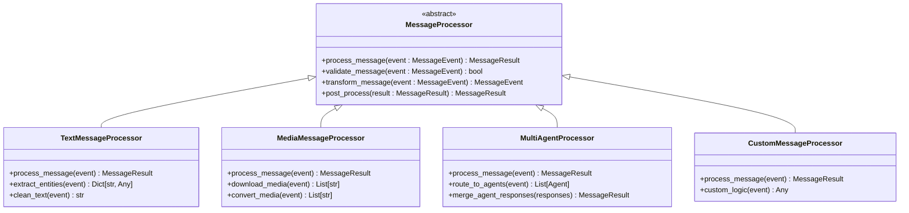
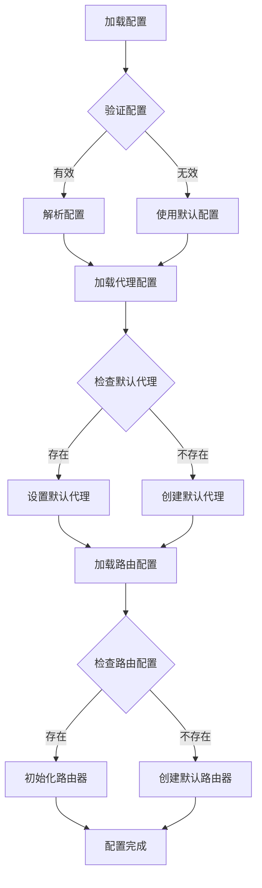
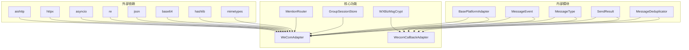

# 扩展开发

<cite>
**本文档引用的文件**
- [README.md](file://README.md)
- [wecom.py](file://wecom.py)
- [wecom_callback.py](file://wecom_callback.py)
- [wecom_crypto.py](file://wecom_crypto.py)
- [mention_router.py](file://mention_router.py)
- [group_session.py](file://group_session.py)
- [test_mention_fix.py](file://test_mention_fix.py)
- [bk/fix_file.py](file://bk/fix_file.py)
- [bk/group_session.py](file://bk/group_session.py)
- [bk/wecom1.py](file://bk/wecom1.py)
</cite>

## 目录
1. [简介](#简介)
2. [项目结构](#项目结构)
3. [核心组件](#核心组件)
4. [架构概览](#架构概览)
5. [详细组件分析](#详细组件分析)
6. [扩展点识别与利用](#扩展点识别与利用)
7. [AI代理扩展开发](#ai代理扩展开发)
8. [代理路由策略扩展](#代理路由策略扩展)
9. [会话存储扩展](#会话存储扩展)
10. [消息处理器扩展](#消息处理器扩展)
11. [自定义代理配置](#自定义代理配置)
12. [依赖分析](#依赖分析)
13. [性能考虑](#性能考虑)
14. [故障排除指南](#故障排除指南)
15. [最佳实践](#最佳实践)
16. [版本管理与向后兼容性](#版本管理与向后兼容性)
17. [测试方法与验证流程](#测试方法与验证流程)
18. [结论](#结论)

## 简介

WeCom 插件是 Hermes Agent 企业微信（WeCom）网关插件，提供了企业微信平台的完整适配能力。该插件支持两种工作模式：WebSocket 模式和 HTTP Callback 模式，并实现了多 Agent 群聊支持、消息加密解密、会话管理和消息处理等功能。

该项目采用模块化设计，每个核心功能都封装在独立的模块中，便于扩展和维护。插件的核心目标是为企业微信提供统一的消息接入和处理接口，支持多种消息类型和复杂的业务场景。

## 项目结构

```mermaid
graph TB
subgraph "核心模块"
A[wecom.py<br/>WebSocket适配器]
B[wecom_callback.py<br/>HTTP回调适配器]
C[wecom_crypto.py<br/>消息加密解密]
D[mention_router.py<br/>@提及解析器]
E[group_session.py<br/>群聊会话管理]
end
subgraph "工具模块"
F[test_mention_fix.py<br/>测试脚本]
G[fix_file.py<br/>文件修复工具]
end
subgraph "备份模块"
H[bk/group_session.py<br/>历史版本]
I[bk/wecom1.py<br/>历史版本]
end
subgraph "配置与文档"
J[README.md<br/>项目说明]
end
A --> D
A --> E
B --> C
A --> J
B --> J
```

**图表来源**
- [wecom.py:1-1774](file://wecom.py#L1-L1774)
- [wecom_callback.py:1-388](file://wecom_callback.py#L1-L388)
- [wecom_crypto.py:1-143](file://wecom_crypto.py#L1-L143)
- [mention_router.py:1-155](file://mention_router.py#L1-L155)
- [group_session.py:1-188](file://group_session.py#L1-L188)

**章节来源**
- [README.md:1-43](file://README.md#L1-L43)
- [wecom.py:1-800](file://wecom.py#L1-L800)

## 核心组件

### WeComAdapter - WebSocket 适配器

WeComAdapter 是企业微信 WebSocket 模式的主适配器，负责与企业微信 AI Bot 网关建立持久连接，处理消息收发和会话管理。

**关键特性：**
- 持久化 WebSocket 连接管理
- 消息去重和批处理
- 多 Agent 群聊支持
- 安全认证和心跳机制
- 媒体文件处理

### WecomCallbackAdapter - HTTP 回调适配器

WecomCallbackAdapter 提供企业微信 HTTP 回调模式的适配，适用于自建应用的场景。

**关键特性：**
- HTTP 服务器监听
- 消息签名验证
- 异步消息队列处理
- 访问令牌管理
- 多应用支持

### MentionRouter - @提及解析器

MentionRouter 负责解析群聊中的 @提及，支持多 Agent 群聊讨论和链式对话。

**关键特性：**
- 多 Agent 配置支持
- 自定义提及模式
- 代理链式调用
- 文本清理和提取

### GroupSessionStore - 群聊会话存储

GroupSessionStore 管理多 Agent 对话状态，在群聊环境中跟踪讨论链路。

**关键特性：**
- 会话状态跟踪
- 链式调用控制
- 冷却时间管理
- 过期清理机制

**章节来源**
- [wecom.py:160-800](file://wecom.py#L160-L800)
- [wecom_callback.py:55-388](file://wecom_callback.py#L55-L388)
- [mention_router.py:46-155](file://mention_router.py#L46-L155)
- [group_session.py:96-188](file://group_session.py#L96-L188)

## 架构概览

```mermaid
graph TB
subgraph "企业微信平台"
A[WeCom AI Bot]
B[WeCom Callback API]
end
subgraph "Hermes Gateway"
C[WeComAdapter<br/>WebSocket模式]
D[WecomCallbackAdapter<br/>HTTP回调模式]
E[MentionRouter<br/>@提及解析]
F[GroupSessionStore<br/>会话管理]
G[MessageDeduplicator<br/>消息去重]
end
subgraph "外部服务"
H[HTTPX AsyncClient]
I[aiohttp ClientSession]
J[企业微信API]
end
A --> C
B --> D
C --> H
C --> I
D --> H
C --> E
C --> F
C --> G
D --> J
```

**图表来源**
- [wecom.py:60-100](file://wecom.py#L60-L100)
- [wecom_callback.py:38-72](file://wecom_callback.py#L38-L72)

## 详细组件分析

### WeComAdapter 类结构



**图表来源**
- [wecom.py:160-207](file://wecom.py#L160-L207)
- [mention_router.py:46-155](file://mention_router.py#L46-L155)
- [group_session.py:96-188](file://group_session.py#L96-L188)

### 消息处理流程



**图表来源**
- [wecom.py:495-586](file://wecom.py#L495-L586)
- [mention_router.py:120-127](file://mention_router.py#L120-L127)
- [group_session.py:104-128](file://group_session.py#L104-L128)

**章节来源**
- [wecom.py:495-586](file://wecom.py#L495-L586)
- [mention_router.py:102-127](file://mention_router.py#L102-L127)
- [group_session.py:104-128](file://group_session.py#L104-L128)

## 扩展点识别与利用

### 主要扩展点

1. **消息处理器扩展点**
   - `BasePlatformAdapter.handle_message()` 方法
   - 支持自定义消息处理逻辑
   - 可扩展为多代理消息处理器

2. **代理路由扩展点**
   - `MentionRouter` 类的可扩展性
   - 支持自定义提及模式
   - 可扩展代理配置系统

3. **会话存储扩展点**
   - `GroupSessionStore` 的接口设计
   - 支持多种存储后端
   - 可扩展会话状态管理

4. **消息类型扩展点**
   - `MessageType` 枚举扩展
   - 支持新消息类型的处理
   - 媒体文件处理扩展

**章节来源**
- [wecom.py:63-70](file://wecom.py#L63-L70)
- [mention_router.py:23-44](file://mention_router.py#L23-L44)
- [group_session.py:21-49](file://group_session.py#L21-L49)

## AI代理扩展开发

### 新代理注册机制

要添加新的 AI 代理，需要以下步骤：

1. **代理配置定义**
   ```python
   # 在 multi_agent 配置中添加新代理
   agents:
     new_agent:
       name: "新代理名称"
       mention_patterns: ["@新代理", "@newagent"]
       model: "gpt-4"
       system_prompt: "新代理的系统提示词"
       enabled_toolsets: ["工具集1", "工具集2"]
   ```

2. **代理类扩展**
   继承现有的代理基类，实现自定义逻辑：
   ```python
   class NewAgent(BaseAgent):
       def __init__(self, config):
           super().__init__(config)
           # 自定义初始化逻辑
       
       async def process_message(self, event: MessageEvent) -> str:
           # 实现自定义消息处理逻辑
           return await self.generate_response(event)
   ```

3. **代理路由配置**
   在 `MentionRouter` 中注册新代理：
   ```python
   def register_agent(self, agent_id: str, agent_config: Dict[str, Any]):
       self.agents[agent_id] = AgentConfig(agent_id, agent_config)
       # 重新编译提及正则表达式
       self._compile_patterns()
   ```

**章节来源**
- [mention_router.py:23-44](file://mention_router.py#L23-L44)
- [mention_router.py:49-101](file://mention_router.py#L49-L101)

## 代理路由策略扩展

### 自定义路由规则实现



**图表来源**
- [mention_router.py:102-127](file://mention_router.py#L102-L127)
- [wecom.py:580-586](file://wecom.py#L580-L586)

### 路由策略扩展点

1. **自定义提及模式**
   ```python
   class CustomMentionPattern:
       def __init__(self, pattern_type: str):
           self.pattern_type = pattern_type
           self.patterns = self._generate_patterns()
       
       def _generate_patterns(self) -> List[str]:
           patterns = []
           if self.pattern_type == "emoji":
               # emoji 提及模式
               patterns.extend([f"😀{agent_id}", f"🤖{agent_id}"])
           elif self.pattern_type == "prefix":
               # 前缀模式
               patterns.extend([f"AI:{agent_id}", f"Agent-{agent_id}"])
           return patterns
   ```

2. **智能路由决策**
   ```python
   class SmartRouter:
       def __init__(self, config: Dict[str, Any]):
           self.config = config
           self.route_history = {}
       
       def calculate_route_score(self, event: MessageEvent, agent_id: str) -> float:
           score = 0.0
           # 基于历史数据的评分
           if agent_id in self.route_history:
               score += self.route_history[agent_id]["success_rate"] * 0.5
           # 基于消息内容的相关性评分
           score += self._calculate_content_similarity(event, agent_id) * 0.3
           # 基于时间的时效性评分
           score += self._calculate_time_factor(event) * 0.2
           return score
   ```

**章节来源**
- [mention_router.py:92-101](file://mention_router.py#L92-L101)
- [wecom.py:580-586](file://wecom.py#L580-L586)

## 会话存储扩展

### 自定义存储后端实现



**图表来源**
- [group_session.py:96-188](file://group_session.py#L96-L188)

### 存储后端扩展实现

1. **Redis 存储后端**
   ```python
   import aioredis
   
   class RedisSessionStore(SessionStorageInterface):
       def __init__(self, redis_url: str):
           self.redis = aioredis.from_url(redis_url)
           self.serializer = JsonSerializer()
       
       async def get_or_create_session(self, chat_id: str) -> Session:
           session_data = await self.redis.get(f"session:{chat_id}")
           if session_data:
               return self.serializer.deserialize(session_data)
           else:
               session = Session(chat_id=chat_id)
               await self.redis.setex(
                   f"session:{chat_id}",
                   SESSION_TTL,
                   self.serializer.serialize(session)
               )
               return session
       
       async def update_session(self, session: Session) -> None:
           await self.redis.setex(
               f"session:{session.chat_id}",
               SESSION_TTL,
               self.serializer.serialize(session)
           )
   ```

2. **数据库存储后端**
   ```python
   import asyncpg
   
   class DatabaseSessionStore(SessionStorageInterface):
       def __init__(self, connection_string: str):
           self.connection_pool = asyncpg.create_pool(connection_string)
       
       async def get_or_create_session(self, chat_id: str) -> Session:
           async with self.connection_pool.acquire() as conn:
               row = await conn.fetchrow(
                   "SELECT data FROM sessions WHERE chat_id = $1",
                   chat_id
               )
               if row:
                   return self._deserialize(row['data'])
               else:
                   session = Session(chat_id=chat_id)
                   await conn.execute(
                       "INSERT INTO sessions (chat_id, data) VALUES ($1, $2)",
                       chat_id,
                       self._serialize(session)
                   )
                   return session
   ```

**章节来源**
- [group_session.py:96-188](file://group_session.py#L96-L188)

## 消息处理器扩展

### 消息处理器架构



**图表来源**
- [wecom.py:63-70](file://wecom.py#L63-L70)

### 自定义消息处理逻辑

1. **消息预处理**
   ```python
   class PreProcessor:
       def __init__(self):
           self.processors = [
               self._remove_mentions,
               self._clean_whitespace,
               self._extract_urls,
               self._detect_language
           ]
       
       def process(self, event: MessageEvent) -> MessageEvent:
           for processor in self.processors:
               event = processor(event)
           return event
       
       def _remove_mentions(self, event: MessageEvent) -> MessageEvent:
           # 移除 @提及标记
           if event.text:
               event.text = re.sub(r'@\w+', '', event.text)
           return event
   ```

2. **消息后处理**
   ```python
   class PostProcessor:
       def __init__(self):
           self.processors = [
               self._add_metadata,
               self._format_response,
               self._validate_output,
               self._cache_result
           ]
       
       def process(self, result: MessageResult) -> MessageResult:
           for processor in self.processors:
               result = processor(result)
           return result
       
       def _add_metadata(self, result: MessageResult) -> MessageResult:
           # 添加处理元数据
           result.metadata = {
               'processed_at': datetime.now(),
               'processing_time': time.time() - result.start_time,
               'input_tokens': self._count_tokens(result.input_text),
               'output_tokens': self._count_tokens(result.output_text)
           }
           return result
   ```

3. **条件消息处理器**
   ```python
   class ConditionalMessageProcessor:
       def __init__(self, conditions: Dict[str, Callable]):
           self.conditions = conditions
           self.processors = {}
       
       def register_processor(self, condition: str, processor: MessageProcessor):
           self.processors[condition] = processor
       
       def select_processor(self, event: MessageEvent) -> MessageProcessor:
           for condition, predicate in self.conditions.items():
               if predicate(event):
                   return self.processors[condition]
           return self.processors['default']
   ```

**章节来源**
- [wecom.py:63-70](file://wecom.py#L63-L70)
- [wecom.py:575-586](file://wecom.py#L575-L586)

## 自定义代理配置

### 代理配置系统



**图表来源**
- [mention_router.py:49-90](file://mention_router.py#L49-L90)

### 高级代理配置选项

1. **模型配置**
   ```python
   class AdvancedAgentConfig:
       def __init__(self, agent_id: str, config: Dict[str, Any]):
           self.agent_id = agent_id
           self.name = config.get('name', agent_id)
           self.model = ModelConfig(
               provider=config.get('provider', 'openai'),
               model_name=config.get('model_name', 'gpt-3.5-turbo'),
               temperature=config.get('temperature', 0.7),
               max_tokens=config.get('max_tokens', 1000),
               api_key=config.get('api_key', ''),
               api_base=config.get('api_base', '')
           )
           self.toolsets = config.get('enabled_toolsets', [])
           self.system_prompt = config.get('system_prompt', '')
           self.response_format = config.get('response_format', 'text')
           self.conversation_style = config.get('conversation_style', 'balanced')
   ```

2. **路由配置**
   ```python
   class AdvancedRouterConfig:
       def __init__(self, router_config: Dict[str, Any]):
           self.enabled = router_config.get('enabled', True)
           self.default_agent = router_config.get('default_agent', 'default')
           self.cross_agent_enabled = router_config.get('cross_agent_enabled', True)
           self.max_chain_length = router_config.get('max_chain_length', 5)
           self.chain_cooldown_seconds = router_config.get('chain_cooldown_seconds', 3)
           self.allow_self_routing = router_config.get('allow_self_routing', False)
           self.preserve_original_order = router_config.get('preserve_original_order', True)
           self.timeout_seconds = router_config.get('timeout_seconds', 30)
   ```

3. **会话配置**
   ```python
   class AdvancedSessionConfig:
       def __init__(self, session_config: Dict[str, Any]):
           self.max_chain_length = session_config.get('max_chain_length', 5)
           self.chain_cooldown_seconds = session_config.get('chain_cooldown_seconds', 3)
           self.max_session_age_seconds = session_config.get('max_session_age_seconds', 300)
           self.cleanup_interval_seconds = session_config.get('cleanup_interval_seconds', 60)
           self.preserve_context = session_config.get('preserve_context', True)
           self.context_window_size = session_config.get('context_window_size', 10)
           self.auto_complete_on_timeout = session_config.get('auto_complete_on_timeout', True)
   ```

**章节来源**
- [mention_router.py:23-44](file://mention_router.py#L23-L44)
- [mention_router.py:49-90](file://mention_router.py#L49-L90)

## 依赖分析



**图表来源**
- [wecom.py:46-70](file://wecom.py#L46-L70)
- [wecom_callback.py:22-41](file://wecom_callback.py#L22-L41)

### 关键依赖关系

1. **异步运行时依赖**
   - `aiohttp`: WebSocket 连接和 HTTP 请求
   - `httpx`: 异步 HTTP 客户端
   - `asyncio`: 异步任务调度

2. **消息处理依赖**
   - `json`: 消息序列化
   - `base64`: 媒体文件编码
   - `hashlib`: 消息签名验证

3. **平台适配依赖**
   - `re`: 正则表达式匹配
   - `mimetypes`: 文件类型检测

**章节来源**
- [wecom.py:46-70](file://wecom.py#L46-L70)
- [wecom_callback.py:22-41](file://wecom_callback.py#L22-L41)

## 性能考虑

### 性能优化策略

1. **连接池管理**
   ```python
   # WebSocket 连接池
   class ConnectionPool:
       def __init__(self, max_connections: int = 10):
           self.max_connections = max_connections
           self.connections = asyncio.LifoQueue(max_connections)
           self.active_connections = 0
           self.lock = asyncio.Lock()
       
       async def acquire(self) -> aiohttp.ClientWebSocketResponse:
           async with self.lock:
               if not self.connections.empty() and self.active_connections < self.max_connections:
                   conn = self.connections.get_nowait()
                   self.active_connections += 1
                   return conn
               elif self.active_connections < self.max_connections:
                   # 创建新连接
                   conn = await self._create_connection()
                   self.active_connections += 1
                   return conn
               else:
                   # 等待可用连接
                   return await self.connections.get()
       
       async def release(self, conn: aiohttp.ClientWebSocketResponse):
           async with self.lock:
               if not conn.closed and self.connections.qsize() < self.max_connections:
                   await self.connections.put(conn)
                   self.active_connections -= 1
               else:
                   conn.close()
   ```

2. **消息批处理优化**
   ```python
   class MessageBatcher:
       def __init__(self, max_batch_size: int = 10, batch_timeout: float = 0.5):
           self.max_batch_size = max_batch_size
           self.batch_timeout = batch_timeout
           self.batches = {}
           self.batch_locks = {}
       
       async def add_to_batch(self, key: str, event: MessageEvent):
           if key not in self.batches:
               self.batches[key] = []
               self.batch_locks[key] = asyncio.Lock()
           
           async with self.batch_locks[key]:
               self.batches[key].append(event)
               
               if len(self.batches[key]) >= self.max_batch_size:
                   return await self._flush_batch(key)
               else:
                   # 延迟刷新
                   asyncio.create_task(self._delayed_flush(key))
                   return None
       
       async def _delayed_flush(self, key: str):
           await asyncio.sleep(self.batch_timeout)
           async with self.batch_locks[key]:
               if key in self.batches and len(self.batches[key]) > 0:
                   await self._flush_batch(key)
       
       async def _flush_batch(self, key: str):
           batch = self.batches.pop(key, [])
           if batch:
               return await self._process_batch(batch)
           return None
   ```

3. **内存管理优化**
   ```python
   class MemoryEfficientSessionStore:
       def __init__(self, max_sessions: int = 1000, cleanup_threshold: float = 0.8):
           self.sessions = OrderedDict()
           self.max_sessions = max_sessions
           self.cleanup_threshold = cleanup_threshold
           self.access_count = {}
       
       def get_or_create_session(self, chat_id: str) -> Session:
           if chat_id in self.sessions:
               # 更新访问计数
               self.access_count[chat_id] = self.access_count.get(chat_id, 0) + 1
               # 移动到末尾（最近使用）
               self.sessions.move_to_end(chat_id)
               return self.sessions[chat_id]
           
           # 清理过期会话
           if len(self.sessions) >= self.max_sessions:
               self._cleanup_expired()
           
           session = Session(chat_id=chat_id)
           self.sessions[chat_id] = session
           self.access_count[chat_id] = 1
           return session
       
       def _cleanup_expired(self):
           # 基于访问频率和时间清理
           cutoff_time = time.time() - SESSION_TTL
           expired_keys = [
               key for key, session in self.sessions.items()
               if session.last_accessed < cutoff_time or self.access_count.get(key, 0) < 1
           ]
           
           for key in expired_keys[:int(self.max_sessions * (1 - self.cleanup_threshold))]:
               del self.sessions[key]
               del self.access_count[key]
   ```

**章节来源**
- [wecom.py:196-201](file://wecom.py#L196-L201)
- [group_session.py:99-102](file://group_session.py#L99-L102)

## 故障排除指南

### 常见问题诊断

1. **连接问题排查**
   ```python
   class ConnectionDiagnostic:
       def __init__(self, adapter: WeComAdapter):
           self.adapter = adapter
           self.diagnostic_log = []
       
       def diagnose_connection(self) -> Dict[str, Any]:
           diagnosis = {
               'bot_id_valid': bool(self.adapter._bot_id),
               'secret_valid': bool(self.adapter._secret),
               'dependencies_available': self._check_dependencies(),
               'websocket_url_reachable': self._check_websocket_url(),
               'authentication_status': self._check_authentication(),
               'connection_state': self._get_connection_state()
           }
           return diagnosis
       
       def _check_dependencies(self) -> bool:
           return AIOHTTP_AVAILABLE and HTTPX_AVAILABLE
       
       def _check_websocket_url(self) -> bool:
           try:
               response = requests.get(self.adapter._ws_url, timeout=5)
               return response.status_code == 200
           except:
               return False
       
       def _check_authentication(self) -> str:
           if not self.adapter._bot_id or not self.adapter._secret:
               return "missing_credentials"
           if not self.adapter._ws:
               return "no_connection"
           return "authenticated"
       
       def _get_connection_state(self) -> Dict[str, Any]:
           return {
               'connected': self.adapter._ws is not None and not self.adapter._ws.closed,
               'pending_requests': len(self.adapter._pending_responses),
               'active_tasks': len(self.adapter._background_tasks)
           }
   ```

2. **消息处理问题排查**
   ```python
   class MessageProcessingDiagnostic:
       def __init__(self, adapter: WeComAdapter):
           self.adapter = adapter
           self.message_log = []
       
       def diagnose_message_processing(self, event: MessageEvent) -> Dict[str, Any]:
           diagnosis = {
               'message_id': event.message_id,
               'message_type': event.message_type,
               'source_validation': self._validate_source(event.source),
               'content_analysis': self._analyze_content(event.text),
               'routing_decision': self._check_routing(event),
               'processing_time': self._measure_processing_time(event),
               'error_details': self._capture_errors(event)
           }
           return diagnosis
       
       def _validate_source(self, source: MessageSource) -> bool:
           return bool(source.chat_id and source.user_id)
       
       def _analyze_content(self, content: str) -> Dict[str, Any]:
           return {
               'length': len(content),
               'has_mentions': '@' in content,
               'has_attachments': bool(self._extract_attachments(content)),
               'language_detection': self._detect_language(content)
           }
       
       def _check_routing(self, event: MessageEvent) -> str:
           if event.source.chat_type == 'group':
               return "group_routing_check"
           else:
               return "direct_routing_check"
       
       def _measure_processing_time(self, event: MessageEvent) -> float:
           return time.time() - event.timestamp.timestamp()
       
       def _capture_errors(self, event: MessageEvent) -> List[str]:
           errors = []
           for i, log_entry in enumerate(self.message_log[-10:]):  # 最近10条日志
               if log_entry.get('message_id') == event.message_id:
                   errors.append(log_entry.get('error', 'unknown_error'))
           return errors
   ```

3. **性能监控**
   ```python
   class PerformanceMonitor:
       def __init__(self):
           self.metrics = {
               'connection_count': 0,
               'message_count': 0,
               'error_count': 0,
               'processing_times': [],
               'memory_usage': []
           }
           self.start_time = time.time()
       
       def record_metric(self, metric_name: str, value: Any):
           if metric_name in self.metrics:
               if isinstance(self.metrics[metric_name], list):
                   self.metrics[metric_name].append(value)
                   if len(self.metrics[metric_name]) > 1000:
                       self.metrics[metric_name].pop(0)
               else:
                   self.metrics[metric_name] = value
       
       def get_performance_report(self) -> Dict[str, Any]:
           uptime = time.time() - self.start_time
           return {
               'uptime_hours': uptime / 3600,
               'messages_per_second': self.metrics['message_count'] / uptime,
               'error_rate': self.metrics['error_count'] / max(self.metrics['message_count'], 1),
               'avg_processing_time': np.mean(self.metrics['processing_times']) if self.metrics['processing_times'] else 0,
               'memory_trend': self._calculate_memory_trend()
           }
       
       def _calculate_memory_trend(self) -> str:
           if len(self.metrics['memory_usage']) < 2:
               return "insufficient_data"
           recent = self.metrics['memory_usage'][-10:]
           slope = (recent[-1] - recent[0]) / len(recent)
           if slope > 0:
               return "increasing"
           elif slope < 0:
               return "decreasing"
           else:
               return "stable"
   ```

**章节来源**
- [wecom.py:212-247](file://wecom.py#L212-L247)
- [wecom.py:495-586](file://wecom.py#L495-L586)

## 最佳实践

### 设计模式应用

1. **工厂模式用于适配器创建**
   ```python
   class WeComAdapterFactory:
       @staticmethod
       def create_adapter(adapter_type: str, config: PlatformConfig) -> BasePlatformAdapter:
           adapters = {
               'websocket': WeComAdapter,
               'callback': WecomCallbackAdapter,
               'hybrid': HybridWeComAdapter
           }
           
           adapter_class = adapters.get(adapter_type, WeComAdapter)
           return adapter_class(config)
       
       @staticmethod
       def create_router(config: Dict[str, Any]) -> MentionRouter:
           return MentionRouter(config.get('multi_agent', {}))
   ```

2. **观察者模式用于事件处理**
   ```python
   class MessageEventHandler:
       def __init__(self):
           self.observers = []
           self.event_queue = asyncio.Queue()
       
       def subscribe(self, observer: Callable):
           self.observers.append(observer)
       
       def notify_observers(self, event: MessageEvent):
           tasks = []
           for observer in self.observers:
               tasks.append(asyncio.create_task(observer(event)))
           return tasks
       
       async def handle_message(self, event: MessageEvent):
           # 异步通知所有观察者
           await asyncio.gather(*self.notify_observers(event))
   ```

3. **策略模式用于消息处理**
   ```python
   class MessageProcessingStrategy:
       def process(self, event: MessageEvent) -> MessageResult:
           raise NotImplementedError
       
       def validate(self, event: MessageEvent) -> bool:
           return True
       
       def transform(self, event: MessageEvent) -> MessageEvent:
           return event

   class TextProcessingStrategy(MessageProcessingStrategy):
       def process(self, event: MessageEvent) -> MessageResult:
           # 文本消息处理逻辑
           return self._generate_text_result(event)
   
   class MediaProcessingStrategy(MessageProcessingStrategy):
       def process(self, event: MessageEvent) -> MessageResult:
           # 媒体消息处理逻辑
           return self._generate_media_result(event)
   ```

### 错误处理最佳实践

1. **分层错误处理**
   ```python
   class HierarchicalErrorHandler:
       def __init__(self):
           self.error_handlers = [
               self._handle_network_errors,
               self._handle_auth_errors,
               self._handle_rate_limit_errors,
               self._handle_business_errors,
               self._handle_unknown_errors
           ]
       
       def handle_error(self, error: Exception, context: Dict[str, Any]) -> Dict[str, Any]:
           for handler in self.error_handlers:
               result = handler(error, context)
               if result:
                   return result
           return self._default_error_handler(error, context)
       
       def _handle_network_errors(self, error: Exception, context: Dict[str, Any]) -> Optional[Dict[str, Any]]:
           if isinstance(error, aiohttp.ClientConnectorError):
               return {
                   'retryable': True,
                   'action': 'reconnect',
                   'delay': 5,
                   'message': '网络连接失败'
               }
           return None
       
       def _handle_auth_errors(self, error: Exception, context: Dict[str, Any]) -> Optional[Dict[str, Any]]:
           if isinstance(error, AuthenticationError):
               return {
                   'retryable': False,
                   'action': 'refresh_token',
                   'delay': 0,
                   'message': '认证失败'
               }
           return None
   ```

2. **超时和重试机制**
   ```python
   class RetryMechanism:
       def __init__(self, max_retries: int = 3, base_delay: float = 1.0):
           self.max_retries = max_retries
           self.base_delay = base_delay
           self.retry_counts = defaultdict(int)
       
       async def execute_with_retry(self, func: Callable, *args, **kwargs) -> Any:
           last_error = None
           
           for attempt in range(self.max_retries + 1):
               try:
                   return await func(*args, **kwargs)
               except Exception as error:
                   last_error = error
                   
                   if not self._should_retry(error, attempt):
                       raise error
                   
                   delay = self._calculate_delay(attempt)
                   await asyncio.sleep(delay)
           
           raise last_error or Exception("Unknown error")
       
       def _should_retry(self, error: Exception, attempt: int) -> bool:
           if attempt >= self.max_retries:
               return False
           
           retryable_errors = (
               aiohttp.ClientConnectorError,
               aiohttp.ServerDisconnectedError,
               asyncio.TimeoutError
           )
           
           return isinstance(error, retryable_errors)
       
       def _calculate_delay(self, attempt: int) -> float:
           exponential_delay = self.base_delay * (2 ** attempt)
           jitter = random.uniform(0, 0.1)
           return exponential_delay * (1 + jitter)
   ```

**章节来源**
- [wecom.py:160-207](file://wecom.py#L160-L207)
- [wecom_callback.py:55-150](file://wecom_callback.py#L55-L150)

## 版本管理与向后兼容性

### 版本兼容性策略

1. **API 兼容性保证**
   ```python
   class VersionCompatibility:
       def __init__(self):
           self.supported_versions = ['1.0', '1.1', '1.2']
           self.deprecated_features = {
               '1.1': ['old_method'],
               '1.2': ['deprecated_property']
           }
           self.breaking_changes = {
               '1.2': ['changed_parameter_order', 'removed_feature']
           }
       
       def check_compatibility(self, version: str) -> CompatibilityReport:
           report = CompatibilityReport(version=version)
           
           if version not in self.supported_versions:
               report.status = 'unsupported'
               report.message = f'版本 {version} 不受支持'
               return report
           
           if version in self.deprecated_features:
               report.status = 'deprecated'
               report.deprecated_features = self.deprecated_features[version]
               report.message = f'版本 {version} 中某些功能已弃用'
           
           if version in self.breaking_changes:
               report.status = 'breaking_changes'
               report.breaking_changes = self.breaking_changes[version]
               report.message = f'版本 {version} 包含破坏性变更'
           
           report.status = 'compatible'
           report.message = f'版本 {version} 完全兼容'
           return report
       
       def migrate_config(self, old_config: Dict[str, Any], target_version: str) -> Dict[str, Any]:
           new_config = copy.deepcopy(old_config)
           
           # 应用迁移规则
           if target_version == '1.2':
               new_config = self._migrate_to_v12(new_config)
           
           return new_config
       
       def _migrate_to_v12(self, config: Dict[str, Any]) -> Dict[str, Any]:
           # 迁移逻辑
           if 'old_setting' in config:
               config['new_setting'] = config.pop('old_setting')
           
           if 'legacy_feature' in config:
               del config['legacy_feature']
           
           return config
   ```

2. **配置向后兼容**
   ```python
   class ConfigBackwardCompatibility:
       def __init__(self):
           self.legacy_mappings = {
               'wecom_bot_id': 'bot_id',
               'wecom_secret': 'secret',
               'websocket_url': 'websocket_url',
               'dm_policy': 'dm_policy',
               'group_policy': 'group_policy'
           }
       
       def normalize_legacy_config(self, legacy_config: Dict[str, Any]) -> Dict[str, Any]:
           normalized_config = {}
           
           for legacy_key, new_key in self.legacy_mappings.items():
               if legacy_key in legacy_config:
                   normalized_config[new_key] = legacy_config[legacy_key]
                   # 删除旧键
                   del legacy_config[legacy_key]
               elif legacy_key in legacy_config:
                   normalized_config[new_key] = legacy_config[legacy_key]
           
           # 合并剩余配置
           normalized_config.update(legacy_config)
           return normalized_config
       
       def validate_config_compatibility(self, config: Dict[str, Any]) -> ValidationResult:
           validation = ValidationResult()
           
           # 检查必需字段
           required_fields = ['bot_id', 'secret']
           for field in required_fields:
               if field not in config:
                   validation.errors.append(f'缺少必需字段: {field}')
           
           # 检查配置值范围
           if 'max_chain_length' in config:
               if not 1 <= config['max_chain_length'] <= 10:
                   validation.warnings.append('max_chain_length 建议在 1-10 范围内')
           
           return validation
   ```

3. **接口演进策略**
   ```python
   class InterfaceEvolution:
       def __init__(self):
           self.interface_versions = {
               'v1': ['connect', 'disconnect', 'send_message', 'handle_message'],
               'v2': ['connect', 'disconnect', 'send_message', 'handle_message', 'get_status'],
               'v3': ['connect', 'disconnect', 'send_message', 'handle_message', 'get_status', 'export_metrics']
           }
       
       def get_interface_methods(self, version: str) -> List[str]:
           if version in self.interface_versions:
               return self.interface_versions[version]
           else:
               raise ValueError(f'未知接口版本: {version}')
       
       def compare_interfaces(self, version1: str, version2: str) -> InterfaceComparison:
           methods1 = set(self.get_interface_methods(version1))
           methods2 = set(self.get_interface_methods(version2))
           
           return InterfaceComparison(
               added_methods=list(methods2 - methods1),
               removed_methods=list(methods1 - methods2),
               common_methods=list(methods1 & methods2)
           )
       
       def deprecate_method(self, method_name: str, replacement: str, removal_version: str):
           deprecation_warning = f"""
           方法 {method_name} 已弃用，请使用 {replacement}
           将在版本 {removal_version} 中移除
           """
           warnings.warn(deprecation_warning, DeprecationWarning)
   ```

**章节来源**
- [wecom.py:132-140](file://wecom.py#L132-L140)
- [mention_router.py:49-90](file://mention_router.py#L49-L90)

## 测试方法与验证流程

### 单元测试框架

```mermaid
flowchart TD
TestPlan[测试计划] --> UnitTests[单元测试]
TestPlan --> IntegrationTests[集成测试]
TestPlan --> PerformanceTests[性能测试]
TestPlan --> SecurityTests[安全测试]
UnitTests --> MessageProcessorTests[消息处理器测试]
UnitTests --> RouterTests[@提及解析测试]
UnitTests --> SessionTests[会话存储测试]
UnitTests --> CryptoTests[加密解密测试]
IntegrationTests --> AdapterIntegrationTests[适配器集成测试]
IntegrationTests --> MultiAgentTests[多代理测试]
IntegrationTests --> EndToEndTests[端到端测试]
PerformanceTests --> LoadTests[负载测试]
PerformanceTests --> StressTests[压力测试]
PerformanceTests --> MemoryTests[内存测试]
SecurityTests --> AuthTests[认证测试]
SecurityTests --> EncryptionTests[加密测试]
SecurityTests --> RateLimitTests[限流测试]
```

**图表来源**
- [test_mention_fix.py:26-77](file://test_mention_fix.py#L26-L77)

### 测试用例设计

1. **@提及功能测试**
   ```python
   import unittest
   from unittest.mock import Mock, patch
   
   class TestMentionRouter(unittest.TestCase):
       def setUp(self):
           self.router_config = {
               'enabled': True,
               'default_agent': 'default',
               'agents': {
                   'alpha': {'name': 'Alpha助手', 'mention_patterns': ['@Alpha', '@Alpha助手']},
                   'beta': {'name': 'Beta助手', 'mention_patterns': ['@Beta', '@Beta助手']}
               },
               'cross_agent': {
                   'enabled': True,
                   'max_chain_length': 5,
                   'chain_cooldown_seconds': 3
               }
           }
           self.router = MentionRouter(self.router_config)
       
       def test_parse_mentions_single_agent(self):
           """测试单个代理的@提及解析"""
           text = "大家好 @Alpha 我有问题"
           result = self.router.parse_mentions(text)
           self.assertEqual(result, ['alpha'])
       
       def test_parse_mentions_multiple_agents(self):
           """测试多个代理的@提及解析"""
           text = "@Beta 请 @Alpha 协助一下"
           result = self.router.parse_mentions(text)
           self.assertEqual(result, ['beta', 'alpha'])
       
       def test_extract_clean_text(self):
           """测试文本清理功能"""
           text = "@Alpha 你好 @Beta 世界"
           result = self.router.extract_clean_text(text)
           self.assertEqual(result, "你好 世界")
       
       def test_resolve_target_agents_no_mention(self):
           """测试无@提及时的默认代理解析"""
           text = "这是一个普通消息"
           result = self.router.resolve_target_agents(text)
           self.assertEqual(result, [])
   ```

2. **消息处理器测试**
   ```python
   class TestMessageProcessor(unittest.TestCase):
       def setUp(self):
           self.processor = MessageProcessor()
           self.test_event = MessageEvent(
               text="测试消息",
               message_type=MessageType.TEXT,
               source=MessageSource(
                   chat_id="test_chat",
                   chat_type="group",
                   user_id="test_user"
               ),
               message_id="test_msg_123"
           )
       
       def test_validate_message_success(self):
           """测试消息验证成功"""
           result = self.processor.validate_message(self.test_event)
           self.assertTrue(result)
       
       def test_validate_message_failure_missing_fields(self):
           """测试消息验证失败 - 缺少字段"""
           invalid_event = MessageEvent(
               text=None,
               message_type=MessageType.TEXT,
               source=self.test_event.source,
               message_id="test_msg_123"
           )
           result = self.processor.validate_message(invalid_event)
           self.assertFalse(result)
       
       def test_transform_message(self):
           """测试消息转换"""
           transformed = self.processor.transform_message(self.test_event)
           self.assertIsInstance(transformed, MessageEvent)
           self.assertEqual(transformed.message_id, "test_msg_123")
   ```

3. **会话存储测试**
   ```python
   class TestGroupSessionStore(unittest.TestCase):
       def setUp(self):
           self.store = GroupSessionStore()
           self.chat_id = "test_group_123"
           self.user_message = "测试消息"
           self.sender_id = "test_user_456"
       
       def test_get_or_create_chain_new_chain(self):
           """测试创建新会话链"""
           chain = asyncio.run(
               self.store.get_or_create_chain(
                    self.chat_id,
                    self.user_message,
                    self.sender_id
                )
            )
           self.assertIsNotNone(chain)
           self.assertEqual(chain.chat_id, self.chat_id)
           self.assertEqual(chain.original_message, self.user_message)
           self.assertEqual(chain.original_sender_id, self.sender_id)
       
       def test_get_or_create_chain_existing_chain(self):
           """测试获取现有会话链"""
           # 先创建链
           first_chain = asyncio.run(
               self.store.get_or_create_chain(
                    self.chat_id,
                    self.user_message,
                    self.sender_id
                )
            )
           
           # 再次获取
           second_chain = asyncio.run(
               self.store.get_or_create_chain(
                    self.chat_id,
                    self.user_message,
                    self.sender_id
                )
            )
           
           self.assertIs(first_chain, second_chain)
       
       def test_add_turn_and_get_context(self):
           """测试添加对话回合和获取上下文"""
           chain = asyncio.run(
               self.store.get_or_create_chain(
                    self.chat_id,
                    self.user_message,
                    self.sender_id
                )
            )
           
           # 添加回合
           turn_record = AgentTurnRecord(
               agent_id="test_agent",
               agent_name="Test Agent",
               request_text="请求文本",
               response_text="响应文本",
               mentions_in_response=[],
               stated_at=time.time(),
               completed_at=time.time() + 1
           )
           
           chain.add_turn(turn_record)
           context = chain.get_conversation_context()
           
           self.assertIn("测试消息", context)
           self.assertIn("响应文本", context)
   ```

4. **性能测试**
   ```python
   class TestPerformance(unittest.TestCase):
       def setUp(self):
           self.test_duration = 10  # 10秒测试
           self.test_messages_per_second = 100
           self.total_messages = self.test_duration * self.test_messages_per_second
       
       def test_high_volume_message_processing(self):
           """测试高并发消息处理"""
           start_time = time.time()
           
           # 创建大量测试消息
           test_events = []
           for i in range(self.total_messages):
               event = MessageEvent(
                   text=f"测试消息 {i}",
                   message_type=MessageType.TEXT,
                   source=MessageSource(
                       chat_id=f"group_{i % 10}",
                       chat_type="group",
                       user_id=f"user_{i}"
                   ),
                   message_id=f"msg_{i}"
               )
               test_events.append(event)
           
           # 处理消息
           results = []
           for event in test_events:
               result = self.processor.process_message(event)
               results.append(result)
           
           end_time = time.time()
           processing_time = end_time - start_time
           
           messages_per_second = self.total_messages / processing_time
           
           self.assertLessEqual(messages_per_second, self.test_messages_per_second * 2)
           self.assertGreaterEqual(messages_per_second, self.test_messages_per_second / 2)
   ```

5. **集成测试**
   ```python
   class TestEndToEnd(unittest.TestCase):
       def setUp(self):
           self.config = {
               'platforms': {
                   'wecom': {
                       'enabled': True,
                       'extra': {
                           'bot_id': 'test_bot_id',
                           'secret': 'test_secret',
                           'websocket_url': 'wss://test.example.com'
                       }
                   }
               }
           }
           self.adapter = WeComAdapter(PlatformConfig(**self.config))
       
       def test_adapter_initialization(self):
           """测试适配器初始化"""
           self.assertIsNotNone(self.adapter._bot_id)
           self.assertIsNotNone(self.adapter._secret)
           self.assertIsNotNone(self.adapter._ws_url)
           self.assertIsNotNone(self.adapter._http_client)
           self.assertIsNotNone(self.adapter._session)
       
       def test_message_routing_integration(self):
           """测试消息路由集成"""
           # 模拟@提及消息
           test_message = {
               'content': '@Alpha 请帮我处理这个任务',
               'mentioned_userid_list': ['alpha_bot'],
               'chattype': 'group'
           }
           
           # 解析@提及
           target_agents = self.adapter._mention_router.resolve_target_agents(test_message['content'])
           
           self.assertEqual(target_agents, ['alpha'])
       
       def test_session_management_integration(self):
           """测试会话管理集成"""
           # 测试多代理链路
           chain = asyncio.run(
               self.adapter._group_session_store.get_or_create_chain(
                   "test_group",
                   "测试消息",
                   "test_user"
               )
            )
           
           self.assertTrue(chain.can_trigger_next("agent_1"))
           self.assertFalse(chain.can_trigger_next("agent_1"))  # 第二次调用应该被限制
   ```

**章节来源**
- [test_mention_fix.py:26-133](file://test_mention_fix.py#L26-L133)
- [wecom.py:160-207](file://wecom.py#L160-L207)

## 结论

WeCom 插件提供了一个完整的企业微信平台适配解决方案，具有良好的扩展性和可维护性。通过模块化的架构设计，开发者可以轻松地扩展 AI 代理、自定义代理配置、代理路由策略、会话存储和消息处理器。

### 主要优势

1. **模块化设计**: 每个核心功能都封装在独立模块中，便于理解和扩展
2. **异步架构**: 基于 asyncio 的异步处理，支持高并发场景
3. **多模式支持**: 同时支持 WebSocket 和 HTTP Callback 两种工作模式
4. **多 Agent 支持**: 完整的多代理群聊支持和链式调用机制
5. **安全性**: 完整的消息加密解密和签名验证机制
6. **可扩展性**: 清晰的扩展点和接口设计

### 扩展建议

1. **代理扩展**: 通过继承 `BasePlatformAdapter` 和 `MentionRouter` 来添加新的 AI 代理
2. **存储扩展**: 实现 `SessionStorageInterface` 接口来支持不同的存储后端
3. **路由扩展**: 通过自定义 `MentionRouter` 来实现更复杂的路由策略
4. **消息处理**: 通过实现自定义消息处理器来扩展消息处理逻辑

### 未来发展方向

1. **云原生支持**: 增强对 Kubernetes 和容器化部署的支持
2. **监控和可观测性**: 添加更完善的监控指标和日志记录
3. **配置热更新**: 支持运行时配置更新而无需重启
4. **多租户支持**: 增强多租户场景下的隔离和资源管理
5. **AI 模型抽象**: 更好的 AI 模型抽象层，支持更多模型提供商

通过遵循本文档提供的最佳实践和设计模式，开发者可以安全地扩展 WeCom 插件的功能，满足各种复杂的企业微信集成需求。