# 消息处理器扩展

<cite>
**本文档引用的文件**
- [README.md](file://README.md)
- [wecom.py](file://wecom.py)
- [wecom_callback.py](file://wecom_callback.py)
- [wecom_crypto.py](file://wecom_crypto.py)
- [mention_router.py](file://mention_router.py)
- [group_session.py](file://group_session.py)
- [test_mention_fix.py](file://test_mention_fix.py)
- [wecom_fixed.py](file://bk/wecom_fixed.py)
- [mention_router.py](file://bk/mention_router.py)
- [group_session.py](file://bk/group_session.py)
- [test_mention_fix.py](file://bk/test_mention_fix.py)
</cite>

## 目录
1. [简介](#简介)
2. [项目结构](#项目结构)
3. [核心组件](#核心组件)
4. [架构概览](#架构概览)
5. [详细组件分析](#详细组件分析)
6. [依赖关系分析](#依赖关系分析)
7. [性能考虑](#性能考虑)
8. [故障排除指南](#故障排除指南)
9. [结论](#结论)
10. [附录](#附录)

## 简介

这是一个基于企业微信（WeCom）平台的消息处理器扩展系统，提供了完整的消息处理管道扩展机制。该系统支持多种消息类型处理，包括文本、多媒体、文件传输和富文本消息，并实现了消息预处理、后处理和中间件模式。

系统的核心特性包括：
- WebSocket 和 HTTP Callback 两种接入模式
- 多代理群聊支持和 @mention 解析
- 消息去重和批处理机制
- 异步消息队列和并发控制
- 完整的错误处理和重试机制
- 多媒体内容缓存和处理

## 项目结构

```mermaid
graph TB
subgraph "企业微信插件项目"
A[wecom.py<br/>WebSocket适配器]
B[wecom_callback.py<br/>HTTP回调适配器]
C[wecom_crypto.py<br/>消息加密模块]
D[mention_router.py<br/>@mention解析器]
E[group_session.py<br/>群聊会话管理]
F[test_mention_fix.py<br/>测试脚本]
subgraph "备份文件"
A1[bk/wecom_fixed.py]
D1[bk/mention_router.py]
E1[bk/group_session.py]
F1[bk/test_mention_fix.py]
end
subgraph "配置文件"
G[README.md<br/>项目说明]
end
end
A --> D
A --> E
B --> C
A -.-> A1
D -.-> D1
E -.-> E1
F -.-> F1
```

**图表来源**
- [wecom.py:1-1774](file://wecom.py#L1-L1774)
- [wecom_callback.py:1-388](file://wecom_callback.py#L1-L388)
- [wecom_crypto.py:1-143](file://wecom_crypto.py#L1-L143)

**章节来源**
- [README.md:1-43](file://README.md#L1-L43)

## 核心组件

### WeComAdapter - 主要消息处理器

WeComAdapter 是整个系统的核心组件，负责处理企业微信的 WebSocket 连接和消息处理。

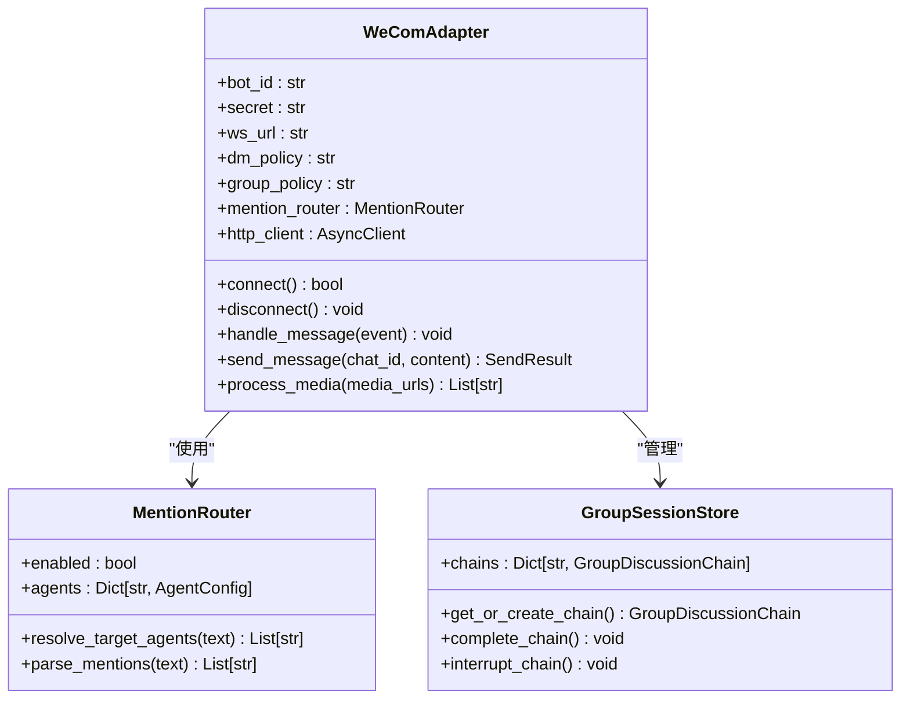

**图表来源**
- [wecom.py:160-800](file://wecom.py#L160-L800)
- [mention_router.py:46-155](file://mention_router.py#L46-L155)
- [group_session.py:96-188](file://group_session.py#L96-L188)

### WecomCallbackAdapter - HTTP回调适配器

WecomCallbackAdapter 提供了 HTTP Callback 模式的适配器，支持多应用配置和异步消息处理。

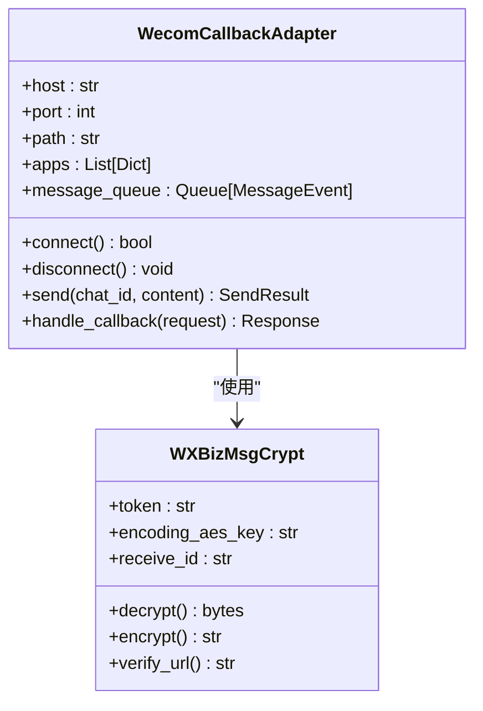

**图表来源**
- [wecom_callback.py:55-388](file://wecom_callback.py#L55-L388)
- [wecom_crypto.py:66-143](file://wecom_crypto.py#L66-L143)

**章节来源**
- [wecom.py:160-800](file://wecom.py#L160-L800)
- [wecom_callback.py:55-388](file://wecom_callback.py#L55-L388)

## 架构概览

系统采用分层架构设计，支持多种消息处理模式：

```mermaid
graph TB
subgraph "外部接口层"
A[企业微信客户端]
B[HTTP回调端点]
end
subgraph "适配器层"
C[WeComAdapter<br/>WebSocket模式]
D[WecomCallbackAdapter<br/>HTTP回调模式]
end
subgraph "消息处理层"
E[消息预处理<br/>去重、批处理]
F[消息路由<br/>@mention解析]
G[消息转换<br/>多媒体处理]
H[消息后处理<br/>会话管理]
end
subgraph "存储层"
I[消息去重器]
J[群聊会话存储]
K[缓存存储]
end
subgraph "中间件层"
L[认证中间件]
M[日志中间件]
N[错误处理中间件]
end
A --> C
B --> D
C --> E
D --> E
E --> F
F --> G
G --> H
H --> I
H --> J
H --> K
E --> L
F --> M
G --> N
```

**图表来源**
- [wecom.py:398-586](file://wecom.py#L398-L586)
- [wecom_callback.py:278-288](file://wecom_callback.py#L278-L288)

## 详细组件分析

### 消息预处理机制

系统实现了多层次的消息预处理机制：

#### 消息去重处理
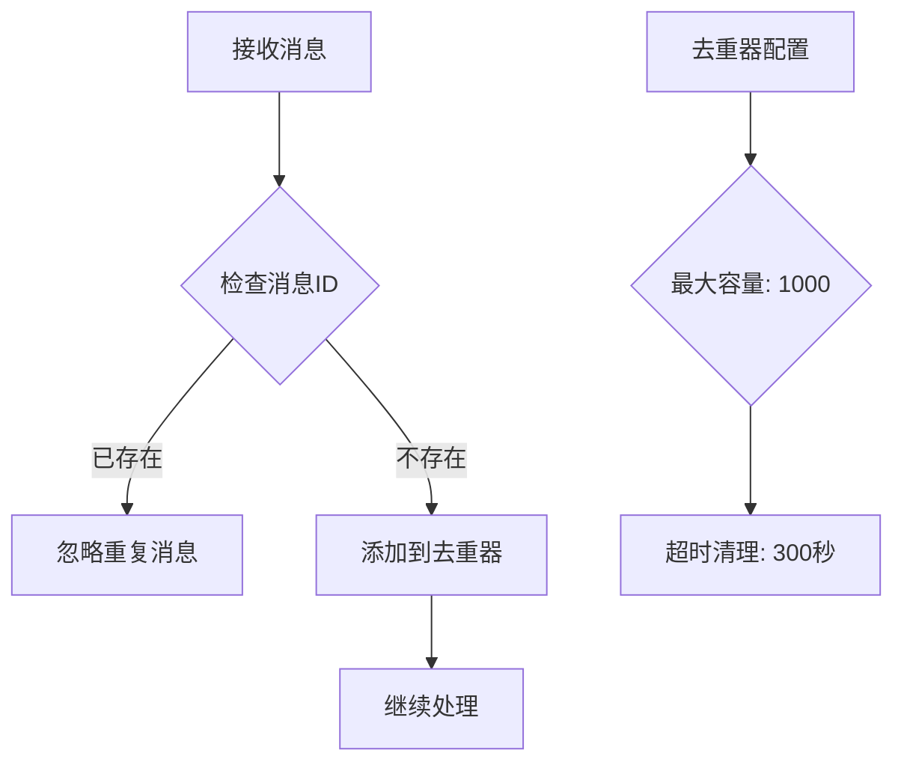

**图表来源**
- [wecom.py:515-519](file://wecom.py#L515-L519)
- [wecom.py:96-97](file://wecom.py#L96-L97)

#### 文本批处理机制
系统支持将企业微信客户端分割的长消息进行合并处理：

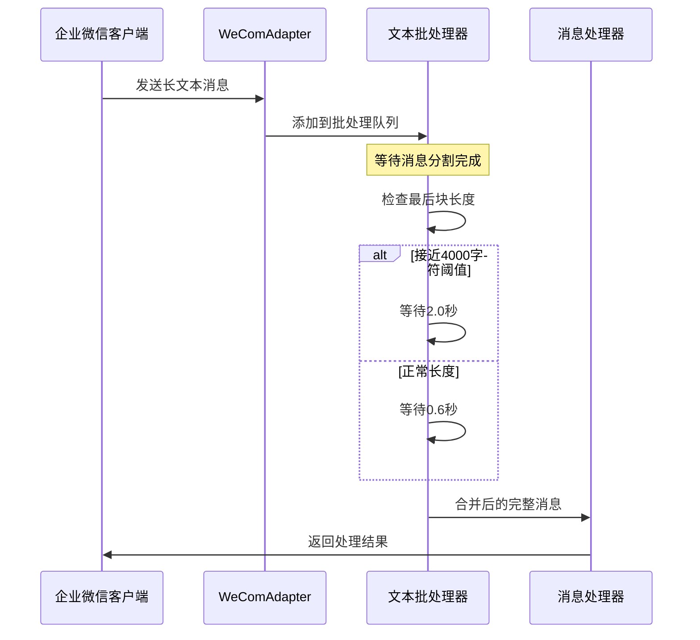

**图表来源**
- [wecom.py:600-656](file://wecom.py#L600-L656)
- [wecom.py:163-166](file://wecom.py#L163-L166)

**章节来源**
- [wecom.py:509-586](file://wecom.py#L509-L586)

### @mention 解析器

MentionRouter 提供了强大的 @mention 解析功能：

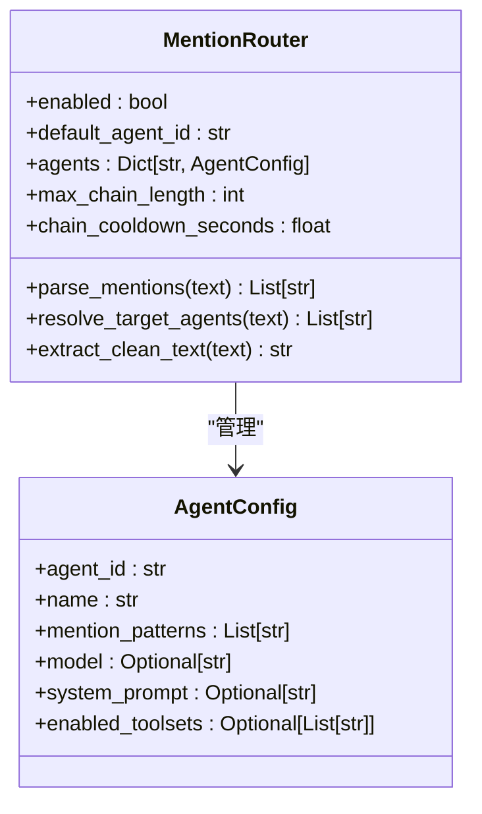

**图表来源**
- [mention_router.py:46-155](file://mention_router.py#L46-L155)
- [mention_router.py:23-44](file://mention_router.py#L23-L44)

#### 多代理群聊支持
系统支持在群聊中同时触发多个代理：

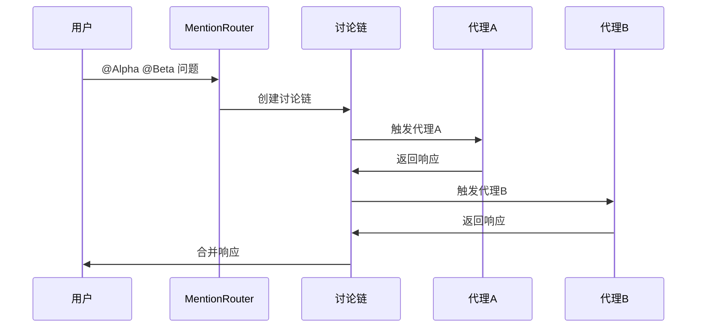

**图表来源**
- [group_session.py:104-127](file://group_session.py#L104-L127)
- [mention_router.py:120-126](file://mention_router.py#L120-L126)

**章节来源**
- [mention_router.py:46-155](file://mention_router.py#L46-L155)
- [group_session.py:96-188](file://group_session.py#L96-L188)

### 多媒体消息处理

系统支持多种多媒体消息类型的处理：

#### 媒体提取和缓存
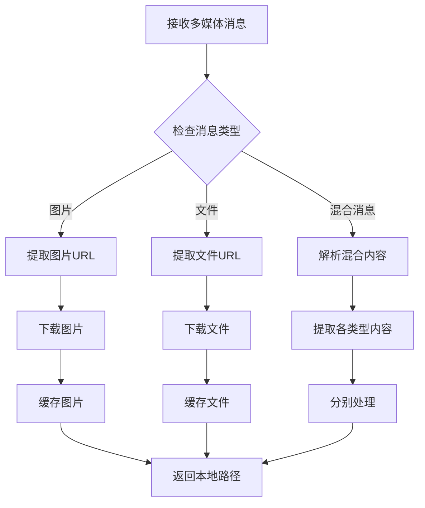

**图表来源**
- [wecom.py:705-799](file://wecom.py#L705-L799)
- [wecom.py:750-799](file://wecom.py#L750-L799)

#### 支持的媒体类型
- **图片**: 支持 base64 和 URL 两种方式
- **文件**: 支持各种文档格式
- **语音**: 支持 AMR 格式
- **富文本**: 支持企业微信 AI Bot 附件

**章节来源**
- [wecom.py:705-799](file://wecom.py#L705-L799)

### HTTP Callback 模式

WecomCallbackAdapter 提供了 HTTP Callback 模式的完整实现：

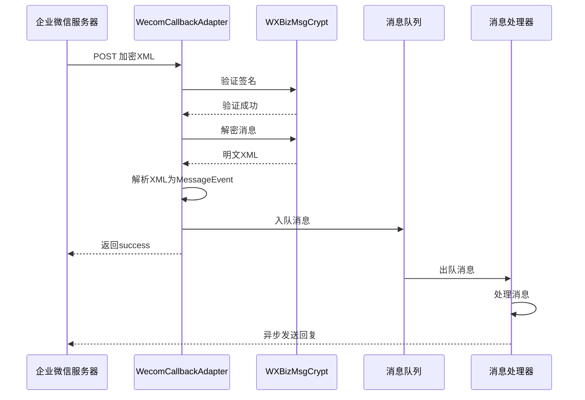

**图表来源**
- [wecom_callback.py:247-276](file://wecom_callback.py#L247-L276)
- [wecom_callback.py:278-288](file://wecom_callback.py#L278-L288)

**章节来源**
- [wecom_callback.py:55-388](file://wecom_callback.py#L55-L388)

## 依赖关系分析

系统采用了清晰的依赖层次结构：

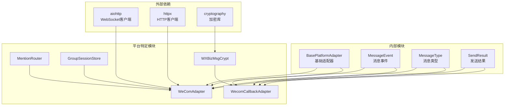

**图表来源**
- [wecom.py:60-70](file://wecom.py#L60-L70)
- [wecom_callback.py:38-42](file://wecom_callback.py#L38-L42)

**章节来源**
- [wecom.py:60-70](file://wecom.py#L60-L70)
- [wecom_callback.py:38-42](file://wecom_callback.py#L38-L42)

## 性能考虑

### 并发控制策略

系统实现了多层次的并发控制机制：

#### 连接池管理
- WebSocket 连接池大小：动态管理
- HTTP 请求超时：15秒
- 心跳检测：30秒间隔
- 断线重连：指数退避算法

#### 消息处理并发
- 消息队列：异步处理
- 会话锁：避免竞态条件
- 批处理：减少系统开销

### 内存管理

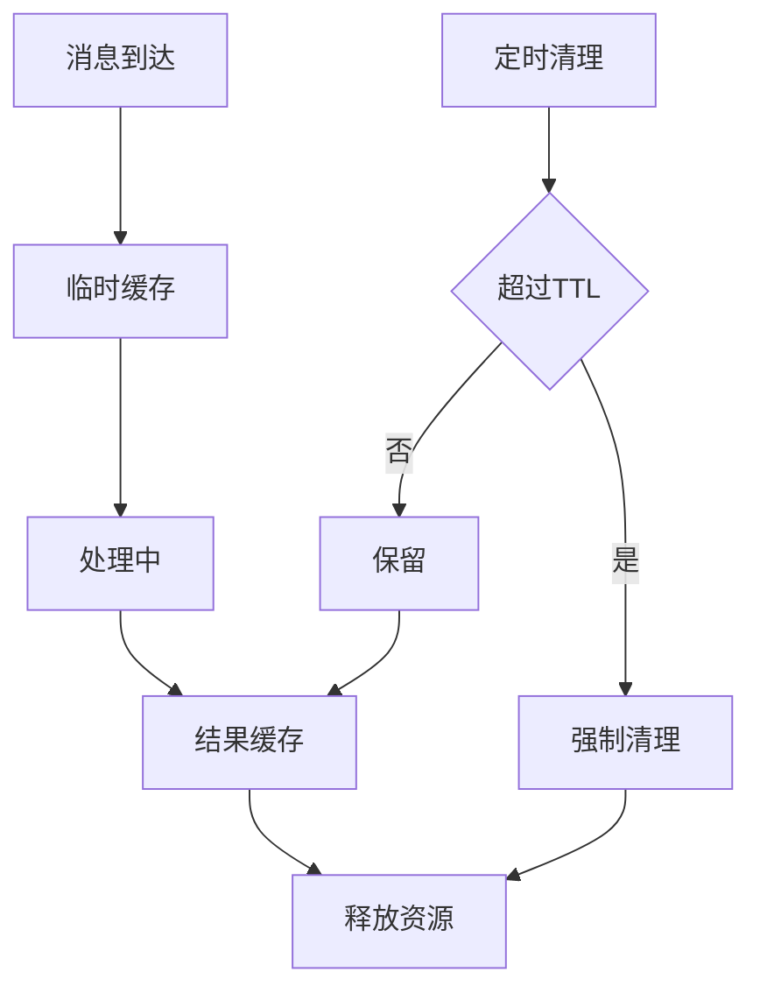

**图表来源**
- [wecom.py:277-277](file://wecom.py#L277-L277)
- [wecom_callback.py:47-48](file://wecom_callback.py#L47-L48)

### 错误处理和重试机制

系统实现了完善的错误处理策略：

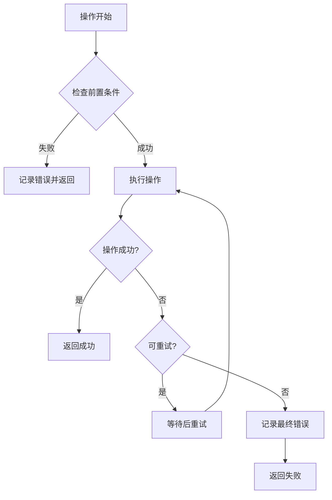

**图表来源**
- [wecom.py:212-246](file://wecom.py#L212-L246)
- [wecom.py:352-376](file://wecom.py#L352-L376)

## 故障排除指南

### 常见问题诊断

#### 连接问题
1. **依赖缺失**: 检查 aiohttp 和 httpx 是否安装
2. **认证失败**: 验证 bot_id 和 secret 配置
3. **网络问题**: 检查 WebSocket URL 可访问性

#### 消息处理问题
1. **@mention 未生效**: 检查 mention_router 配置
2. **多媒体消息丢失**: 验证文件大小限制
3. **消息重复**: 检查去重器配置

#### HTTP Callback 问题
1. **签名验证失败**: 检查 token 和 encoding_aes_key
2. **消息解密失败**: 验证 receive_id 配置
3. **队列积压**: 监控消息处理速度

**章节来源**
- [wecom.py:212-246](file://wecom.py#L212-L246)
- [wecom_callback.py:232-245](file://wecom_callback.py#L232-L245)

### 单元测试框架

系统提供了完整的测试覆盖：

#### @mention 功能测试
```python
def test_is_bot_mentioned():
    """测试机器人是否被 @"""
    # 测试各种 @mention 场景
    pass

def test_group_message_flow():
    """测试群聊消息处理流程"""
    # 验证被 @ 和未被 @ 的消息处理
    pass
```

#### 组合测试
```python
def test_multi_agent_chain():
    """测试多代理链式调用"""
    # 验证代理间的自动触发
    pass

def test_media_processing():
    """测试多媒体消息处理"""
    # 验证图片和文件的处理
    pass
```

**章节来源**
- [test_mention_fix.py:26-116](file://test_mention_fix.py#L26-L116)

## 结论

这个企业微信消息处理器扩展系统提供了完整的企业级消息处理解决方案。其核心优势包括：

1. **灵活的架构设计**: 支持多种接入模式和扩展机制
2. **强大的消息处理能力**: 支持多媒体、富文本等多种消息类型
3. **完善的错误处理**: 提供重试机制和故障恢复
4. **高性能设计**: 实现了并发控制和内存优化
5. **易于扩展**: 提供了清晰的扩展点和中间件机制

系统特别适合需要处理复杂企业微信场景的应用，如多代理群聊、多媒体消息处理和异步消息队列等需求。

## 附录

### 配置选项

#### WeComAdapter 配置
- `bot_id`: 企业微信机器人ID
- `secret`: 机器人密钥
- `websocket_url`: WebSocket 服务器地址
- `dm_policy`: 私聊策略 (open/allowlist/disabled)
- `group_policy`: 群聊策略 (open/allowlist/disabled)
- `multi_agent`: 多代理配置

#### WecomCallbackAdapter 配置
- `host`: HTTP 服务主机
- `port`: HTTP 服务端口
- `path`: 回调路径
- `apps`: 应用配置列表
- `token`: 企业微信 token
- `encoding_aes_key`: AES 密钥
- `receive_id`: 接收方 ID

### 开发最佳实践

1. **消息预处理**: 在消息进入处理管道前进行必要的预处理
2. **错误隔离**: 将不同类型的错误进行分类处理
3. **资源管理**: 及时释放连接和缓存资源
4. **监控告警**: 实现关键指标的监控和告警
5. **日志记录**: 详细的日志记录便于问题排查