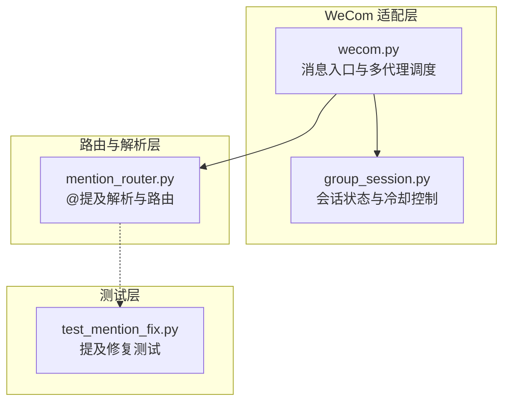
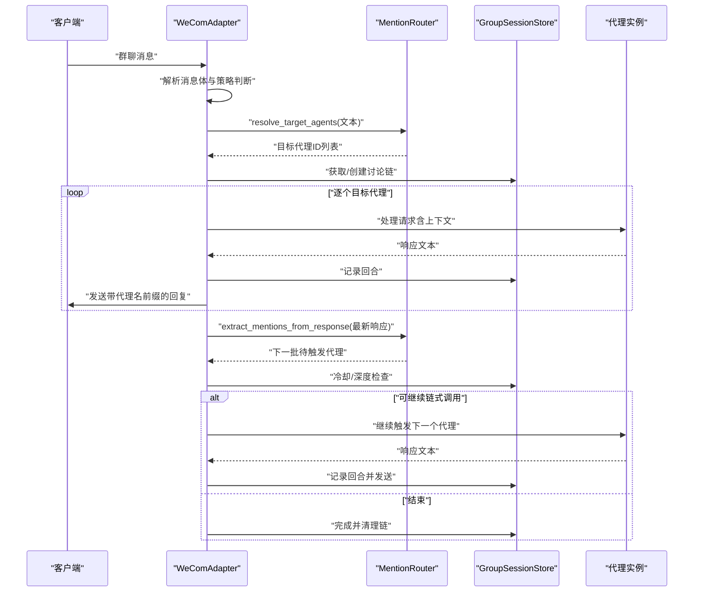
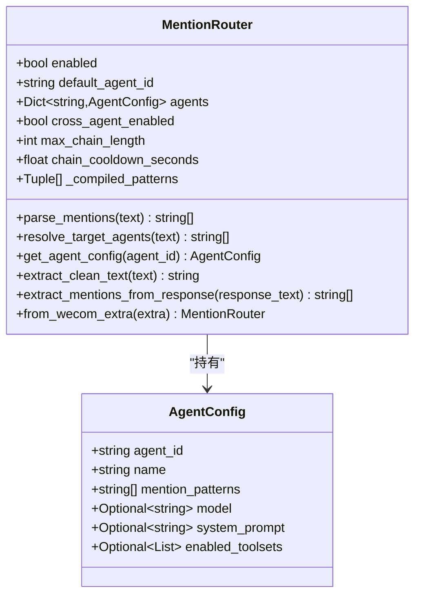
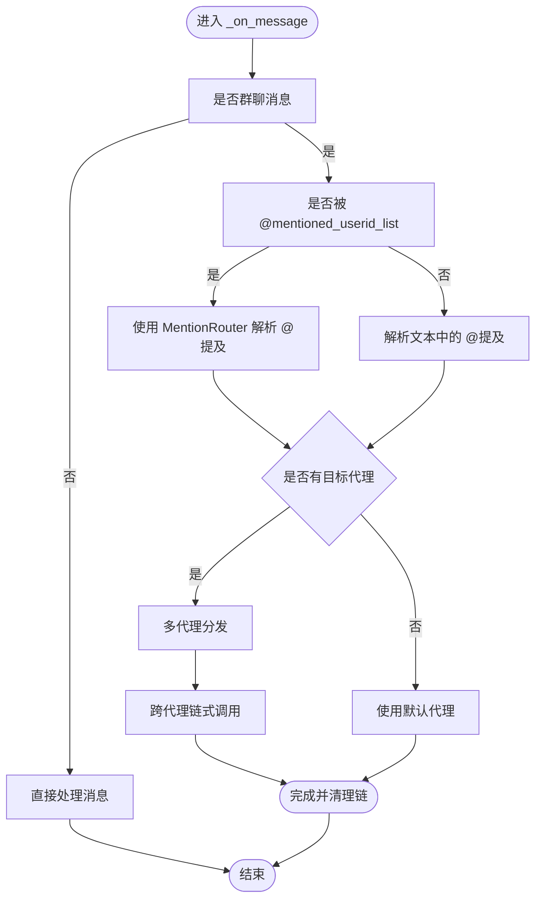
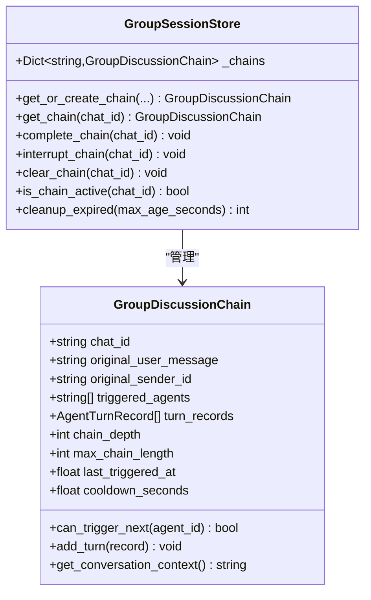
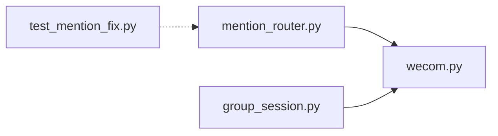

# 路由策略扩展

<cite>
**本文引用的文件**
- [mention_router.py](file://mention_router.py)
- [bk/mention_router.py](file://bk/mention_router.py)
- [wecom.py](file://wecom.py)
- [group_session.py](file://group_session.py)
- [bk/group_session.py](file://bk/group_session.py)
- [test_mention_fix.py](file://test_mention_fix.py)
- [bk/test_mention_fix.py](file://bk/test_mention_fix.py)
- [README.md](file://README.md)
</cite>

## 目录
1. [简介](#简介)
2. [项目结构](#项目结构)
3. [核心组件](#核心组件)
4. [架构总览](#架构总览)
5. [详细组件分析](#详细组件分析)
6. [依赖关系分析](#依赖关系分析)
7. [性能考虑](#性能考虑)
8. [故障排查指南](#故障排查指南)
9. [结论](#结论)
10. [附录](#附录)

## 简介
本指南围绕“路由策略扩展”主题，系统讲解 MentionRouter 类的核心路由机制与策略实现，涵盖：
- @提及解析的正则表达式模式与边界条件处理
- 自定义路由规则的实现方法与扩展接口
- 多代理链式调用的实现原理与冷却时间机制
- 路由策略的性能优化与匹配效率提升方法
- 路由冲突解决与优先级处理策略
- 路由扩展的单元测试与集成测试方法

目标是帮助开发者快速理解并安全地扩展多代理群聊路由能力。

## 项目结构
该仓库围绕企业微信（WeCom）平台适配器构建，核心文件如下：
- mention_router.py：@提及解析与路由核心逻辑
- wecom.py：WeCom 适配器，负责消息接收、路由分发与跨代理链式调用
- group_session.py：群聊会话状态管理，支撑链式调用的冷却与深度控制
- test_mention_fix.py：提及修复相关的测试脚本（与 MentionRouter 并列存在）

图表来源
- [wecom.py:495-586](file://wecom.py#L495-L586)
- [mention_router.py:46-155](file://mention_router.py#L46-L155)
- [group_session.py:33-188](file://group_session.py#L33-L188)
- [test_mention_fix.py:1-133](file://test_mention_fix.py#L1-L133)

章节来源
- [README.md:1-43](file://README.md#L1-L43)
- [wecom.py:495-586](file://wecom.py#L495-L586)
- [mention_router.py:46-155](file://mention_router.py#L46-L155)
- [group_session.py:33-188](file://group_session.py#L33-L188)
- [test_mention_fix.py:1-133](file://test_mention_fix.py#L1-L133)

## 核心组件
- MentionRouter：负责从群聊文本中解析 @提及，生成目标代理列表，并支持提取干净文本、从响应中扫描 @提及用于链式调用。
- WeComAdapter：在收到群聊消息后，根据 MentionRouter 的结果进行多代理分发与链式调用，同时维护会话状态。
- GroupSessionStore：管理群聊讨论链的状态，包括已触发代理、链深度、冷却时间等，确保链式调用不会无限递归或过于频繁。

章节来源
- [mention_router.py:46-155](file://mention_router.py#L46-L155)
- [wecom.py:909-1181](file://wecom.py#L909-L1181)
- [group_session.py:33-188](file://group_session.py#L33-L188)

## 架构总览
下图展示从消息到达至多代理链式调用的整体流程。

图表来源
- [wecom.py:909-1181](file://wecom.py#L909-L1181)
- [mention_router.py:120-146](file://mention_router.py#L120-L146)
- [group_session.py:33-188](file://group_session.py#L33-L188)

## 详细组件分析

### MentionRouter 组件
- AgentConfig：封装单个代理的配置，包括名称、提及模式、模型覆盖、系统提示词、工具集等。
- MentionRouter：
  - 初始化：从配置构建代理注册表，编译每个代理的提及正则，支持跨代理链式调用参数（最大链长、冷却秒数）。
  - 提取目标代理：解析文本中的 @提及，按首次出现顺序返回代理ID列表；若无提及则返回空列表（由调用方决定默认代理）。
  - 清理文本：移除文本中的 @提及标记，保留干净内容。
  - 响应扫描：从代理响应中再次扫描 @提及，用于链式调用。

图表来源
- [mention_router.py:23-155](file://mention_router.py#L23-L155)

章节来源
- [mention_router.py:23-155](file://mention_router.py#L23-L155)

### WeComAdapter 组件
- 入站消息处理：在群聊场景下，优先通过 mentioned_userid_list 判断是否被 @；若未被 @，再使用 MentionRouter 解析文本中的 @提及。
- 多代理分发：根据目标代理列表依次调用消息处理器，构建上下文并记录回合。
- 跨代理链式调用：在最后一个代理响应中扫描 @提及，过滤已触发代理后，按冷却与深度限制继续触发新代理，支持递归扫描进一步的 @提及。
- 会话状态：通过 GroupSessionStore 控制链式调用的冷却与最大深度，避免无限循环。

图表来源
- [wecom.py:495-586](file://wecom.py#L495-L586)
- [wecom.py:909-1181](file://wecom.py#L909-L1181)

章节来源
- [wecom.py:495-586](file://wecom.py#L495-L586)
- [wecom.py:909-1181](file://wecom.py#L909-L1181)

### GroupSessionStore 组件
- 讨论链状态：记录聊天ID、原始用户消息、触发代理序列、回合记录、链深度、最大链长、最后触发时间、冷却秒数等。
- 冷却与深度控制：can_trigger_next(agent_id) 检查是否可触发下一个代理，综合考虑已触发代理、链深度上限与冷却时间。
- 上下文构建：根据历史回合生成完整对话上下文，供后续代理使用。

图表来源
- [group_session.py:33-188](file://group_session.py#L33-L188)

章节来源
- [group_session.py:33-188](file://group_session.py#L33-L188)

### 正则表达式模式与边界条件
- 右边界：提及后可跟随的标点集合，覆盖 ASCII 与全角中文标点，确保匹配更精准。
- 左边界：@ 前不能是字母或点，避免误匹配邮箱地址等场景。
- 编译策略：对每个代理的提及模式进行转义并组合边界断言，生成大小写不敏感的正则，按首次出现位置排序返回目标代理列表。
- 边界条件：
  - 文本为空或路由禁用时直接返回空列表
  - 同一代理多次提及仅取第一次出现位置
  - 响应中扫描 @提及用于链式调用，过滤已触发代理

章节来源
- [mention_router.py:17-20](file://mention_router.py#L17-L20)
- [mention_router.py:91-118](file://mention_router.py#L91-L118)
- [mention_router.py:141-146](file://mention_router.py#L141-L146)

### 自定义路由规则与扩展接口
- 代理提及模式：通过 AgentConfig 的 mention_patterns 字段配置，支持多模式与默认回退。
- 默认代理：当文本中无 @提及且路由启用时，可回退到默认代理。
- 扩展点：
  - 新增代理：在 multi_agent.agents 中添加条目，自动编译正则并参与匹配。
  - 调整链式参数：cross_agent.max_chain_length 与 chain_cooldown_seconds 控制链长度与冷却。
  - 响应扫描：利用 extract_mentions_from_response 在代理响应中发现新的 @提及，实现链式联动。

章节来源
- [mention_router.py:49-89](file://mention_router.py#L49-L89)
- [mention_router.py:120-126](file://mention_router.py#L120-L126)
- [wecom.py:909-1181](file://wecom.py#L909-L1181)

### 多代理链式调用与冷却机制
- 触发条件：最后一个代理的响应中出现新的 @提及，且未在当前链中触发过。
- 冷却与深度：can_trigger_next 检查链深度上限与冷却时间，避免过快连续触发。
- 递归扫描：若最新响应仍包含未触发的 @提及，将继续触发，直到达到链深上限或无更多待触发代理。

章节来源
- [wecom.py:1051-1181](file://wecom.py#L1051-L1181)
- [group_session.py:50-71](file://group_session.py#L50-L71)

## 依赖关系分析
- MentionRouter 依赖于 Python 标准库 re 与 typing，无外部依赖。
- WeComAdapter 依赖 MentionRouter 进行路由解析，并依赖 GroupSessionStore 管理会话状态。
- 测试脚本 test_mention_fix.py 与 MentionRouter 并列存在，用于验证 @提及修复逻辑。

图表来源
- [wecom.py:62-62](file://wecom.py#L62-L62)
- [mention_router.py:13-14](file://mention_router.py#L13-L14)
- [test_mention_fix.py:5-6](file://test_mention_fix.py#L5-L6)

章节来源
- [wecom.py:62-62](file://wecom.py#L62-L62)
- [mention_router.py:13-14](file://mention_router.py#L13-L14)
- [test_mention_fix.py:5-6](file://test_mention_fix.py#L5-L6)

## 性能考虑
- 正则编译：在 MentionRouter 初始化阶段一次性编译所有代理的提及正则，避免运行时重复编译开销。
- 匹配顺序：按首次出现位置排序，减少不必要的重复匹配与去重成本。
- 文本清理：在提取干净文本时，按已编译正则逐一替换，复杂度与提及数量线性相关。
- 链式调用：通过 GroupSessionStore 的冷却与深度限制，避免无限递归导致的性能问题。
- 建议优化：
  - 对高频代理的提及模式进行预热与缓存
  - 在大规模代理场景下，考虑将提及模式合并为单一复合正则以减少匹配次数
  - 对超长文本进行分块处理，避免单次正则匹配耗时过长

章节来源
- [mention_router.py:91-118](file://mention_router.py#L91-L118)
- [wecom.py:1051-1181](file://wecom.py#L1051-L1181)

## 故障排查指南
- 群聊消息未被处理
  - 检查 mentioned_userid_list 是否包含机器人ID
  - 若未被 @，确认文本中是否存在有效的 @提及模式
- 路由未命中默认代理
  - 确认 multi_agent.enabled 与 default_agent 配置
  - 检查 MentionRouter.resolve_target_agents 返回值
- 链式调用未触发或提前终止
  - 检查 cross_agent.enabled、max_chain_length、chain_cooldown_seconds
  - 确认响应中确实包含新的 @提及且未在已触发列表中
- 单元测试与集成测试
  - 使用 test_mention_fix.py 验证 mentioned_userid_list 的解析与消息流程
  - 在集成测试中模拟多轮链式调用，验证冷却与深度限制

章节来源
- [test_mention_fix.py:26-117](file://test_mention_fix.py#L26-L117)
- [wecom.py:909-1181](file://wecom.py#L909-L1181)
- [group_session.py:50-71](file://group_session.py#L50-L71)

## 结论
MentionRouter 通过简洁而稳健的正则匹配与边界断言，实现了高可用的 @提及解析与路由；结合 WeComAdapter 的多代理分发与 GroupSessionStore 的冷却/深度控制，形成了完整的链式调用闭环。通过合理配置与性能优化，可在保证稳定性的同时提升匹配效率与用户体验。

## 附录
- 配置参考：multi_agent.enabled、default_agent、agents、cross_agent.max_chain_length、cross_agent.chain_cooldown_seconds
- 关键路径参考：
  - MentionRouter 初始化与编译：[mention_router.py:49-100](file://mention_router.py#L49-L100)
  - @提及解析与排序：[mention_router.py:102-118](file://mention_router.py#L102-L118)
  - 响应扫描与链式调用：[wecom.py:1051-1181](file://wecom.py#L1051-L1181)
  - 会话状态与冷却控制：[group_session.py:50-71](file://group_session.py#L50-L71)