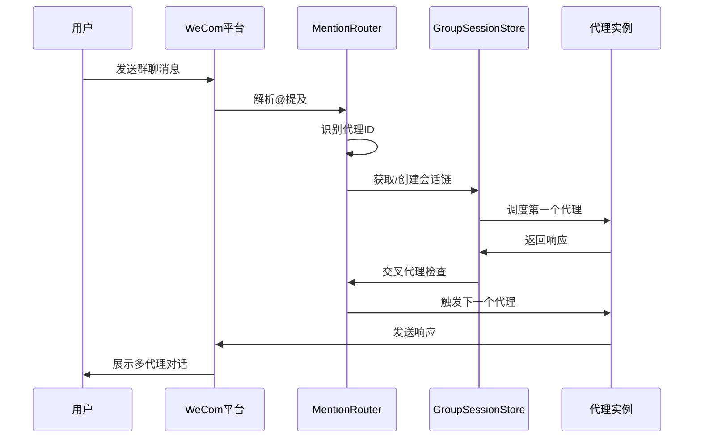
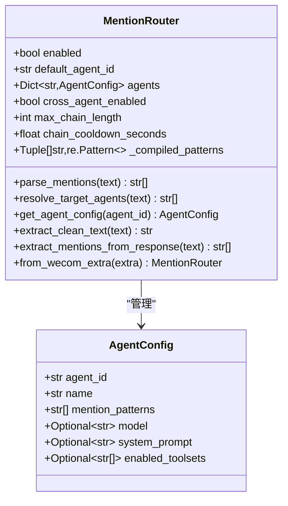
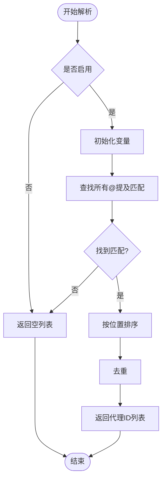
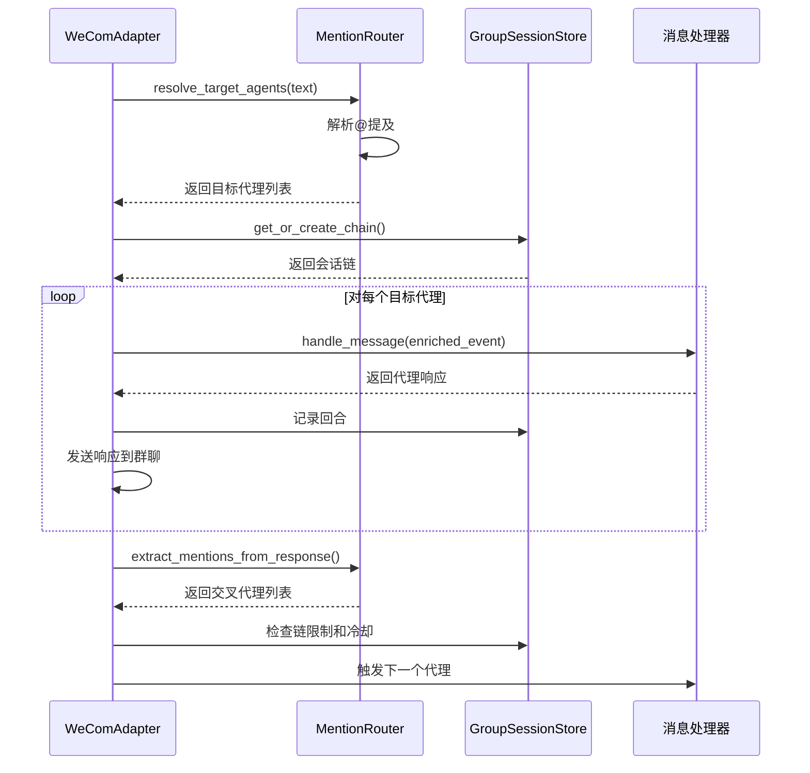
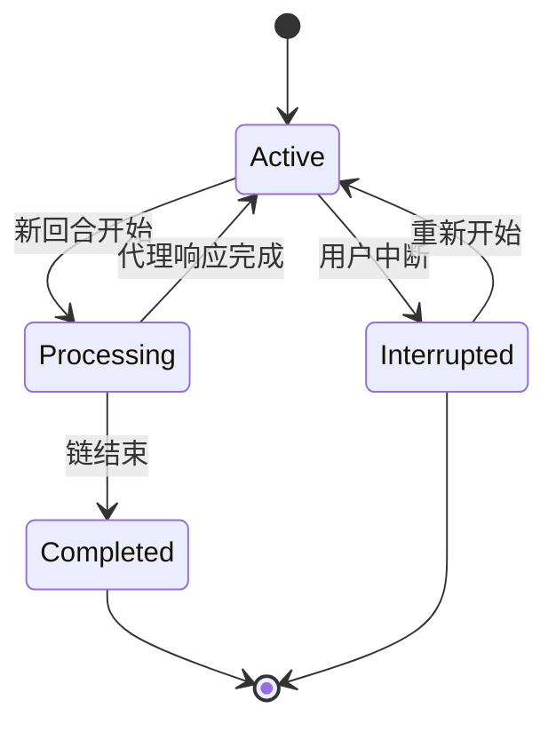
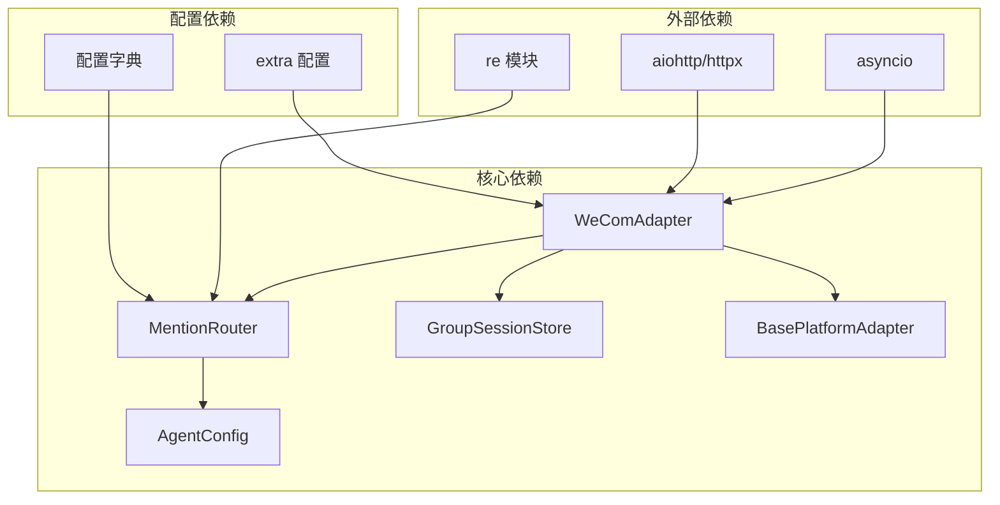

# @提及解析器

<cite>
**本文档引用的文件**
- [mention_router.py](file://mention_router.py)
- [wecom.py](file://wecom.py)
- [README.md](file://README.md)
- [test_mention_fix.py](file://test_mention_fix.py)
- [group_session.py](file://group_session.py)
</cite>

## 目录
1. [简介](#简介)
2. [项目结构](#项目结构)
3. [核心组件](#核心组件)
4. [架构概览](#架构概览)
5. [详细组件分析](#详细组件分析)
6. [依赖关系分析](#依赖关系分析)
7. [性能考虑](#性能考虑)
8. [故障排除指南](#故障排除指南)
9. [结论](#结论)
10. [附录](#附录)

## 简介
@提及解析器是企业微信（WeCom）多代理协作系统的核心组件，负责解析群聊消息中的@提及标记，并将消息路由到相应的代理配置。该系统支持：
- 多代理@提及解析（支持多种命名模式）
- 代理识别与目标解析
- 链式触发机制（跨代理协作）
- 清晰的消息文本提取
- 完整的配置管理

## 项目结构
该项目采用模块化设计，主要文件包括：
- mention_router.py：@提及解析器核心实现
- wecom.py：WeCom平台适配器，集成多代理功能
- group_session.py：群聊会话状态管理
- test_mention_fix.py：@提及修复测试脚本
- README.md：项目说明文档

```mermaid
graph TB
subgraph "WeCom 插件"
MR[MentionRouter<br/>@提及解析器]
WA[WeComAdapter<br/>平台适配器]
GS[GroupSessionStore<br/>会话存储]
TR[TestScript<br/>测试脚本]
end
subgraph "配置系统"
CFG[Multi-Agent Config<br/>多代理配置]
AC[AgentConfig<br/>代理配置]
end
MR --> WA
WA --> GS
WA --> MR
MR --> AC
CFG --> MR
TR --> MR
```

**图表来源**
- [mention_router.py:1-155](file://mention_router.py#L1-L155)
- [wecom.py:160-207](file://wecom.py#L160-L207)
- [group_session.py:96-188](file://group_session.py#L96-L188)

**章节来源**
- [README.md:1-43](file://README.md#L1-L43)
- [mention_router.py:1-155](file://mention_router.py#L1-L155)
- [wecom.py:160-207](file://wecom.py#L160-L207)

## 核心组件
@提及解析器系统由以下核心组件构成：

### MentionRouter 类
负责解析@提及并路由到相应代理：
- 支持多种@提及模式配置
- 提供代理识别和目标解析功能
- 实现链式触发机制
- 提取消息中的@提及标记

### AgentConfig 类  
代理配置管理：
- 代理标识符和名称
- @提及模式列表
- 模型覆盖配置
- 系统提示词和工具集

### WeComAdapter 集成
平台适配器集成多代理功能：
- 群聊消息处理
- 代理调度和响应
- 会话状态管理
- 跨代理链式调用

**章节来源**
- [mention_router.py:23-155](file://mention_router.py#L23-L155)
- [wecom.py:160-207](file://wecom.py#L160-L207)

## 架构概览
@提及解析器采用分层架构设计，实现了从消息解析到代理调度的完整流程。



**图表来源**
- [wecom.py:909-1181](file://wecom.py#L909-L1181)
- [mention_router.py:102-146](file://mention_router.py#L102-L146)
- [group_session.py:96-188](file://group_session.py#L96-L188)

## 详细组件分析

### MentionRouter 类深度分析

#### 核心数据结构


**图表来源**
- [mention_router.py:23-155](file://mention_router.py#L23-L155)

#### @提及解析算法
@提及解析器使用正则表达式实现精确的@提及匹配：



**图表来源**
- [mention_router.py:102-118](file://mention_router.py#L102-L118)

#### 配置系统架构
```mermaid
graph LR
subgraph "配置层次"
A[全局配置] --> B[代理配置]
B --> C[@提及模式]
B --> D[模型设置]
B --> E[工具集]
end
subgraph "运行时配置"
F[默认代理ID] --> G[链长度限制]
F --> H[冷却时间]
F --> I[跨代理开关]
end
C --> J[正则表达式编译]
D --> K[代理实例配置]
E --> L[工具集选择]
```

**图表来源**
- [mention_router.py:49-89](file://mention_router.py#L49-L89)

**章节来源**
- [mention_router.py:46-155](file://mention_router.py#L46-L155)

### WeComAdapter 集成分析

#### 多代理调度流程
WeCom适配器实现了完整的多代理调度机制：



**图表来源**
- [wecom.py:909-1181](file://wecom.py#L909-L1181)

#### 会话状态管理
群聊会话存储管理多代理讨论链的状态：



**图表来源**
- [group_session.py:34-94](file://group_session.py#L34-L94)

**章节来源**
- [wecom.py:909-1181](file://wecom.py#L909-L1181)
- [group_session.py:96-188](file://group_session.py#L96-L188)

## 依赖关系分析

### 组件间依赖关系


**图表来源**
- [mention_router.py:11-14](file://mention_router.py#L11-L14)
- [wecom.py:60-70](file://wecom.py#L60-L70)

### 错误处理和边界情况
系统实现了完善的错误处理机制：
- 代理配置验证
- 正则表达式编译错误处理
- 会话状态一致性检查
- 超时和重连机制

**章节来源**
- [wecom.py:212-278](file://wecom.py#L212-L278)
- [mention_router.py:91-100](file://mention_router.py#L91-L100)

## 性能考虑
@提及解析器在设计时充分考虑了性能优化：

### 时间复杂度分析
- @提及解析：O(n*m)，其中n为消息长度，m为代理数量
- 正则表达式编译：O(k)，k为@提及模式数量
- 会话状态查询：O(1)平均情况

### 内存优化策略
- 正则表达式预编译缓存
- 会话状态内存存储
- 消息批处理机制

### 并发处理
- 异步消息处理
- 代理并发调用
- 会话状态锁保护

## 故障排除指南

### 常见问题诊断
1. **@提及未生效**
   - 检查代理配置中的@提及模式
   - 验证消息中的@符号格式
   - 确认代理ID配置正确

2. **代理响应异常**
   - 检查代理配置参数
   - 验证会话状态完整性
   - 查看日志错误信息

3. **链式触发问题**
   - 检查链长度限制配置
   - 验证冷却时间设置
   - 确认交叉代理配置

### 调试工具
测试脚本提供了完整的调试能力：
- @提及检测函数测试
- 群聊消息流程验证
- 边界情况处理测试

**章节来源**
- [test_mention_fix.py:26-133](file://test_mention_fix.py#L26-L133)

## 结论
@提及解析器是一个设计精良的企业微信多代理协作系统，具有以下特点：

### 技术优势
- **模块化设计**：清晰的组件分离和职责划分
- **可扩展性**：灵活的配置系统支持动态代理管理
- **可靠性**：完善的错误处理和状态管理机制
- **性能优化**：高效的正则表达式匹配和异步处理

### 应用价值
- 支持复杂的多代理群聊场景
- 实现智能的代理间协作
- 提供良好的用户体验
- 具备良好的维护性和扩展性

## 附录

### API 接口说明

#### MentionRouter 核心方法
- `parse_mentions(text)`：解析消息中的@提及，返回代理ID列表
- `resolve_target_agents(text)`：确定目标代理，支持默认代理回退
- `get_agent_config(agent_id)`：获取代理配置对象
- `extract_clean_text(text)`：提取干净的消息文本
- `extract_mentions_from_response(response_text)`：从代理响应中提取@提及

#### 配置选项
- `enabled`：启用多代理功能
- `default_agent`：默认代理ID
- `max_chain_length`：最大链长度限制
- `chain_cooldown_seconds`：代理触发冷却时间
- `mention_patterns`：自定义@提及模式

### 使用场景
1. **多专家协作**：@Alpha @Beta @Gamma 同时参与讨论
2. **知识传递**：代理A回答后@代理B进行补充
3. **任务分配**：根据@提及自动分配不同任务给对应代理
4. **智能路由**：基于@提及模式自动路由到合适的代理

### 最佳实践
1. **配置管理**：合理设置@提及模式和代理配置
2. **性能监控**：关注@提及解析的性能指标
3. **错误处理**：建立完善的日志和错误报告机制
4. **测试验证**：使用测试脚本验证@提及解析功能