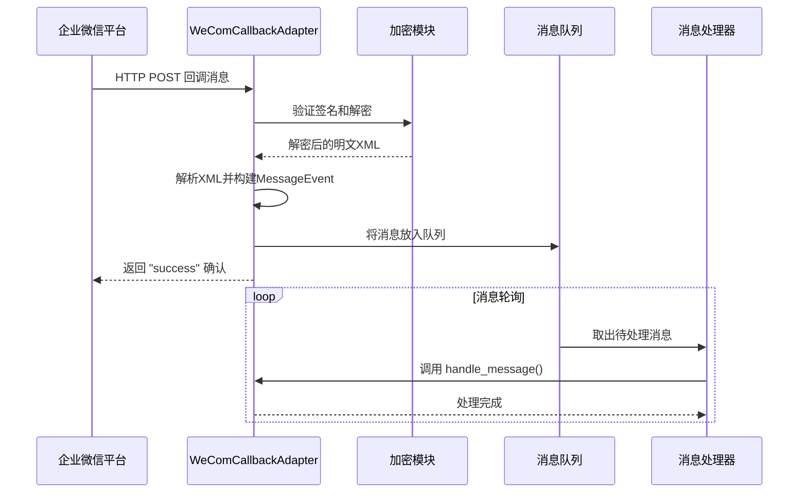
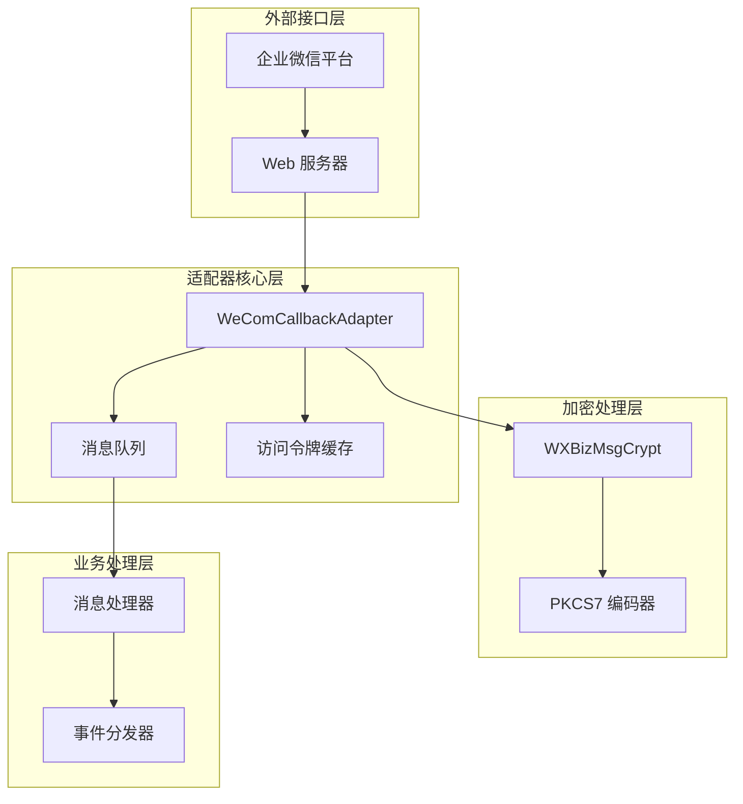
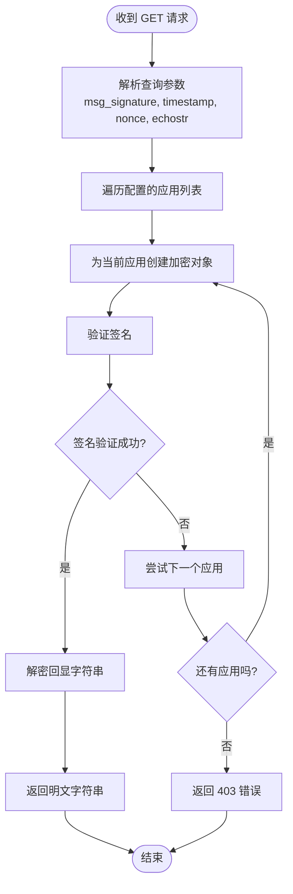
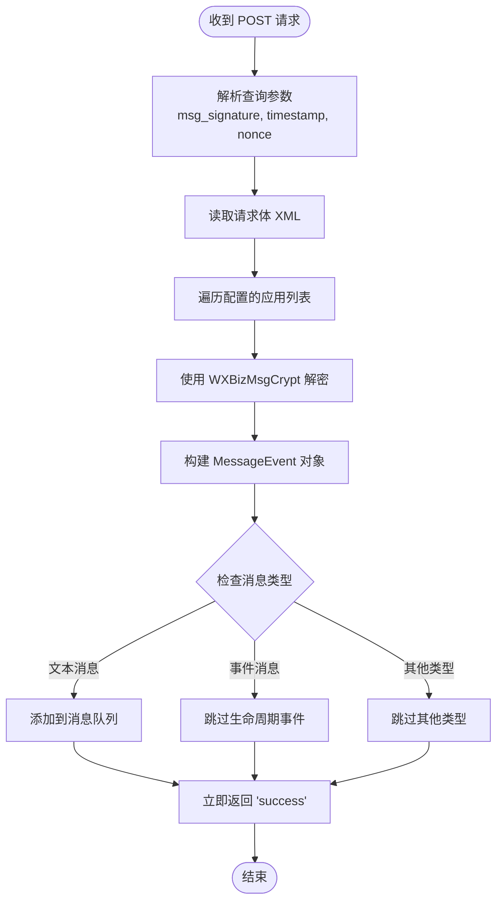
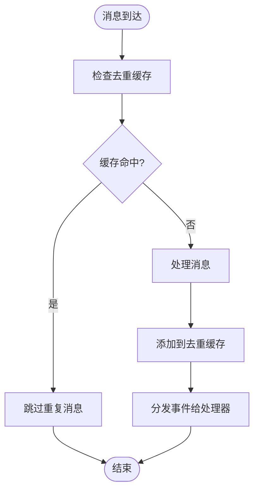
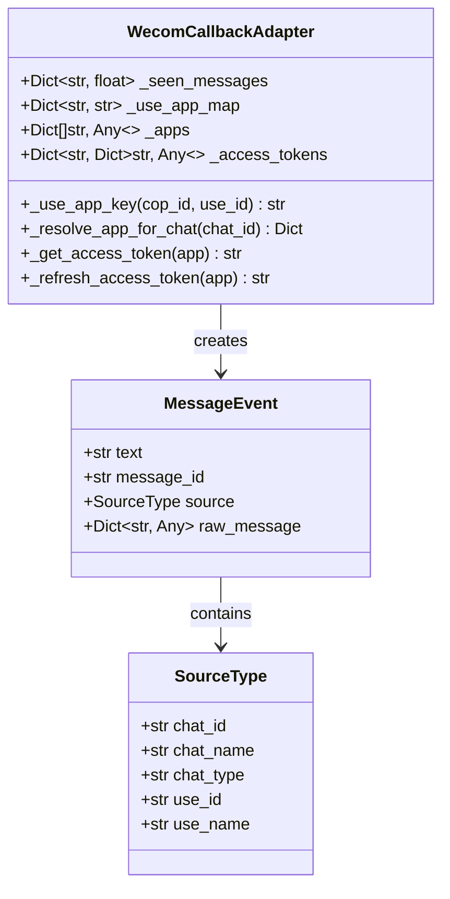
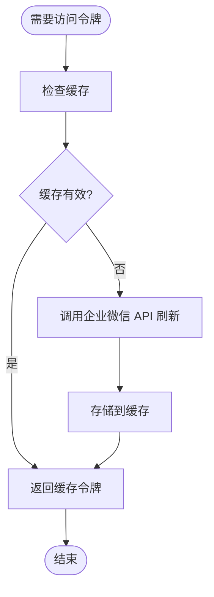
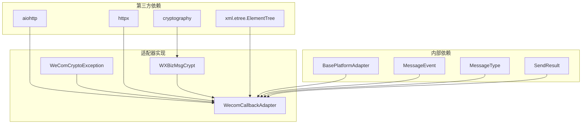
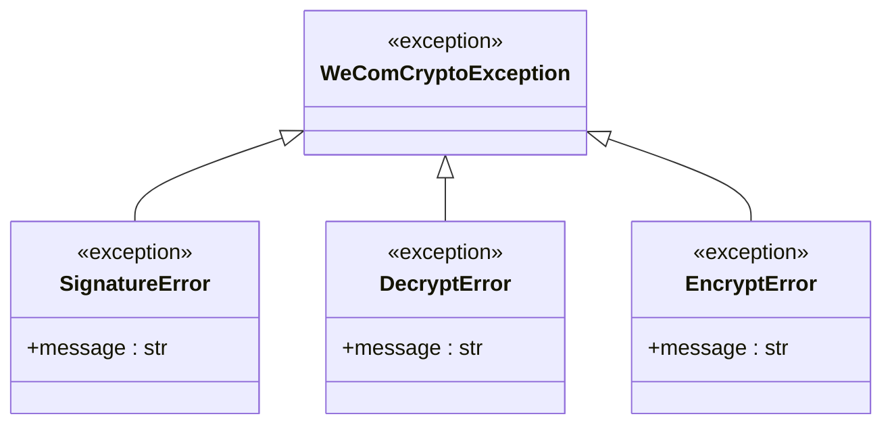
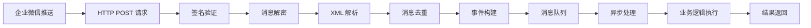

# HTTP 回调适配器

<cite>
**本文档引用的文件**
- [wecom_callback.py](file://wecom_callback.py)
- [wecom_crypto.py](file://wecom_crypto.py)
- [wecom.py](file://wecom.py)
- [mention_router.py](file://mention_router.py)
- [group_session.py](file://group_session.py)
- [test_mention_fix.py](file://test_mention_fix.py)
- [README.md](file://README.md)
</cite>

## 目录
1. [简介](#简介)
2. [项目结构](#项目结构)
3. [核心组件](#核心组件)
4. [架构概览](#架构概览)
5. [详细组件分析](#详细组件分析)
6. [依赖关系分析](#依赖关系分析)
7. [性能考虑](#性能考虑)
8. [故障排除指南](#故障排除指南)
9. [结论](#结论)
10. [附录](#附录)

## 简介

WeComCallbackAdapter 是一个专为企业微信（WeCom）自建应用设计的 HTTP 回调模式适配器。它与传统的 WebSocket 模式形成鲜明对比，采用被动响应的方式处理企业微信平台的消息推送。

该适配器的核心特点包括：
- **HTTP 回调模式**：企业微信通过 HTTP POST 将加密的 XML 消息推送到指定端点
- **即时确认机制**：收到消息后立即确认，异步处理回复
- **多应用支持**：单个网关实例可管理多个自建应用
- **完整加密支持**：内置企业微信消息加解密功能
- **消息去重处理**：防止重复消息的处理
- **访问令牌管理**：自动管理企业微信 API 访问令牌

## 项目结构

该项目采用模块化设计，主要包含以下核心文件：

```mermaid
graph TB
subgraph "核心适配器模块"
A[wecom_callback.py<br/>HTTP 回调适配器]
B[wecom_crypto.py<br/>消息加解密模块]
end
subgraph "辅助功能模块"
C[wecom.py<br/>WebSocket 模式适配器]
D[mention_router.py<br/>@提及路由解析器]
E[group_session.py<br/>群聊会话管理]
F[test_mention_fix.py<br/>测试脚本]
end
subgraph "配置与文档"
G[README.md<br/>项目说明]
end
A --> B
A --> C
A --> D
A --> E
C --> D
C --> E
```

**图表来源**
- [wecom_callback.py:1-50](file://wecom_callback.py#L1-L50)
- [wecom_crypto.py:1-25](file://wecom_crypto.py#L1-L25)

**章节来源**
- [README.md:1-43](file://README.md#L1-L43)

## 核心组件

### WeComCallbackAdapter 类

WeComCallbackAdapter 是整个系统的核心类，继承自基础平台适配器类。它负责管理 HTTP 服务器、消息处理队列、访问令牌缓存等关键功能。

#### 主要特性

1. **多应用配置支持**
   - 支持在同一实例中配置多个自建应用
   - 通过 `cop_id:use_id` 键避免跨公司冲突
   - 动态应用映射和选择机制

2. **HTTP 服务器管理**
   - 健康检查端点 `/health`
   - URL 验证端点 `/wecomcallback`
   - 回调处理端点 `/wecomcallback`

3. **消息处理管道**
   - 异步消息队列处理
   - 消息去重机制
   - 即时确认响应

**章节来源**
- [wecom_callback.py:55-150](file://wecom_callback.py#L55-L150)

### WeComCrypto 加密模块

消息加解密模块实现了与企业微信官方 SDK 兼容的加密算法，确保消息的安全传输。

#### 加密特性

1. **AES-CBC 加密**
   - 使用 256-bit AES 密钥
   - PKCS7 填充标准
   - CBC 模式操作

2. **SHA1 签名验证**
   - 基于 token、时间戳、随机数和加密内容的签名
   - 确保消息完整性验证

3. **XML 格式兼容**
   - 完整的企业微信 XML 格式支持
   - 自动解析和构建消息结构

**章节来源**
- [wecom_crypto.py:66-143](file://wecom_crypto.py#L66-L143)

## 架构概览

WeComCallbackAdapter 采用事件驱动的异步架构，通过 HTTP 回调接收消息并异步处理。



**图表来源**
- [wecom_callback.py:247-288](file://wecom_callback.py#L247-L288)
- [wecom_crypto.py:88-112](file://wecom_crypto.py#L88-L112)

### 系统组件交互图



**图表来源**
- [wecom_callback.py:178-224](file://wecom_callback.py#L178-L224)
- [wecom_crypto.py:66-83](file://wecom_crypto.py#L66-L83)

## 详细组件分析

### HTTP 回调处理流程

#### GET 验证端点

URL 验证端点用于企业微信平台的 URL 和 Token 验证：



**图表来源**
- [wecom_callback.py:232-246](file://wecom_callback.py#L232-L246)

#### POST 回调端点

POST 端点处理企业微信推送的消息：



**图表来源**
- [wecom_callback.py:247-277](file://wecom_callback.py#L247-L277)

**章节来源**
- [wecom_callback.py:229-277](file://wecom_callback.py#L229-L277)

### 消息处理与去重机制

#### 消息去重流程



**图表来源**
- [wecom_callback.py:69-69](file://wecom_callback.py#L69-L69)

#### 应用映射机制

为了支持多应用场景，系统使用 `cop_id:use_id` 组合作为键：



**图表来源**
- [wecom_callback.py:77-71](file://wecom_callback.py#L77-L71)

**章节来源**
- [wecom_callback.py:77-72](file://wecom_callback.py#L77-L72)

### 访问令牌管理系统

#### 令牌刷新流程



**图表来源**
- [wecom_callback.py:357-387](file://wecom_callback.py#L357-L387)

**章节来源**
- [wecom_callback.py:357-387](file://wecom_callback.py#L357-L387)

## 依赖关系分析

### 核心依赖关系



**图表来源**
- [wecom_callback.py:22-42](file://wecom_callback.py#L22-L42)

### 错误处理层次



**图表来源**
- [wecom_crypto.py:22-35](file://wecom_crypto.py#L22-L35)

**章节来源**
- [wecom_crypto.py:22-35](file://wecom_crypto.py#L22-L35)

## 性能考虑

### 异步处理优势

1. **非阻塞 I/O**
   - 使用 asyncio 实现完全异步的消息处理
   - HTTP 请求和企业微信 API 调用都是异步的

2. **内存优化**
   - 消息队列限制大小，防止内存泄漏
   - 访问令牌缓存自动过期机制
   - 去重缓存 TTL 控制

3. **并发处理**
   - 多应用并发处理能力
   - 异步任务池管理
   - 背景任务清理机制

### 性能调优建议

1. **消息队列配置**
   - 根据预期并发量调整队列大小
   - 监控队列长度和处理延迟

2. **网络优化**
   - 合理设置 HTTP 客户端超时时间
   - 使用连接池减少连接开销
   - CDN 加速静态资源（如有）

3. **加密性能**
   - 批量处理相似消息
   - 避免不必要的重复解密
   - 优化 XML 解析性能

## 故障排除指南

### 常见问题诊断

#### 1. 回调 URL 验证失败

**症状**：企业微信平台显示 URL 验证失败

**可能原因**：
- 应用配置错误
- 网络连接问题
- 服务器端口占用

**解决步骤**：
1. 检查应用配置中的 token 和 encoding_aes_key
2. 验证服务器端口是否开放
3. 确认防火墙设置允许外部访问

#### 2. 消息解密失败

**症状**：日志中出现解密错误

**可能原因**：
- 加密密钥配置错误
- 时间戳过期
- 签名验证失败

**解决步骤**：
1. 重新生成并配置 encoding_aes_key
2. 检查系统时间同步
3. 验证消息签名算法

#### 3. 访问令牌获取失败

**症状**：发送消息时报错，提示令牌无效

**可能原因**：
- 企业微信应用配置错误
- 网络连接问题
- 令牌过期

**解决步骤**：
1. 验证企业微信应用的 corp_id 和 secret
2. 检查网络连通性
3. 查看令牌过期时间设置

**章节来源**
- [wecom_callback.py:103-149](file://wecom_callback.py#L103-L149)

### 日志分析

#### 关键日志级别

| 日志级别 | 用途 | 示例 |
|---------|------|------|
| DEBUG | 详细调试信息 | 消息处理详情、队列状态 |
| INFO | 重要操作记录 | 服务器启动、令牌刷新 |
| WARNING | 警告信息 | 配置问题、性能警告 |
| ERROR | 错误信息 | 连接失败、解密错误 |

#### 常用日志关键字

- `[WecomCallback]` - 适配器相关日志
- `health` - 健康检查
- `signature verification` - 签名验证
- `token refreshed` - 令牌刷新
- `duplicate message` - 重复消息

## 结论

WeComCallbackAdapter 提供了一个完整、可靠的 HTTP 回调模式解决方案，具有以下优势：

1. **架构清晰**：模块化设计，职责分离明确
2. **安全性高**：完整的消息加密和签名验证机制
3. **扩展性强**：支持多应用配置和动态扩展
4. **性能优秀**：异步处理，低延迟响应
5. **易于维护**：完善的错误处理和监控机制

该适配器特别适合需要通过 HTTP 回调接收企业微信消息的场景，相比 WebSocket 模式具有更好的稳定性和可靠性。

## 附录

### 部署配置示例

#### 基础配置

```yaml
# ~/.hermes/config.yaml
gateway:
  platforms:
    wecom_callback:
      enabled: true
      extra:
        host: "0.0.0.0"
        port: 8645
        path: "wecomcallback"
        
        # 应用配置
        apps:
          - name: "default_app"
            corp_id: "your-corp-id"
            corp_secret: "your-corp-secret"
            agent_id: 1000002
            token: "your-token"
            encoding_aes_key: "your-encoding-aes-key"
```

#### 多应用配置

```yaml
gateway:
  platforms:
    wecom_callback:
      enabled: true
      extra:
        host: "0.0.0.0"
        port: 8645
        path: "wecomcallback"
        
        # 多应用配置
        apps:
          - name: "app_a"
            corp_id: "corp-id-a"
            corp_secret: "secret-a"
            agent_id: 1000002
            token: "token-a"
            encoding_aes_key: "key-a"
            
          - name: "app_b"
            corp_id: "corp-id-b"
            corp_secret: "secret-b"
            agent_id: 1000003
            token: "token-b"
            encoding_aes_key: "key-b"
```

### Web 服务器配置

#### Nginx 反向代理配置

```nginx
server {
    listen 80;
    server_name your-domain.com;
    
    location /wecomcallback {
        proxy_pass http://localhost:8645/wecomcallback;
        proxy_set_header Host $host;
        proxy_set_header X-Real-IP $remote_addr;
        proxy_set_header X-Forwarded-For $proxy_add_x_forwarded_for;
        
        # 超时设置
        proxy_connect_timeout 30s;
        proxy_send_timeout 30s;
        proxy_read_timeout 30s;
    }
    
    # 健康检查
    location /health {
        proxy_pass http://localhost:8645/health;
    }
}
```

#### Apache 反向代理配置

```apache
<VirtualHost *:80>
    ServerName your-domain.com
    
    ProxyPreserveHost On
    ProxyPass /wecomcallback http://localhost:8645/wecomcallback
    ProxyPassReverse /wecomcallback http://localhost:8645/wecomcallback
    
    # 健康检查
    ProxyPass /health http://localhost:8645/health
    ProxyPassReverse /health http://localhost:8645/health
</VirtualHost>
```

### 安全配置建议

#### 企业微信平台配置

1. **回调 URL 设置**
   - HTTPS 地址（推荐）
   - 端口 80 或 443
   - 路径 `/wecomcallback`

2. **安全设置**
   - 启用 IP 白名单（可选）
   - 配置合适的超时时间
   - 监控回调成功率

#### 服务器安全

1. **防火墙规则**
   - 仅开放 8645 端口
   - 限制来源 IP（可选）
   - 启用 SSL/TLS 加密

2. **访问控制**
   - 使用反向代理进行认证
   - 配置速率限制
   - 监控异常访问

### API 端点说明

#### 健康检查端点

- **URL**: `GET /health`
- **用途**: 服务健康状态检查
- **响应**: `{"status": "ok", "platform": "wecom_callback"}`

#### URL 验证端点

- **URL**: `GET /wecomcallback`
- **参数**:
  - `msg_signature`: 签名
  - `timestamp`: 时间戳
  - `nonce`: 随机数
  - `echostr`: 回显字符串
- **用途**: 企业微信平台 URL 和 Token 验证

#### 回调处理端点

- **URL**: `POST /wecomcallback`
- **用途**: 接收企业微信推送的消息
- **响应**: `"success"`（立即确认）
- **要求**: 企业微信平台必须收到成功响应

### 集成最佳实践

#### 消息处理流程



#### 错误处理策略

1. **验证失败**: 返回 403 状态码
2. **解密失败**: 返回 400 状态码
3. **处理异常**: 记录错误日志，返回 500 状态码
4. **超时处理**: 实现重试机制

#### 监控指标

- **回调成功率**: `count_success / (count_success + count_failure)`
- **平均处理时间**: 消息从接收到底层处理的时间
- **队列长度**: 当前等待处理的消息数量
- **令牌刷新频率**: 访问令牌的更新次数

**章节来源**
- [wecom_callback.py:229-277](file://wecom_callback.py#L229-L277)