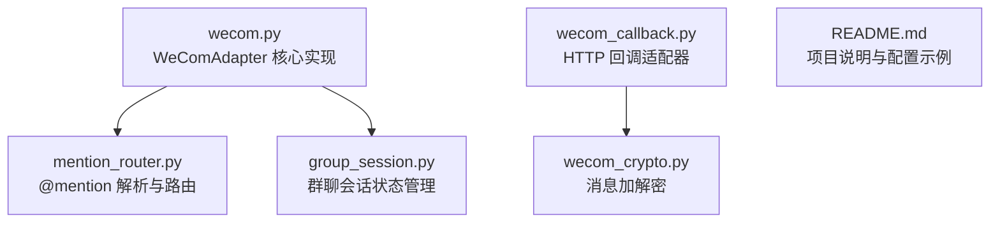
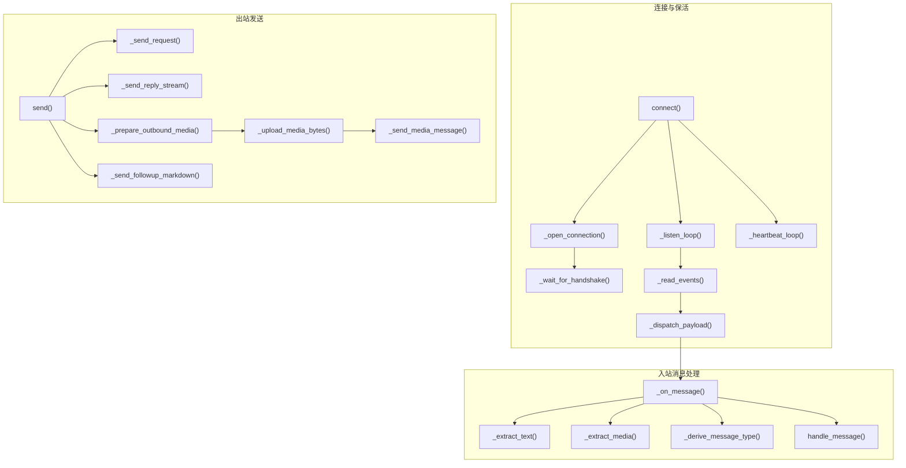
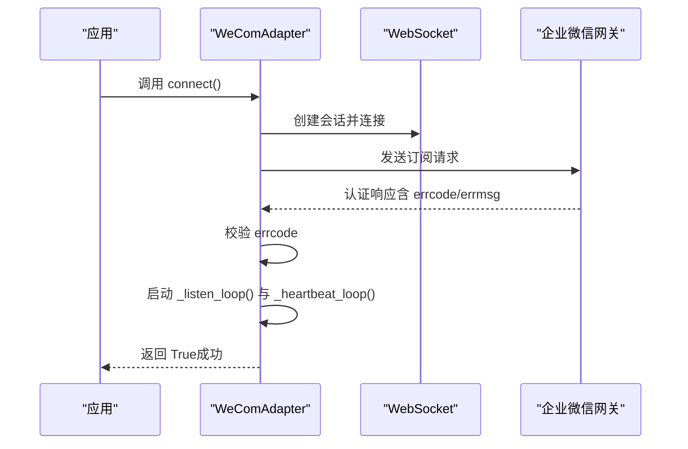
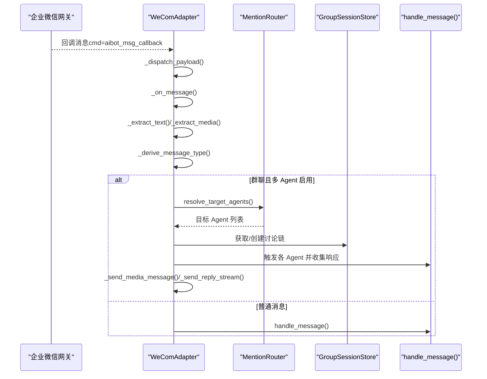
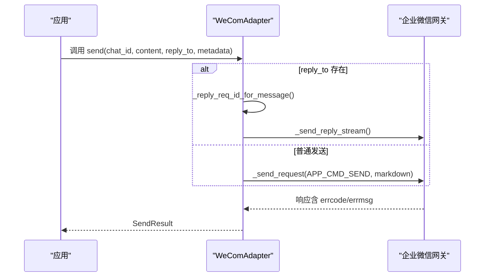
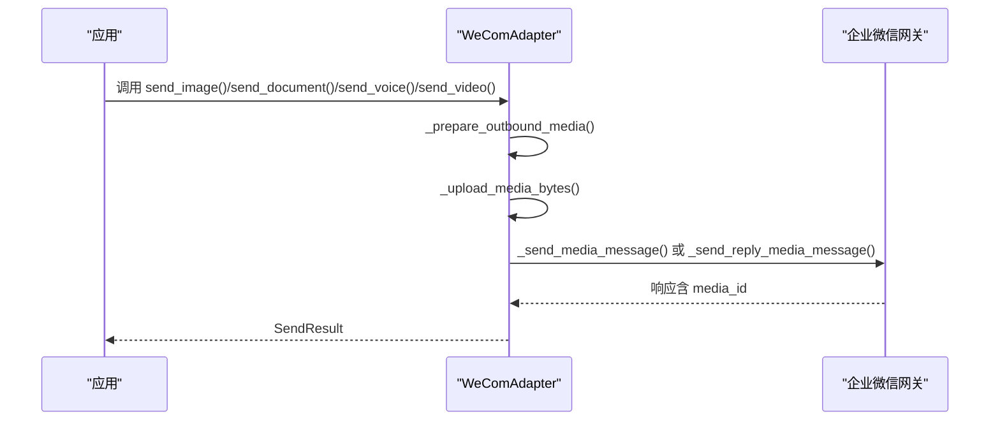
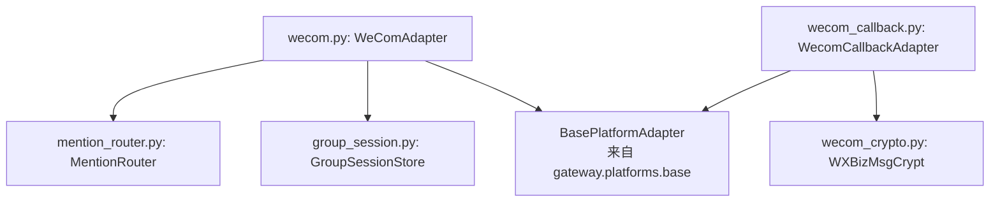

# API 方法

<cite>
**本文引用的文件**
- [wecom.py](file://wecom.py)
- [wecom_callback.py](file://wecom_callback.py)
- [wecom_crypto.py](file://wecom_crypto.py)
- [group_session.py](file://group_session.py)
- [mention_router.py](file://mention_router.py)
- [README.md](file://README.md)
</cite>

## 目录
1. [简介](#简介)
2. [项目结构](#项目结构)
3. [核心组件](#核心组件)
4. [架构总览](#架构总览)
5. [详细组件分析](#详细组件分析)
6. [依赖分析](#依赖分析)
7. [性能考虑](#性能考虑)
8. [故障排查指南](#故障排查指南)
9. [结论](#结论)
10. [附录](#附录)

## 简介
本文件面向 WeComAdapter 的公共 API 方法，提供详尽的参考文档，覆盖以下目标：
- 公共 API：connect()、disconnect()、send()、send_image()、send_document()、send_voice()、send_video()、get_chat_info()、send_typing()
- 内部关键方法：_send_request()、_send_reply_request()、_dispatch_payload()、_listen_loop()、_heartbeat_loop()、_on_message()、_send_media_source()、_upload_media_bytes()、_prepare_outbound_media() 等
- 参数、返回值、异常与错误码说明
- 方法调用序列图、典型使用场景与集成示例
- 方法间依赖关系与最佳实践

## 项目结构
WeComAdapter 所在的仓库包含多个与企业微信对接相关的模块：
- 主要适配器：wecom.py（WebSocket 模式）
- HTTP Callback 模式：wecom_callback.py（与回调模式相关）
- 加解密工具：wecom_crypto.py
- 多 Agent 群聊支持：mention_router.py、group_session.py
- 顶层说明：README.md

图表来源
- [wecom.py:160-1774](file://wecom.py#L160-L1774)
- [mention_router.py:1-155](file://mention_router.py#L1-L155)
- [group_session.py:1-188](file://group_session.py#L1-L188)
- [wecom_callback.py:1-388](file://wecom_callback.py#L1-L388)
- [wecom_crypto.py:1-143](file://wecom_crypto.py#L1-L143)
- [README.md:1-43](file://README.md#L1-L43)

章节来源
- [README.md:1-43](file://README.md#L1-L43)

## 核心组件
- WeComAdapter：基于持久 WebSocket 连接的企业微信 AI Bot 适配器，负责订阅认证、接收回调事件、发送消息与媒体、心跳保活、重连与去重等。
- MentionRouter：解析群聊中的 @mention，支持多 Agent 触发与链式联动。
- GroupSessionStore：维护群聊多 Agent 讨论链的状态，控制链长度、冷却时间与中断。
- WXBizMsgCrypt：HTTP 回调模式的消息加解密工具（与回调适配器配合使用）。

章节来源
- [wecom.py:160-1774](file://wecom.py#L160-L1774)
- [mention_router.py:46-155](file://mention_router.py#L46-L155)
- [group_session.py:96-188](file://group_session.py#L96-L188)
- [wecom_callback.py:55-388](file://wecom_callback.py#L55-L388)
- [wecom_crypto.py:66-143](file://wecom_crypto.py#L66-L143)

## 架构总览
WeComAdapter 的运行时架构由“连接生命周期”“消息分发”“出站发送”三部分组成，并辅以策略与多 Agent 支持。

图表来源
- [wecom.py:212-278](file://wecom.py#L212-L278)
- [wecom.py:289-337](file://wecom.py#L289-L337)
- [wecom.py:338-377](file://wecom.py#L338-L377)
- [wecom.py:398-416](file://wecom.py#L398-L416)
- [wecom.py:495-586](file://wecom.py#L495-L586)
- [wecom.py:658-704](file://wecom.py#L658-L704)
- [wecom.py:705-748](file://wecom.py#L705-L748)
- [wecom.py:845-854](file://wecom.py#L845-L854)
- [wecom.py:1616-1673](file://wecom.py#L1616-L1673)
- [wecom.py:1406-1421](file://wecom.py#L1406-L1421)
- [wecom.py:1422-1490](file://wecom.py#L1422-L1490)
- [wecom.py:1480-1490](file://wecom.py#L1480-L1490)
- [wecom.py:1523-1535](file://wecom.py#L1523-L1535)

## 详细组件分析

### 公共 API 方法参考

#### connect()
- 功能：建立到企业微信 AI Bot WebSocket 网关的连接，完成认证与保活任务启动。
- 返回值：布尔值，成功返回 True，失败返回 False。
- 异常与错误码：
  - 依赖缺失：当 aiohttp 或 httpx 未安装时，设置致命错误并返回 False。
  - 凭证缺失：当 bot_id 或 secret 为空时，设置致命错误并返回 False。
  - 认证失败：握手响应 errcode 非 0 时抛出异常。
  - 其他连接异常：捕获并记录，清理资源后返回 False。
- 典型调用时机：应用启动阶段初始化平台适配器。
- 最佳实践：
  - 在调用前确保环境变量或配置项已正确设置。
  - 对返回值进行判断，失败时重试或降级处理。

章节来源
- [wecom.py:212-247](file://wecom.py#L212-L247)
- [wecom.py:289-337](file://wecom.py#L289-L337)

#### disconnect()
- 功能：断开连接，取消监听与心跳任务，清理挂起响应与会话。
- 返回值：None。
- 异常与错误码：无显式异常抛出，内部通过取消任务与关闭会话保证资源释放。
- 典型调用时机：应用关闭或平台适配器销毁时。
- 最佳实践：
  - 在异步上下文中调用，确保任务被正确取消。
  - 断开后清空去重表，避免后续误判。

章节来源
- [wecom.py:248-278](file://wecom.py#L248-L278)

#### send()
- 功能：向指定聊天发送 Markdown 文本消息；支持回复与 @ 提及。
- 参数
  - chat_id: 目标聊天标识（群或用户）
  - content: Markdown 文本内容（最大长度受 MAX_MESSAGE_LENGTH 限制）
  - reply_to: 可选，回复某条消息时传入其消息 ID 或关联 req_id
  - metadata: 可选，包含 mention_names（@提及的昵称列表）
- 返回值：SendResult，包含 success、message_id、raw_response、error 等字段。
- 异常与错误码：
  - 超时：发送过程中超时返回 Timeout 错误。
  - WeCom 错误：响应 errcode 非 0 时，构造错误字符串返回。
  - 其他异常：记录日志并返回错误。
- 典型使用场景
  - 发送普通 Markdown 文本
  - 回复某条消息（带 reply_to）
  - 群聊 @ 提及（metadata 中传入 mention_names）
- 最佳实践
  - 控制 content 长度，避免超出限制。
  - 使用 reply_to 时确保能正确映射到 reply_req_id。

章节来源
- [wecom.py:1616-1673](file://wecom.py#L1616-L1673)
- [wecom.py:1492-1505](file://wecom.py#L1492-L1505)
- [wecom.py:1646-1658](file://wecom.py#L1646-L1658)

#### send_image() / send_image_file()
- 功能：发送图片（URL 或本地路径），支持可选标题说明。
- 参数
  - chat_id: 目标聊天标识
  - image_url/image_path: 图片源（URL 或本地路径）
  - caption: 可选，图片下方说明文字
  - reply_to: 可选，回复某条消息
  - metadata: 可选
- 返回值：SendResult。
- 异常与错误码：
  - 准备阶段：文件不存在、类型不匹配、大小超限等，返回错误。
  - 上传阶段：超时或 WeCom 错误，返回错误。
  - URL 回退：若为 URL 且发送失败，回退为纯文本链接发送。
- 典型使用场景：发送图片并附带说明。
- 最佳实践
  - 优先使用本地路径，减少网络波动影响。
  - 注意图片大小限制与格式支持。

章节来源
- [wecom.py:1675-1696](file://wecom.py#L1675-L1696)
- [wecom.py:1698-1712](file://wecom.py#L1698-L1712)
- [wecom.py:1536-1614](file://wecom.py#L1536-L1614)

#### send_document()
- 功能：发送文档（PDF/Word/Excel 等），支持自定义文件名。
- 参数
  - chat_id: 目标聊天标识
  - file_path: 本地文件路径
  - caption: 可选，说明文字
  - file_name: 可选，覆盖默认文件名
  - reply_to: 可选，回复某条消息
  - **kwargs: 兼容参数
- 返回值：SendResult。
- 异常与错误码：同媒体发送流程。
- 典型使用场景：发送附件或报告。
- 最佳实践
  - 确认文件存在且大小符合限制。
  - 合理设置 file_name 以便识别。

章节来源
- [wecom.py:1714-1730](file://wecom.py#L1714-L1730)
- [wecom.py:1536-1614](file://wecom.py#L1536-L1614)

#### send_voice()
- 功能：发送语音（AMR 格式优先），支持可选说明。
- 参数
  - chat_id: 目标聊天标识
  - audio_path: 本地音频路径
  - caption: 可选
  - reply_to: 可选
  - **kwargs: 兼容参数
- 返回值：SendResult。
- 异常与错误码：同媒体发送流程。
- 典型使用场景：发送语音消息。
- 最佳实践
  - 使用官方支持的 AMR 格式，避免被降级为文件。
  - 控制语音大小不超过限制。

章节来源
- [wecom.py:1732-1746](file://wecom.py#L1732-L1746)
- [wecom.py:1536-1614](file://wecom.py#L1536-L1614)

#### send_video()
- 功能：发送视频，支持可选说明。
- 参数
  - chat_id: 目标聊天标识
  - video_path: 本地视频路径
  - caption: 可选
  - reply_to: 可选
  - **kwargs: 兼容参数
- 返回值：SendResult。
- 异常与错误码：同媒体发送流程。
- 典型使用场景：发送短视频或演示视频。
- 最佳实践
  - 控制视频大小与格式，避免被降级为文件。

章节来源
- [wecom.py:1748-1762](file://wecom.py#L1748-L1762)
- [wecom.py:1536-1614](file://wecom.py#L1536-L1614)

#### get_chat_info()
- 功能：返回聊天基本信息（名称与类型）。
- 参数
  - chat_id: 目标聊天标识
- 返回值：字典，包含 name、type。
- 典型使用场景：UI 展示或日志输出。
- 最佳实践
  - 该方法为轻量查询，适合在渲染界面时调用。

章节来源
- [wecom.py:1768-1774](file://wecom.py#L1768-L1774)

#### send_typing()
- 功能：占位方法（当前实现为空操作）。
- 参数
  - chat_id: 目标聊天标识
  - metadata: 可选
- 返回值：None。
- 典型使用场景：占位，便于统一接口。
- 最佳实践
  - 若需显示输入指示，可在上层自行实现。

章节来源
- [wecom.py:1764-1767](file://wecom.py#L1764-L1767)

### 内部方法参考

#### _send_request(cmd, body, timeout)
- 功能：发送请求并等待对应响应，基于 req_id 关联。
- 参数
  - cmd: 命令类型（如发送、上传等）
  - body: 请求体
  - timeout: 超时秒数
- 返回值：响应字典。
- 异常与错误码：连接断开、超时、WeCom 错误等。
- 调用时机：所有需要等待响应的请求（如发送消息、上传媒体）。
- 最佳实践
  - 确保 WebSocket 已连接。
  - 正确处理超时与错误。

章节来源
- [wecom.py:430-444](file://wecom.py#L430-L444)

#### _send_reply_request(reply_req_id, body, cmd, timeout)
- 功能：对入站回调的 reply_req_id 进行回复。
- 参数
  - reply_req_id: 来自入站回调的请求 ID
  - body: 回复体
  - cmd: 命令类型（默认为响应命令）
  - timeout: 超时秒数
- 返回值：响应字典。
- 异常与错误码：同 _send_request。
- 调用时机：需要对某条入站消息进行回复时。
- 最佳实践
  - reply_req_id 必须非空且与入站消息匹配。

章节来源
- [wecom.py:445-470](file://wecom.py#L445-L470)

#### _dispatch_payload(payload)
- 功能：根据 payload 的 cmd 与 req_id 分发到相应处理逻辑。
- 参数
  - payload: WebSocket 接收到的 JSON 载荷
- 返回值：None。
- 异常与错误码：忽略未知或非响应类命令。
- 调用时机：_read_events() 中收到消息后。
- 最佳实践
  - 保持对 NON_RESPONSE_COMMANDS 的正确识别。

章节来源
- [wecom.py:398-416](file://wecom.py#L398-L416)

#### _listen_loop()
- 功能：持续读取事件，处理异常并按指数退避重连。
- 参数：无。
- 返回值：None。
- 异常与错误码：连接异常、认证失败等。
- 调用时机：connect() 成功后启动。
- 最佳实践
  - 监控日志中的重连提示，及时排查网络问题。

章节来源
- [wecom.py:338-377](file://wecom.py#L338-L377)

#### _heartbeat_loop()
- 功能：周期性发送 ping 保活。
- 参数：无。
- 返回值：None。
- 异常与错误码：发送失败时记录调试日志。
- 调用时机：connect() 成功后启动。
- 最佳实践
  - 保持心跳间隔稳定，避免频繁失败。

章节来源
- [wecom.py:378-397](file://wecom.py#L378-L397)

#### _on_message(payload)
- 功能：解析入站消息，执行策略校验、@mention 解析、多 Agent 路由与去重。
- 参数
  - payload: 入站回调载荷
- 返回值：None。
- 异常与错误码：解析失败、策略拒绝、空消息等。
- 调用时机：_dispatch_payload() 识别为回调命令时。
- 最佳实践
  - 确保策略配置正确，避免误拒或误放。
  - 多 Agent 模式下注意 mention_router 的启用与配置。

章节来源
- [wecom.py:495-586](file://wecom.py#L495-L586)

#### _send_media_source(chat_id, media_source, caption, file_name, reply_to)
- 功能：准备并发送媒体（图片/文档/语音/视频），支持降级与后续说明。
- 参数
  - chat_id: 目标聊天标识
  - media_source: 媒体来源（URL/本地路径）
  - caption: 可选说明
  - file_name: 可选覆盖文件名
  - reply_to: 可选回复
- 返回值：SendResult。
- 异常与错误码：准备失败、上传失败、WeCom 错误、超时等。
- 调用时机：send_image()/send_document()/send_voice()/send_video() 内部。
- 最佳实践
  - 严格遵守大小限制，必要时降级为文件。
  - 对 URL 场景做好回退策略。

章节来源
- [wecom.py:1536-1614](file://wecom.py#L1536-L1614)

#### _upload_media_bytes(data, media_type, filename)
- 功能：分块上传媒体至企业微信，返回 media_id。
- 参数
  - data: 媒体二进制数据
  - media_type: 媒体类型（image/video/voice/file）
  - filename: 文件名
- 返回值：包含 type、media_id、created_at 的字典。
- 异常与错误码：初始化失败、分块失败、完成失败等。
- 调用时机：_send_media_source() 中。
- 最佳实践
  - 控制单文件大小与分块数量，避免超过上限。

章节来源
- [wecom.py:1422-1490](file://wecom.py#L1422-L1490)

#### _prepare_outbound_media(media_source, file_name)
- 功能：加载并检测媒体类型与大小，生成标准化元信息。
- 参数
  - media_source: 媒体来源
  - file_name: 可选覆盖文件名
- 返回值：字典，包含 data、content_type、file_name、detected_type、大小检查结果等。
- 异常与错误码：文件不存在、URL 不安全、大小超限等。
- 调用时机：_send_media_source() 中。
- 最佳实践
  - 优先使用本地路径，减少网络风险。
  - 合理设置 file_name 以提升识别度。

章节来源
- [wecom.py:1406-1421](file://wecom.py#L1406-L1421)

### 方法调用序列图

#### 连接与认证序列

图表来源
- [wecom.py:212-247](file://wecom.py#L212-L247)
- [wecom.py:289-337](file://wecom.py#L289-L337)
- [wecom.py:338-397](file://wecom.py#L338-L397)

#### 入站消息处理序列

图表来源
- [wecom.py:398-416](file://wecom.py#L398-L416)
- [wecom.py:495-586](file://wecom.py#L495-L586)
- [wecom.py:909-1050](file://wecom.py#L909-L1050)
- [mention_router.py:120-127](file://mention_router.py#L120-L127)
- [group_session.py:104-128](file://group_session.py#L104-L128)

#### 出站发送（Markdown）序列

图表来源
- [wecom.py:1616-1673](file://wecom.py#L1616-L1673)
- [wecom.py:1492-1505](file://wecom.py#L1492-L1505)

#### 出站发送（媒体）序列

图表来源
- [wecom.py:1536-1614](file://wecom.py#L1536-L1614)
- [wecom.py:1422-1490](file://wecom.py#L1422-L1490)

### 典型使用场景与集成示例

- 初始化与连接
  - 在应用启动时调用 connect()，并在失败时重试或降级。
  - 参考：[wecom.py:212-247](file://wecom.py#L212-L247)

- 发送 Markdown 文本
  - 调用 send()，支持 reply_to 与 mention_names。
  - 参考：[wecom.py:1616-1673](file://wecom.py#L1616-L1673)

- 发送图片/文档/语音/视频
  - 使用对应 send_* 方法，内部自动准备与上传。
  - 参考：[wecom.py:1675-1762](file://wecom.py#L1675-L1762)，[wecom.py:1536-1614](file://wecom.py#L1536-L1614)

- 多 Agent 群聊
  - 配置 multi_agent，启用 mention_router 与 group_session。
  - 参考：[README.md:21-38](file://README.md#L21-L38)，[wecom.py:909-1181](file://wecom.py#L909-L1181)，[mention_router.py:46-155](file://mention_router.py#L46-L155)，[group_session.py:96-188](file://group_session.py#L96-L188)

- HTTP 回调模式（与 WebSocket 模式互补）
  - 使用 wecom_callback.py 提供 HTTP 端点，解密回调并派发消息。
  - 参考：[wecom_callback.py:103-149](file://wecom_callback.py#L103-L149)，[wecom_crypto.py:66-143](file://wecom_crypto.py#L66-L143)

### 依赖关系与最佳实践

- 组件耦合
  - WeComAdapter 依赖 MentionRouter 与 GroupSessionStore 实现多 Agent 群聊。
  - 出站发送依赖 httpx/aiohttp 完成网络请求与媒体上传。
- 错误处理
  - 统一通过 _response_error() 与 _raise_for_wecom_error() 将 WeCom 错误转换为异常或错误字符串。
  - 超时与网络异常分别捕获并返回 SendResult。
- 性能优化
  - 文本批处理：对长消息进行合并与延迟刷新，减少拆分带来的多次事件。
  - 去重：基于 MessageDeduplicator 避免重复处理。
  - 保活：心跳与指数退避重连降低断线影响。
- 最佳实践
  - 明确配置项（bot_id、secret、策略等），避免运行期报错。
  - 对媒体发送做好大小与格式检查，必要时降级为文件。
  - 在多 Agent 场景中合理设置链长度与冷却时间，防止无限循环。

## 依赖分析

图表来源
- [wecom.py:160-1774](file://wecom.py#L160-L1774)
- [mention_router.py:46-155](file://mention_router.py#L46-L155)
- [group_session.py:96-188](file://group_session.py#L96-L188)
- [wecom_callback.py:55-388](file://wecom_callback.py#L55-L388)
- [wecom_crypto.py:66-143](file://wecom_crypto.py#L66-L143)

章节来源
- [wecom.py:160-1774](file://wecom.py#L160-L1774)
- [wecom_callback.py:55-388](file://wecom_callback.py#L55-L388)

## 性能考虑
- 连接与保活
  - 心跳间隔与连接超时参数可调，建议在高延迟网络下调大超时值。
- 文本批处理
  - 通过 _text_batch_delay_seconds 与 _text_batch_split_delay_seconds 控制合并与刷新节奏，避免频繁刷新导致抖动。
- 媒体上传
  - 分块大小与最大分块数限制决定上传效率与稳定性，建议在带宽受限场景适当调整分块大小。
- 去重与会话
  - 去重窗口与会话键构建影响内存占用与命中率，建议结合业务规模评估阈值。

## 故障排查指南
- 连接失败
  - 检查 bot_id、secret 是否正确，确认依赖 aiohttp/httpx 是否安装。
  - 查看认证响应 errcode/errmsg，定位具体错误。
  - 参考：[wecom.py:212-247](file://wecom.py#L212-L247)，[wecom.py:308-313](file://wecom.py#L308-L313)
- 发送失败
  - 检查 content 长度、媒体大小与格式，关注降级提示。
  - 确认 reply_to 是否能映射到 reply_req_id。
  - 参考：[wecom.py:1616-1673](file://wecom.py#L1616-L1673)，[wecom.py:1536-1614](file://wecom.py#L1536-L1614)
- 多 Agent 群聊异常
  - 检查 mention_router 配置与正则表达式，确认链长度与冷却时间设置。
  - 参考：[wecom.py:909-1181](file://wecom.py#L909-L1181)，[mention_router.py:46-155](file://mention_router.py#L46-L155)，[group_session.py:96-188](file://group_session.py#L96-L188)
- 回调模式问题
  - 确认 HTTP 端口未被占用，验证签名与解密流程。
  - 参考：[wecom_callback.py:103-149](file://wecom_callback.py#L103-L149)，[wecom_crypto.py:66-143](file://wecom_crypto.py#L66-L143)

## 结论
WeComAdapter 提供了从连接、认证、消息分发到媒体发送的完整能力，支持多 Agent 群聊与回复机制。通过合理的配置与错误处理策略，可在复杂场景中稳定运行。建议在生产环境中结合日志监控与重试策略，确保消息可靠送达与用户体验。

## 附录
- 配置示例与多 Agent 群聊说明参见 README。
- 参考：[README.md:21-38](file://README.md#L21-L38)