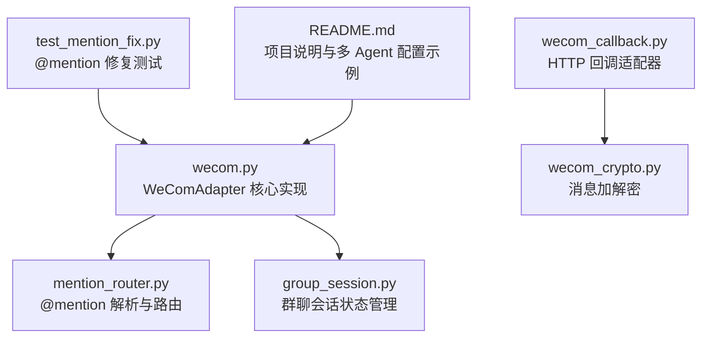
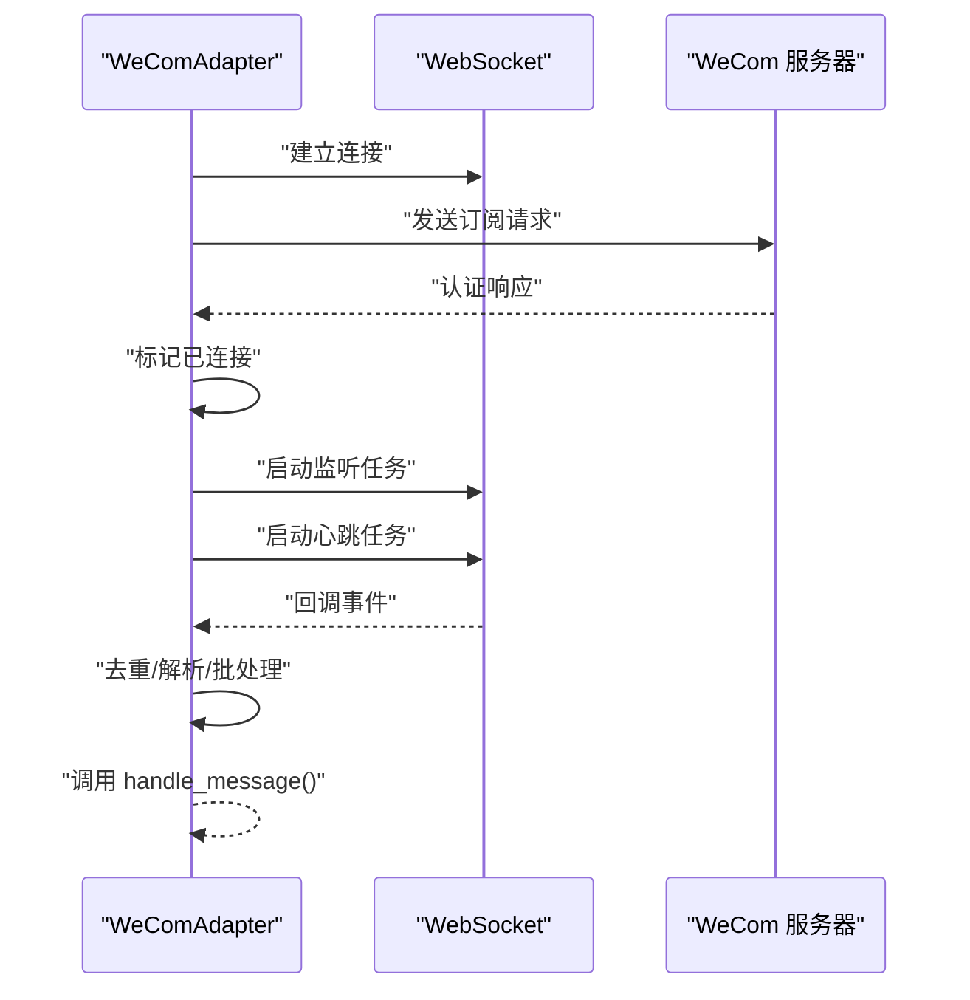
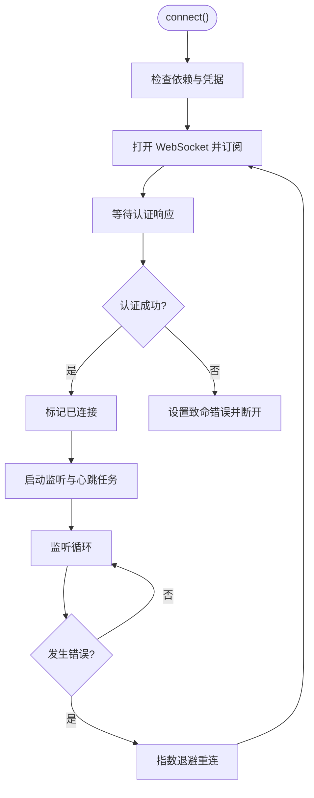
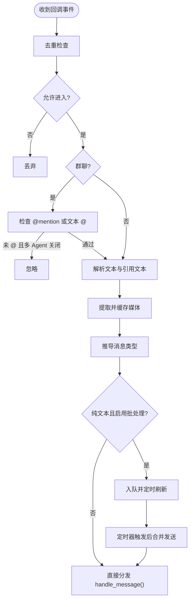
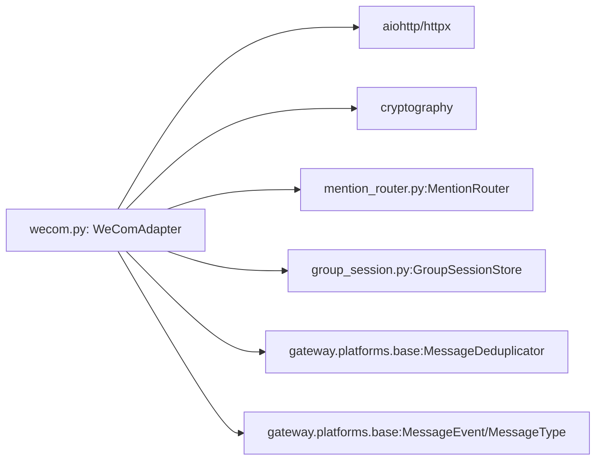

# WeCom 适配器

<cite>
**本文引用的文件**
- [wecom.py](file://wecom.py)
- [wecom_callback.py](file://wecom_callback.py)
- [wecom_crypto.py](file://wecom_crypto.py)
- [group_session.py](file://group_session.py)
- [mention_router.py](file://mention_router.py)
- [test_mention_fix.py](file://test_mention_fix.py)
- [README.md](file://README.md)
</cite>

## 目录
1. [简介](#简介)
2. [项目结构](#项目结构)
3. [核心组件](#核心组件)
4. [架构总览](#架构总览)
5. [详细组件分析](#详细组件分析)
6. [依赖关系分析](#依赖关系分析)
7. [性能考量](#性能考量)
8. [故障排除指南](#故障排除指南)
9. [结论](#结论)
10. [附录](#附录)

## 简介
本文件为 WeComAdapter 类的详细技术文档，聚焦于企业微信（WeCom）AI Bot WebSocket 模式适配器。内容涵盖：
- WebSocket 连接管理：连接建立、认证流程、心跳保持与自动重连策略
- 消息处理流程：消息解析、去重机制、文本批处理、多媒体内容提取
- 访问控制策略：私聊与群聊的权限管理
- API 方法说明：connect()、disconnect()、handle_message() 等
- 配置项详解：bot_id、secret、websocket_url 等
- 故障排除与性能优化建议

## 项目结构
该仓库包含 WeCom 相关适配器与工具模块，其中 WeComAdapter 主要位于 wecom.py，多 Agent 群聊能力由 mention_router.py 与 group_session.py 支持，回调模式适配器位于 wecom_callback.py，消息加解密工具位于 wecom_crypto.py。

图表来源
- [wecom.py:160-1774](file://wecom.py#L160-L1774)
- [mention_router.py:1-155](file://mention_router.py#L1-L155)
- [group_session.py:1-188](file://group_session.py#L1-L188)
- [wecom_callback.py:1-388](file://wecom_callback.py#L1-L388)
- [wecom_crypto.py:1-143](file://wecom_crypto.py#L1-L143)
- [test_mention_fix.py:1-133](file://test_mention_fix.py#L1-L133)
- [README.md:1-43](file://README.md#L1-L43)

章节来源
- [wecom.py:1-1774](file://wecom.py#L1-L1774)
- [README.md:1-43](file://README.md#L1-L43)

## 核心组件
- WeComAdapter：基于持久 WebSocket 连接的企业微信适配器，负责订阅认证、接收回调事件、发送消息、上传媒体等。
- MentionRouter：解析群聊中的 @mention，支持多 Agent 触发与跨 Agent 链式对话。
- GroupSessionStore：维护群聊多 Agent 讨论链的状态，包括触发顺序、冷却时间、最大链长等。
- WeComCallbackAdapter：HTTP 回调模式适配器，用于自建应用的加密回调处理与异步回复。
- WeComCrypto：与官方 BizMsgCrypt 兼容的消息加解密工具。

章节来源
- [wecom.py:160-1774](file://wecom.py#L160-L1774)
- [mention_router.py:46-155](file://mention_router.py#L46-L155)
- [group_session.py:96-188](file://group_session.py#L96-L188)
- [wecom_callback.py:55-388](file://wecom_callback.py#L55-L388)
- [wecom_crypto.py:66-143](file://wecom_crypto.py#L66-L143)

## 架构总览
WeComAdapter 采用“订阅 + 心跳 + 事件分发”的架构：
- 连接阶段：初始化 aiohttp/httpx 客户端，建立 WebSocket，发送订阅请求并等待认证响应
- 运行阶段：启动监听任务与心跳任务；收到回调后按命令分发至消息处理
- 断开阶段：取消任务、清理资源、失败挂起请求

图表来源
- [wecom.py:212-278](file://wecom.py#L212-L278)
- [wecom.py:289-397](file://wecom.py#L289-L397)
- [wecom.py:398-423](file://wecom.py#L398-L423)

## 详细组件分析

### WeComAdapter 连接与生命周期
- 连接建立
  - 初始化 httpx/aiohttp 客户端
  - 建立 WebSocket 并设置心跳间隔
  - 发送订阅请求，携带 bot_id 与 secret
  - 等待认证响应，校验 errcode
- 断开与清理
  - 取消监听与心跳任务
  - 失败挂起请求，关闭 WebSocket 与会话
  - 清理去重表
- 心跳与重连
  - 应用层 ping（每 30 秒）
  - 监听循环异常时按指数退避重连（2, 5, 10, 30, 60）

图表来源
- [wecom.py:212-278](file://wecom.py#L212-L278)
- [wecom.py:289-397](file://wecom.py#L289-L397)

章节来源
- [wecom.py:212-278](file://wecom.py#L212-L278)
- [wecom.py:289-397](file://wecom.py#L289-L397)

### 认证流程
- 订阅命令：aibot_subscribe
- 请求体包含 bot_id 与 secret
- 等待响应，errcode 为 0 或 None 视为成功

章节来源
- [wecom.py:299-313](file://wecom.py#L299-L313)
- [wecom.py:314-337](file://wecom.py#L314-L337)

### 心跳与自动重连
- 应用层 ping：每 30 秒发送 ping 命令
- 监听循环异常时按 [2, 5, 10, 30, 60] 秒退避重连
- 重连成功后重新订阅

章节来源
- [wecom.py:378-397](file://wecom.py#L378-L397)
- [wecom.py:338-363](file://wecom.py#L338-L363)

### 消息处理流程
- 去重：以 msgid 为键，结合 req_id 映射，避免重复处理
- 权限校验：私聊与群聊分别依据策略与白名单过滤
- 群聊 @ 与多 Agent：优先检查 mentioned_userid_list；未 @ 时使用 MentionRouter 解析文本中的 @
- 文本批处理：对连续短消息进行合并，避免 WeCom 客户端侧拆分影响
- 媒体提取：从回调体中抽取图片/文件/语音/附件，并下载或解码缓存
- 事件构建：组装 MessageEvent，调用 handle_message()

图表来源
- [wecom.py:495-586](file://wecom.py#L495-L586)
- [wecom.py:600-656](file://wecom.py#L600-L656)
- [wecom.py:705-748](file://wecom.py#L705-L748)

章节来源
- [wecom.py:495-586](file://wecom.py#L495-L586)
- [wecom.py:600-656](file://wecom.py#L600-L656)
- [wecom.py:705-748](file://wecom.py#L705-L748)

### 去重机制
- 使用 MessageDeduplicator 维护去重表
- 以 msgid 为主键，同时记录 req_id 映射，便于回复关联
- 超限时淘汰最旧条目

章节来源
- [wecom.py:193-194](file://wecom.py#L193-L194)
- [wecom.py:890-898](file://wecom.py#L890-L898)

### 文本批处理
- 会话级键：根据会话键生成批处理键
- 近似 4000 字符阈值：当最后块接近阈值时延长刷新延迟
- 合并文本与媒体列表，定时器触发后统一派发

章节来源
- [wecom.py:591-656](file://wecom.py#L591-L656)

### 媒体内容提取与上传
- 提取规则：mixed/text/voice/appmsg/image/file/quote 等
- 缓存策略：base64 直接解码或远程下载，必要时 AES 解密
- 上传流程：init → chunk × N → finish，返回 media_id
- 发送策略：回复消息使用 reply_req_id，否则使用普通发送

章节来源
- [wecom.py:705-799](file://wecom.py#L705-L799)
- [wecom.py:1422-1479](file://wecom.py#L1422-L1479)
- [wecom.py:1480-1522](file://wecom.py#L1480-L1522)

### 访问控制策略
- 私聊策略：open/allowlist/disabled/pairing
- 群聊策略：open/allowlist/disabled
- 群组细粒度：支持按群 ID 的 allow_from
- 白名单匹配：支持通配符与规范化

章节来源
- [wecom.py:859-889](file://wecom.py#L859-L889)

### 多 Agent 群聊与会话链
- @mention 解析：MentionRouter 支持多 Agent、默认 Agent、边界匹配
- 会话链：GroupSessionStore 维护讨论链，含最大链长、冷却时间、中断标记
- 跨 Agent 链式：根据上一 Agent 响应中的 @mention 自动触发下一 Agent

章节来源
- [mention_router.py:46-155](file://mention_router.py#L46-L155)
- [group_session.py:96-188](file://group_session.py#L96-L188)
- [wecom.py:909-1181](file://wecom.py#L909-L1181)

### API 方法说明
- connect()：建立连接、订阅认证、启动任务
- disconnect()：断开连接、取消任务、清理资源
- handle_message()：由框架调用，处理消息事件
- send()/send_image()/send_document()/send_voice()/send_video()：发送消息与媒体
- send_image_file()：发送本地图片文件
- send_typing()：占位方法（WeCom 不支持打字指示）
- get_chat_info()：返回聊天信息

章节来源
- [wecom.py:212-278](file://wecom.py#L212-L278)
- [wecom.py:1616-1774](file://wecom.py#L1616-L1774)

### 配置选项
- bot_id：企业微信机器人 ID（环境变量 WECOM_BOT_ID）
- secret：企业微信机器人密钥（环境变量 WECOM_SECRET）
- websocket_url：WebSocket 地址（默认 wss://openws.work.weixin.qq.com）
- dm_policy/group_policy：私聊/群聊策略（open/allowlist/disabled）
- allow_from/group_allow_from：白名单列表
- groups：按群 ID 的细粒度配置
- multi_agent：多 Agent 群聊配置（enabled、default_agent、agents、cross_agent）

章节来源
- [wecom.py:17-28](file://wecom.py#L17-L28)
- [wecom.py:168-186](file://wecom.py#L168-L186)
- [README.md:21-38](file://README.md#L21-L38)

## 依赖关系分析
WeComAdapter 依赖外部库与内部组件：
- aiohttp/httpx：WebSocket 与 HTTP 下载
- cryptography：媒体解密
- MentionRouter/GroupSessionStore：多 Agent 能力
- MessageDeduplicator：去重
- MessageEvent/MessageType：消息模型与类型

图表来源
- [wecom.py:30-70](file://wecom.py#L30-L70)
- [wecom.py:160-1774](file://wecom.py#L160-L1774)
- [mention_router.py:1-155](file://mention_router.py#L1-L155)
- [group_session.py:1-188](file://group_session.py#L1-L188)

章节来源
- [wecom.py:30-70](file://wecom.py#L30-L70)
- [wecom.py:160-1774](file://wecom.py#L160-L1774)

## 性能考量
- 文本批处理：减少频繁拆分带来的多次派发
- 媒体上传：分片上传，避免超大文件一次性传输
- 去重与会话键：降低重复处理与内存占用
- 心跳与重连：维持连接稳定性，减少认证抖动
- 多 Agent 链：通过冷却与最大链长限制，避免风暴式并发

[本节为通用指导，无需特定文件来源]

## 故障排除指南
- 依赖缺失
  - 现象：启动时报错提示缺少 aiohttp/httpx
  - 处理：安装依赖并重启
- 认证失败
  - 现象：订阅响应 errcode 非 0
  - 处理：核对 bot_id/secret 是否正确
- 连接中断
  - 现象：监听循环异常后自动重连
  - 处理：检查网络与防火墙；关注日志中的重连次数
- 媒体发送失败
  - 现象：大小/格式超出限制或解密失败
  - 处理：检查文件大小与格式；确认 AES key 有效
- 群聊未触发
  - 现象：未 @ 机器人但多 Agent 未生效
  - 处理：确认 MentionRouter 配置与文本 @ 匹配规则

章节来源
- [wecom.py:214-246](file://wecom.py#L214-L246)
- [wecom.py:314-337](file://wecom.py#L314-L337)
- [wecom.py:1217-1278](file://wecom.py#L1217-L1278)
- [wecom.py:1295-1320](file://wecom.py#L1295-L1320)

## 结论
WeComAdapter 提供了稳定的企业微信 WebSocket 适配能力，具备完善的连接管理、消息处理与多 Agent 群聊支持。通过合理的配置与监控，可在生产环境中可靠运行。

[本节为总结性内容，无需特定文件来源]

## 附录

### API 方法参考（概览）
- connect()：建立连接并启动监听与心跳
- disconnect()：断开连接并清理资源
- handle_message()：框架回调入口，处理消息事件
- send()/send_image()/send_document()/send_voice()/send_video()：发送消息与媒体
- send_image_file()：发送本地图片
- send_typing()：占位方法
- get_chat_info()：查询聊天信息

章节来源
- [wecom.py:212-278](file://wecom.py#L212-L278)
- [wecom.py:1616-1774](file://wecom.py#L1616-L1774)

### 配置项参考（概览）
- bot_id/secret/websocket_url：基础连接参数
- dm_policy/group_policy/allow_from/group_allow_from/groups：访问控制
- multi_agent：多 Agent 群聊配置

章节来源
- [wecom.py:17-28](file://wecom.py#L17-L28)
- [wecom.py:168-186](file://wecom.py#L168-L186)
- [README.md:21-38](file://README.md#L21-L38)

### @mention 修复测试
- 验证 mentioned_userid_list 与文本 @ 的识别逻辑
- 确保群聊未 @ 时不触发

章节来源
- [test_mention_fix.py:8-77](file://test_mention_fix.py#L8-L77)
- [test_mention_fix.py:80-116](file://test_mention_fix.py#L80-L116)