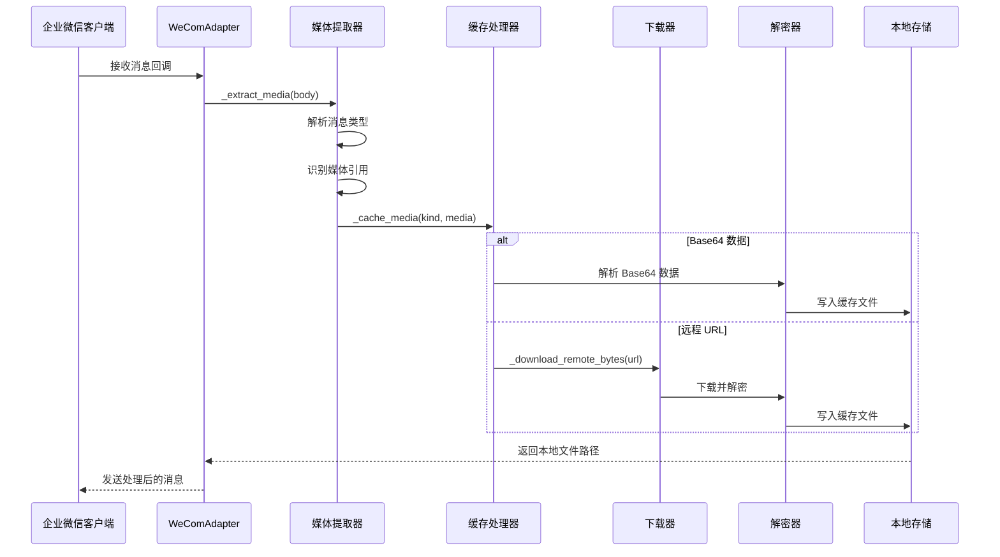
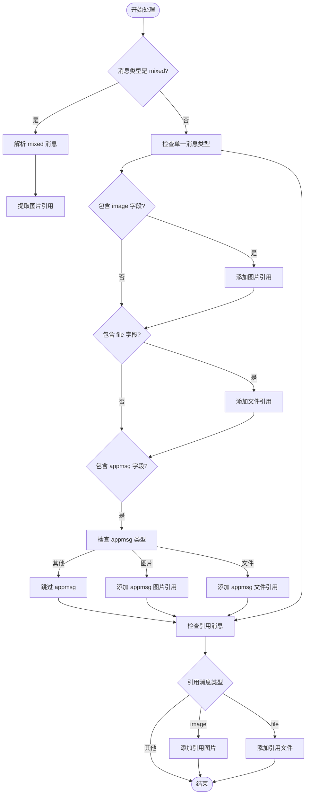
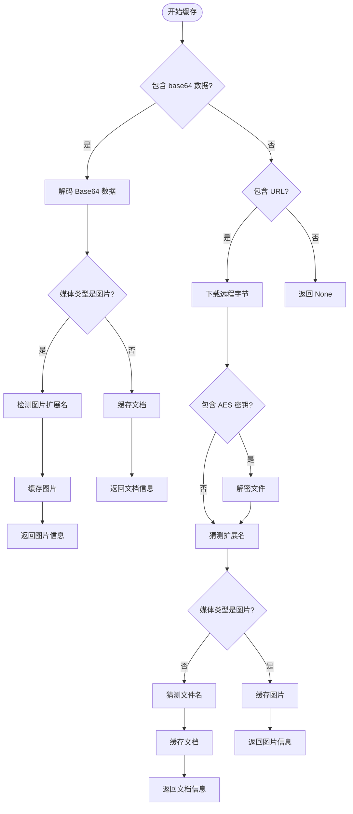
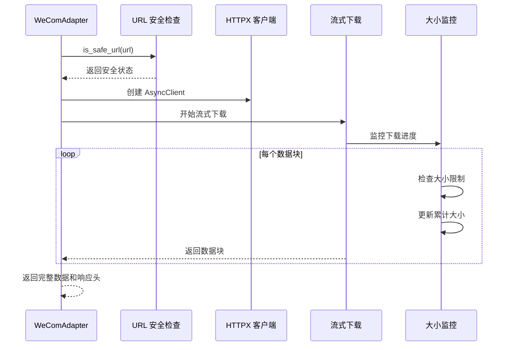
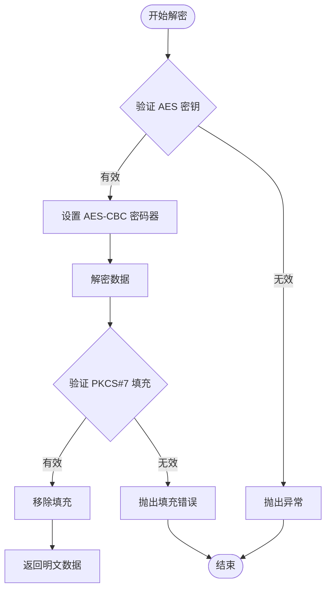

# 多媒体内容提取

<cite>
**本文档引用的文件**
- [wecom.py](file://wecom.py)
- [wecom_crypto.py](file://wecom_crypto.py)
- [wecom_callback.py](file://wecom_callback.py)
- [group_session.py](file://group_session.py)
- [mention_router.py](file://mention_router.py)
</cite>

## 目录
1. [简介](#简介)
2. [项目结构](#项目结构)
3. [核心组件](#核心组件)
4. [架构概览](#架构概览)
5. [详细组件分析](#详细组件分析)
6. [依赖关系分析](#依赖关系分析)
7. [性能考虑](#性能考虑)
8. [故障排除指南](#故障排除指南)
9. [结论](#结论)

## 简介

本文档深入解析 WeComAdapter 的多媒体提取系统，重点涵盖 `_extract_media()` 和 `_cache_media()` 方法的完整处理流程。该系统负责从企业微信消息中提取图片、文件和混合消息中的多媒体内容，实现智能缓存机制、远程资源下载处理以及安全的文件解密功能。

系统支持多种输入源：直接的 Base64 编码数据、远程 URL 下载、以及加密的 WeCom 媒体文件。所有处理都遵循严格的安全策略，包括 URL 安全性检查、文件大小限制和内容类型验证。

## 项目结构

WeCom 插件采用模块化设计，主要包含以下核心文件：

```mermaid
graph TB
subgraph "WeCom 插件核心"
A[wecom.py<br/>主适配器类]
B[wecom_crypto.py<br/>加密解密模块]
C[wecom_callback.py<br/>回调模式适配器]
end
subgraph "辅助模块"
D[group_session.py<br/>群聊会话管理]
E[mention_router.py<br/>@提及路由解析]
end
subgraph "平台基础"
F[BasePlatformAdapter<br/>基础适配器]
G[MessageEvent<br/>消息事件]
H[MessageType<br/>消息类型枚举]
end
A --> F
A --> G
A --> H
A --> B
A --> D
A --> E
C --> B
```

**图表来源**
- [wecom.py:160-1774](file://wecom.py#L160-L1774)
- [wecom_crypto.py:1-143](file://wecom_crypto.py#L1-L143)
- [wecom_callback.py:1-388](file://wecom_callback.py#L1-L388)

**章节来源**
- [wecom.py:1-100](file://wecom.py#L1-L100)
- [README.md:1-43](file://README.md#L1-L43)

## 核心组件

### WeComAdapter 主类

WeComAdapter 是整个多媒体提取系统的核心，继承自 BasePlatformAdapter，提供了完整的企业微信集成能力：

- **连接管理**：维护 WebSocket 连接，处理认证和心跳
- **消息解析**：解析企业微信回调消息，提取文本和多媒体内容
- **多媒体处理**：实现完整的多媒体提取、缓存和下载流程
- **安全控制**：实施 URL 安全检查、文件大小限制和内容类型验证

### 媒体提取方法

系统提供两个关键方法来处理多媒体内容：

1. **_extract_media()**：从消息体中提取所有可用的媒体引用
2. **_cache_media()**：将媒体引用缓存到本地存储

**章节来源**
- [wecom.py:705-748](file://wecom.py#L705-L748)
- [wecom.py:750-799](file://wecom.py#L750-L799)

## 架构概览

多媒体处理系统采用分层架构，确保功能模块的清晰分离和高内聚低耦合：



**图表来源**
- [wecom.py:705-799](file://wecom.py#L705-L799)
- [wecom.py:1322-1365](file://wecom.py#L1322-L1365)

## 详细组件分析

### _extract_media() 方法分析

该方法负责从企业微信消息中提取所有可用的媒体引用，支持多种消息格式：



**图表来源**
- [wecom.py:705-748](file://wecom.py#L705-L748)

#### 处理逻辑详解

1. **消息类型检测**：首先检查消息是否为混合类型（mixed），这是企业微信特有的复杂消息格式
2. **媒体引用收集**：遍历所有可能的媒体位置，包括主消息和引用消息
3. **类型安全验证**：确保每个媒体引用都是有效的字典对象
4. **统一处理**：将所有收集到的媒体引用传递给 `_cache_media()` 方法进行缓存

**章节来源**
- [wecom.py:705-748](file://wecom.py#L705-L748)

### _cache_media() 方法分析

这是多媒体处理的核心方法，负责将各种来源的媒体内容缓存到本地存储：



**图表来源**
- [wecom.py:750-799](file://wecom.py#L750-L799)

#### Base64 数据处理流程

当媒体以 Base64 格式直接提供时，系统执行以下步骤：

1. **数据提取**：从包含 MIME 前缀的 Base64 字符串中提取纯 Base64 数据
2. **解码验证**：使用标准 Base64 解码器转换为二进制数据
3. **类型分支处理**：
   - **图片处理**：检测图片格式并调用 `cache_image_from_bytes()`
   - **文档处理**：使用提供的文件名调用 `cache_document_from_bytes()`

#### 远程 URL 处理流程

对于远程 URL 提供的媒体，系统实施更严格的安全检查：

1. **URL 安全性验证**：使用 `is_safe_url()` 函数检查 URL 是否安全
2. **远程下载**：使用异步 HTTP 客户端流式下载媒体数据
3. **实时大小检查**：在下载过程中持续监控数据大小
4. **可选解密**：如果提供 AES 密钥，则对下载的数据进行解密
5. **内容类型推断**：根据 URL、Content-Type 和实际数据内容推断文件扩展名

**章节来源**
- [wecom.py:750-799](file://wecom.py#L750-L799)
- [wecom.py:1322-1365](file://wecom.py#L1322-L1365)

### 媒体缓存机制

系统实现了智能的本地缓存机制，确保多媒体文件的高效存储和访问：

#### 文件类型检测

系统支持多种图片格式的自动检测：

| 格式 | 检测标识 | 扩展名 |
|------|----------|--------|
| PNG | `\x89PNG\r\n\x1a\n` | .png |
| JPEG | `\xff\xd8\xff` | .jpg |
| GIF | `GIF87a` 或 `GIF89a` | .gif |
| WebP | `RIFF` + `WEBP` | .webp |

#### 内容类型推断

系统采用多层次的内容类型推断策略：

1. **HTTP 头部优先**：使用 `Content-Type` 头部值
2. **URL 后缀推断**：从 URL 路径提取文件扩展名
3. **实际数据检测**：分析文件二进制签名
4. **默认回退**：使用 `application/octet-stream`

#### 本地存储路径生成

缓存文件采用标准化的命名策略：

1. **图片文件**：使用检测到的扩展名，如 `image_123456.png`
2. **文档文件**：使用原始文件名或推断的扩展名
3. **路径组织**：所有缓存文件存储在统一的缓存目录中

**章节来源**
- [wecom.py:805-842](file://wecom.py#L805-L842)

### 远程资源下载处理

`_download_remote_bytes()` 方法实现了安全高效的远程资源下载：



**图表来源**
- [wecom.py:1322-1365](file://wecom.py#L1322-L1365)

#### 超时控制机制

系统实施多层超时保护：

- **连接超时**：默认 30 秒
- **请求超时**：默认 30 秒
- **下载超时**：流式下载过程中的持续监控
- **重连策略**：指数退避重连机制

#### 错误处理策略

1. **URL 安全性**：阻止潜在的 SSRF 攻击
2. **大小限制**：实时监控下载大小，防止内存溢出
3. **网络异常**：优雅处理网络中断和超时
4. **解码失败**：捕获并记录 Base64 解码错误

**章节来源**
- [wecom.py:1322-1365](file://wecom.py#L1322-L1365)

### 多媒体文件解密支持

系统提供了完整的 WeCom 媒体文件解密功能：

#### AES-CBC 解密流程



**图表来源**
- [wecom.py:1295-1320](file://wecom.py#L1295-L1320)

#### 解密参数验证

系统实施严格的解密参数验证：

1. **密钥长度检查**：确保 AES 密钥长度为 32 字节
2. **填充验证**：验证 PKCS#7 填充的有效性
3. **数据完整性**：检查解密后数据的完整性

**章节来源**
- [wecom.py:1295-1320](file://wecom.py#L1295-L1320)

## 依赖关系分析

多媒体处理系统依赖于多个外部库和内部模块：

```mermaid
graph TB
subgraph "外部依赖"
A[aiohttp<br/>WebSocket 客户端]
B[httpx<br/>HTTP 异步客户端]
C[cryptography<br/>加密库]
D[mimetypes<br/>MIME 类型检测]
E[base64<br/>Base64 编解码]
end
subgraph "内部模块"
F[BasePlatformAdapter<br/>基础适配器]
G[MessageEvent<br/>消息事件]
H[MessageDeduplicator<br/>去重器]
I[MentionRouter<br/>@提及路由器]
end
subgraph "工具函数"
J[cache_document_from_bytes<br/>文档缓存]
K[cache_image_from_bytes<br/>图片缓存]
L[is_safe_url<br/>URL 安全检查]
end
Adapter --> A
Adapter --> B
Adapter --> C
Adapter --> D
Adapter --> E
Adapter --> F
Adapter --> G
Adapter --> H
Adapter --> I
Adapter --> J
Adapter --> K
Adapter --> L
```

**图表来源**
- [wecom.py:39-70](file://wecom.py#L39-L70)

**章节来源**
- [wecom.py:39-70](file://wecom.py#L39-L70)

## 性能考虑

### 内存管理优化

1. **流式下载**：使用异步流式下载避免大文件占用过多内存
2. **分块处理**：对大文件实施分块处理，减少峰值内存使用
3. **及时释放**：下载完成后及时释放网络连接和临时缓冲区

### 并发处理

1. **异步操作**：所有网络操作都是异步的，避免阻塞主线程
2. **连接池**：复用 HTTP 连接，减少连接建立开销
3. **任务调度**：合理安排媒体下载和处理任务的执行顺序

### 缓存策略

1. **智能缓存**：只缓存必要的媒体文件，避免重复下载
2. **缓存清理**：定期清理过期的缓存文件
3. **磁盘空间**：监控磁盘使用情况，防止缓存占用过多空间

## 故障排除指南

### 常见问题及解决方案

#### 媒体下载失败

**症状**：`Failed to download media from URL: ...`

**可能原因**：
1. URL 不安全或被阻止
2. 网络连接超时
3. 远程服务器不可达

**解决方法**：
1. 检查 URL 安全性配置
2. 增加超时时间设置
3. 验证网络连接状态

#### Base64 解码错误

**症状**：`Failed to decode base64 media: ...`

**可能原因**：
1. Base64 数据格式不正确
2. 数据损坏或截断
3. 缺少 MIME 前缀

**解决方法**：
1. 验证 Base64 数据格式
2. 检查数据传输完整性
3. 确保包含正确的 MIME 前缀

#### AES 解密失败

**症状**：`Failed to decrypt media: ...`

**可能原因**：
1. AES 密钥长度不正确
2. 填充格式错误
3. 数据被篡改

**解决方法**：
1. 验证 AES 密钥格式和长度
2. 检查 PKCS#7 填充有效性
3. 确认数据未被修改

**章节来源**
- [wecom.py:755-786](file://wecom.py#L755-L786)
- [wecom.py:1295-1320](file://wecom.py#L1295-L1320)

## 结论

WeComAdapter 的多媒体提取系统展现了现代企业微信集成的最佳实践。通过精心设计的架构和严格的安全措施，系统能够可靠地处理各种来源的多媒体内容。

### 主要优势

1. **安全性**：实施多层安全检查，防止 SSRF 攻击和恶意文件注入
2. **可靠性**：完善的错误处理和重试机制
3. **性能**：异步处理和智能缓存策略
4. **兼容性**：支持多种媒体格式和企业微信特性

### 技术亮点

- **智能媒体识别**：自动检测和处理多种媒体格式
- **安全解密**：完整的 AES-CBC 解密支持
- **流式处理**：高效的远程资源下载
- **类型推断**：准确的内容类型和扩展名推断

该系统为企业微信应用开发提供了坚实的基础，能够满足各种复杂的多媒体处理需求。