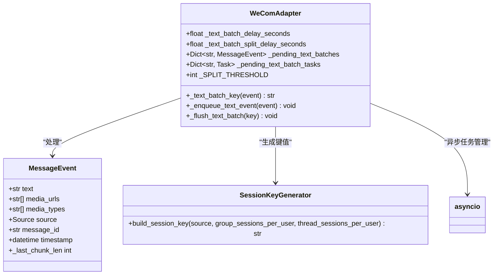
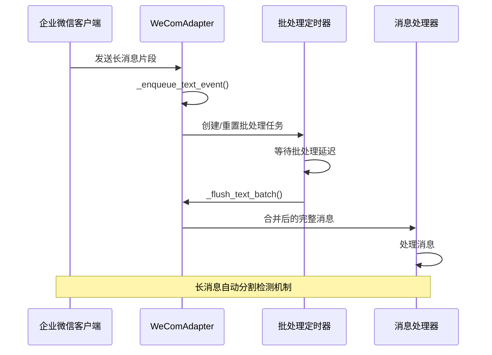
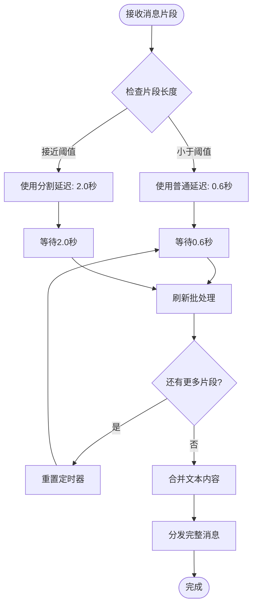
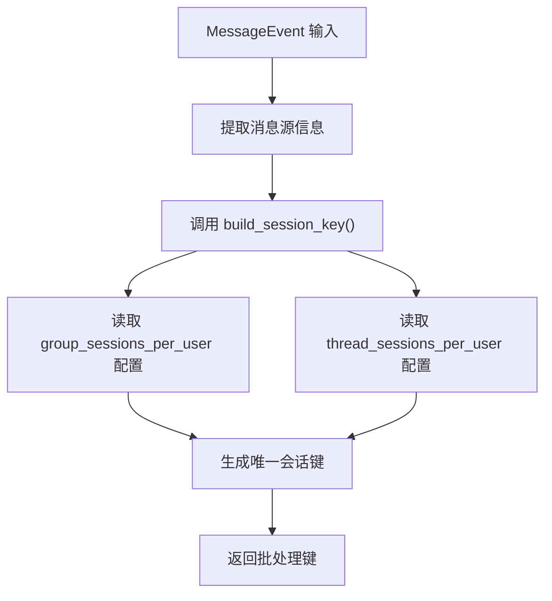
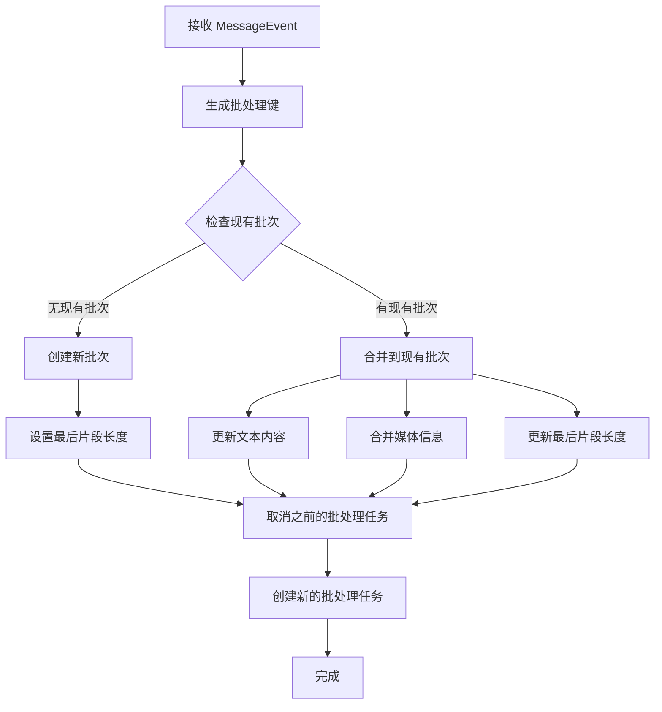
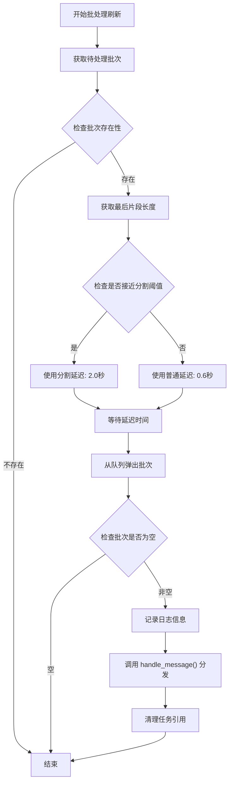
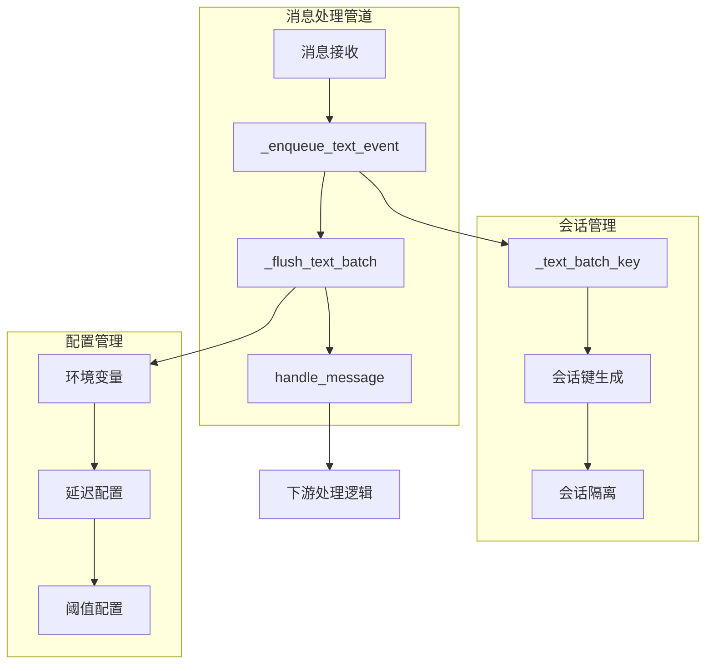

# 文本批处理与合并

<cite>
**本文档引用的文件**
- [wecom.py](file://wecom.py)
- [group_session.py](file://group_session.py)
- [mention_router.py](file://mention_router.py)
</cite>

## 目录
1. [简介](#简介)
2. [项目结构](#项目结构)
3. [核心组件](#核心组件)
4. [架构概览](#架构概览)
5. [详细组件分析](#详细组件分析)
6. [依赖关系分析](#依赖关系分析)
7. [性能考虑](#性能考虑)
8. [故障排除指南](#故障排除指南)
9. [结论](#结论)

## 简介

本文档深入解析 WeComAdapter 的文本批处理系统，重点阐述企业微信客户端消息分割机制以及相关的三个核心方法：`_text_batch_key()`、`_enqueue_text_event()` 和 `_flush_text_batch()`。该系统通过智能检测和合并企业微信客户端在长消息场景下的自动分割，显著提升用户体验和系统效率。

企业微信客户端在处理超过特定字符长度的消息时，会自动将长文本分割成多个片段，这些片段通常在几毫秒内连续到达。批处理系统通过会话级键值管理，将这些连续的片段合并为完整的消息，然后一次性分发给下游处理逻辑。

## 项目结构

WeComAdapter 所属的项目采用模块化设计，主要文件包括：

```mermaid
graph TB
subgraph "核心适配器模块"
A[wecom.py<br/>主适配器实现]
end
subgraph "会话管理模块"
B[group_session.py<br/>群组会话存储]
C[mention_router.py<br/>@提及路由]
end
subgraph "外部依赖"
D[gateway.session<br/>会话键生成]
E[MessageEvent<br/>消息事件模型]
end
A --> D
A --> E
A --> B
A --> C
B --> E
```

**图表来源**
- [wecom.py:160-206](file://wecom.py#L160-L206)
- [group_session.py:96-188](file://group_session.py#L96-L188)
- [mention_router.py:46-155](file://mention_router.py#L46-L155)

**章节来源**
- [wecom.py:160-206](file://wecom.py#L160-L206)
- [group_session.py:96-188](file://group_session.py#L96-L188)
- [mention_router.py:46-155](file://mention_router.py#L46-L155)

## 核心组件

### 文本批处理系统架构

WeComAdapter 实现了一个高效的文本批处理系统，专门处理企业微信客户端的长消息分割问题：



**图表来源**
- [wecom.py:160-206](file://wecom.py#L160-L206)
- [wecom.py:591-656](file://wecom.py#L591-L656)

### 关键配置参数

系统提供了灵活的配置选项来控制批处理行为：

| 参数名称 | 默认值 | 环境变量 | 描述 |
|---------|--------|----------|------|
| `_text_batch_delay_seconds` | 0.6秒 | `HERMES_WECOM_TEXT_BATCH_DELAY_SECONDS` | 普通消息批处理延迟时间 |
| `_text_batch_split_delay_seconds` | 2.0秒 | `HERMES_WECOM_TEXT_BATCH_SPLIT_DELAY_SECONDS` | 长消息分割检测延迟时间 |
| `_SPLIT_THRESHOLD` | 3900字符 | 固定常量 | 长消息分割阈值 |

**章节来源**
- [wecom.py:166](file://wecom.py#L166)
- [wecom.py:198-199](file://wecom.py#L198-L199)

## 架构概览

### 文本批处理工作流



**图表来源**
- [wecom.py:600-656](file://wecom.py#L600-L656)

### 近似分割检测机制

系统采用智能的近似分割检测算法，通过阈值判断来识别可能的长消息分割：



**图表来源**
- [wecom.py:630-656](file://wecom.py#L630-L656)

## 详细组件分析

### _text_batch_key() 方法

该方法负责生成会话级的批处理键值，确保不同会话的消息能够独立处理：



**图表来源**
- [wecom.py:591-598](file://wecom.py#L591-L598)

该方法的关键特性：
- **会话隔离**：每个会话拥有独立的批处理队列
- **配置驱动**：支持按用户或线程级别的会话管理
- **稳定性保证**：即使消息来源发生变化，也能正确识别同一会话

**章节来源**
- [wecom.py:591-598](file://wecom.py#L591-L598)

### _enqueue_text_event() 方法

此方法负责将接收到的消息片段缓冲到批处理队列中：



**图表来源**
- [wecom.py:600-628](file://wecom.py#L600-L628)

**章节来源**
- [wecom.py:600-628](file://wecom.py#L600-L628)

### _flush_text_batch() 方法

该方法负责在适当的时机刷新批处理队列，将合并的消息分发给下游处理：



**图表来源**
- [wecom.py:630-656](file://wecom.py#L630-L656)

**章节来源**
- [wecom.py:630-656](file://wecom.py#L630-L656)

### 近似分割阈值检测机制

系统实现了智能的长消息分割检测算法：

| 特征 | 阈值设置 | 延迟策略 | 行为说明 |
|------|----------|----------|----------|
| 正常消息 | < 3900字符 | 0.6秒 | 快速响应，避免不必要的延迟 |
| 接近阈值 | ≥ 3900字符 | 2.0秒 | 预留长消息继续分割的时间窗口 |
| 完整消息 | 无后续片段 | 自动刷新 | 立即分发合并后的完整消息 |

**章节来源**
- [wecom.py:166](file://wecom.py#L166)
- [wecom.py:640-644](file://wecom.py#L640-L644)

## 依赖关系分析

### 组件间交互关系



**图表来源**
- [wecom.py:591-656](file://wecom.py#L591-L656)

### 外部依赖关系

系统依赖于以下关键组件：

1. **会话键生成器** (`gateway.session.build_session_key`)
   - 提供稳定的会话标识符生成
   - 支持用户级别和线程级别的会话隔离

2. **消息事件模型** (`MessageEvent`)
   - 统一的消息数据结构
   - 支持文本、媒体等多种消息类型

3. **异步任务管理** (`asyncio`)
   - 非阻塞的批处理调度
   - 任务取消和清理机制

**章节来源**
- [wecom.py:593-598](file://wecom.py#L593-L598)
- [wecom.py:626-628](file://wecom.py#L626-L628)

## 性能考虑

### 内存管理策略

系统采用了高效的记忆体管理机制：

- **批量队列管理**：使用字典存储待处理的批处理队列
- **任务引用清理**：在任务完成后及时清理引用，防止内存泄漏
- **配置驱动的容量控制**：通过环境变量控制批处理行为

### 性能优化参数

| 参数 | 默认值 | 调优建议 | 影响范围 |
|------|--------|----------|----------|
| `_text_batch_delay_seconds` | 0.6秒 | 0.3-1.0秒 | 消息响应延迟 |
| `_text_batch_split_delay_seconds` | 2.0秒 | 1.5-3.0秒 | 长消息处理准确性 |
| `_SPLIT_THRESHOLD` | 3900字符 | 3800-4000字符 | 分割检测灵敏度 |

### 错误恢复机制

系统具备完善的错误处理和恢复能力：

1. **任务取消保护**：批处理任务在重新入队时会被正确取消
2. **异常隔离**：批处理过程中的异常不会影响其他会话
3. **资源清理**：确保所有临时资源在任务结束后得到清理

## 故障排除指南

### 常见问题诊断

1. **消息未正确合并**
   - 检查 `_text_batch_delay_seconds` 设置是否过短
   - 验证会话键生成逻辑是否正常工作

2. **批处理超时**
   - 调整 `_text_batch_split_delay_seconds` 增加等待时间
   - 检查网络连接稳定性

3. **内存占用过高**
   - 监控 `_pending_text_batches` 队列长度
   - 检查任务清理机制是否正常工作

### 调试技巧

- 启用详细的日志记录以跟踪批处理状态
- 使用环境变量进行动态配置调整
- 监控批处理队列的积压情况

**章节来源**
- [wecom.py:654-656](file://wecom.py#L654-L656)

## 结论

WeComAdapter 的文本批处理系统通过智能的分割检测和合并机制，有效解决了企业微信客户端长消息分割带来的用户体验问题。系统的设计充分考虑了性能、稳定性和可维护性，为大规模消息处理提供了可靠的解决方案。

该系统的核心优势在于：
- **智能分割检测**：通过阈值判断准确识别长消息分割
- **会话级隔离**：确保不同会话的消息处理互不干扰
- **灵活的配置**：支持运行时参数调整以适应不同场景需求
- **健壮的错误处理**：提供完善的任务管理和资源清理机制

通过合理配置和监控，该系统能够在保证消息处理准确性的同时，最大化提升系统的整体性能和用户体验。