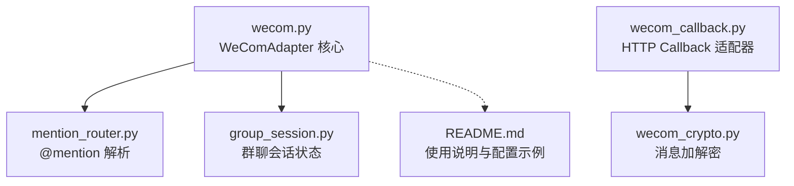
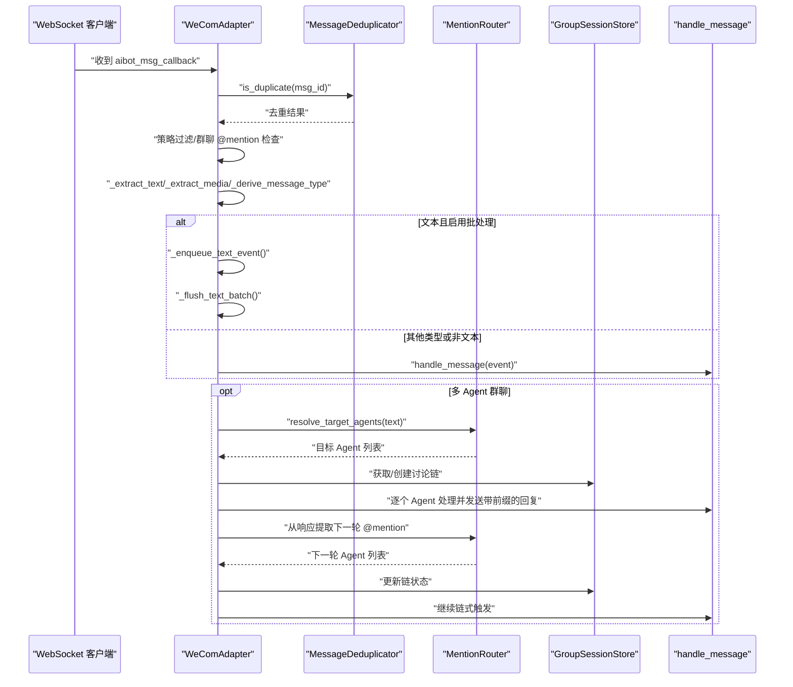
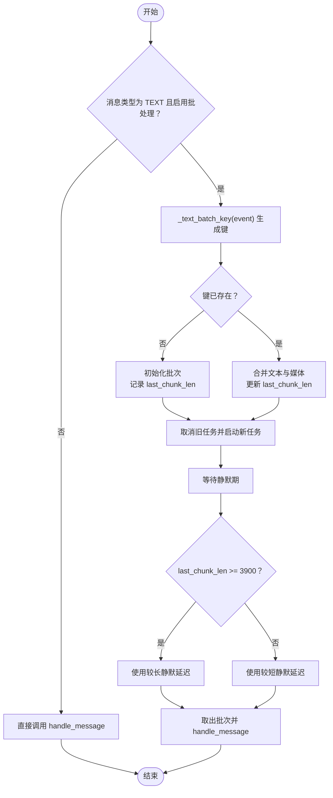
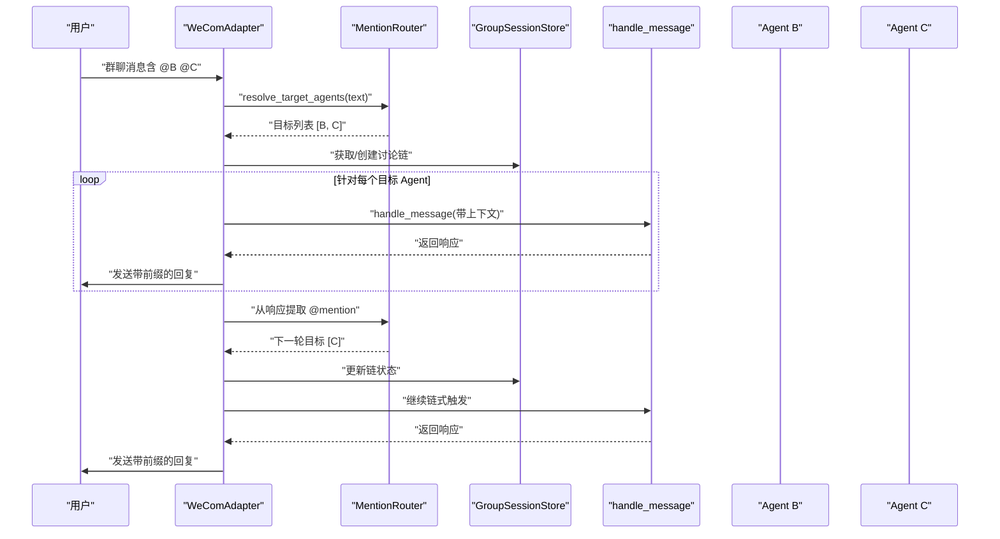
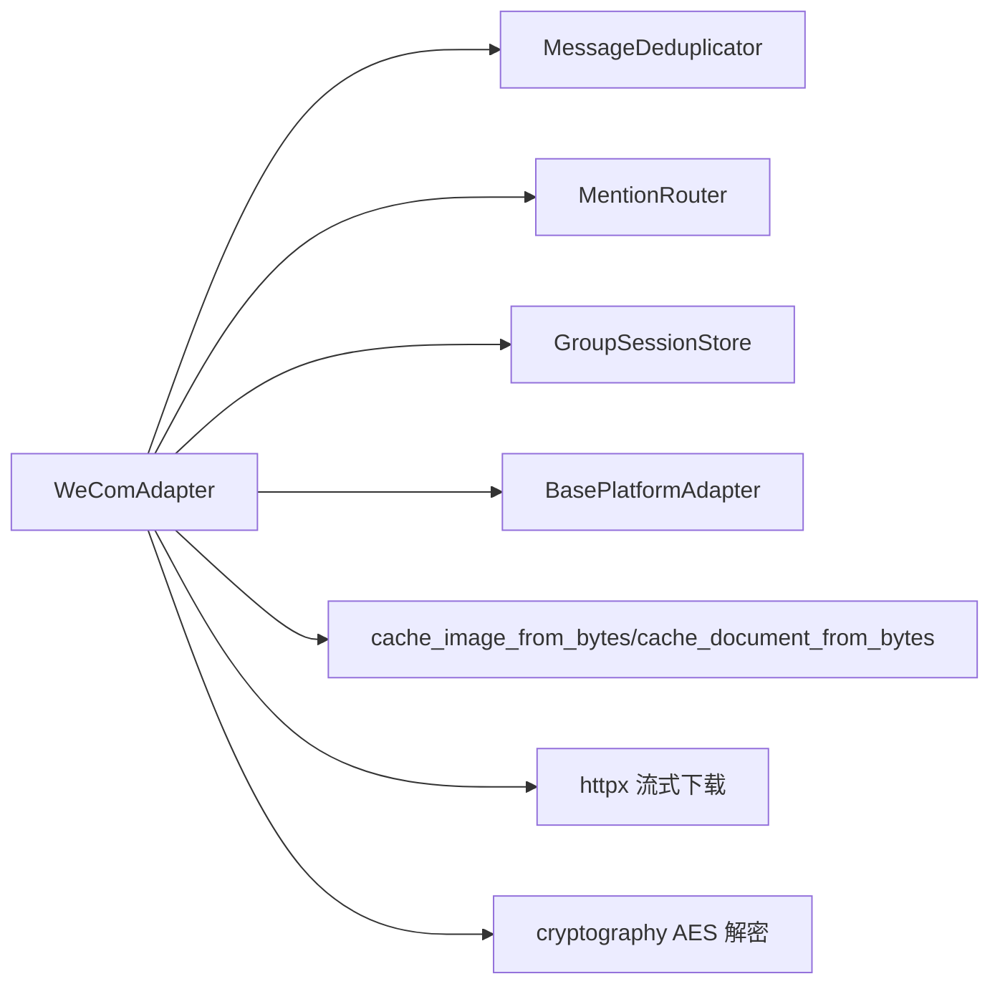

# 消息处理

<cite>
**本文引用的文件列表**
- [wecom.py](file://wecom.py)
- [mention_router.py](file://mention_router.py)
- [group_session.py](file://group_session.py)
- [wecom_callback.py](file://wecom_callback.py)
- [wecom_crypto.py](file://wecom_crypto.py)
- [README.md](file://README.md)
</cite>

## 目录
1. [简介](#简介)
2. [项目结构](#项目结构)
3. [核心组件](#核心组件)
4. [架构总览](#架构总览)
5. [详细组件分析](#详细组件分析)
6. [依赖关系分析](#依赖关系分析)
7. [性能考量](#性能考量)
8. [故障排查指南](#故障排查指南)
9. [结论](#结论)
10. [附录](#附录)

## 简介
本文件聚焦 WeComAdapter 的消息处理系统，围绕以下目标展开：
- 深入解释 _on_message() 的完整处理逻辑与消息去重机制
- 详解文本批处理（长消息拆分合并）的工作原理，包括 _text_batch_key()、_enqueue_text_event()、_flush_text_batch()
- 说明消息类型识别、多媒体内容提取与回复上下文处理
- 提供消息处理的配置项、性能调优建议与错误处理策略
- 给出常见消息格式示例与处理流程图

## 项目结构
WeComAdapter 主要由以下模块组成：
- wecom.py：企业微信 WebSocket 模式适配器，包含消息解析、去重、文本批处理、多媒体下载与上传、多 Agent 群聊路由等核心逻辑
- mention_router.py：群聊 @mention 解析与多 Agent 路由
- group_session.py：群聊会话状态存储（用于多 Agent 讨论链）
- wecom_callback.py：企业微信 HTTP Callback 模式适配器（与 WebSocket 模式互补）
- wecom_crypto.py：回调模式的消息加解密工具

图表来源
- [wecom.py:160-1774](file://wecom.py#L160-L1774)
- [mention_router.py:1-155](file://mention_router.py#L1-L155)
- [group_session.py:1-188](file://group_session.py#L1-L188)
- [wecom_callback.py:1-388](file://wecom_callback.py#L1-L388)
- [wecom_crypto.py:1-143](file://wecom_crypto.py#L1-L143)

章节来源
- [README.md:1-43](file://README.md#L1-L43)

## 核心组件
- WeComAdapter：负责连接、认证、接收回调、消息解析、去重、文本批处理、多媒体下载与上传、多 Agent 群聊路由、发送响应等
- MentionRouter：解析群聊中的 @mention，决定目标 Agent 列表，并支持从 Agent 响应中提取下一轮 @mention
- GroupSessionStore：维护群聊讨论链的状态，控制链长度、冷却时间、中断与清理
- WXBizMsgCrypt：HTTP Callback 模式的加解密工具

章节来源
- [wecom.py:160-1774](file://wecom.py#L160-L1774)
- [mention_router.py:46-155](file://mention_router.py#L46-L155)
- [group_session.py:96-188](file://group_session.py#L96-L188)
- [wecom_callback.py:55-388](file://wecom_callback.py#L55-L388)
- [wecom_crypto.py:66-143](file://wecom_crypto.py#L66-L143)

## 架构总览
WeComAdapter 的消息处理路径如下：
- WebSocket 接收回调事件
- 去重校验
- 策略过滤（私聊/群聊白名单/禁用策略）
- 解析文本与引用文本、提取多媒体
- 判断消息类型（文本/图片/语音/文档）
- 文本批处理（长消息拆分合并）
- 多 Agent 群聊路由（按 @mention 决定目标 Agent）
- 调用 handle_message 分发给上层处理
- 发送响应（Markdown 或媒体）

图表来源
- [wecom.py:495-586](file://wecom.py#L495-L586)
- [wecom.py:600-656](file://wecom.py#L600-L656)
- [wecom.py:909-1050](file://wecom.py#L909-L1050)
- [mention_router.py:102-127](file://mention_router.py#L102-L127)
- [group_session.py:104-158](file://group_session.py#L104-L158)

## 详细组件分析

### _on_message() 完整处理逻辑
- 去重：以 msg_id 为键进行去重，避免重复处理
- 策略过滤：根据私聊/群聊策略与白名单决定是否接收
- 群聊 @mention：优先检查 mentioned_userid_list，否则通过 MentionRouter 解析文本中的 @mention
- 文本与引用文本提取：支持 mixed/text/voice/appmsg 等多种消息体结构
- 多媒体提取：优先 base64，其次远程下载，支持 AES 解密
- 消息类型推断：根据媒体类型与消息类型确定最终类型
- 回复上下文：当存在引用文本且当前消息有文本或媒体时，构造 reply_to_message_id 与 reply_to_text
- 文本批处理：纯文本消息进入批处理队列，等待安静期后合并发送
- 多 Agent 群聊：若启用跨 Agent 链式路由，则按 @mention 触发对应 Agent 并自动链式触发后续 Agent

章节来源
- [wecom.py:495-586](file://wecom.py#L495-L586)
- [wecom.py:658-704](file://wecom.py#L658-L704)
- [wecom.py:705-748](file://wecom.py#L705-L748)
- [wecom.py:844-854](file://wecom.py#L844-L854)
- [wecom.py:909-1050](file://wecom.py#L909-L1050)

### 消息去重机制
- 使用 MessageDeduplicator 维护去重窗口
- 以 msg_id 作为键，若重复则忽略
- 同时记录 reply_req_id 映射，便于回复关联

章节来源
- [wecom.py:501-506](file://wecom.py#L501-L506)
- [wecom.py:890-898](file://wecom.py#L890-L898)

### 文本批处理：_text_batch_key()、_enqueue_text_event()、_flush_text_batch()
- _text_batch_key()：基于会话键生成批处理键，支持按用户/群组/线程维度隔离
- _enqueue_text_event()：将新文本事件合并到现有批次，追加媒体信息，重置刷新任务
- _flush_text_batch()：根据最后块长度判断是否接近 WeCom 4000 字符阈值，采用不同静默延迟，最终统一发送

图表来源
- [wecom.py:591-598](file://wecom.py#L591-L598)
- [wecom.py:600-629](file://wecom.py#L600-L629)
- [wecom.py:630-656](file://wecom.py#L630-L656)

章节来源
- [wecom.py:591-656](file://wecom.py#L591-L656)

### 消息类型识别与多媒体提取
- 类型识别：依据媒体类型前缀与消息类型字段综合判断
- 文本提取：mixed 结构中的 text 子项、voice 的识别文本、appmsg 的标题
- 引用文本：支持 text/voice 引用
- 多媒体提取：优先 base64 直接缓存，其次远程下载并可 AES 解密，自动猜测扩展名与 MIME 类型

章节来源
- [wecom.py:844-854](file://wecom.py#L844-L854)
- [wecom.py:658-704](file://wecom.py#L658-L704)
- [wecom.py:705-748](file://wecom.py#L705-L748)
- [wecom.py:750-799](file://wecom.py#L750-L799)

### 回复上下文处理
- 当存在引用文本且当前消息包含文本或媒体时，设置 reply_to_message_id 与 reply_to_text
- 用于在上层构建“引用回复”语义

章节来源
- [wecom.py:546-573](file://wecom.py#L546-L573)

### 多 Agent 群聊路由与链式触发
- 解析 @mention 决定目标 Agent 列表，若为空则回退到默认 Agent
- 获取/创建群聊讨论链，记录对话上下文与 Agent 轮次
- 对每个目标 Agent 生成带上下文的事件并调用 handle_message
- 从最后一个 Agent 的响应中提取新的 @mention，按冷却与链深限制继续链式触发
- 支持中断与清理，防止无限循环

图表来源
- [wecom.py:909-1050](file://wecom.py#L909-L1050)
- [wecom.py:1051-1181](file://wecom.py#L1051-L1181)
- [mention_router.py:102-147](file://mention_router.py#L102-L147)
- [group_session.py:104-158](file://group_session.py#L104-L158)

章节来源
- [wecom.py:909-1181](file://wecom.py#L909-L1181)
- [mention_router.py:102-147](file://mention_router.py#L102-L147)
- [group_session.py:104-158](file://group_session.py#L104-L158)

## 依赖关系分析
- WeComAdapter 依赖：
  - MessageDeduplicator：去重
  - MentionRouter：@mention 解析与多 Agent 路由
  - GroupSessionStore：群聊会话状态
  - 基类 BasePlatformAdapter：通用平台适配器能力
- 多媒体处理依赖：
  - 缓存工具：cache_image_from_bytes、cache_document_from_bytes
  - 下载工具：httpx 流式下载与 SSRF 安全检查
  - 加密工具：cryptography 库进行 AES 解密

图表来源
- [wecom.py:60-70](file://wecom.py#L60-L70)
- [wecom.py:750-799](file://wecom.py#L750-L799)
- [wecom.py:1322-1365](file://wecom.py#L1322-L1365)
- [wecom.py:1295-1321](file://wecom.py#L1295-L1321)

章节来源
- [wecom.py:60-70](file://wecom.py#L60-L70)
- [wecom.py:750-799](file://wecom.py#L750-L799)
- [wecom.py:1322-1365](file://wecom.py#L1322-L1365)
- [wecom.py:1295-1321](file://wecom.py#L1295-L1321)

## 性能考量
- 文本批处理延迟
  - 短延迟：默认静默期，适合普通快速输入
  - 长延迟：当最后一块接近 4000 字符阈值时，延长静默期以等待可能的续传块
- 媒体下载与上传
  - 流式下载，支持内容长度预检与最大字节限制
  - 分片上传，支持最大分片数限制
- 去重窗口
  - 控制内存占用与去重效果平衡
- 多 Agent 链式触发
  - 通过冷却时间与最大链深限制防止风暴与无限循环

章节来源
- [wecom.py:196-201](file://wecom.py#L196-L201)
- [wecom.py:630-656](file://wecom.py#L630-L656)
- [wecom.py:1322-1365](file://wecom.py#L1322-L1365)
- [wecom.py:1422-1479](file://wecom.py#L1422-L1479)
- [wecom.py:890-898](file://wecom.py#L890-L898)
- [group_session.py:50-63](file://group_session.py#L50-L63)

## 故障排查指南
- 连接与认证失败
  - aiohttp/httpx 依赖缺失、bot_id/secret 未配置、握手超时
- 去重导致消息丢失
  - 检查 msg_id 是否正确传递，确认去重窗口大小
- 文本批处理未合并
  - 检查批处理延迟配置、是否为纯文本消息、是否被策略过滤
- 媒体下载失败
  - URL 不安全（SSRF 保护）、远程资源过大、网络异常
- 媒体上传失败
  - 分片过多、MD5 校验失败、WeCom 返回错误码
- 多 Agent 链式触发异常
  - @mention 模式未启用、目标 Agent 未配置、链深或冷却限制导致跳过

章节来源
- [wecom.py:212-247](file://wecom.py#L212-L247)
- [wecom.py:501-506](file://wecom.py#L501-L506)
- [wecom.py:630-656](file://wecom.py#L630-L656)
- [wecom.py:1322-1365](file://wecom.py#L1322-L1365)
- [wecom.py:1422-1479](file://wecom.py#L1422-L1479)
- [wecom.py:909-1050](file://wecom.py#L909-L1050)

## 结论
WeComAdapter 的消息处理系统通过去重、策略过滤、文本批处理与多 Agent 群聊路由，实现了对 WeCom 客户端侧长消息拆分与复杂消息类型的稳健处理。其设计兼顾了性能与可扩展性，同时提供了完善的错误处理与配置项，便于在生产环境中稳定运行。

## 附录

### 配置选项与环境变量
- 基础配置
  - bot_id、secret、websocket_url
  - 私聊策略 dm_policy 与 allow_from
  - 群聊策略 group_policy、group_allow_from、groups.*
- 文本批处理
  - HERMES_WECOM_TEXT_BATCH_DELAY_SECONDS：短静默延迟
  - HERMES_WECOM_TEXT_BATCH_SPLIT_DELAY_SECONDS：长静默延迟
- 多 Agent 群聊
  - multi_agent.enabled、default_agent、agents.*、cross_agent.enabled/maxChainLength/chainCooldownSeconds

章节来源
- [wecom.py:168-206](file://wecom.py#L168-L206)
- [wecom.py:196-201](file://wecom.py#L196-L201)
- [README.md:21-38](file://README.md#L21-L38)

### 常见消息格式示例
- 文本消息
  - body.msgtype = text，body.text.content 为纯文本
- 语音消息
  - body.msgtype = voice，body.voice.content 为识别文本
- 图片/文件/应用消息
  - mixed 结构或直接字段，image/file/appmsg
- 引用消息
  - body.quote.msgtype = text/voice，引用文本在 quote.text/content 中
- 多媒体下载
  - 优先 base64，其次 remote URL + AES key 可选解密

章节来源
- [wecom.py:658-704](file://wecom.py#L658-L704)
- [wecom.py:705-748](file://wecom.py#L705-L748)
- [wecom.py:750-799](file://wecom.py#L750-L799)