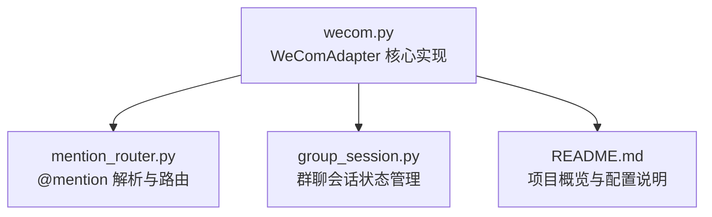
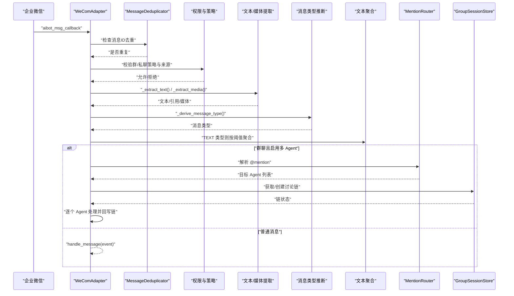
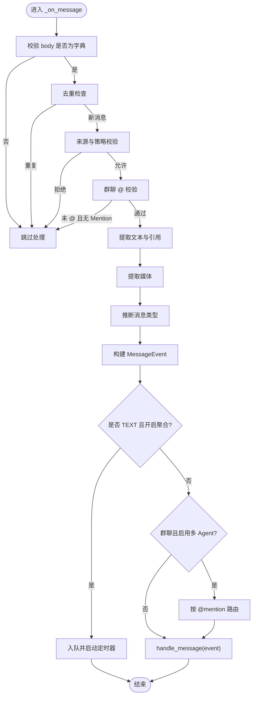
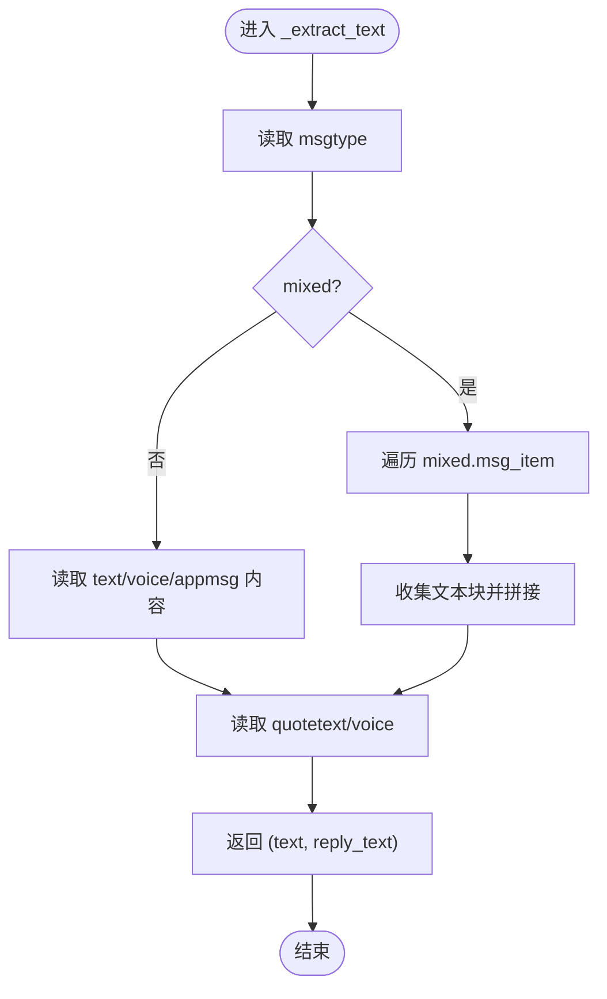
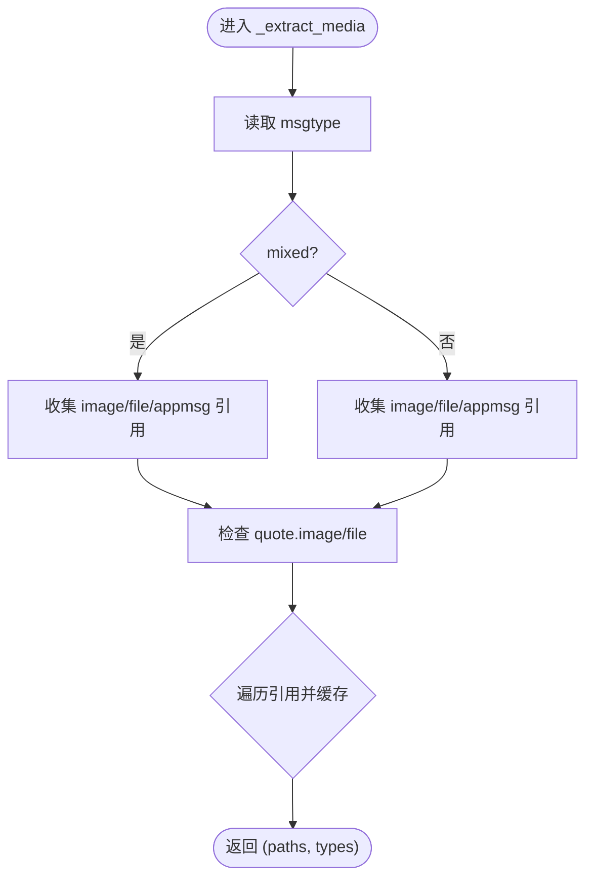
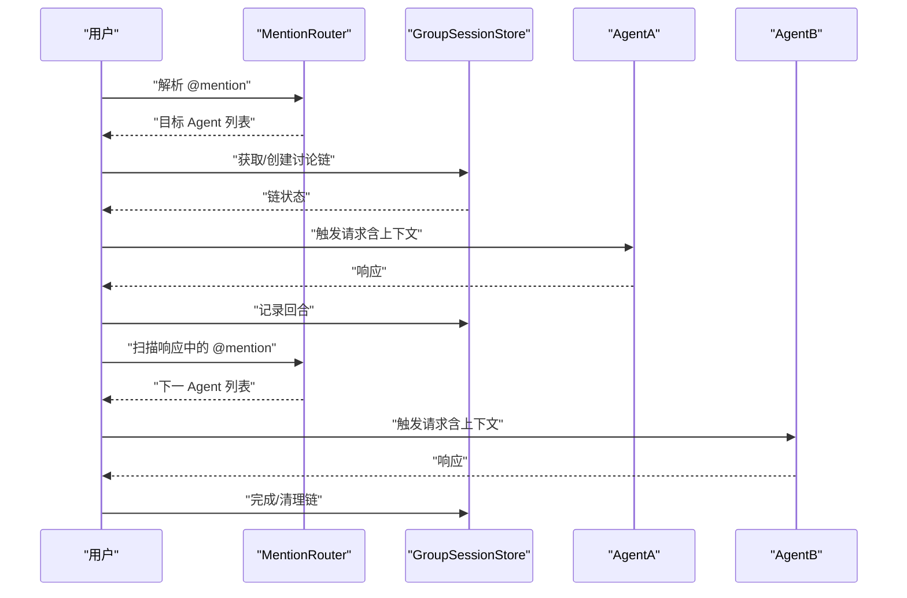
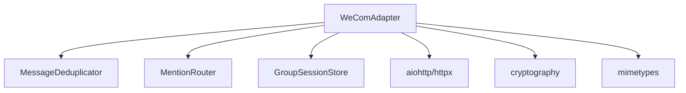

# 消息解析与类型识别

<cite>
**本文档引用的文件**
- [wecom.py](file://wecom.py)
- [mention_router.py](file://mention_router.py)
- [group_session.py](file://group_session.py)
- [README.md](file://README.md)
</cite>

## 目录
1. [简介](#简介)
2. [项目结构](#项目结构)
3. [核心组件](#核心组件)
4. [架构总览](#架构总览)
5. [详细组件分析](#详细组件分析)
6. [依赖分析](#依赖分析)
7. [性能考虑](#性能考虑)
8. [故障排查指南](#故障排查指南)
9. [结论](#结论)
10. [附录](#附录)

## 简介
本文件聚焦 WeComAdapter 的消息解析系统，围绕 _on_message() 方法的完整处理流程进行深入说明，涵盖以下主题：
- 消息去重机制（MessageDeduplicator）
- 消息来源验证与权限检查
- 消息类型识别逻辑（纯文本、混合消息、语音消息、图片消息、文件消息）
- 文本与多媒体提取方法（_extract_text()、_extract_media()）
- 配置项、错误处理策略与性能优化建议
- 实际消息格式示例与解析流程图

## 项目结构
WeComAdapter 所在仓库包含以下与消息解析直接相关的文件：
- wecom.py：企业微信 WebSocket 模式适配器，包含消息回调入口、去重、权限校验、文本与媒体提取、类型推断等核心逻辑
- mention_router.py：群聊 @mention 解析与路由，支持多 Agent 群聊
- group_session.py：群聊会话状态管理，支撑跨 Agent 链式对话
- README.md：项目概览与多 Agent 群聊能力说明

**图表来源**
- [wecom.py:160-586](file://wecom.py#L160-L586)
- [mention_router.py:46-155](file://mention_router.py#L46-L155)
- [group_session.py:96-188](file://group_session.py#L96-L188)

**章节来源**
- [README.md:1-43](file://README.md#L1-L43)

## 核心组件
- WeComAdapter：负责连接、认证、接收回调、消息解析、去重、权限校验、类型识别、文本聚合、多 Agent 路由与派发
- MessageDeduplicator：基于消息 ID 的去重缓存，避免重复处理
- MentionRouter：解析群聊 @mention，决定目标 Agent 并生成对话上下文
- GroupSessionStore：维护群聊讨论链路状态，控制链式调用深度与冷却时间

**章节来源**
- [wecom.py:160-586](file://wecom.py#L160-L586)
- [mention_router.py:46-155](file://mention_router.py#L46-L155)
- [group_session.py:96-188](file://group_session.py#L96-L188)

## 架构总览
下图展示了从企业微信回调到消息事件构建与分发的整体流程。

**图表来源**
- [wecom.py:495-586](file://wecom.py#L495-L586)
- [wecom.py:658-748](file://wecom.py#L658-L748)
- [wecom.py:845-853](file://wecom.py#L845-L853)
- [wecom.py:591-656](file://wecom.py#L591-L656)
- [mention_router.py:102-127](file://mention_router.py#L102-L127)
- [group_session.py:104-128](file://group_session.py#L104-L128)

## 详细组件分析

### WeComAdapter._on_message() 完整处理流程
- 输入：企业微信回调负载（包含 body、headers 等）
- 关键步骤：
  1) 去重：使用 MessageDeduplicator 基于 msgid 或 req_id 去重
  2) 来源与权限：解析 sender、chat_id，校验私聊/群组策略与白名单
  3) 群聊 @ 校验：若为群聊，优先检查 mentioned_userid_list；否则通过 MentionRouter 解析文本中的 @mention
  4) 文本与引用提取：调用 _extract_text() 提取正文与引用文本
  5) 媒体提取：调用 _extract_media() 提取图片/文件/附件等
  6) 类型推断：根据媒体类型与 msgtype 推断最终消息类型
  7) 引用上下文：若存在引用且有文本或媒体，则设置 reply_to_* 字段
  8) 文本聚合：对 TEXT 类型按阈值延迟合并 WeCom 客户端侧拆分的消息
  9) 多 Agent 分发：群聊且启用跨 Agent 时，按 @mention 顺序路由至各 Agent，并支持链式触发

**图表来源**
- [wecom.py:495-586](file://wecom.py#L495-L586)
- [wecom.py:658-703](file://wecom.py#L658-L703)
- [wecom.py:705-748](file://wecom.py#L705-L748)
- [wecom.py:845-853](file://wecom.py#L845-L853)
- [wecom.py:591-656](file://wecom.py#L591-L656)
- [mention_router.py:102-127](file://mention_router.py#L102-L127)

**章节来源**
- [wecom.py:495-586](file://wecom.py#L495-L586)

### 消息去重机制（MessageDeduplicator）
- 使用场景：避免同一消息多次到达导致重复处理
- 去重依据：优先使用 msgid，其次使用回调 req_id
- 存储容量：最大缓存条目数受 DEDUP_MAX_SIZE 控制
- 行为特征：一旦发现重复，立即记录日志并跳过后续处理

**章节来源**
- [wecom.py:193](file://wecom.py#L193)
- [wecom.py:501-505](file://wecom.py#L501-L505)

### 消息来源验证与权限检查
- 私聊策略（dm_policy）：
  - disabled：禁止私聊
  - allowlist：仅允许 allow_from 列表中的用户
  - open：默认开放
- 群组策略（group_policy）：
  - disabled：禁止群聊
  - allowlist：仅允许 group_allow_from 列表中的群
  - open：默认开放
- 群内来源细粒度：可针对特定群组配置 allow_from
- 白名单匹配规则：支持通配符与规范化匹配

**章节来源**
- [wecom.py:180-185](file://wecom.py#L180-L185)
- [wecom.py:859-876](file://wecom.py#L859-L876)
- [wecom.py:878-888](file://wecom.py#L878-L888)

### 消息类型识别逻辑
- 识别依据：
  - 若存在 application/text 文档类媒体：归类为 DOCUMENT
  - 若存在 image/* 媒体：当无文本时归类为 PHOTO，否则为 TEXT
  - 若 msgtype 为 voice：归类为 VOICE
  - 其他情况：归类为 TEXT
- 作用：统一下游处理与渲染策略

**章节来源**
- [wecom.py:845-853](file://wecom.py#L845-L853)

### 文本内容提取与引用回复处理（_extract_text）
- 支持的消息类型：
  - mixed：遍历 mixed.msg_item，收集文本块
  - text：提取 text.content
  - voice：提取 voice.content（语音转文本）
  - appmsg：提取 appmsg.title（AI Bot 附件标题）
- 引用回复（quote）：
  - 支持 text/voice 引用，提取引用文本作为 reply_text
- 返回值：拼接后的文本与引用文本

**图表来源**
- [wecom.py:658-703](file://wecom.py#L658-L703)

**章节来源**
- [wecom.py:658-703](file://wecom.py#L658-L703)

### 多媒体资源解析（_extract_media）
- 支持的媒体来源：
  - mixed.image
  - image/file/appmsg.file/appmsg.image
  - quote.image/file
- 缓存策略：
  - base64：解码后按扩展名缓存为图片或文档
  - URL：下载并可选 AES 解密，随后缓存
- 返回值：本地缓存路径列表与对应 Content-Type 列表

**图表来源**
- [wecom.py:705-748](file://wecom.py#L705-L748)
- [wecom.py:750-798](file://wecom.py#L750-L798)

**章节来源**
- [wecom.py:705-748](file://wecom.py#L705-L748)
- [wecom.py:750-798](file://wecom.py#L750-L798)

### 群聊 @mention 与多 Agent 路由
- @ 校验：
  - 群聊优先检查 mentioned_userid_list
  - 未 @ 时通过 MentionRouter 解析文本中的 @mention
- 多 Agent：
  - 按 @mention 出现顺序依次触发
  - 支持 Agent 回应中再次 @ 其他 Agent，形成链式调用
  - 通过 GroupSessionStore 维护讨论链，控制最大长度与冷却时间

**图表来源**
- [wecom.py:909-1181](file://wecom.py#L909-L1181)
- [mention_router.py:102-147](file://mention_router.py#L102-L147)
- [group_session.py:104-158](file://group_session.py#L104-L158)

**章节来源**
- [wecom.py:909-1181](file://wecom.py#L909-L1181)
- [mention_router.py:102-147](file://mention_router.py#L102-L147)
- [group_session.py:104-158](file://group_session.py#L104-L158)

### 文本聚合（处理 WeCom 客户端侧拆分）
- 触发条件：消息类型为 TEXT 且开启文本聚合
- 聚合策略：
  - 近似 4000 字节阈值：若最新分片接近阈值，延长等待时间
  - 合并同一会话下的连续文本分片
- 输出：一次性派发聚合后的完整文本

**章节来源**
- [wecom.py:591-656](file://wecom.py#L591-L656)

## 依赖分析
- WeComAdapter 依赖：
  - MessageDeduplicator：去重
  - MentionRouter：@mention 解析与路由
  - GroupSessionStore：群聊链式会话
  - 基础平台抽象（MessageEvent、MessageType 等）：用于事件构建与类型约束
- 外部依赖：
  - aiohttp/httpx：WebSocket 与 HTTP 下载
  - cryptography：媒体 AES 解密
  - mimetypes：内容类型推断

**图表来源**
- [wecom.py:61-70](file://wecom.py#L61-L70)
- [wecom.py:1322-1365](file://wecom.py#L1322-L1365)
- [wecom.py:1295-1321](file://wecom.py#L1295-L1321)

**章节来源**
- [wecom.py:61-70](file://wecom.py#L61-L70)
- [wecom.py:1322-1365](file://wecom.py#L1322-L1365)
- [wecom.py:1295-1321](file://wecom.py#L1295-L1321)

## 性能考虑
- 去重缓存：合理设置 DEDUP_MAX_SIZE，避免内存膨胀
- 文本聚合：通过延迟参数平衡吞吐与实时性
- 媒体下载：限制最大字节数与并发，避免大文件阻塞
- AES 解密：仅在必要时进行，减少 CPU 开销
- 多 Agent 链：控制最大链长与冷却时间，防止风暴式调用

[本节为通用建议，无需特定文件引用]

## 故障排查指南
- 连接失败
  - 检查依赖安装与环境变量（aiohttp/httpx/cryptography）
  - 查看认证失败原因（errcode/errmsg）
- 消息未处理
  - 确认去重命中与策略放行
  - 检查群聊 @ 校验是否通过
- 媒体下载/解密异常
  - URL 安全性与可达性
  - AES Key 格式与长度
- 多 Agent 链异常
  - 检查 MentionRouter 配置与正则边界
  - 关注链长度与冷却时间

**章节来源**
- [wecom.py:212-247](file://wecom.py#L212-L247)
- [wecom.py:1281-1293](file://wecom.py#L1281-L1293)
- [wecom.py:1322-1365](file://wecom.py#L1322-L1365)
- [wecom.py:1295-1321](file://wecom.py#L1295-L1321)

## 结论
WeComAdapter 的消息解析系统以 _on_message() 为核心，结合去重、权限校验、文本与媒体提取、类型推断与多 Agent 路由，实现了对多种消息形态的稳健处理。通过合理的配置与性能优化，可在保证稳定性的同时提升吞吐与用户体验。

[本节为总结性内容，无需特定文件引用]

## 附录

### 配置选项速览（关键项）
- 认证与连接
  - bot_id、secret、websocket_url
- 策略与白名单
  - dm_policy、allow_from
  - group_policy、group_allow_from、groups[*]/allow_from
- 文本聚合
  - HERMES_WECOM_TEXT_BATCH_DELAY_SECONDS、HERMES_WECOM_TEXT_BATCH_SPLIT_DELAY_SECONDS
- 多 Agent 群聊
  - multi_agent.enabled、multi_agent.default_agent、multi_agent.agents[*]、multi_agent.cross_agent.enabled、max_chain_length、chain_cooldown_seconds

**章节来源**
- [wecom.py:172-205](file://wecom.py#L172-L205)
- [wecom.py:878-888](file://wecom.py#L878-L888)
- [README.md:21-38](file://README.md#L21-L38)

### 实际消息格式示例（描述性）
- 纯文本消息
  - body.msgtype = "text"
  - body.text.content 为文本内容
- 语音消息
  - body.msgtype = "voice"
  - body.voice.content 为转写文本
- 图片消息
  - body.msgtype = "image"
  - 或 body.mixed.msg_item 中包含 image
- 文件/附件消息
  - body.msgtype = "file"
  - 或 body.appmsg.file/title
- 引用回复
  - body.quote.msgtype 可为 "text" 或 "voice"
  - body.quote.text/voice.content 为引用文本

[本节为概念性示例，无需特定文件引用]