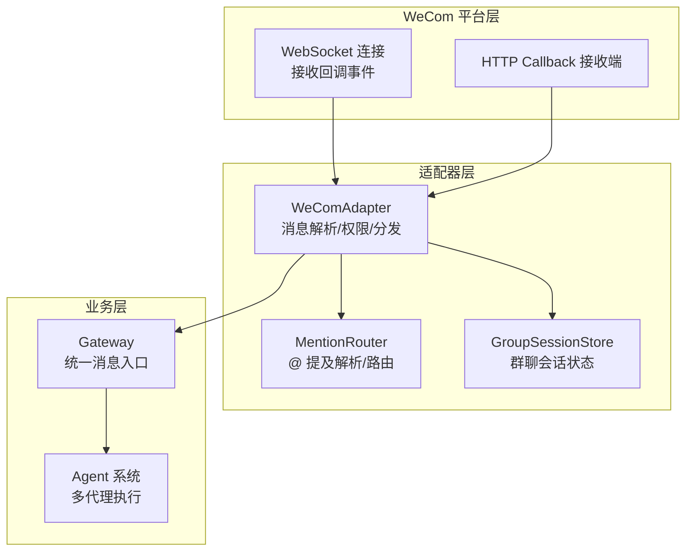
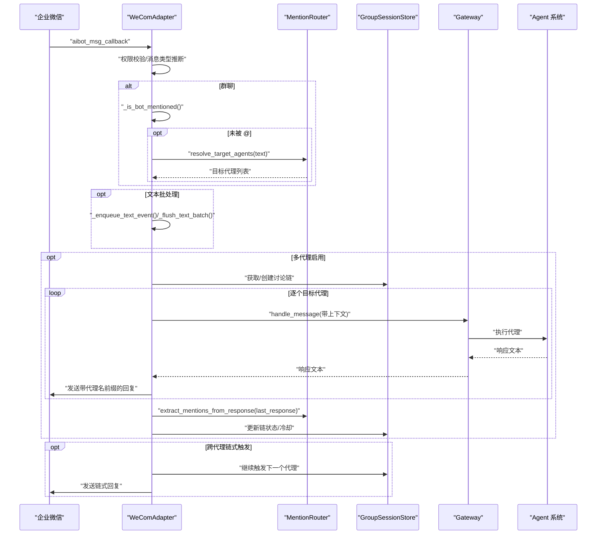
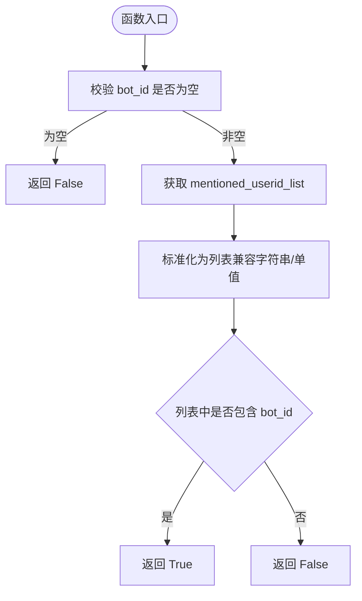
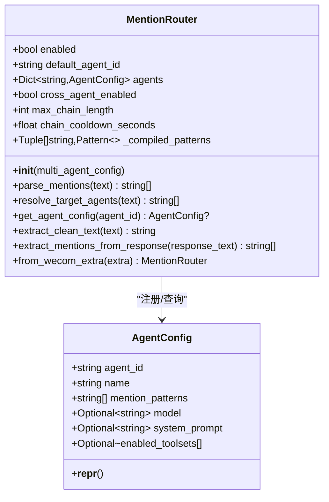
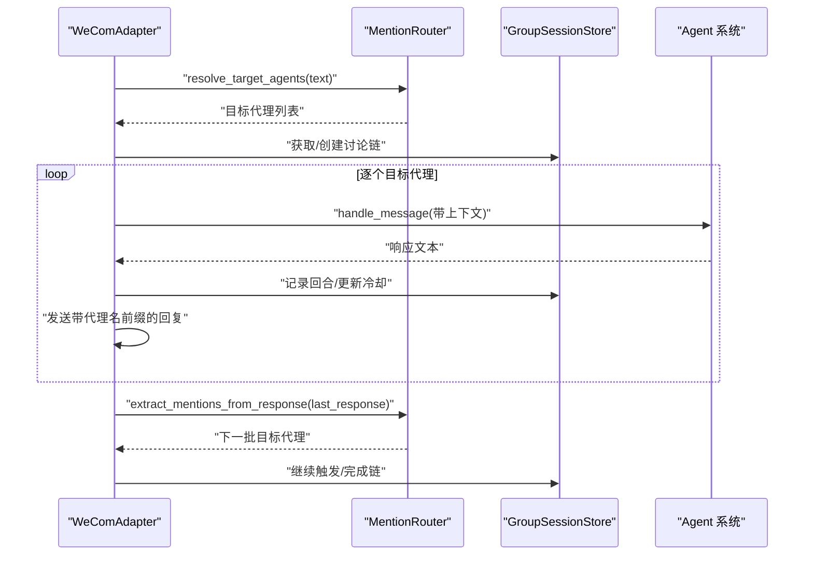
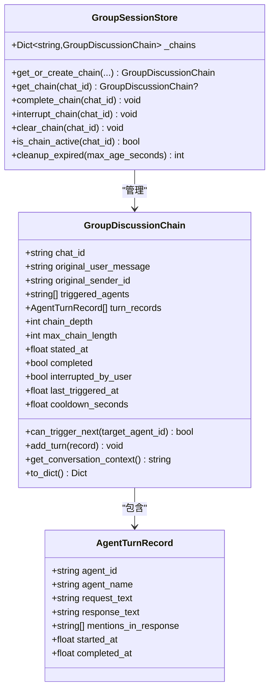
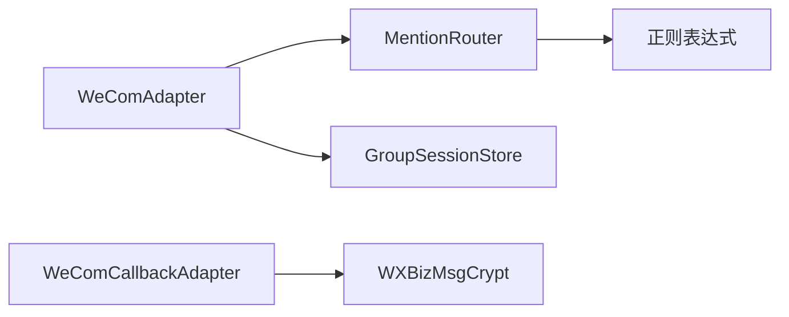

# 消息路由与分发

<cite>
**本文引用的文件**
- [wecom.py](file://wecom.py)
- [mention_router.py](file://mention_router.py)
- [group_session.py](file://group_session.py)
- [test_mention_fix.py](file://test_mention_fix.py)
- [wecom_callback.py](file://wecom_callback.py)
- [wecom_crypto.py](file://wecom_crypto.py)
- [README.md](file://README.md)
</cite>

## 目录
1. [简介](#简介)
2. [项目结构](#项目结构)
3. [核心组件](#核心组件)
4. [架构总览](#架构总览)
5. [详细组件分析](#详细组件分析)
6. [依赖关系分析](#依赖关系分析)
7. [性能考量](#性能考量)
8. [故障排查指南](#故障排查指南)
9. [结论](#结论)
10. [附录](#附录)

## 简介
本文件聚焦 WeComAdapter 的消息路由系统，系统性阐述：
- 群聊 @ 提及检测与解析
- 私聊消息处理
- 多代理协作触发与链式处理
- 立即分发与批处理策略
- 路由配置、权限控制与安全检查
- 路由流程图、@ 提及解析示例与多代理协作场景

## 项目结构
WeComAdapter 采用“适配器 + 路由器 + 会话存储”的分层设计：
- 适配器负责接入企业微信（WebSocket 或 Callback），解析消息体，执行权限校验与消息类型推断，并将消息路由至多代理系统。
- 路由器负责从文本中解析 @ 提及，确定目标代理集合，并支持从代理响应中提取二次 @ 提及以实现跨代理链式触发。
- 会话存储负责在群聊中维护一次讨论链的状态，控制链长度、冷却时间与中断状态，避免无限循环。

图表来源
- [wecom.py:160-1774](file://wecom.py#L160-L1774)
- [mention_router.py:46-155](file://mention_router.py#L46-L155)
- [group_session.py:96-188](file://group_session.py#L96-L188)

章节来源
- [wecom.py:160-1774](file://wecom.py#L160-L1774)
- [mention_router.py:46-155](file://mention_router.py#L46-L155)
- [group_session.py:96-188](file://group_session.py#L96-L188)

## 核心组件
- WeComAdapter：负责连接、消息回调分发、权限控制、消息类型推断、文本批处理、多代理路由与跨代理链式触发。
- MentionRouter：负责 @ 提及解析、目标代理选择、清理文本中的 @ 标记、从响应中提取二次 @ 提及。
- GroupSessionStore：负责群聊讨论链的生命周期管理，包括链深度、冷却时间、中断与完成状态。

章节来源
- [wecom.py:160-1774](file://wecom.py#L160-L1774)
- [mention_router.py:46-155](file://mention_router.py#L46-L155)
- [group_session.py:96-188](file://group_session.py#L96-L188)

## 架构总览
WeComAdapter 在收到回调后，按以下流程进行路由与分发：
- 权限校验：根据策略与白名单决定是否接受该消息。
- 群聊 @ 提及检测：优先使用 WeCom 提供的 mentioned_userid_list 判断是否被 @；若未被 @，则使用 MentionRouter 从文本解析 @ 提及。
- 文本批处理：对纯文本消息进行短时聚合，合并企业微信客户端侧分割的消息块。
- 多代理分发：在启用多代理且跨代理链式触发开启时，按顺序调用目标代理，生成带代理名前缀的回复并发送回群。
- 跨代理链式触发：扫描最后一个代理的回复，提取新的 @ 提及，按冷却与最大链长限制继续触发。

图表来源
- [wecom.py:495-586](file://wecom.py#L495-L586)
- [wecom.py:909-1181](file://wecom.py#L909-L1181)
- [mention_router.py:120-146](file://mention_router.py#L120-L146)
- [group_session.py:96-188](file://group_session.py#L96-L188)

## 详细组件分析

### 组件一：_is_bot_mentioned() @ 提及识别算法
- 输入：WeCom 回调消息体（含 mentioned_userid_list）、机器人 bot_id
- 输出：是否被 @ 提及
- 关键点：
  - 若 bot_id 为空，直接返回 False
  - 从消息体提取 mentioned_userid_list，兼容列表与单值字符串
  - 将 bot_id 与 mentioned 列表比对，命中即返回 True
- 作用：在群聊中优先使用企业微信提供的 @ 列表，确保准确性与性能。

图表来源
- [wecom.py:142-157](file://wecom.py#L142-L157)

章节来源
- [wecom.py:142-157](file://wecom.py#L142-L157)
- [test_mention_fix.py:8-24](file://test_mention_fix.py#L8-L24)

### 组件二：MentionRouter @ 提及解析与路由
- 功能：
  - 解析文本中的 @ 提及，返回首次出现顺序的目标代理列表
  - 支持为每个代理配置可选的 mention_patterns
  - 提供从响应中提取二次 @ 提及的能力
  - 清理文本中的 @ 标记，便于下游处理
- 关键数据结构：
  - AgentConfig：代理配置（agent_id/name/mention_patterns/模型/工具集等）
  - _compiled_patterns：预编译的正则表达式，用于快速匹配
- 路由决策：
  - 若解析到 @ 提及，按首次出现顺序返回目标代理
  - 若未解析到 @ 提及，返回空列表，调用方应使用默认代理

图表来源
- [mention_router.py:23-155](file://mention_router.py#L23-L155)

章节来源
- [mention_router.py:23-155](file://mention_router.py#L23-L155)

### 组件三：WeComAdapter 消息路由与分发
- 群聊路由：
  - 优先使用 _is_bot_mentioned() 判断是否被 @
  - 未被 @ 时，使用 MentionRouter.resolve_target_agents() 解析 @ 提及
  - 未解析到任何 @ 提及，且多代理启用，则使用默认代理
- 文本批处理：
  - 对纯文本消息设置短延迟聚合，合并企业微信客户端侧分割的长消息
  - 当最后一条分片接近阈值时，延长等待时间以确保完整聚合
- 多代理分发：
  - 为每个目标代理构建带上下文的合成事件（包含历史对话）
  - 逐个调用 handle_message，记录回合并发送带代理名前缀的回复
- 跨代理链式触发：
  - 扫描最后一个代理的回复，提取新的 @ 提及
  - 基于链深度与冷却时间判断是否继续触发
  - 支持递归扫描，直到无新 @ 提及或达到最大链长

图表来源
- [wecom.py:909-1181](file://wecom.py#L909-L1181)
- [group_session.py:96-188](file://group_session.py#L96-L188)

章节来源
- [wecom.py:495-586](file://wecom.py#L495-L586)
- [wecom.py:909-1181](file://wecom.py#L909-L1181)

### 组件四：GroupSessionStore 群聊会话状态
- 记录一次讨论链的原始消息、触发代理序列、回合记录、链深、冷却时间与完成状态
- 提供 can_trigger_next() 控制链深与冷却
- 提供 get_conversation_context() 生成上下文字符串，供代理执行时使用

图表来源
- [group_session.py:21-188](file://group_session.py#L21-L188)

章节来源
- [group_session.py:21-188](file://group_session.py#L21-L188)

### 组件五：权限控制与安全检查
- 策略与白名单：
  - 私聊策略：disabled/open/allowlist，支持 allow_from 白名单
  - 群聊策略：disabled/open/allowlist，支持 group_allow_from 白名单与群级 allow_from
  - 群级配置支持通配符与大小写不敏感匹配
- 安全检查：
  - 企业微信回调模式使用 WXBizMsgCrypt 进行签名验证与解密
  - 下载远端媒体时进行 URL 安全性检查与大小限制
  - 媒体上传前进行类型与大小校验，必要时降级为文件类型发送

章节来源
- [wecom.py:859-889](file://wecom.py#L859-L889)
- [wecom_callback.py:232-276](file://wecom_callback.py#L232-L276)
- [wecom_crypto.py:66-143](file://wecom_crypto.py#L66-L143)
- [wecom.py:1217-1278](file://wecom.py#L1217-L1278)

## 依赖关系分析
- WeComAdapter 依赖 MentionRouter 进行 @ 提及解析与路由
- WeComAdapter 依赖 GroupSessionStore 维护群聊讨论链状态
- WeComCallbackAdapter 依赖 WXBizMsgCrypt 进行回调消息的解密与签名验证
- MentionRouter 依赖正则表达式进行 @ 提及匹配

图表来源
- [wecom.py:60-70](file://wecom.py#L60-L70)
- [wecom_callback.py:40](file://wecom_callback.py#L40)
- [wecom_crypto.py:66-143](file://wecom_crypto.py#L66-L143)
- [mention_router.py:92-100](file://mention_router.py#L92-L100)

章节来源
- [wecom.py:60-70](file://wecom.py#L60-L70)
- [wecom_callback.py:40](file://wecom_callback.py#L40)
- [wecom_crypto.py:66-143](file://wecom_crypto.py#L66-L143)
- [mention_router.py:92-100](file://mention_router.py#L92-L100)

## 性能考量
- 文本批处理：对纯文本消息设置短延迟聚合，避免频繁发送与重复渲染；当最后一条分片接近阈值时延长等待时间，提升完整性。
- 跨代理链式触发：通过冷却时间与最大链长限制，避免无限循环与资源耗尽。
- 媒体处理：下载与上传采用流式处理与分块上传，结合大小限制与降级策略，减少内存占用与网络压力。
- 正则匹配：预编译正则表达式，降低每次匹配的开销。

## 故障排查指南
- 群聊未触发多代理：
  - 检查 mentioned_userid_list 是否存在且包含 bot_id
  - 若未被 @，确认文本中 @ 提及是否符合配置的 mention_patterns
  - 确认多代理与跨代理链式触发开关已启用
- 跨代理链式未继续：
  - 检查链深与冷却时间是否达到上限
  - 确认代理响应中是否存在新的 @ 提及
- 回调解密失败：
  - 核对 token、encoding_aes_key、receive_id 配置
  - 确认签名验证通过
- 媒体发送失败：
  - 检查文件大小与类型是否超过限制
  - 确认下载 URL 安全性与可达性

章节来源
- [wecom.py:142-157](file://wecom.py#L142-L157)
- [test_mention_fix.py:26-116](file://test_mention_fix.py#L26-L116)
- [wecom_callback.py:232-276](file://wecom_callback.py#L232-L276)
- [wecom_crypto.py:84-112](file://wecom_crypto.py#L84-L112)
- [wecom.py:1217-1278](file://wecom.py#L1217-L1278)

## 结论
WeComAdapter 的消息路由系统通过“@ 提及解析 + 文本批处理 + 多代理分发 + 跨代理链式触发”的组合，实现了高效、可控的企业微信群聊多代理协作。其关键优势在于：
- 精准的 @ 提及识别与解析
- 可配置的跨代理链式触发与冷却控制
- 完善的权限与安全检查
- 面向性能的批处理与媒体处理策略

## 附录

### 配置选项与参数
- WeComAdapter 配置（extra）
  - bot_id、secret、websocket_url
  - dm_policy、allow_from、group_policy、group_allow_from、groups
  - multi_agent.enabled、multi_agent.default_agent、multi_agent.agents、multi_agent.cross_agent.enabled、multi_agent.cross_agent.max_chain_length、multi_agent.cross_agent.chain_cooldown_seconds
- 文本批处理环境变量
  - HERMES_WECOM_TEXT_BATCH_DELAY_SECONDS、HERMES_WECOM_TEXT_BATCH_SPLIT_DELAY_SECONDS

章节来源
- [wecom.py:168-206](file://wecom.py#L168-L206)
- [README.md:21-38](file://README.md#L21-L38)