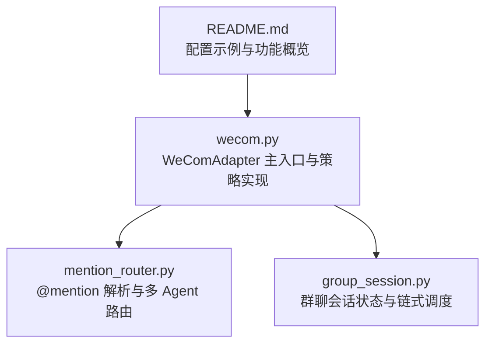
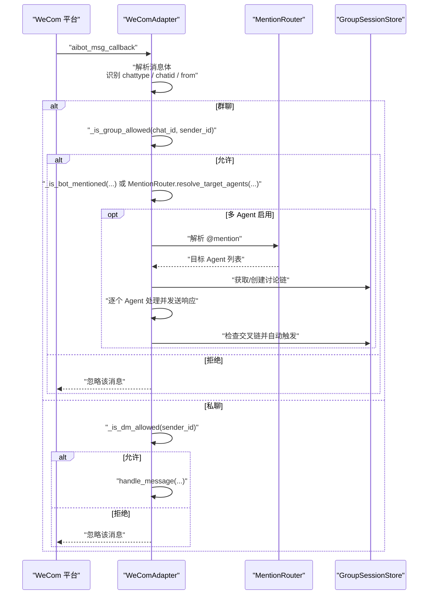
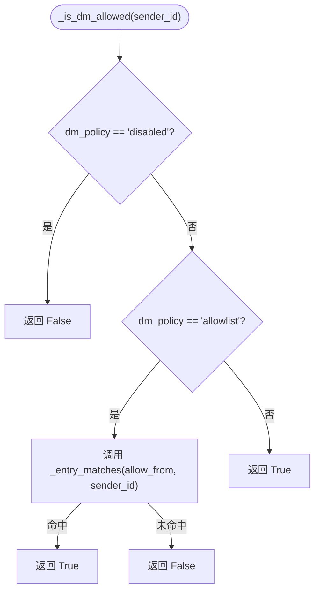
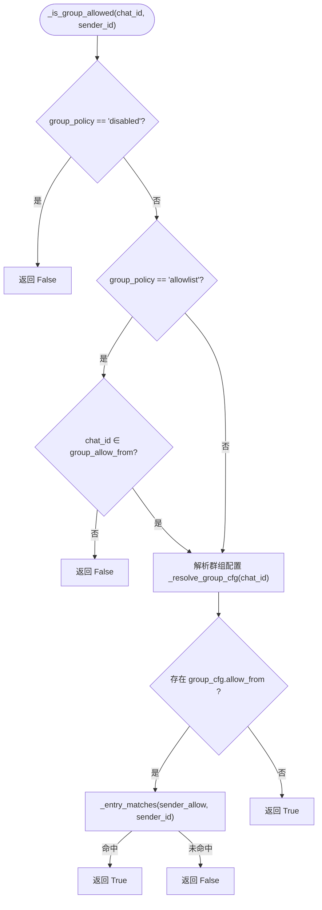
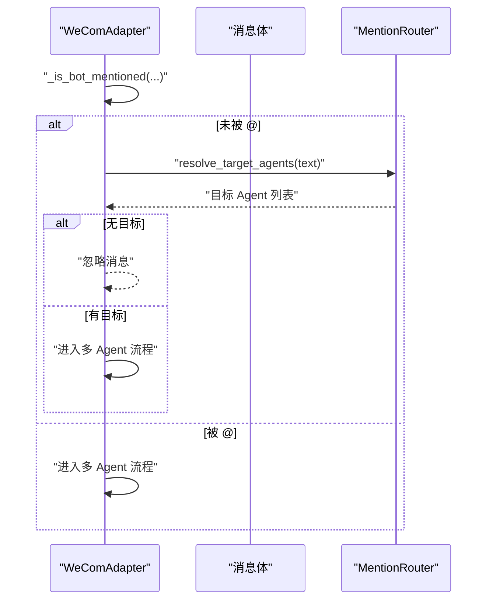
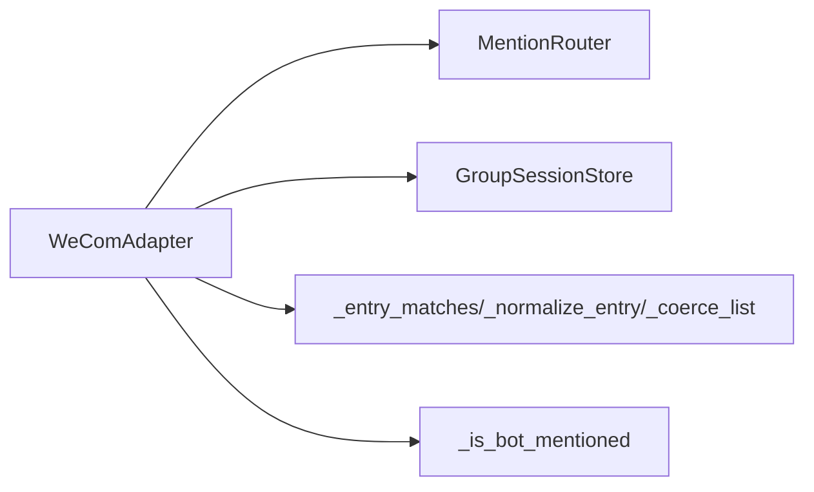

# 访问控制

<cite>
**本文引用的文件**
- [wecom.py](file://wecom.py)
- [mention_router.py](file://mention_router.py)
- [group_session.py](file://group_session.py)
- [README.md](file://README.md)
</cite>

## 目录
1. [简介](#简介)
2. [项目结构](#项目结构)
3. [核心组件](#核心组件)
4. [架构总览](#架构总览)
5. [详细组件分析](#详细组件分析)
6. [依赖分析](#依赖分析)
7. [性能考虑](#性能考虑)
8. [故障排除指南](#故障排除指南)
9. [结论](#结论)
10. [附录](#附录)

## 简介
本文件聚焦 WeComAdapter 的访问控制系统，系统性阐述私聊与群聊的权限管理策略，包括 dm_policy 与 group_policy 的配置项、允许列表匹配机制、通配符与大小写不敏感规则，并给出策略组合与安全最佳实践。同时提供常见访问控制场景与故障排除建议，帮助读者快速理解并正确配置 WeCom 平台的消息入口访问控制。

## 项目结构
WeComAdapter 的访问控制逻辑集中在主适配器文件中，配合多 Agent 群聊路由与会话状态管理模块共同完成消息入口的策略校验与分发。



图表来源
- [wecom.py:160-1774](file://wecom.py#L160-L1774)
- [mention_router.py:1-155](file://mention_router.py#L1-L155)
- [group_session.py:1-188](file://group_session.py#L1-L188)
- [README.md:1-43](file://README.md#L1-L43)

章节来源
- [wecom.py:160-1774](file://wecom.py#L160-L1774)
- [README.md:1-43](file://README.md#L1-L43)

## 核心组件
- WeComAdapter：负责连接、消息回调处理、策略判断与消息分发。
- 访问控制策略：
  - 私聊策略 dm_policy：open | allowlist | disabled | pairing（注：pairing 在当前代码中未见直接使用）
  - 群聊策略 group_policy：open | allowlist | disabled
- 允许列表匹配工具：
  - _entry_matches：大小写不敏感、支持通配符“*”的匹配函数
  - _normalize_entry：标准化条目（去除前缀如 wecom:user:、wecom:group: 等）
  - _coerce_list：将字符串、列表等配置统一为字符串列表
- 群组级策略覆盖：
  - _resolve_group_cfg：按 chat_id 或通配符“*”解析群组级 allow_from 配置
- 群聊 @mention 与多 Agent：
  - _is_group_allowed：结合 group_policy 与群组允许列表
  - _is_bot_mentioned：检测是否被 @
  - MentionRouter：解析 @mention，决定目标 Agent 列表

章节来源
- [wecom.py:113-140](file://wecom.py#L113-L140)
- [wecom.py:859-889](file://wecom.py#L859-L889)
- [wecom.py:142-158](file://wecom.py#L142-L158)
- [mention_router.py:46-155](file://mention_router.py#L46-L155)

## 架构总览
WeComAdapter 在收到回调后，先根据消息类型（私聊/群聊）与策略进行准入判断，再决定是否进入多 Agent 路由与会话链路。



图表来源
- [wecom.py:495-586](file://wecom.py#L495-L586)
- [wecom.py:859-889](file://wecom.py#L859-L889)
- [mention_router.py:102-127](file://mention_router.py#L102-L127)
- [group_session.py:104-128](file://group_session.py#L104-L128)

## 详细组件分析

### 访问控制策略与配置
- 私聊策略 dm_policy
  - open：默认开放，不做额外限制
  - allowlist：仅允许 allow_from 中的用户
  - disabled：完全禁止私聊
  - pairing：当前代码未见直接使用，保留以供扩展
- 群聊策略 group_policy
  - open：默认开放，不做额外限制
  - allowlist：仅允许 group_allow_from 中的群组
  - disabled：完全禁止群聊
- 允许列表配置
  - allow_from：私聊允许列表
  - group_allow_from：群聊允许列表
  - groups：按群组粒度的 allow_from 覆盖，支持大小写不敏感键名与通配符“*”

章节来源
- [wecom.py:13-28](file://wecom.py#L13-L28)
- [wecom.py:180-185](file://wecom.py#L180-L185)
- [wecom.py:878-889](file://wecom.py#L878-L889)

### 允许列表匹配机制
- _normalize_entry：移除 wecom:user:/wecom:group: 前缀，统一为纯标识
- _entry_matches：大小写不敏感匹配，支持“*”通配符
- _coerce_list：将字符串、元组、集合等统一为字符串列表，去除空值与空白
- 匹配优先级
  - 群组级 allow_from 优先于全局 allow_from
  - 通配符“*”可作为全局兜底策略

```mermaid
flowchart TD
Start(["开始匹配"]) --> Normalize["标准化目标标识<br/>_normalize_entry(entry)"]
Normalize --> Lower["转换为小写"]
Lower --> Loop{"遍历允许列表"}
Loop --> |命中 "*" 或完全相等| Allow["允许"]
Loop --> |未命中| Next["继续下一个条目"]
Next --> Loop
Loop --> |遍历结束| Deny["拒绝"]
```

图表来源
- [wecom.py:124-139](file://wecom.py#L124-L139)

章节来源
- [wecom.py:113-140](file://wecom.py#L113-L140)

### 私聊访问控制：_is_dm_allowed()
- 策略判定流程
  - 若 dm_policy 为 disabled：直接拒绝
  - 若 dm_policy 为 allowlist：使用 _entry_matches 检查 sender_id 是否在 allow_from
  - 其他情况（open/pairing）：默认允许
- 关键点
  - 使用 _entry_matches 实现大小写不敏感与通配符支持
  - 与 _normalize_entry 协作，确保输入兼容



图表来源
- [wecom.py:859-864](file://wecom.py#L859-L864)
- [wecom.py:132-139](file://wecom.py#L132-L139)

章节来源
- [wecom.py:859-864](file://wecom.py#L859-L864)

### 群聊访问控制：_is_group_allowed()
- 策略判定流程
  - 若 group_policy 为 disabled：直接拒绝
  - 若 group_policy 为 allowlist：检查 chat_id 是否在 group_allow_from
  - 解析群组级配置：_resolve_group_cfg(chat_id)
  - 若存在 group_cfg.allow_from：使用 _entry_matches 检查 sender_id
  - 否则默认允许
- 关键点
  - 支持按 chat_id 精确匹配与大小写不敏感键名
  - 支持通配符“*”作为兜底群组配置
  - sender_allow 优先级高于全局 group_allow_from



图表来源
- [wecom.py:866-876](file://wecom.py#L866-L876)
- [wecom.py:878-889](file://wecom.py#L878-L889)
- [wecom.py:132-139](file://wecom.py#L132-L139)

章节来源
- [wecom.py:866-876](file://wecom.py#L866-L876)
- [wecom.py:878-889](file://wecom.py#L878-L889)

### 群聊 @mention 与多 Agent 路由
- 机器人是否被 @：_is_bot_mentioned(body, bot_id)
- 多 Agent 解析：MentionRouter.resolve_target_agents(text)
- 策略与路由的关系
  - 若未被 @ 且未解析到目标 Agent，则忽略该消息（避免无关噪音）
  - 若解析到目标 Agent，则进入多 Agent 链式调度



图表来源
- [wecom.py:524-542](file://wecom.py#L524-L542)
- [wecom.py:142-158](file://wecom.py#L142-L158)
- [mention_router.py:120-127](file://mention_router.py#L120-L127)

章节来源
- [wecom.py:524-542](file://wecom.py#L524-L542)
- [mention_router.py:102-127](file://mention_router.py#L102-L127)

### 群聊会话与链式调度
- 会话存储：GroupSessionStore 维护讨论链，控制链长度与冷却时间
- 链式触发：当 Agent 响应中再次 @ 其他 Agent 时，自动触发下一轮
- 完整性与清理：达到最大链长或无新 @ 后完成并清理

章节来源
- [group_session.py:96-188](file://group_session.py#L96-L188)
- [wecom.py:909-1181](file://wecom.py#L909-L1181)

## 依赖分析
- WeComAdapter 依赖
  - MentionRouter：用于解析 @mention，决定目标 Agent
  - GroupSessionStore：用于维护多 Agent 讨论链的状态
- 内部依赖
  - _entry_matches/_normalize_entry/_coerce_list：提供通用的允许列表匹配能力
  - _is_bot_mentioned：提供群聊 @ 机器人检测



图表来源
- [wecom.py:205-206](file://wecom.py#L205-L206)
- [wecom.py:922-925](file://wecom.py#L922-L925)
- [wecom.py:132-139](file://wecom.py#L132-L139)
- [wecom.py:142-158](file://wecom.py#L142-L158)

章节来源
- [wecom.py:205-206](file://wecom.py#L205-L206)
- [wecom.py:922-925](file://wecom.py#L922-L925)

## 性能考虑
- 允许列表匹配
  - _entry_matches 对每个条目执行一次正则与大小写转换，复杂度 O(N)；N 为允许列表长度
  - 建议将 allow_from/group_allow_from 控制在合理规模，避免过长列表影响匹配性能
- 群组配置解析
  - _resolve_group_cfg 支持大小写不敏感键名与通配符“*”，查找成本较低但需注意配置数量
- 文本批处理
  - WeCom 客户端可能拆分长消息，适配器内置文本批处理减少重复事件，降低上游压力

章节来源
- [wecom.py:132-139](file://wecom.py#L132-L139)
- [wecom.py:878-889](file://wecom.py#L878-L889)
- [wecom.py:591-656](file://wecom.py#L591-L656)

## 故障排除指南
- 现象：私聊消息被忽略
  - 排查 dm_policy 与 allow_from
  - 确认 sender_id 是否在 allow_from 中（大小写不敏感）
  - 参考路径：[wecom.py:859-864](file://wecom.py#L859-L864)
- 现象：群聊消息被忽略
  - 排查 group_policy 与 group_allow_from
  - 检查群组级 allow_from 是否覆盖
  - 参考路径：[wecom.py:866-876](file://wecom.py#L866-L876)
- 现象：@mention 无效
  - 确认 MentionRouter 已启用且配置了正确的 mention_patterns
  - 确认消息中 @ 标记符合边界规则
  - 参考路径：[mention_router.py:91-101](file://mention_router.py#L91-L101)
- 现象：多 Agent 链式触发异常
  - 检查 cross_agent 配置（enabled、max_chain_length、chain_cooldown_seconds）
  - 确认 Agent 名称与 mention_patterns 一致
  - 参考路径：[group_session.py:104-128](file://group_session.py#L104-L128)
- 现象：策略未生效
  - 确认配置项大小写与键名（如 allowFrom vs allow_from）
  - 群组配置键名大小写不敏感，但建议保持一致
  - 参考路径：[wecom.py:180-185](file://wecom.py#L180-L185)

章节来源
- [wecom.py:859-876](file://wecom.py#L859-L876)
- [mention_router.py:91-101](file://mention_router.py#L91-L101)
- [group_session.py:104-128](file://group_session.py#L104-L128)

## 结论
WeComAdapter 的访问控制通过 dm_policy 与 group_policy 将私聊与群聊的入口权限清晰分离，并以 allow_from 与 group_allow_from 提供细粒度控制。借助 _entry_matches 的大小写不敏感与通配符支持，以及群组级配置的灵活覆盖，系统既能满足开放协作需求，也能在严格场景下实现最小暴露面。结合 @mention 与多 Agent 路由，可在保证安全的前提下实现高效的群聊协作。

## 附录

### 配置示例与策略组合
- 私聊仅允许特定用户
  - 设置 dm_policy: allowlist，allow_from: ["user_a", "user_b"]
- 群聊仅允许特定群组
  - 设置 group_policy: allowlist，group_allow_from: ["group_a", "group_b"]
- 全局开放，仅对个别群组限制
  - 设置 group_policy: open，groups: {"group_x": {"allow_from": ["user_a"]}}
- 全局限制，仅对个别群组开放
  - 设置 group_policy: disabled，groups: {"group_y": {"allow_from": ["*"]}}

章节来源
- [wecom.py:13-28](file://wecom.py#L13-L28)
- [wecom.py:180-185](file://wecom.py#L180-L185)
- [wecom.py:878-889](file://wecom.py#L878-L889)

### 安全最佳实践
- 默认最小权限原则
  - 私聊与群聊均设置为 allowlist，仅添加必要白名单
- 通配符谨慎使用
  - 仅在兜底场景使用“*”，避免过度放宽
- 群组级覆盖优先
  - 通过 groups 精细化控制，避免全局策略带来的风险
- @mention 边界与模式
  - 明确 mention_patterns，避免误触发
- 日志与审计
  - 关注被拒绝的日志，定期审查策略有效性

章节来源
- [wecom.py:132-139](file://wecom.py#L132-L139)
- [wecom.py:859-889](file://wecom.py#L859-L889)
- [mention_router.py:29-35](file://mention_router.py#L29-L35)