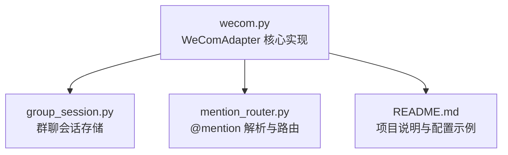
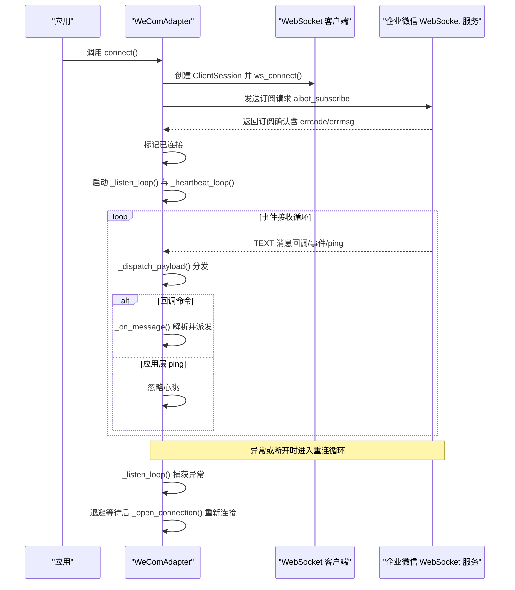
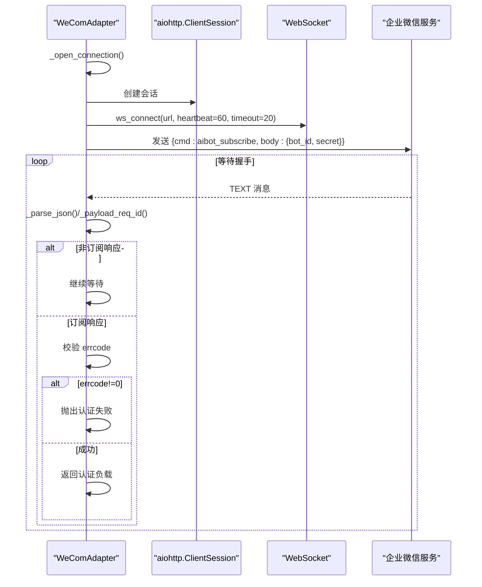
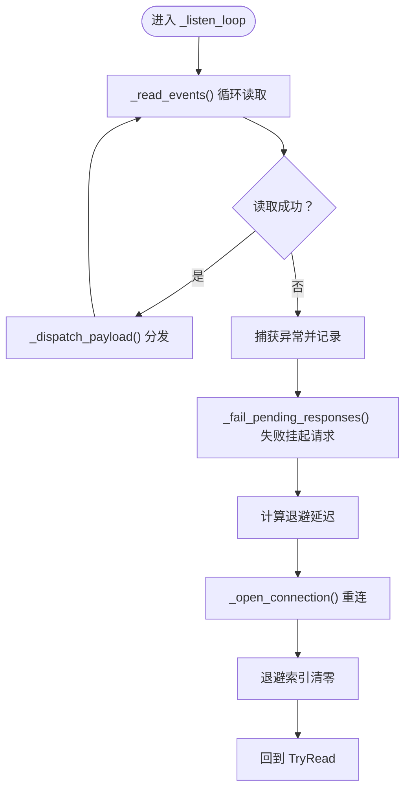
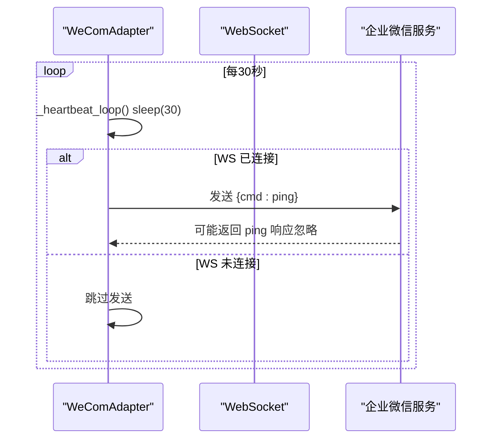
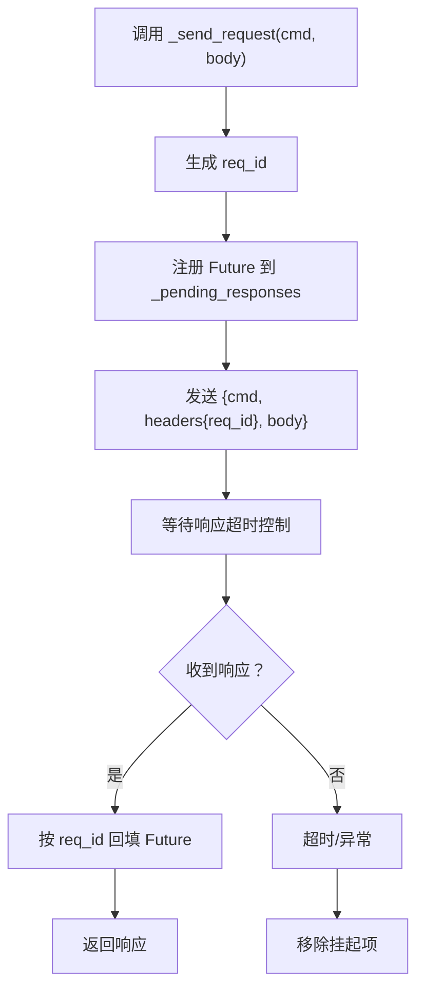
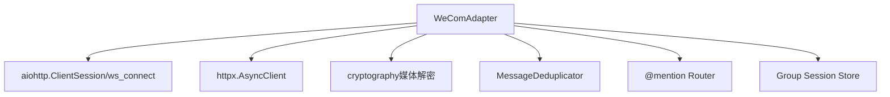

# 连接管理

<cite>
**本文引用的文件**
- [wecom.py](file://wecom.py)
- [README.md](file://README.md)
- [group_session.py](file://group_session.py)
- [mention_router.py](file://mention_router.py)
- [test_mention_fix.py](file://test_mention_fix.py)
</cite>

## 目录
1. [简介](#简介)
2. [项目结构](#项目结构)
3. [核心组件](#核心组件)
4. [架构总览](#架构总览)
5. [详细组件分析](#详细组件分析)
6. [依赖分析](#依赖分析)
7. [性能考虑](#性能考虑)
8. [故障排查指南](#故障排查指南)
9. [结论](#结论)
10. [附录](#附录)

## 简介
本节面向 WeComAdapter 的连接管理能力，系统性梳理 WebSocket 连接生命周期与关键方法的行为，包括：
- 连接建立流程与认证机制
- 心跳维持与应用层 ping
- 自动重连策略与退避算法
- 连接超时配置、错误处理与故障恢复
- 连接状态监控、连接池管理与资源清理
- 连接问题排查与性能优化建议

本文件严格基于仓库源码进行分析，避免臆测，确保技术细节可追溯至具体文件与行号。

## 项目结构
WeComAdapter 所在的主文件为 wecom.py，负责 WebSocket 连接、消息收发、媒体上传、多 Agent 群聊路由等核心逻辑。其余相关模块包括：
- 群聊会话管理：用于多 Agent 讨论链的状态维护
- @mention 解析器：用于多 Agent 群聊中的触发与链式调用
- README 提供了整体概览与配置要点

图表来源
- [wecom.py:160-210](file://wecom.py#L160-L210)
- [group_session.py:96-188](file://group_session.py#L96-L188)
- [mention_router.py:46-155](file://mention_router.py#L46-L155)
- [README.md:1-43](file://README.md#L1-L43)

章节来源
- [wecom.py:160-210](file://wecom.py#L160-L210)
- [README.md:1-43](file://README.md#L1-L43)

## 核心组件
- WeComAdapter：继承自平台基类，封装 WebSocket 连接、认证、事件分发、请求响应、心跳与重连等。
- 连接生命周期管理：connect/disconnect/_open_connection/_listen_loop/_heartbeat_loop
- 请求/响应模型：_send_request/_send_reply_request/_dispatch_payload
- 去重与回复映射：MessageDeduplicator、reply_req_id 缓存
- 连接超时与退避：CONNECT_TIMEOUT_SECONDS、REQUEST_TIMEOUT_SECONDS、HEARTBEAT_INTERVAL_SECONDS、RECONNECT_BACKOFF

章节来源
- [wecom.py:160-210](file://wecom.py#L160-L210)
- [wecom.py:212-278](file://wecom.py#L212-L278)
- [wecom.py:289-396](file://wecom.py#L289-L396)
- [wecom.py:430-470](file://wecom.py#L430-L470)
- [wecom.py:495-586](file://wecom.py#L495-L586)

## 架构总览
下图展示 WeComAdapter 的连接管理与事件处理主干流程，包括连接建立、认证握手、事件监听、心跳与重连。

图表来源
- [wecom.py:212-278](file://wecom.py#L212-L278)
- [wecom.py:289-396](file://wecom.py#L289-L396)
- [wecom.py:338-396](file://wecom.py#L338-L396)

## 详细组件分析

### 连接建立与认证流程
- connect()：前置依赖检查、初始化 HTTP 客户端、打开 WebSocket、启动监听与心跳任务，并标记连接成功。
- _open_connection()：清理旧连接，创建 aiohttp.ClientSession 与 WebSocket，发送订阅请求，等待握手确认，校验 errcode。
- _wait_for_handshake()：在连接超时内轮询接收消息，过滤 ping，匹配 req_id，返回认证结果；若超时或连接关闭则抛出异常。

图表来源
- [wecom.py:289-337](file://wecom.py#L289-L337)
- [wecom.py:314-337](file://wecom.py#L314-L337)

章节来源
- [wecom.py:212-278](file://wecom.py#L212-L278)
- [wecom.py:289-337](file://wecom.py#L289-L337)

### 事件监听与分发
- _listen_loop()：主监听循环，捕获异常后执行指数退避重连，重新打开连接并清零退避索引。
- _read_events()：持续从 WS 接收消息，解析 JSON，调用 _dispatch_payload()。
- _dispatch_payload()：根据 req_id 与 cmd 将响应结果回填 Future 或派发回调事件；对 ping 与事件回调做特殊处理。

图表来源
- [wecom.py:338-396](file://wecom.py#L338-L396)
- [wecom.py:364-377](file://wecom.py#L364-L377)
- [wecom.py:398-423](file://wecom.py#L398-L423)

章节来源
- [wecom.py:338-396](file://wecom.py#L338-L396)
- [wecom.py:398-423](file://wecom.py#L398-L423)

### 心跳与保活
- _heartbeat_loop()：周期性发送应用层 ping（cmd: ping），避免底层空闲断开；在连接未就绪或已关闭时跳过发送。
- WebSocket 层心跳：ws_connect() 设置 heartbeat=60（心跳间隔的两倍），作为底层保活；应用层 ping 作为补充。

图表来源
- [wecom.py:378-396](file://wecom.py#L378-L396)
- [wecom.py:293-297](file://wecom.py#L293-L297)

章节来源
- [wecom.py:378-396](file://wecom.py#L378-L396)

### 请求/响应与去重
- _send_request()：生成唯一 req_id，注册 Future，发送 JSON 请求，等待响应并在超时后取消挂起。
- _send_reply_request()：针对回调 req_id 的回复，使用相同 req_id 作为 correlation。
- _dispatch_payload()：若收到响应且非非响应命令，则设置 Future 结果；否则按回调/事件处理。
- _fail_pending_responses()：断开时统一失败挂起请求，避免泄漏。
- 去重：MessageDeduplicator 与 reply_req_id 映射表，防止重复处理与内存膨胀。

图表来源
- [wecom.py:430-470](file://wecom.py#L430-L470)
- [wecom.py:398-423](file://wecom.py#L398-L423)
- [wecom.py:890-904](file://wecom.py#L890-L904)

章节来源
- [wecom.py:430-470](file://wecom.py#L430-L470)
- [wecom.py:398-423](file://wecom.py#L398-L423)
- [wecom.py:890-904](file://wecom.py#L890-L904)

### 连接超时与错误处理
- 连接超时：CONNECT_TIMEOUT_SECONDS=20 秒，用于握手等待与底层 ws_connect()。
- 请求超时：REQUEST_TIMEOUT_SECONDS=15 秒，用于 _send_request() 等待响应。
- 心跳间隔：HEARTBEAT_INTERVAL_SECONDS=30 秒，用于应用层 ping。
- 重连退避：RECONNECT_BACKOFF=[2, 5, 10, 30, 60]，最大 60 秒，避免风暴重连。
- 错误处理：连接失败设置致命错误标记，断开时取消任务、失败挂起请求、清理资源。

章节来源
- [wecom.py:91-94](file://wecom.py#L91-L94)
- [wecom.py:212-246](file://wecom.py#L212-L246)
- [wecom.py:248-278](file://wecom.py#L248-L278)

### 连接状态监控与资源清理
- 状态标记：connect/disconnect 内部调用标记函数以更新连接状态。
- 资源清理：_cleanup_ws() 关闭 WS 与会话；disconnect() 取消任务、失败挂起请求、关闭 HTTP 客户端、清理去重表。
- 去重与映射：MessageDeduplicator 与 reply_req_id 缓存，防止重复处理与内存增长。

章节来源
- [wecom.py:248-278](file://wecom.py#L248-L278)
- [wecom.py:279-288](file://wecom.py#L279-L288)
- [wecom.py:890-904](file://wecom.py#L890-L904)

### 多 Agent 群聊与连接的关系
- 多 Agent 群聊通过 @mention 解析与会话存储实现跨 Agent 链式对话，但与连接管理无直接耦合。
- 连接管理关注点：连接稳定性、重连可靠性、消息去重与响应一致性。

章节来源
- [mention_router.py:46-155](file://mention_router.py#L46-L155)
- [group_session.py:96-188](file://group_session.py#L96-L188)

## 依赖分析
- 外部依赖：aiohttp（WebSocket）、httpx（HTTP 下载与令牌刷新）、cryptography（媒体解密）。
- 内部依赖：平台基类、消息去重器、@mention 路由器、群聊会话存储。

图表来源
- [wecom.py:46-58](file://wecom.py#L46-L58)
- [wecom.py:60-70](file://wecom.py#L60-L70)
- [wecom.py:160-210](file://wecom.py#L160-L210)

章节来源
- [wecom.py:46-58](file://wecom.py#L46-L58)
- [wecom.py:60-70](file://wecom.py#L60-L70)

## 性能考虑
- 心跳与保活：应用层 ping 与底层 heartbeat 配合，降低空闲断开概率。
- 退避重连：指数退避上限 60 秒，避免雪崩效应。
- 去重与批处理：消息去重与文本批处理减少重复工作与网络压力。
- 超时控制：连接与请求超时参数平衡稳定性与响应速度。
- 媒体下载：流式下载与大小限制，避免内存峰值与超限错误。

章节来源
- [wecom.py:91-94](file://wecom.py#L91-L94)
- [wecom.py:378-396](file://wecom.py#L378-L396)
- [wecom.py:1322-1365](file://wecom.py#L1322-L1365)

## 故障排查指南
- 连接失败
  - 检查依赖安装：aiohttp 与 httpx 是否可用。
  - 检查凭证：bot_id 与 secret 是否配置。
  - 查看致命错误标记与日志，确认是否因依赖缺失或凭证不足导致。
- 握手超时
  - 确认 CONNECT_TIMEOUT_SECONDS（20 秒）是否足够，网络环境是否稳定。
  - 检查订阅响应是否返回 errcode!=0，定位认证失败原因。
- 断线重连
  - 观察 _listen_loop() 的异常日志与退避延迟，确认是否进入重连循环。
  - 若反复重连失败，检查网络、代理、防火墙与企业微信服务可达性。
- 心跳失效
  - 检查 _heartbeat_loop() 是否正常运行，WS 是否处于 closed 状态。
  - 确认应用层 ping 是否被服务端正确处理（忽略 ping 命令）。
- 响应超时
  - REQUEST_TIMEOUT_SECONDS（15 秒）可能过短，结合业务场景适当放宽。
  - 检查 _pending_responses 是否正确清理，避免 Future 泄漏。
- 媒体发送失败
  - 检查文件大小与类型限制，必要时降级为文件类型发送。
  - 确认 AES 解密与下载安全策略（SSRF 保护）。

章节来源
- [wecom.py:212-246](file://wecom.py#L212-L246)
- [wecom.py:314-337](file://wecom.py#L314-L337)
- [wecom.py:338-396](file://wecom.py#L338-L396)
- [wecom.py:430-470](file://wecom.py#L430-L470)
- [wecom.py:1217-1278](file://wecom.py#L1217-L1278)
- [wecom.py:1322-1365](file://wecom.py#L1322-L1365)

## 结论
WeComAdapter 的连接管理以“可靠连接 + 应用层保活 + 智能重连”为核心设计，配合去重、超时与资源清理机制，形成稳健的长连接方案。通过合理的超时与退避参数、完善的错误处理与状态监控，能够在复杂网络环境中维持高可用的消息通道。对于多 Agent 群聊场景，连接管理与消息路由相互独立，便于扩展与维护。

## 附录
- 配置参考：README 提供了多 Agent 群聊配置示例，便于理解连接与消息处理的整体关系。
- 单元测试：test_mention_fix.py 展示了 @mention 修复逻辑的测试用例，有助于理解群聊消息处理边界。

章节来源
- [README.md:21-38](file://README.md#L21-L38)
- [test_mention_fix.py:8-77](file://test_mention_fix.py#L8-L77)