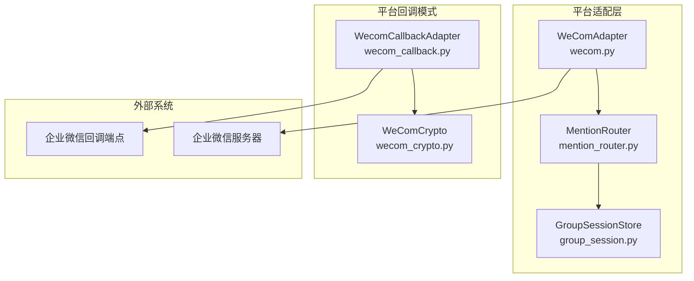
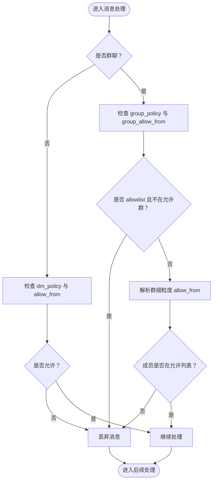
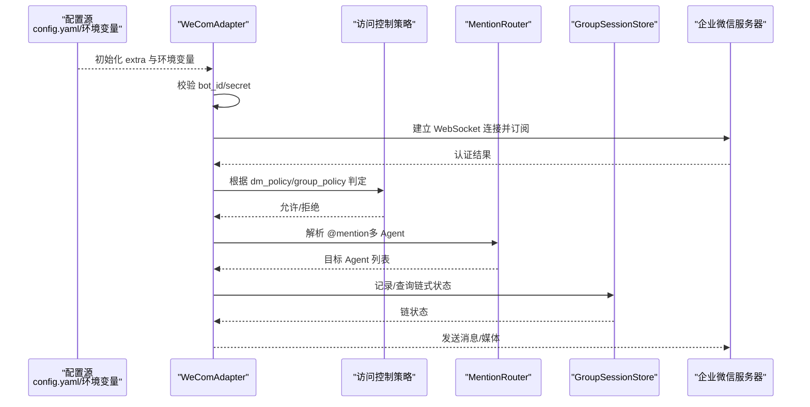

# 配置选项

<cite>
**本文引用的文件**
- [wecom.py](file://wecom.py)
- [README.md](file://README.md)
- [mention_router.py](file://mention_router.py)
- [group_session.py](file://group_session.py)
- [wecom_callback.py](file://wecom_callback.py)
- [wecom_crypto.py](file://wecom_crypto.py)
</cite>

## 目录
1. [简介](#简介)
2. [项目结构与定位](#项目结构与定位)
3. [核心配置项总览](#核心配置项总览)
4. [配置来源与优先级](#配置来源与优先级)
5. [访问控制策略与允许列表](#访问控制策略与允许列表)
6. [环境变量清单](#环境变量清单)
7. [配置示例与模板](#配置示例与模板)
8. [配置验证与默认值处理](#配置验证与默认值处理)
9. [热更新与运行时行为](#热更新与运行时行为)
10. [常见场景与最佳实践](#常见场景与最佳实践)
11. [故障排除指南](#故障排除指南)
12. [架构与数据流图](#架构与数据流图)
13. [结论](#结论)

## 简介
本文件面向 WeComAdapter 的配置系统，系统性梳理并解释所有配置项的作用、设置方式、默认值、优先级、校验逻辑以及运行时行为。重点覆盖：
- 必需配置：bot_id、secret、websocket_url
- 访问控制：dm_policy、group_policy、allow_from、group_allow_from、分组细粒度 allow_from
- 多 Agent 群聊：mention_router 与跨 Agent 链式调用
- 环境变量支持与配置优先级
- 配置验证、默认值处理与热更新能力
- 常见配置场景与故障排除

## 项目结构与定位
WeComAdapter 是基于 WebSocket 的企业微信 AI Bot 适配器，负责认证、接收回调、发送消息、媒体上传等。其配置位于平台 extra 字段中，并通过环境变量提供覆盖。

图表来源
- [wecom.py:160-207](file://wecom.py#L160-L207)
- [mention_router.py:46-155](file://mention_router.py#L46-L155)
- [group_session.py:96-188](file://group_session.py#L96-L188)
- [wecom_callback.py:55-173](file://wecom_callback.py#L55-L173)
- [wecom_crypto.py:66-143](file://wecom_crypto.py#L66-L143)

章节来源
- [wecom.py:13-28](file://wecom.py#L13-L28)
- [README.md:7-11](file://README.md#L7-L11)

## 核心配置项总览
以下为 WeComAdapter 的关键配置项及其作用范围（均来自配置文件 extra 字段）：

- 平台基础
  - bot_id：企业微信 AI Bot 的 bot_id，必填
  - secret：企业微信 AI Bot 的 secret，必填
  - websocket_url：WebSocket 网关地址，默认使用官方地址
- 访问控制
  - dm_policy：私聊策略，可选值 open、allowlist、disabled
  - allow_from：私聊允许来源用户 ID 列表（支持字符串逗号分隔或数组）
  - group_policy：群聊策略，可选值 open、allowlist、disabled
  - group_allow_from：群聊允许来源群 ID 列表（支持字符串逗号分隔或数组）
  - groups：按群 ID 维度的细粒度 allow_from 配置，支持通配符 *
- 多 Agent 群聊
  - multi_agent.enabled：启用多 Agent 群聊
  - multi_agent.default_agent：默认 Agent
  - multi_agent.agents：Agent 列表及提及模式、模型/工具集等
  - multi_agent.cross_agent.enabled：启用跨 Agent 链式调用
  - multi_agent.cross_agent.max_chain_length：最大链长度
  - multi_agent.cross_agent.chain_cooldown_seconds：Agent 触发冷却时间
- 文本批处理
  - HERMES_WECOM_TEXT_BATCH_DELAY_SECONDS：普通文本批处理延迟
  - HERMES_WECOM_TEXT_BATCH_SPLIT_DELAY_SECONDS：接近 4000 字符分割阈值时的延迟

章节来源
- [wecom.py:171-185](file://wecom.py#L171-L185)
- [wecom.py:198-199](file://wecom.py#L198-L199)
- [wecom.py:859-889](file://wecom.py#L859-L889)
- [wecom.py:278-301](file://wecom.py#L278-L301)
- [mention_router.py:46-89](file://mention_router.py#L46-L89)

## 配置来源与优先级
- 配置来源
  - 平台 extra 字段：config.yaml 中 platforms.wecom.extra
  - 环境变量：当 extra 中未显式提供时，从环境变量读取
- 优先级规则
  - 运行时初始化时，若 extra 中存在对应键，则优先使用 extra；否则回退到环境变量
  - 若 extra 中键存在但为空字符串，仍视为显式覆盖（空串不回退到环境变量）
- 具体映射
  - bot_id → WECOM_BOT_ID
  - secret → WECOM_SECRET
  - websocket_url → WECOM_WEBSOCKET_URL
  - dm_policy → WECOM_DM_POLICY
  - group_policy → WECOM_GROUP_POLICY
  - 文本批处理参数 → HERMES_WECOM_TEXT_BATCH_DELAY_SECONDS、HERMES_WECOM_TEXT_BATCH_SPLIT_DELAY_SECONDS

章节来源
- [wecom.py:171-185](file://wecom.py#L171-L185)
- [wecom.py:198-199](file://wecom.py#L198-L199)

## 访问控制策略与允许列表
WeComAdapter 提供两套访问控制策略：私聊策略（dm_policy）与群聊策略（group_policy），并支持 allow_from 与 group_allow_from 的白名单匹配，以及按群维度的细粒度 allow_from。

- 私聊策略
  - open：允许所有私聊消息（默认）
  - allowlist：仅允许 allow_from 中的用户
  - disabled：禁止所有私聊消息
- 群聊策略
  - open：允许所有群聊消息（但仍需 @ 机器人或命中多 Agent 规则）
  - allowlist：仅允许 group_allow_from 中的群；若该群还配置了 allow_from，则进一步限制成员
  - disabled：禁止所有群聊消息
- 允许列表匹配规则
  - 支持字符串、数组、逗号分隔字符串统一归一化为字符串列表
  - 支持忽略前缀 wecom:user: 或 wecom:group:，并大小写不敏感匹配
  - 支持通配符 *，表示全量放行
- 分组细粒度配置
  - groups 支持按群 ID 设置 allow_from；支持大小写不敏感匹配；支持通配符 *
  - 当群 ID 不存在时，回退到通配符 * 的配置

图表来源
- [wecom.py:859-889](file://wecom.py#L859-L889)
- [wecom.py:278-301](file://wecom.py#L278-L301)

章节来源
- [wecom.py:113-139](file://wecom.py#L113-L139)
- [wecom.py:859-889](file://wecom.py#L859-L889)

## 环境变量清单
- WECOM_BOT_ID：AI Bot 的 bot_id
- WECOM_SECRET：AI Bot 的 secret
- WECOM_WEBSOCKET_URL：WebSocket 网关地址（默认官方地址）
- WECOM_DM_POLICY：私聊策略（open/allowlist/disabled）
- WECOM_GROUP_POLICY：群聊策略（open/allowlist/disabled）
- HERMES_WECOM_TEXT_BATCH_DELAY_SECONDS：普通文本批处理延迟（秒）
- HERMES_WECOM_TEXT_BATCH_SPLIT_DELAY_SECONDS：接近 4000 字符分割阈值时的延迟（秒）

章节来源
- [wecom.py:171-185](file://wecom.py#L171-L185)
- [wecom.py:198-199](file://wecom.py#L198-L199)

## 配置示例与模板
- YAML 配置模板（config.yaml）
  - 平台启用与基础字段
  - 访问控制策略与允许列表
  - 分组细粒度 allow_from
  - 多 Agent 群聊配置（enabled、default_agent、agents、cross_agent）
- 环境变量示例
  - WECOM_BOT_ID=WECOM_BOT_ID
  - WECOM_SECRET=WECOM_SECRET
  - WECOM_WEBSOCKET_URL=wss://openws.work.weixin.qq.com
  - WECOM_DM_POLICY=open
  - WECOM_GROUP_POLICY=allowlist
  - HERMES_WECOM_TEXT_BATCH_DELAY_SECONDS=0.6
  - HERMES_WECOM_TEXT_BATCH_SPLIT_DELAY_SECONDS=2.0

章节来源
- [wecom.py:13-28](file://wecom.py#L13-L28)
- [README.md:21-38](file://README.md#L21-L38)

## 配置验证与默认值处理
- 必填校验
  - 启动连接时必须同时提供 bot_id 与 secret，否则标记致命错误并拒绝启动
- 默认值
  - websocket_url 默认官方地址
  - dm_policy 默认 open
  - group_policy 默认 open
  - 文本批处理延迟参数有默认值（秒）
- 归一化与匹配
  - allow_from、group_allow_from 支持字符串、数组、逗号分隔字符串，统一转换为去空白的字符串列表
  - 允许列表匹配支持大小写不敏感与通配符 *
- 分组配置解析
  - groups 支持大小写不敏感匹配与通配符 *
  - 未找到精确匹配时回退到通配符配置

章节来源
- [wecom.py:224-228](file://wecom.py#L224-L228)
- [wecom.py:171-185](file://wecom.py#L171-L185)
- [wecom.py:113-139](file://wecom.py#L113-L139)
- [wecom.py:878-889](file://wecom.py#L878-L889)

## 热更新与运行时行为
- 运行时不可热更新
  - WeComAdapter 在初始化阶段读取配置并缓存为实例属性，随后不会自动重新加载配置
  - 若需应用新配置，需重启适配器进程
- 连接生命周期
  - connect 成功后建立持久 WebSocket 连接，失败时记录致命错误并断开
  - 断线自动重连，指数退避
- 多 Agent 群聊状态
  - GroupSessionStore 为内存态，链式讨论状态随进程生命周期存在，重启后清空
  - 支持链长度上限与冷却时间控制，避免无限循环与频繁触发

章节来源
- [wecom.py:212-247](file://wecom.py#L212-L247)
- [wecom.py:352-377](file://wecom.py#L352-L377)
- [group_session.py:96-188](file://group_session.py#L96-L188)

## 常见场景与最佳实践
- 场景一：开放策略（测试/开发）
  - dm_policy: open
  - group_policy: open
  - groups: 可留空或仅配置通配符 *
- 场景二：严格白名单（生产）
  - dm_policy: allowlist
  - group_policy: allowlist
  - allow_from: 限定私聊用户
  - group_allow_from: 限定群聊群组
  - groups: 对特定群组再做成员级 allow_from 细化
- 场景三：多 Agent 群聊
  - 启用 multi_agent 与 cross_agent
  - 定义 agents 及 mention_patterns
  - 设置 max_chain_length 与 chain_cooldown_seconds 控制链长度与冷却
- 场景四：媒体发送与尺寸限制
  - 图片/视频/语音有大小限制，超限时自动降级为文件类型发送并提示
  - 发送失败时会返回错误信息，便于用户理解

章节来源
- [wecom.py:859-889](file://wecom.py#L859-L889)
- [wecom.py:1217-1278](file://wecom.py#L1217-L1278)
- [mention_router.py:46-89](file://mention_router.py#L46-L89)

## 故障排除指南
- 启动失败：缺少 bot_id 或 secret
  - 现象：连接失败并记录致命错误
  - 排查：确认 config.yaml 中 extra 字段或环境变量 WECOM_BOT_ID/WECOM_SECRET 是否正确
- 连接认证失败
  - 现象：订阅握手返回 errcode 非 0
  - 排查：核对 bot_id 与 secret 是否匹配企业微信后台配置
- 消息被过滤
  - 现象：私聊或群聊消息未被处理
  - 排查：检查 dm_policy/group_policy 与 allow_from/group_allow_from 及 groups 细粒度配置
- 多 Agent 链式未触发
  - 现象：@某 Agent 未响应或链式未继续
  - 排查：确认 multi_agent.enabled/cross_agent.enabled、mention_patterns、max_chain_length、chain_cooldown_seconds
- 媒体发送失败
  - 现象：图片/视频/语音发送失败或被降级
  - 排查：检查文件大小是否超过限制，格式是否受支持，URL 是否安全

章节来源
- [wecom.py:224-228](file://wecom.py#L224-L228)
- [wecom.py:322-327](file://wecom.py#L322-L327)
- [wecom.py:859-889](file://wecom.py#L859-L889)
- [wecom.py:1217-1278](file://wecom.py#L1217-L1278)

## 架构与数据流图
下图展示 WeComAdapter 的配置读取、策略判定与消息处理的关键流程。

图表来源
- [wecom.py:168-207](file://wecom.py#L168-L207)
- [wecom.py:859-889](file://wecom.py#L859-L889)
- [mention_router.py:46-155](file://mention_router.py#L46-L155)
- [group_session.py:96-188](file://group_session.py#L96-L188)

## 结论
WeComAdapter 的配置系统以“extra 字段 + 环境变量”的双通道设计为核心，结合严格的必填校验、灵活的白名单策略与多 Agent 群聊能力，既满足快速上手，也支持生产级的安全与治理需求。建议在生产环境中：
- 明确 dm_policy 与 group_policy 的边界
- 使用 allow_from 与 group_allow_from 实施最小权限原则
- 通过 groups 细粒度控制关键群组
- 启用多 Agent 时合理设置链长度与冷却时间
- 关注媒体尺寸与格式限制，确保用户体验稳定