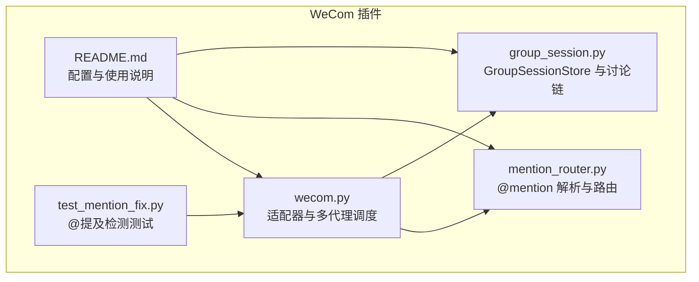
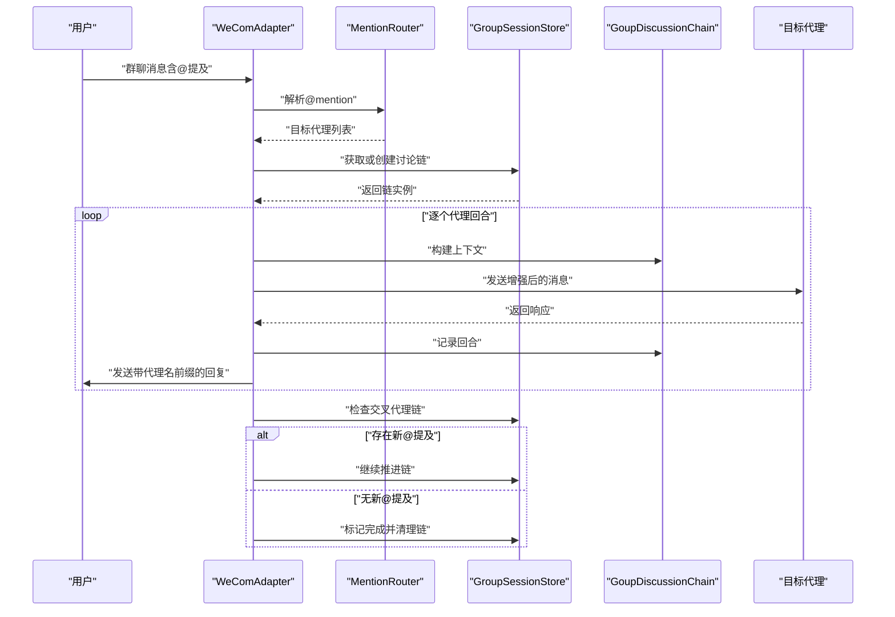
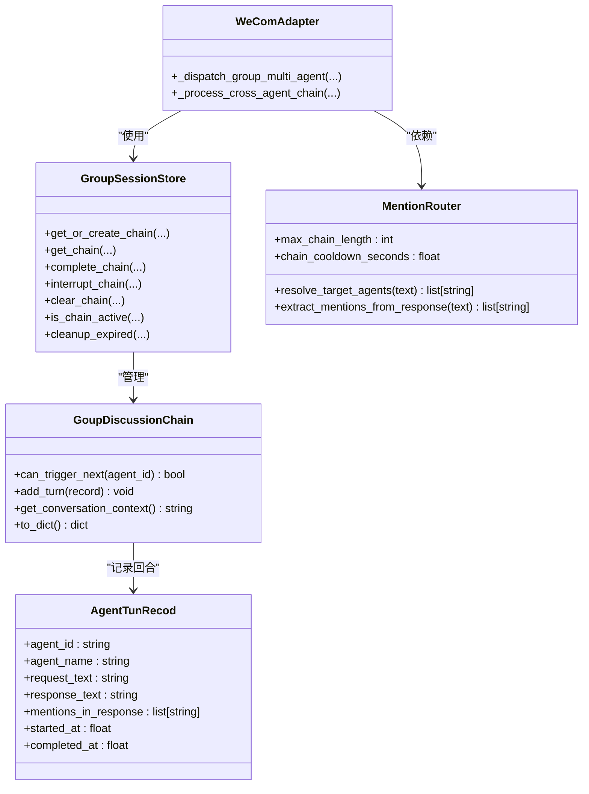

# 会话管理器

<cite>
**本文引用的文件**
- [group_session.py](file://group_session.py)
- [bk/group_session.py](file://bk/group_session.py)
- [wecom.py](file://wecom.py)
- [mention_router.py](file://mention_router.py)
- [README.md](file://README.md)
- [test_mention_fix.py](file://test_mention_fix.py)
</cite>

## 目录
1. [简介](#简介)
2. [项目结构](#项目结构)
3. [核心组件](#核心组件)
4. [架构总览](#架构总览)
5. [详细组件分析](#详细组件分析)
6. [依赖分析](#依赖分析)
7. [性能考虑](#性能考虑)
8. [故障排查指南](#故障排查指南)
9. [结论](#结论)
10. [附录](#附录)

## 简介
本文档围绕 GroupSessionStore 类及其配套的多代理群聊会话管理机制进行系统化技术说明。重点涵盖：
- 会话创建与生命周期管理
- 多代理协作中的会话链管理（回合记录、上下文传递、状态同步）
- 会话存储策略（内存存储、清理与超时）
- 完整 API 接口说明（查询、更新、清理）
- 并发控制与数据一致性保障
- 配置项、性能调优与故障恢复策略
- 实际使用示例与最佳实践

## 项目结构
该仓库提供了 WeCom 网关插件的核心能力，其中与 GroupSessionStore 相关的关键文件如下：
- group_session.py：定义了会话存储与讨论链模型
- wecom.py：WeCom 适配器，负责多代理群聊分发与会话链驱动
- mention_router.py：@mention 解析与多代理路由
- README.md：项目说明与多代理配置示例
- test_mention_fix.py：群聊 @ 提及检测的测试脚本

图表来源
- [wecom.py](file://wecom.py)
- [mention_router.py](file://mention_router.py)
- [group_session.py](file://group_session.py)
- [README.md](file://README.md)
- [test_mention_fix.py](file://test_mention_fix.py)

章节来源
- [README.md](file://README.md)

## 核心组件
本节聚焦 GroupSessionStore 及其配套的数据模型，解释其职责与关键接口。

- GroupSessionStore：内存中的群聊讨论链存储，提供会话的创建、查询、完成标记、中断标记、清理与过期清理等能力。
- GoupDiscussionChain：一次群聊多代理讨论链的状态载体，包含原始用户消息、触发代理序列、回合记录、链深度、最大长度、冷却时间、起始时间、完成状态与中断状态等。
- AgentTunRecod：一次代理回合的记录，包含代理标识、名称、请求文本、响应文本、提及列表、开始与结束时间等。

章节来源
- [group_session.py](file://group_session.py)
- [bk/group_session.py](file://bk/group_session.py)

## 架构总览
下图展示了多代理群聊的端到端流程，强调 GroupSessionStore 在其中的角色：作为会话状态的内存存储，配合 MentionRouter 进行 @mention 解析，并由 WeComAdapter 驱动会话链的构建与推进。

图表来源
- [wecom.py](file://wecom.py)
- [mention_router.py](file://mention_router.py)
- [group_session.py](file://group_session.py)

## 详细组件分析

### GroupSessionStore 类
- 存储结构：以 chat_id 为键，值为 GoupDiscussionChain 的字典。
- 并发控制：使用 asyncio.Lock 保护对内部状态的访问，确保多协程安全。
- 生命周期管理：
  - get_or_create_chain：按需创建或获取现有链，避免重复启动同一链。
  - get_chain：查询链是否存在。
  - complete_chain：标记链完成。
  - interrupt_chain：标记链被用户中断。
  - clear_chain：从存储中移除链。
  - is_chain_active：判断链是否处于活跃状态（未完成且未被中断）。
  - cleanup_expired：按最大年龄清理过期链，返回清理数量。
- 单例模式：提供全局访问入口与重置入口，便于测试与运行时管理。

章节来源
- [group_session.py](file://group_session.py)
- [bk/group_session.py](file://bk/group_session.py)

### GoupDiscussionChain 数据模型
- 关键字段与行为：
  - can_trigger_next：判断是否可触发下一个代理（去重、链深限制、冷却时间）。
  - add_turn：记录回合并更新链状态（回合数、冷却时间）。
  - get_conversation_context：生成传递给下一个代理的上下文字符串。
  - to_dict：导出链的部分状态用于序列化或调试。
- 重要约束：
  - max_chain_length：限制链的最大长度，防止无限循环。
  - cooldown_seconds：相邻触发之间的最小间隔，避免快速轮询。
  - interrupted_by_user：用户主动中断标志，阻止后续推进。

章节来源
- [group_session.py](file://group_session.py)
- [bk/group_session.py](file://bk/group_session.py)

### AgentTunRecod 数据模型
- 记录一次代理回合的输入输出与元信息，便于回溯与上下文拼接。
- 支持在响应中提取新的 @mention，从而驱动交叉代理链。

章节来源
- [group_session.py](file://group_session.py)
- [bk/group_session.py](file://bk/group_session.py)

### WeComAdapter 与多代理调度
- 入站消息处理：解析群聊消息，识别是否被 @ 或通过 @mention 解析命中目标代理。
- 会话链驱动：调用 GroupSessionStore 获取/创建链，构建上下文，依次调用目标代理，记录回合并发送带代理名前缀的回复。
- 交叉代理链：扫描最新代理回复中的 @mention，自动触发下一代理，直至无新@提及或达到链深上限。
- 配置来源：从 MentionRouter 中读取 max_chain_length 与 chain_cooldown_seconds，用于链的约束与冷却控制。

章节来源
- [wecom.py](file://wecom.py)
- [mention_router.py](file://mention_router.py)

### MentionRouter 与配置
- 功能：解析消息中的 @mention，按配置生成正则表达式，返回目标代理列表；支持默认代理与交叉代理链参数。
- 配置项（来自 README 示例）：
  - enabled：启用多代理群聊
  - crossAgent.enabled：启用交叉代理链
  - crossAgent.maxChainLength：链最大长度
  - crossAgent.chainCooldownSeconds：触发冷却秒数

章节来源
- [mention_router.py](file://mention_router.py)
- [README.md](file://README.md)

## 依赖分析
- GroupSessionStore 与 GoupDiscussionChain 之间是强内聚的存储与状态对象关系。
- WeComAdapter 依赖 MentionRouter 进行 @mention 解析，并依赖 GroupSessionStore 管理会话链。
- MentionRouter 依赖配置字典，提供跨代理链的约束参数。

图表来源
- [group_session.py](file://group_session.py)
- [wecom.py](file://wecom.py)
- [mention_router.py](file://mention_router.py)

## 性能考虑
- 内存存储与锁竞争
  - GroupSessionStore 使用 asyncio.Lock 串行化对共享字典的访问，避免竞态条件，但可能成为高并发下的瓶颈点。建议：
    - 将链粒度拆分（如按群组或用户维度）减少锁持有范围
    - 对频繁查询路径进行缓存（如最近活跃链）
- 清理策略
  - cleanup_expired 默认按 300 秒清理过期链，可根据业务峰值调整阈值
- 冷却与链深
  - chain_cooldown_seconds 与 max_chain_length 控制链推进速率与长度，避免风暴式代理调用
- 上下文拼接
  - get_conversation_context 会累积历史回合，建议在高并发场景下限制上下文长度或采用摘要策略

[本节为通用性能建议，无需特定文件来源]

## 故障排查指南
- 常见问题与定位
  - 会话未创建或重复创建：检查 get_or_create_chain 的 chat_id 是否唯一，确认 is_chain_active 判断是否正确
  - 代理未触发：检查 can_trigger_next 的冷却与链深限制，确认 MentionRouter 的目标代理列表
  - 交叉代理链未推进：检查响应中是否包含新的 @mention，确认 MentionRouter 的提取逻辑
  - 会话未清理：检查 cleanup_expired 的调用频率与阈值
- 单元测试参考
  - test_mention_fix.py 提供了 @提及检测的测试用例，可用于验证群聊消息处理流程

章节来源
- [test_mention_fix.py](file://test_mention_fix.py)

## 结论
GroupSessionStore 为多代理群聊会话提供了简洁而高效的内存存储方案，结合 MentionRouter 的 @mention 解析与 WeComAdapter 的调度逻辑，实现了从用户触发到交叉代理链推进的完整闭环。通过合理的配置与清理策略，可在保证数据一致性的前提下获得良好的并发性能。

[本节为总结性内容，无需特定文件来源]

## 附录

### API 接口说明（GroupSessionStore）
- get_or_create_chain(chat_id, user_message, sender_id, max_chain_length=5, cooldown_seconds=3.0)
  - 返回或创建一个 GoupDiscussionChain 实例
- get_chain(chat_id) -> Optional[GoupDiscussionChain]
  - 查询链是否存在
- complete_chain(chat_id) -> None
  - 标记链完成
- interrupt_chain(chat_id) -> None
  - 标记链被用户中断
- clear_chain(chat_id) -> None
  - 从存储中移除链
- is_chain_active(chat_id) -> bool
  - 判断链是否处于活跃状态
- cleanup_expired(max_age_seconds=300.0) -> int
  - 清理过期链并返回清理数量

章节来源
- [group_session.py](file://group_session.py)

### 配置选项与最佳实践
- 配置项（来自 README 示例）
  - multiAgent.enabled：启用多代理群聊
  - multiAgent.crossAgent.enabled：启用交叉代理链
  - multiAgent.crossAgent.maxChainLength：链最大长度（建议根据业务复杂度设置）
  - multiAgent.crossAgent.chainCooldownSeconds：触发冷却秒数（建议根据代理响应速度设置）
- 最佳实践
  - 合理设置 maxChainLength，避免无限循环
  - 设置合理的 chainCooldownSeconds，防止代理风暴
  - 定期调用 cleanup_expired，释放内存占用
  - 在高并发场景下，考虑拆分链粒度与引入缓存

章节来源
- [README.md](file://README.md)
- [wecom.py](file://wecom.py)
- [mention_router.py](file://mention_router.py)