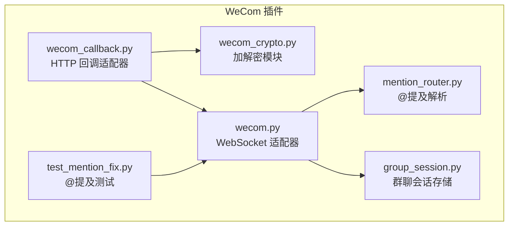
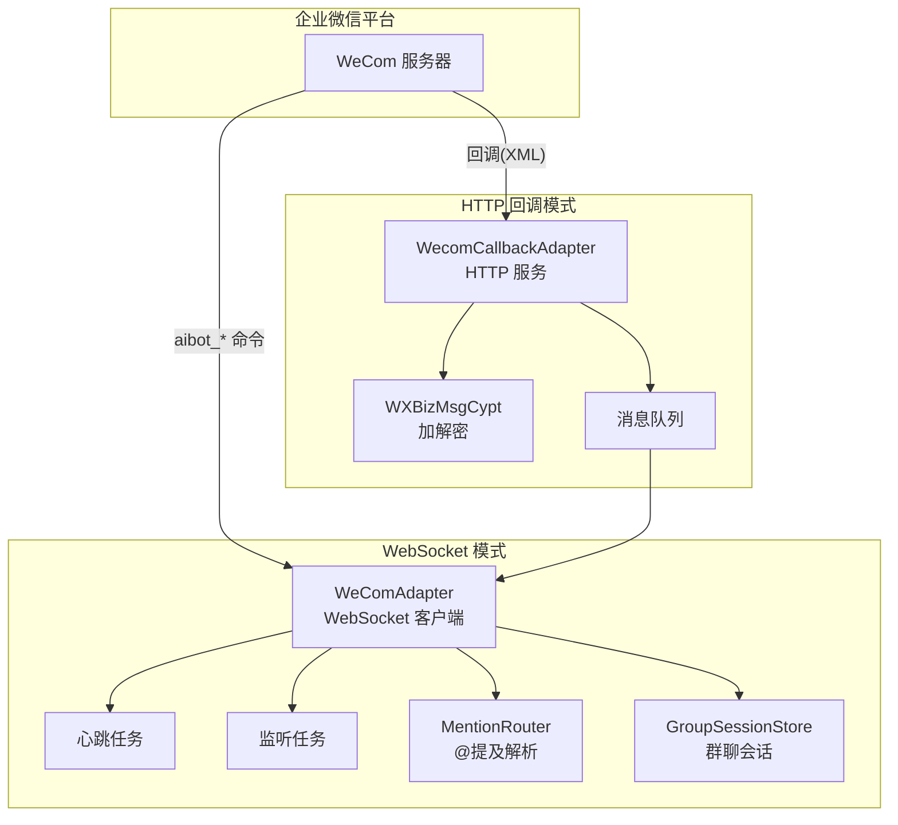
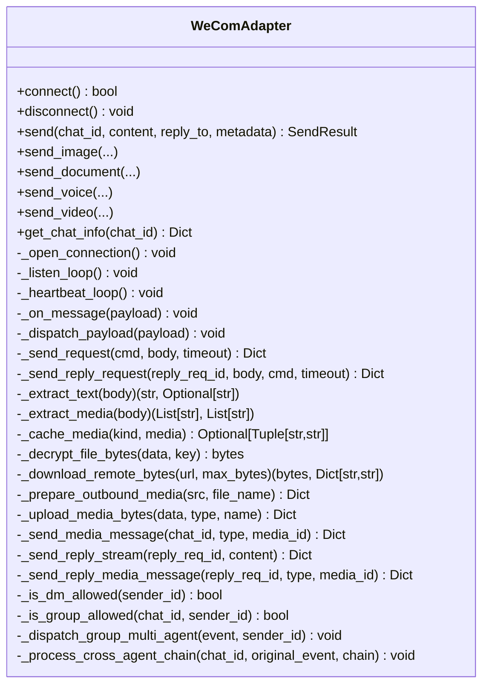
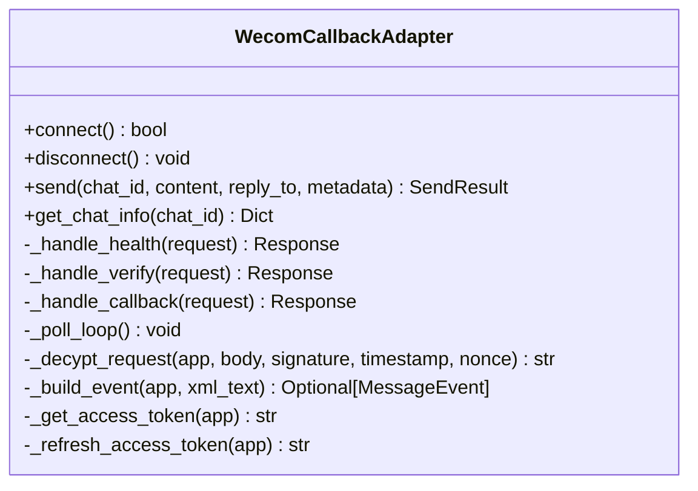
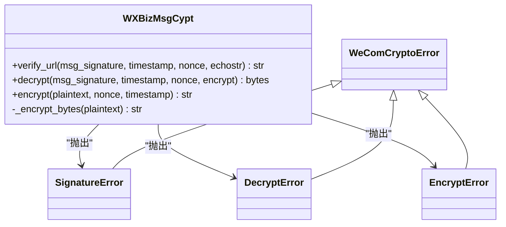
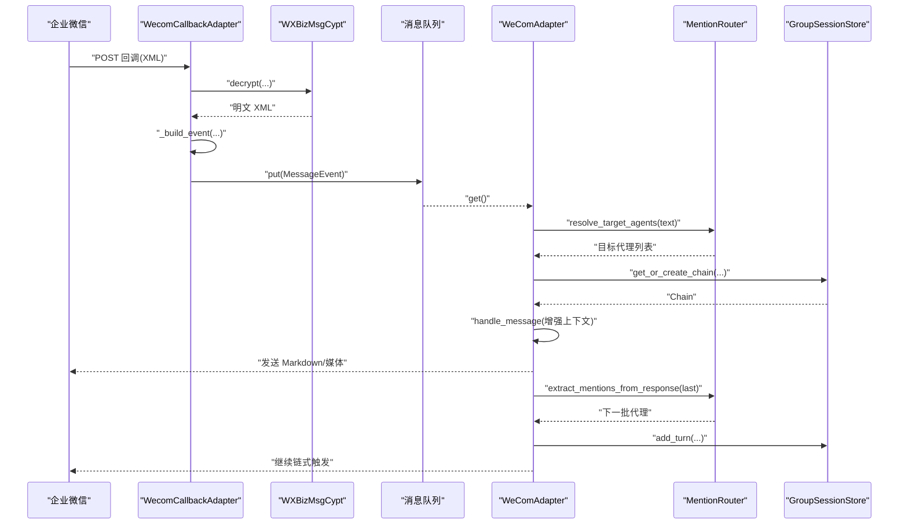
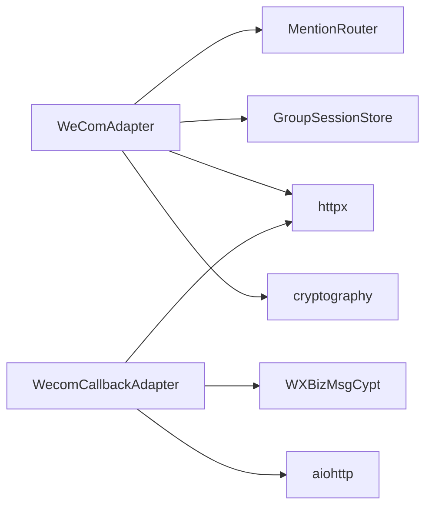

# 核心组件

<cite>
**本文引用的文件**
- [wecom.py](file://wecom.py)
- [wecom_callback.py](file://wecom_callback.py)
- [wecom_crypto.py](file://wecom_crypto.py)
- [mention_router.py](file://mention_router.py)
- [group_session.py](file://group_session.py)
- [test_mention_fix.py](file://test_mention_fix.py)
- [README.md](file://README.md)
</cite>

## 目录
1. [简介](#简介)
2. [项目结构](#项目结构)
3. [核心组件](#核心组件)
4. [架构总览](#架构总览)
5. [详细组件分析](#详细组件分析)
6. [依赖关系分析](#依赖关系分析)
7. [性能考量](#性能考量)
8. [故障排除指南](#故障排除指南)
9. [结论](#结论)
10. [附录](#附录)

## 简介
本文件面向 WeCom 插件的核心组件，系统性梳理以下能力：
- WeComAdapter 类：基于 WebSocket 的消息收发与连接管理，含去重、心跳、重连、媒体上传与下载、策略控制等。
- HTTP 回调适配器：接收企业微信回调，解密 XML，入队后异步派发，再以主动消息 API 发送回复。
- 消息加解密模块：实现与企业微信一致的 AES-CBC 加解密与签名校验，兼容官方 BizMsgCrypt。
- 多代理协作系统：@提及解析、会话管理与跨代理链式联动，支持链路长度与冷却时间控制。
- 组件间交互与数据流：从接入层到业务层的完整链路。
- API 接口说明、参数配置、使用示例、故障排除与性能优化建议。

## 项目结构
仓库采用按功能模块划分的组织方式，核心文件如下：
- wecom.py：WeCom WebSocket 模式适配器（主入口）
- wecom_callback.py：WeCom HTTP 回调模式适配器
- wecom_crypto.py：消息加解密工具
- mention_router.py：@提及解析与多代理路由
- group_session.py：群聊会话状态存储与链式调度
- test_mention_fix.py：@提及检测的单元测试样例
- README.md：项目说明与多代理配置示例

图表来源
- [wecom.py](file://wecom.py)
- [wecom_callback.py](file://wecom_callback.py)
- [wecom_crypto.py](file://wecom_crypto.py)
- [mention_router.py](file://mention_router.py)
- [group_session.py](file://group_session.py)
- [test_mention_fix.py](file://test_mention_fix.py)

章节来源
- [README.md](file://README.md)

## 核心组件
本节概述 WeCom 插件三大核心组件及其职责：
- WeComAdapter：负责与企业微信 AI Bot WebSocket 网关建立持久连接，认证握手，接收回调事件，发送消息与媒体，处理去重、心跳、重连、文本批处理与多代理路由。
- WecomCallbackAdapter：作为 HTTP 服务端，接收企业微信回调，解密 XML，构建消息事件并入队，随后通过主动消息 API 异步发送回复。
- WeComCrypto/WXBizMsgCypt：实现与企业微信一致的 AES-CBC 加解密与 SHA1 签名校验，确保回调安全。

章节来源
- [wecom.py](file://wecom.py)
- [wecom_callback.py](file://wecom_callback.py)
- [wecom_crypto.py](file://wecom_crypto.py)

## 架构总览
下图展示 WeComAdapter 与 WecomCallbackAdapter 的整体交互，以及与加解密模块、会话存储的关系。

图表来源
- [wecom.py](file://wecom.py)
- [wecom_callback.py](file://wecom_callback.py)
- [wecom_crypto.py](file://wecom_crypto.py)
- [mention_router.py](file://mention_router.py)
- [group_session.py](file://group_session.py)

## 详细组件分析

### WeComAdapter（WebSocket 模式）
WeComAdapter 是企业微信 AI Bot 的 WebSocket 适配器，负责：
- 连接生命周期管理：认证握手、心跳、断线重连、清理资源。
- 入站消息处理：去重、策略过滤、@提及判断、文本批处理、媒体缓存与下载、类型推导。
- 出站消息发送：Markdown 文本、媒体上传与发送、回复关联、错误映射。
- 多代理协作：@提及解析、会话上下文构建、跨代理链式触发。

关键特性与实现要点
- 认证与握手
  - 使用订阅命令进行认证，等待响应并校验错误码。
  - 超时控制与异常处理，失败则设置致命错误并清理资源。
- 心跳与重连
  - 应用级 ping 心跳，周期可配置。
  - 断线指数退避重连，最大等待时间受常量限制。
- 去重与请求相关性
  - 通过 req_id 关联请求与响应，维护 pending 映射。
  - 去重器对消息 ID 去重，避免重复处理。
- 文本批处理
  - 将企业微信客户端侧分片的长文本合并为完整消息后再派发。
  - 对近阈值分片采用更长静默窗口，提升合并成功率。
- 策略与权限
  - 支持私聊/群聊策略（开放/白名单/禁用），并支持按群组细粒度配置。
  - 允许按用户或群组配置 allowlist。
- 多代理与会话
  - 基于 MentionRouter 解析 @提及，结合 GroupSessionStore 维护讨论链。
  - 支持跨代理链式触发，限制链深与冷却时间，防止无限循环。
- 媒体处理
  - 支持图片、文件、语音（AMR）等类型，自动降级与尺寸限制。
  - 下载远程媒体时进行 SSRF 保护与大小限制。
  - 支持 AES-CBC 解密（当提供 AES Key）。
- 发送接口
  - 支持 Markdown 文本与媒体发送，支持回复关联与 @ 提及注入。
  - 主动消息 API 发送，错误码映射为统一错误信息。

API 接口与参数
- connect() -> bool：建立连接，返回是否成功。
- disconnect() -> None：断开连接并清理资源。
- send(chat_id, content, reply_to=None, metadata=None) -> SendResult：发送 Markdown 文本，支持 @ 提及与回复关联。
- send_image(...) / send_document(...) / send_voice(...) / send_video(...)：发送各类媒体，支持回退为文本。
- get_chat_info(chat_id) -> Dict：返回聊天基础信息。
- 内部方法：_send_request/_send_reply_request/_upload_media_bytes/_send_media_message 等。

使用示例（路径参考）
- 连接与断开：[wecom.py](file://wecom.py)
- 发送文本与媒体：[wecom.py](file://wecom.py)
- 媒体下载与解密：[wecom.py](file://wecom.py)
- 多代理链式触发：[wecom.py](file://wecom.py)

章节来源
- [wecom.py](file://wecom.py)

#### WeComAdapter 类图

图表来源
- [wecom.py](file://wecom.py)

### HTTP 回调适配器（WecomCallbackAdapter）
该适配器以 HTTP 服务形式运行，负责：
- 启动 HTTP 服务，注册健康检查、URL 校验与回调入口。
- 解密回调 XML，构建消息事件并入队，立即返回成功。
- 后台轮询队列，将事件交由网关处理。
- 通过主动消息 API 发送回复，携带 access_token。

关键特性与实现要点
- 服务启动与健康检查
  - 绑定主机、端口与路径，默认 0.0.0.0:8645/wecomcallback。
  - 启动前进行端口占用检查。
- URL 校验
  - GET 请求用于校验回调 URL，逐应用尝试解密 echoStr 并返回明文。
- 回调处理
  - POST 接收加密 XML，逐应用尝试解密，构建 MessageEvent 并入队。
  - 立即返回 success，避免阻塞企业微信回调。
- 访问令牌管理
  - 缓存 access_token，过期前刷新，减少频繁请求。
- 多应用支持
  - 支持同一实例下多个 cop_id/use_id 应用，按 cop_id:use_id 作用域隔离。

API 接口与参数
- connect() -> bool：启动 HTTP 服务并注册路由。
- disconnect() -> None：停止服务并清理资源。
- send(chat_id, content, reply_to=None, metadata=None) -> SendResult：通过主动消息 API 发送文本。
- get_chat_info(chat_id) -> Dict：返回聊天基础信息。

使用示例（路径参考）
- 服务启动与路由注册：[wecom_callback.py](file://wecom_callback.py)
- 回调解密与事件构建：[wecom_callback.py](file://wecom_callback.py)
- 主动消息发送：[wecom_callback.py](file://wecom_callback.py)

章节来源
- [wecom_callback.py](file://wecom_callback.py)

#### HTTP 回调适配器类图

图表来源
- [wecom_callback.py](file://wecom_callback.py)

### 消息加解密模块（WXBizMsgCypt）
该模块实现与企业微信一致的 AES-CBC 加解密与 SHA1 签名校验，确保回调安全：
- 初始化参数：token、encoding_aes_key、receive_id。
- 校验 URL：verify_url 将加密 echoStr 解密并返回明文。
- 解密回调：decrypt 校验签名，解密并剥离随机前缀与 receive_id。
- 加密输出：encrypt 生成 Encrypted XML，包含签名、时间戳与随机数。

API 接口与参数
- verify_url(msg_signature, timestamp, nonce, echostr) -> str：URL 校验。
- decrypt(msg_signature, timestamp, nonce, encrypt) -> bytes：解密回调。
- encrypt(plaintext, nonce=None, timestamp=None) -> str：加密输出。

使用示例（路径参考）
- 加解密实现与异常类型：[wecom_crypto.py](file://wecom_crypto.py)

章节来源
- [wecom_crypto.py](file://wecom_crypto.py)

#### 加解密模块类图

图表来源
- [wecom_crypto.py](file://wecom_crypto.py)

### 多代理协作系统（@提及解析与会话管理）
- @提及解析（MentionRouter）
  - 支持多模式 @ 匹配（名称、ID、全名等），按首次出现顺序返回目标代理。
  - 提供提取干净文本、从响应中提取 @ 提及的能力。
- 群聊会话（GroupSessionStore）
  - 维护讨论链：原始用户消息、已触发代理、回合记录、链深、冷却时间。
  - 提供链创建、完成、中断、清理与过期回收。
- 跨代理链式触发（WeComAdapter）
  - 基于 @提及解析确定目标代理，按回合上下文构建消息，依次调用代理。
  - 检查最新代理响应中的 @ 提及，自动触发下一个代理，直至链路结束或达到上限。

API 接口与参数
- MentionRouter.resolve_target_agents(text) -> List[str]：解析 @ 提及。
- GroupSessionStore.get_or_create_chain(...) -> Chain：获取或创建链。
- WeComAdapter._dispatch_group_multi_agent(...)：多代理派发。
- WeComAdapter._process_cross_agent_chain(...)：跨代理链式处理。

使用示例（路径参考）
- @提及解析与配置：[mention_router.py](file://mention_router.py)
- 群聊会话存储：[group_session.py](file://group_session.py)
- 多代理派发与链式触发：[wecom.py](file://wecom.py)

章节来源
- [mention_router.py](file://mention_router.py)
- [group_session.py](file://group_session.py)
- [wecom.py](file://wecom.py)

#### 多代理协作序列图

图表来源
- [wecom_callback.py](file://wecom_callback.py)
- [wecom_crypto.py](file://wecom_crypto.py)
- [wecom.py](file://wecom.py)
- [mention_router.py](file://mention_router.py)
- [group_session.py](file://group_session.py)

## 依赖关系分析
- WeComAdapter 依赖：
  - MentionRouter：用于 @提及解析与多代理路由。
  - GroupSessionStore：用于群聊讨论链的上下文与状态管理。
  - 媒体下载与解密：依赖 httpx 与 cryptography。
- WecomCallbackAdapter 依赖：
  - WXBizMsgCypt：用于回调解密与 URL 校验。
  - httpx：用于主动消息 API 请求。
  - aiohttp：用于 HTTP 服务端。
- MentionRouter 与 GroupSessionStore 为纯 Python 实现，无外部依赖。

图表来源
- [wecom.py](file://wecom.py)
- [wecom_callback.py](file://wecom_callback.py)
- [wecom_crypto.py](file://wecom_crypto.py)
- [mention_router.py](file://mention_router.py)
- [group_session.py](file://group_session.py)

章节来源
- [wecom.py](file://wecom.py)
- [wecom_callback.py](file://wecom_callback.py)
- [wecom_crypto.py](file://wecom_crypto.py)
- [mention_router.py](file://mention_router.py)
- [group_session.py](file://group_session.py)

## 性能考量
- 连接与心跳
  - 心跳间隔与超时参数可调，建议根据网络状况适当增大心跳间隔以降低 CPU 占用。
  - 重连退避策略避免雪崩，建议在高并发场景下保持默认退避序列。
- 文本批处理
  - 文本批处理延迟与分片阈值可调，合理设置可减少消息碎片化带来的多次派发。
- 媒体处理
  - 远程媒体下载启用 SSRF 保护与大小限制，避免大文件导致内存压力。
  - 媒体上传采用分块上传，建议根据网络质量调整块大小与并发。
- 多代理链式
  - 链深与冷却时间限制可防止链式风暴，建议结合业务场景调优。
- HTTP 回调
  - 解密与入队为异步处理，避免阻塞回调响应；主动消息 API 调用需注意限流与重试。

[本节为通用性能建议，无需特定文件引用]

## 故障排除指南
常见问题与排查步骤
- WebSocket 连接失败
  - 检查依赖安装：aiohttp、httpx 是否可用。
  - 校验 bot_id 与 secret 是否配置正确。
  - 查看认证响应错误码与日志，确认网络可达与证书有效。
- 断线重连频繁
  - 检查网络波动与防火墙策略；适当增大心跳间隔。
  - 关注去重与请求相关性，避免重复消息导致误判。
- 媒体发送失败
  - 检查文件大小与类型限制，必要时进行降级发送。
  - 若为加密文件，确认 AES Key 与解密流程。
- 回调解密失败
  - 确认 token、encoding_aes_key、receive_id 配置一致。
  - 校验签名计算顺序与编码，确保与企业微信一致。
- 多代理链式异常
  - 检查 @提及正则与边界字符配置，确保命中预期代理。
  - 关注链深与冷却时间，避免无限循环与过快触发。

章节来源
- [wecom.py](file://wecom.py)
- [wecom_callback.py](file://wecom_callback.py)
- [wecom_crypto.py](file://wecom_crypto.py)

## 结论
WeCom 插件通过 WeComAdapter 与 WecomCallbackAdapter 提供了两种接入模式，配合 WXBizMsgCypt 的加解密能力与 MentionRouter、GroupSessionStore 的多代理协作机制，实现了稳定、可扩展的企业微信集成方案。建议在生产环境中：
- 明确接入模式与部署方式（WebSocket 或 HTTP 回调）。
- 严格配置安全参数（token、encoding_aes_key、bot_id、secret）。
- 合理设置策略与多代理参数，保障链式触发的稳定性。
- 关注媒体与网络性能，做好限流与降级策略。

[本节为总结性内容，无需特定文件引用]

## 附录

### API 接口说明与参数配置
- WeComAdapter
  - connect()/disconnect()：连接生命周期管理。
  - send(chat_id, content, reply_to=None, metadata=None)：发送 Markdown 文本，metadata 支持 mention_names 注入 @ 提及。
  - send_image/send_document/send_voice/send_video：发送各类媒体，支持 caption 与回复关联。
  - get_chat_info(chat_id)：返回聊天基础信息。
  - 配置项（extra）：bot_id、secret、websocket_url、dm_policy、allow_from、group_policy、group_allow_from、groups、multi_agent 等。
- WecomCallbackAdapter
  - connect()/disconnect()：启动/停止 HTTP 服务。
  - send(chat_id, content, reply_to=None, metadata=None)：通过主动消息 API 发送文本。
  - 配置项（extra）：host、port、path、apps（包含 cop_id、cop_secret、agent_id、token、encoding_aes_key）。
- WXBizMsgCypt
  - verify_url()/decrypt()/encrypt()：回调解密与加密。
  - 配置项：token、encoding_aes_key（43 字符）、receive_id。

章节来源
- [wecom.py](file://wecom.py)
- [wecom_callback.py](file://wecom_callback.py)
- [wecom_crypto.py](file://wecom_crypto.py)

### 使用示例（路径参考）
- WeComAdapter
  - 连接与断开：[wecom.py](file://wecom.py)
  - 发送文本与媒体：[wecom.py](file://wecom.py)
  - 多代理派发与链式触发：[wecom.py](file://wecom.py)
- WecomCallbackAdapter
  - 服务启动与路由注册：[wecom_callback.py](file://wecom_callback.py)
  - 回调解密与事件构建：[wecom_callback.py](file://wecom_callback.py)
  - 主动消息发送：[wecom_callback.py](file://wecom_callback.py)
- 加解密
  - 加解密实现与异常类型：[wecom_crypto.py](file://wecom_crypto.py)
- @提及修复测试
  - 修复逻辑与测试用例：[test_mention_fix.py](file://test_mention_fix.py)

章节来源
- [wecom.py](file://wecom.py)
- [wecom_callback.py](file://wecom_callback.py)
- [wecom_crypto.py](file://wecom_crypto.py)
- [test_mention_fix.py](file://test_mention_fix.py)