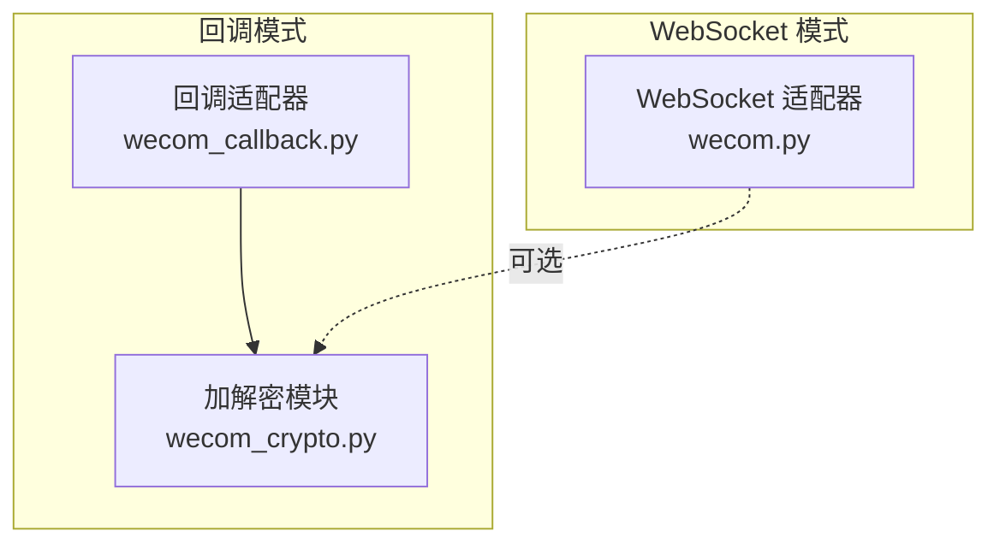
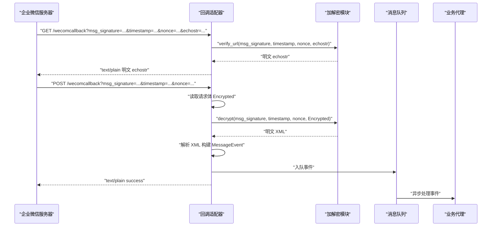
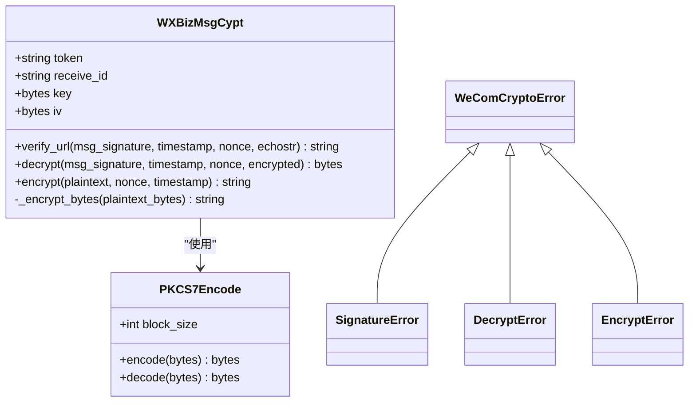
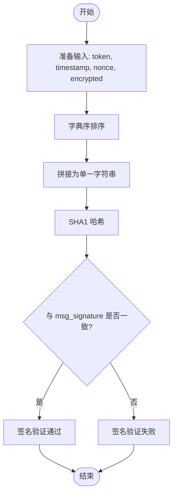
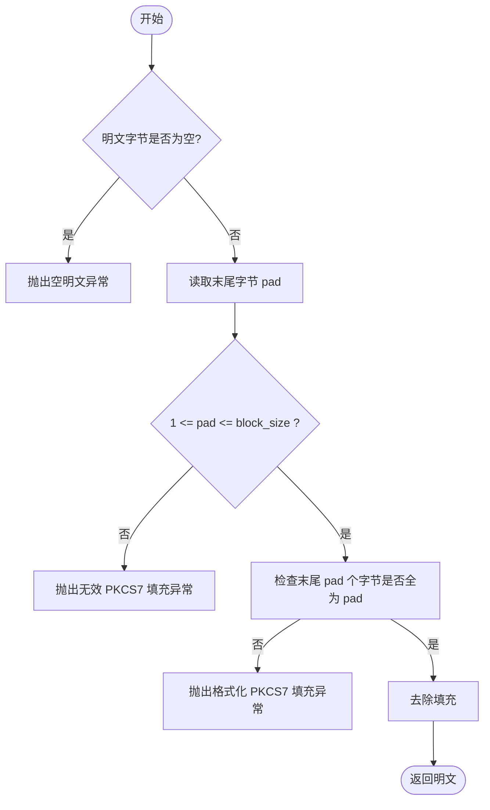
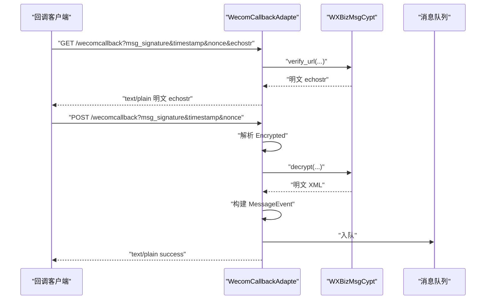
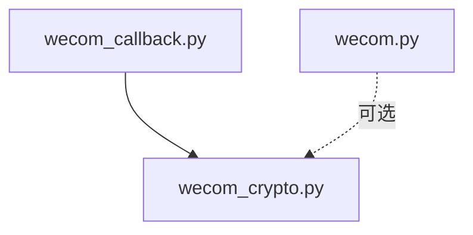

# 消息加解密模块

<cite>
**本文档引用的文件**
- [wecom_crypto.py](file://wecom_crypto.py)
- [wecom_callback.py](file://wecom_callback.py)
- [README.md](file://README.md)
- [wecom.py](file://wecom.py)
- [test_mention_fix.py](file://test_mention_fix.py)
- [mention_router.py](file://mention_router.py)
- [group_session.py](file://group_session.py)
</cite>

## 目录
1. [简介](#简介)
2. [项目结构](#项目结构)
3. [核心组件](#核心组件)
4. [架构总览](#架构总览)
5. [详细组件分析](#详细组件分析)
6. [依赖分析](#依赖分析)
7. [性能考虑](#性能考虑)
8. [故障排查指南](#故障排查指南)
9. [结论](#结论)
10. [附录](#附录)

## 简介
本文件为 WeCom 加密解密模块的技术文档，聚焦于回调模式下的消息加解密与签名验证机制。文档深入解释：
- AES-CBC 加密算法的实现与使用
- SHA1 签名验证机制
- PKCS7 填充标准的应用
- 企业微信回调消息的加密解密流程（含消息签名验证与数据完整性保护）
- 完整的 API 接口说明（加密函数、解密函数、签名验证函数）
- 密钥管理、IV 向量生成与安全最佳实践
- 常见错误处理与安全审计建议

本模块与回调适配器协同工作，确保从企业微信服务器接收的回调消息在传输过程中具备机密性、完整性与抗抵赖性。

## 项目结构
该仓库包含 WeCom 插件的核心文件，其中与消息加解密直接相关的是：
- wecom_crypto.py：实现与企业微信兼容的回调模式加解密与签名验证
- wecom_callback.py：基于 aiohttp 的回调 HTTP 服务端，负责接收回调、解密与事件分发
- wecom.py：企业微信 WebSocket 模式适配器（与回调模式互补）
- 其他工具模块：mention_router.py、group_session.py、test_mention_fix.py 等

图表来源
- [wecom_callback.py:55-388](file://wecom_callback.py#L55-L388)
- [wecom_crypto.py:66-143](file://wecom_crypto.py#L66-L143)

章节来源
- [README.md:1-43](file://README.md#L1-L43)

## 核心组件
- 加密解密类：WXBizMsgCypt
  - 提供回调模式下的消息加密、解密与签名验证
  - 内部使用 AES-CBC 对称加密与 PKCS7 填充
- 签名辅助：SHA1 签名计算
  - 将 token、timestamp、nonce、密文按字典序拼接后进行 SHA1 计算
- PKCS7 编解码：PKCS7Encode
  - 实现 PKCS7 填充与去填充
- 回调适配器：WecomCallbackAdapte
  - 提供 GET URL 校验与 POST 回调解密、事件构建与队列投递

章节来源
- [wecom_crypto.py:66-143](file://wecom_crypto.py#L66-L143)
- [wecom_callback.py:55-388](file://wecom_callback.py#L55-L388)

## 架构总览
回调模式的消息流如下：
1. 企业微信服务器向本服务的回调地址发起请求（GET URL 校验或 POST 回调）
2. 回调适配器解析查询参数与请求体
3. 使用加解密模块对密文进行 SHA1 签名验证与 AES-CBC 解密
4. 解析出明文 XML，提取 MsgType、Content 等字段，构建消息事件
5. 将事件入队，立即返回成功响应，后续由主动消息接口回复

图表来源
- [wecom_callback.py:232-276](file://wecom_callback.py#L232-L276)
- [wecom_callback.py:293-300](file://wecom_callback.py#L293-L300)
- [wecom_crypto.py:84-112](file://wecom_crypto.py#L84-L112)

## 详细组件分析

### 加密解密类 WXBizMsgCypt
- 初始化参数
  - token：用于签名验证的令牌
  - encoding_aes_key：Base64 编码的 AES 密钥（长度需为 43）
  - receive_id：企业微信应用的接收方标识（通常为企业 ID）
- 关键方法
  - verify_url(msg_signature, timestamp, nonce, echostr)：URL 校验，解密回显字符串
  - decrypt(msg_signature, timestamp, nonce, encrypted)：解密回调消息，校验签名与 receive_id
  - encrypt(plaintext, nonce, timestamp)：加密明文，生成签名与 XML 结构
  - _encrypt_bytes(plaintext_bytes)：内部实现加密核心逻辑
- 数据结构与填充
  - PKCS7 填充块大小为 32 字节
  - IV 向量取密钥前 16 字节
  - 明文格式：随机前缀(16B) + 文本长度(4B) + 文本 + receive_id
- 异常类型
  - SignatureError、DecryptError、EncryptError、WeComCryptoError

图表来源
- [wecom_crypto.py:66-143](file://wecom_crypto.py#L66-L143)

章节来源
- [wecom_crypto.py:66-143](file://wecom_crypto.py#L66-L143)

### SHA1 签名验证机制
- 输入序列：token、timestamp、nonce、密文（均转换为字符串）
- 排序规则：按字典序升序排列
- 计算方式：对排序后的字符串拼接后进行 SHA1 哈希
- 校验流程：将计算结果与请求中的 msg_signature 比较，一致则通过

图表来源
- [wecom_crypto.py:61-64](file://wecom_crypto.py#L61-L64)

章节来源
- [wecom_crypto.py:61-64](file://wecom_crypto.py#L61-L64)

### PKCS7 填充标准
- 填充规则：填充长度等于需要补齐的字节数，每个填充字节值等于填充长度
- 去填充规则：检查末尾字节值是否在 [1..block_size] 范围内，且末尾连续相同字节数等于该值
- 错误处理：非法填充或格式错误抛出解密异常

图表来源
- [wecom_crypto.py:49-58](file://wecom_crypto.py#L49-L58)

章节来源
- [wecom_crypto.py:38-58](file://wecom_crypto.py#L38-L58)

### 回调适配器 WecomCallbackAdapte
- 生命周期
  - connect：启动 HTTP 服务，注册健康检查、URL 校验与回调处理路由
  - disconnect：清理资源，关闭站点与客户端
- GET 校验
  - 解析 msg_signature、timestamp、nonce、echostr
  - 遍历配置的应用，尝试解密回显字符串，成功即返回明文
- POST 回调
  - 解析 msg_signature、timestamp、nonce、Encrypted
  - 解密明文 XML，构建 MessageEvent 并入队，立即返回 success
- 应用配置
  - 支持多应用配置，按 cop_id:use_id 命名空间避免冲突
  - 自动刷新 access_token 以支持后续主动消息发送

图表来源
- [wecom_callback.py:232-276](file://wecom_callback.py#L232-L276)
- [wecom_callback.py:293-300](file://wecom_callback.py#L293-L300)

章节来源
- [wecom_callback.py:55-388](file://wecom_callback.py#L55-L388)

### 主动消息发送（与回调模式配合）
- 通过 access_token 获取与企业微信 API 交互
- 支持文本、Markdown、图片、文档、语音、视频等消息类型
- 支持 @ 提及与回复消息的关联

章节来源
- [wecom.py:1616-1774](file://wecom.py#L1616-L1774)

## 依赖分析
- 外部依赖
  - cryptography：AES-CBC 加解密与 PKCS7 填充
  - aiohttp/httpx：HTTP 服务端与客户端
  - lxml（XML 解析）：在回调适配器中解析 Encrypted XML
- 内部依赖
  - 回调适配器依赖加解密模块进行消息解密与签名验证
  - 主动消息发送依赖 access_token 管理与企业微信 API

图表来源
- [wecom_callback.py:40-40](file://wecom_callback.py#L40-L40)
- [wecom_crypto.py:18-19](file://wecom_crypto.py#L18-L19)

章节来源
- [wecom_callback.py:40-40](file://wecom_callback.py#L40-L40)
- [wecom_crypto.py:18-19](file://wecom_crypto.py#L18-L19)

## 性能考虑
- 加解密性能
  - AES-CBC 在 CPU 上开销较小，适合高并发场景
  - 建议使用异步 HTTP 服务（aiohttp）与异步队列，避免阻塞
- 内存占用
  - 明文 XML 与加密负载按需处理，注意及时释放中间变量
- 并发与限流
  - 回调适配器使用 asyncio 队列与任务调度，避免阻塞主请求线程
- I/O 优化
  - 主动消息发送采用 httpx 异步客户端，合理设置超时与重试策略

## 故障排查指南
- 常见错误与定位
  - 签名不匹配：检查 token、timestamp、nonce、密文顺序与编码一致性
  - Base64 解码失败：确认 Encrypted 字段为有效 Base64
  - PKCS7 填充错误：检查密钥长度与填充块大小是否符合规范
  - receive_id 不匹配：确认 receive_id 与企业微信应用配置一致
  - URL 校验失败：确认回调地址与企业微信后台配置一致
- 日志与调试
  - 回调适配器记录关键事件与异常，便于定位问题
  - 建议开启详细日志级别，捕获请求头与响应状态
- 安全审计要点
  - 核对密钥长度与 Base64 编码格式
  - 校验 IV 与密钥派生逻辑
  - 确保签名验证在解密前执行
  - 防止敏感信息泄露，避免在日志中输出密钥与明文

章节来源
- [wecom_callback.py:232-276](file://wecom_callback.py#L232-L276)
- [wecom_crypto.py:84-112](file://wecom_crypto.py#L84-L112)

## 结论
本模块实现了与企业微信回调模式兼容的加解密与签名验证能力，结合回调适配器可安全可靠地处理企业微信推送的加密消息。通过严格的签名验证、PKCS7 填充与密钥管理，确保了消息的机密性、完整性与抗抵赖性。建议在生产环境中遵循安全最佳实践，定期轮换密钥、严格控制日志输出，并进行持续的安全审计。

## 附录

### API 接口说明（摘要）
- WXBizMsgCypt.encrypt(plaintext, nonce=None, timestamp=None) -> string
  - 功能：加密明文，生成 Encrypted、MsgSignature、Timestamp、Nonce 的 XML
  - 参数：明文字符串、随机 nonce、时间戳（可选）
  - 返回：XML 字符串
- WXBizMsgCypt.decrypt(msg_signature, timestamp, nonce, encrypted) -> bytes
  - 功能：解密回调消息，校验签名与 receive_id
  - 参数：签名、时间戳、随机 nonce、加密字符串
  - 返回：明文 XML 字节
- WXBizMsgCypt.verify_url(msg_signature, timestamp, nonce, echostr) -> string
  - 功能：URL 校验，解密回显字符串
  - 参数：签名、时间戳、随机 nonce、回显字符串
  - 返回：明文字符串
- PKCS7Encode.encode(bytes) -> bytes
  - 功能：PKCS7 填充
- PKCS7Encode.decode(bytes) -> bytes
  - 功能：去填充，校验填充合法性

章节来源
- [wecom_crypto.py:114-124](file://wecom_crypto.py#L114-L124)
- [wecom_crypto.py:88-112](file://wecom_crypto.py#L88-L112)
- [wecom_crypto.py:84-86](file://wecom_crypto.py#L84-L86)
- [wecom_crypto.py:42-47](file://wecom_crypto.py#L42-L47)
- [wecom_crypto.py:50-58](file://wecom_crypto.py#L50-L58)

### 密钥管理与安全最佳实践
- 密钥长度
  - encoding_aes_key 必须为 43 字符的 Base64 编码，解码后长度为 32 字节
- IV 向量
  - IV 为密钥前 16 字节，确保与企业微信实现一致
- 随机性
  - nonce 与随机前缀应使用安全随机源生成
- 传输安全
  - 回调地址应使用 HTTPS，避免中间人攻击
- 日志与审计
  - 避免记录密钥与明文，仅记录必要上下文（如 msg_signature 校验结果）

章节来源
- [wecom_crypto.py:69-82](file://wecom_crypto.py#L69-L82)
- [wecom_crypto.py:139-142](file://wecom_crypto.py#L139-L142)

### 企业微信回调消息解密流程详解
- 请求阶段
  - GET：URL 校验，返回明文 echostr
  - POST：接收 Encrypted，立即返回 success
- 解密阶段
  - 校验 SHA1 签名
  - Base64 解码密文
  - AES-CBC 解密
  - PKCS7 去填充
  - 提取明文长度与 receive_id
  - 解析 XML，构建消息事件
- 响应阶段
  - 入队事件，异步处理
  - 返回 success，避免重复投递

章节来源
- [wecom_callback.py:232-276](file://wecom_callback.py#L232-L276)
- [wecom_callback.py:293-300](file://wecom_callback.py#L293-L300)
- [wecom_crypto.py:88-112](file://wecom_crypto.py#L88-L112)