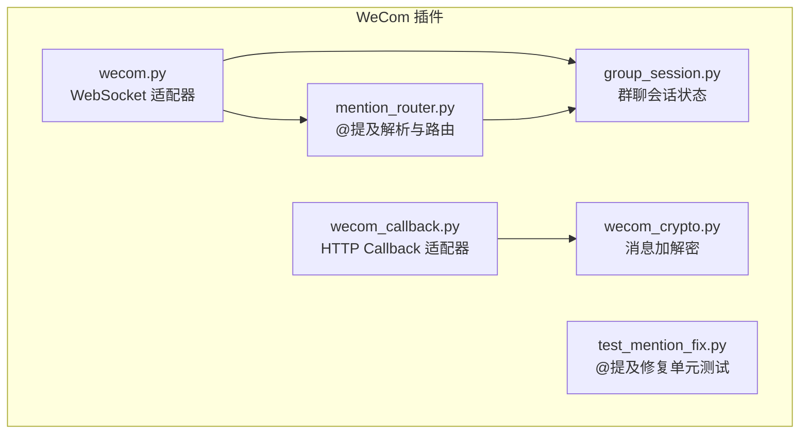
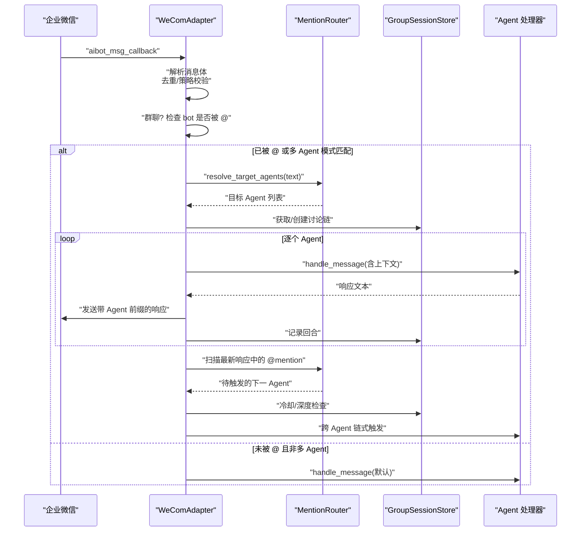
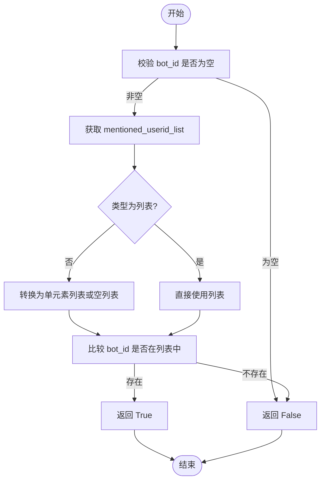
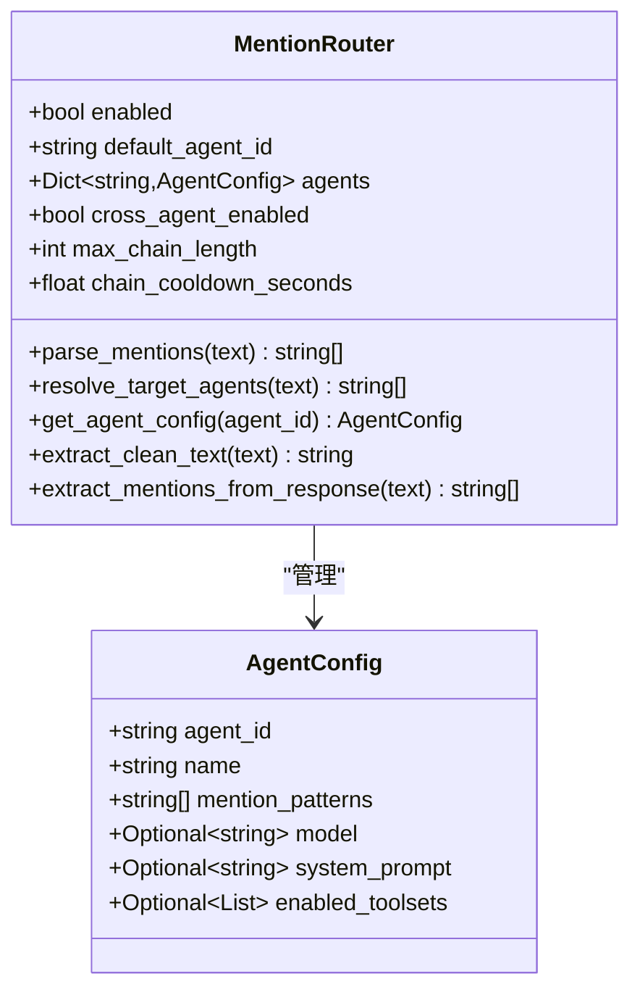
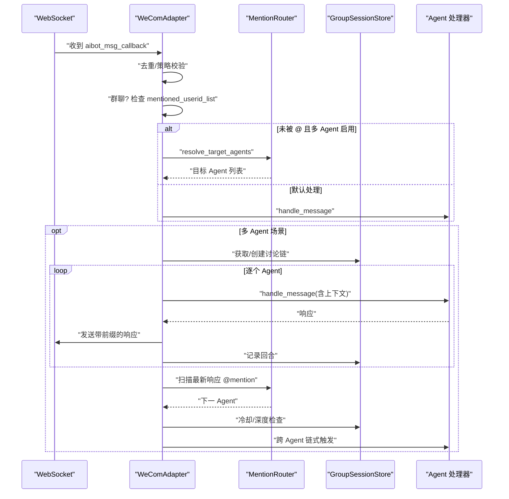
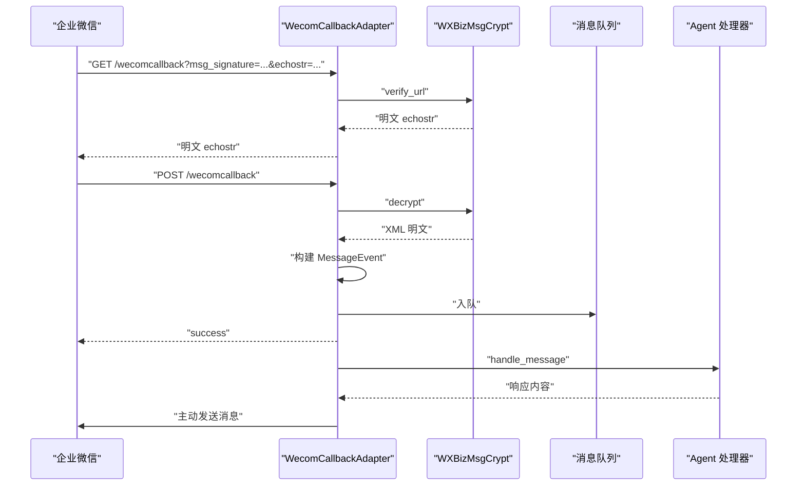
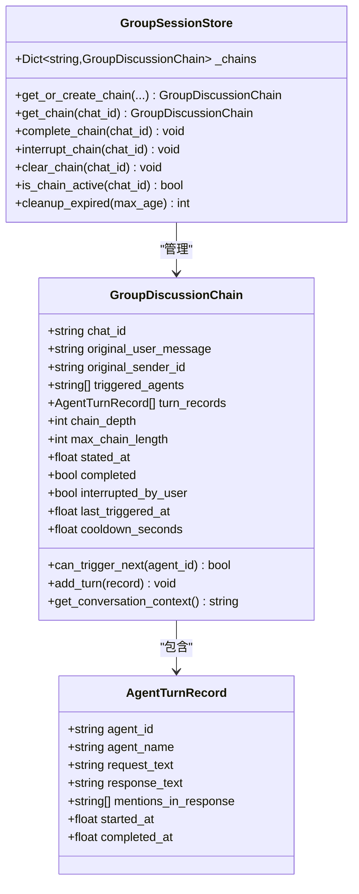
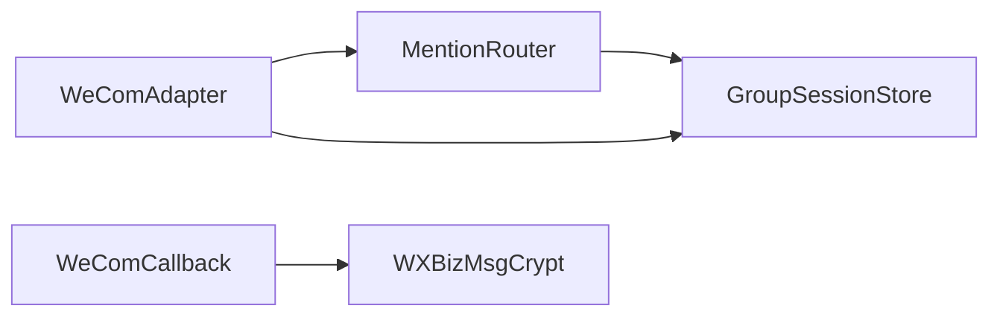

# 测试与调试

<cite>
**本文引用的文件**
- [README.md](file://README.md)
- [test_mention_fix.py](file://test_mention_fix.py)
- [mention_router.py](file://mention_router.py)
- [wecom.py](file://wecom.py)
- [wecom_callback.py](file://wecom_callback.py)
- [wecom_crypto.py](file://wecom_crypto.py)
- [group_session.py](file://group_session.py)
</cite>

## 目录
1. [简介](#简介)
2. [项目结构](#项目结构)
3. [核心组件](#核心组件)
4. [架构总览](#架构总览)
5. [详细组件分析](#详细组件分析)
6. [依赖分析](#依赖分析)
7. [性能考虑](#性能考虑)
8. [故障排查指南](#故障排查指南)
9. [结论](#结论)
10. [附录](#附录)

## 简介
本指南面向 WeCom 插件的测试与调试，覆盖单元测试编写、@提及修复功能的测试策略、集成测试场景与执行流程、调试工具与日志分析、常见问题诊断与解决、性能与压力测试实施、测试数据准备与模拟环境搭建，以及自动化测试与持续集成建议。目标是帮助开发者快速定位问题、验证修复、保障多 Agent 群聊与 @提及路由的稳定性与可维护性。

## 项目结构
该仓库包含 WeCom 适配器（WebSocket 与 Callback 两种模式）、消息加解密模块、@提及解析与多 Agent 路由、群聊会话状态管理等核心模块，并提供针对 @提及修复的独立测试脚本。

图表来源
- [wecom.py](file://wecom.py)
- [wecom_callback.py](file://wecom_callback.py)
- [wecom_crypto.py](file://wecom_crypto.py)
- [mention_router.py](file://mention_router.py)
- [group_session.py](file://group_session.py)
- [test_mention_fix.py](file://test_mention_fix.py)

章节来源
- [README.md](file://README.md)
- [wecom.py](file://wecom.py)
- [wecom_callback.py](file://wecom_callback.py)
- [wecom_crypto.py](file://wecom_crypto.py)
- [mention_router.py](file://mention_router.py)
- [group_session.py](file://group_session.py)
- [test_mention_fix.py](file://test_mention_fix.py)

## 核心组件
- WeCom WebSocket 适配器：负责连接、认证、事件分发、消息聚合、媒体下载与上传、@提及检测与多 Agent 路由、跨 Agent 链式调用。
- WeCom Callback 适配器：处理企业自建应用回调，解密 XML，入队消息，异步发送响应。
- 消息加解密模块：兼容官方 BizMsgCrypt 语义，实现签名验证、AES-CBC 解密与加密。
- @提及解析与路由：从文本中提取 @mention，构建正则规则，解析多 Agent 群聊目标与顺序，支持链式触发。
- 群聊会话状态：记录多 Agent 讨论链的上下文、深度、冷却时间、中断标记等，避免无限循环。
- @提及修复单元测试：验证群聊消息中 bot 是否被 @ 的判断逻辑，覆盖多种边界情况。

章节来源
- [wecom.py](file://wecom.py)
- [wecom_callback.py](file://wecom_callback.py)
- [wecom_crypto.py](file://wecom_crypto.py)
- [mention_router.py](file://mention_router.py)
- [group_session.py](file://group_session.py)
- [test_mention_fix.py](file://test_mention_fix.py)

## 架构总览
下图展示 WeCom 适配器在群聊中的消息处理路径，包括 @提及检测、多 Agent 路由、会话状态管理与跨 Agent 链式触发。

图表来源
- [wecom.py](file://wecom.py)
- [mention_router.py](file://mention_router.py)
- [group_session.py](file://group_session.py)

## 详细组件分析

### @提及修复单元测试
- 测试目标：验证群聊消息中 bot 是否被 @ 的判断逻辑，确保多 Agent 模式与 @提及解析协同工作。
- 关键点：
  - 支持 mentioned_userid_list 为列表、字符串、缺失、空数组等边界。
  - 与 MentionRouter 的解析结果联动，验证“未被 @”时是否按默认策略处理。
- 测试用例覆盖：
  - 被 @ 的消息应被处理。
  - 未被 @ 的消息应被忽略。
  - mentioned_userid_list 类型异常与空值处理。
  - bot_id 为空时不应误判。

图表来源
- [test_mention_fix.py](file://test_mention_fix.py)

章节来源
- [test_mention_fix.py](file://test_mention_fix.py)

### MentionRouter 组件
- 功能：解析 @mention 文本，生成正则规则，按首次出现位置排序返回目标 Agent 列表；支持从响应中提取再次触发的 Agent。
- 关键配置：
  - enabled、default_agent、agents（含 name、mention_patterns、模型/系统提示/工具集覆盖）。
  - cross_agent（启用、最大链长、冷却秒数）。
- 边界与复杂度：
  - 正则编译与匹配，时间复杂度与文本长度和模式数量相关。
  - 提取消除 @ 标记后清理多余空白，避免影响后续处理。

图表来源
- [mention_router.py](file://mention_router.py)

章节来源
- [mention_router.py](file://mention_router.py)

### WeComAdapter（WebSocket 模式）
- 连接与认证：建立 WebSocket，发送订阅请求，等待握手确认。
- 入站消息处理：
  - 去重、策略校验（DM/群组白名单/禁用）。
  - 群聊中优先检查 mentioned_userid_list，其次通过 MentionRouter 解析 @mention。
  - 文本批处理：合并接近 4000 字符的客户端侧拆分。
- 多 Agent 路由与跨 Agent 链式触发：
  - 构建会话上下文，依次调用目标 Agent。
  - 扫描最新响应中的 @mention，按冷却与链长限制继续触发。
- 出站消息：支持 Markdown、媒体上传与回复流，注入 @mention 用户名列表。

图表来源
- [wecom.py](file://wecom.py)
- [mention_router.py](file://mention_router.py)
- [group_session.py](file://group_session.py)

章节来源
- [wecom.py](file://wecom.py)

### WeComCallback（HTTP Callback 模式）
- 功能：监听 HTTP 端点，接收企业自建应用回调，解密 XML，构建消息事件，入队后立即 ACK，稍后通过主动 API 发送响应。
- 加解密：使用 WXBizMsgCrypt 实现签名验证与 AES-CBC 解密。
- 应用管理：支持多应用配置，按 cop_id:user_id 映射到具体应用，维护访问令牌缓存。

图表来源
- [wecom_callback.py](file://wecom_callback.py)
- [wecom_crypto.py](file://wecom_crypto.py)

章节来源
- [wecom_callback.py](file://wecom_callback.py)
- [wecom_crypto.py](file://wecom_crypto.py)

### 群聊会话状态（GroupSessionStore）
- 记录一次多 Agent 讨论链的上下文、已触发 Agent、深度、冷却时间、中断标记等。
- 提供并发安全的获取/创建、完成、中断、清理过期链等操作。
- 用于防止无限循环与过度触发，保证链式对话有序进行。

图表来源
- [group_session.py](file://group_session.py)

章节来源
- [group_session.py](file://group_session.py)

## 依赖分析
- WeComAdapter 依赖 MentionRouter 与 GroupSessionStore，实现多 Agent 群聊与链式触发。
- WeComCallback 依赖 WXBizMsgCrypt 完成回调解密。
- MentionRouter 依赖正则表达式与配置字典，构建可扩展的 @mention 规则。
- GroupSessionStore 为内存态，避免跨实例共享，适合网关重启后清空。

图表来源
- [wecom.py](file://wecom.py)
- [wecom_callback.py](file://wecom_callback.py)
- [wecom_crypto.py](file://wecom_crypto.py)
- [mention_router.py](file://mention_router.py)
- [group_session.py](file://group_session.py)

章节来源
- [wecom.py](file://wecom.py)
- [wecom_callback.py](file://wecom_callback.py)
- [wecom_crypto.py](file://wecom_crypto.py)
- [mention_router.py](file://mention_router.py)
- [group_session.py](file://group_session.py)

## 性能考虑
- 文本批处理：对接近 4000 字符的长消息设置短延迟刷新，减少重复派发与网络开销。
- 媒体上传：分块上传，限制最大块数与总大小，失败时降级为文本或文件发送。
- 去重与心跳：基于消息 ID 去重，应用层 ping 保活，异常自动重连。
- 多 Agent 链式触发：通过冷却时间与最大链长限制，避免风暴式调用。
- 日志级别：生产环境建议 INFO/ERROR，调试时临时提升到 DEBUG。

[本节为通用指导，无需特定文件来源]

## 故障排查指南
- 连接与认证失败
  - 检查依赖安装（aiohttp、httpx），确认 bot_id 与 secret 配置。
  - 查看握手超时与关闭原因，必要时增加日志级别。
- 群聊消息未被处理
  - 确认 mentioned_userid_list 是否存在且类型正确。
  - 若多 Agent 启用，检查 MentionRouter 的 mention_patterns 与默认 Agent 配置。
- 响应未发送或格式异常
  - 检查 Markdown 内容长度限制与 mention_names 注入逻辑。
  - 媒体发送失败时查看降级提示与错误码。
- 回调解密失败
  - 核对 token、encoding_aes_key、receive_id 配置。
  - 确认签名验证与填充校验是否通过。
- 会话链异常
  - 检查链深与冷却时间是否达到上限。
  - 确认中断标记与过期清理逻辑是否生效。

章节来源
- [wecom.py](file://wecom.py)
- [wecom_callback.py](file://wecom_callback.py)
- [wecom_crypto.py](file://wecom_crypto.py)
- [group_session.py](file://group_session.py)

## 结论
通过完善的单元测试、端到端集成测试与日志分析，WeCom 插件在多 Agent 群聊与 @提及修复方面具备良好的可测试性与可观测性。建议在开发与回归中坚持“先单元后集成”的策略，配合性能与压力测试，确保在高并发与复杂消息场景下的稳定性。

[本节为总结，无需特定文件来源]

## 附录

### 单元测试编写与用例设计
- 基于现有测试脚本，扩展以下维度：
  - 输入边界：空列表、None、单元素字符串、重复 mention、大小写混合。
  - 多 Agent 场景：顺序一致性、重复触发过滤、默认 Agent 回退。
  - 异常路径：mention_patterns 缺失、配置非法、会话状态异常。
- 断言建议：
  - 返回值布尔性与列表顺序。
  - 清理后的文本与预期一致。
  - 会话链的深度、冷却与中断标记。

章节来源
- [test_mention_fix.py](file://test_mention_fix.py)
- [mention_router.py](file://mention_router.py)
- [group_session.py](file://group_session.py)

### @提及修复功能测试策略与验证方法
- 策略：
  - 针对 mentioned_userid_list 的多种形态进行参数化测试。
  - 在多 Agent 模式下，验证 MentionRouter 的解析与 WeComAdapter 的分支逻辑。
- 验证：
  - 使用构造的消息体，分别验证“被 @”与“未被 @”两条路径。
  - 对比日志输出与实际行为，确保策略与默认 Agent 的切换正确。

章节来源
- [test_mention_fix.py](file://test_mention_fix.py)
- [wecom.py](file://wecom.py)
- [mention_router.py](file://mention_router.py)

### 集成测试场景设计与执行流程
- 场景一：WebSocket 群聊 @触发
  - 准备消息体（含 mentioned_userid_list 与 content）。
  - 启动适配器，注入消息，断言响应发送与会话链记录。
- 场景二：WebSocket 多 Agent 链式触发
  - Agent A 响应中包含 @AgentB，验证链式触发与冷却。
- 场景三：Callback 模式解密与发送
  - 伪造回调请求，解密 XML，断言入队与 ACK 成功，随后主动发送成功。
- 场景四：媒体与长文本
  - 验证分块上传、降级提示与文本批处理。

章节来源
- [wecom.py](file://wecom.py)
- [wecom_callback.py](file://wecom_callback.py)
- [wecom_crypto.py](file://wecom_crypto.py)
- [group_session.py](file://group_session.py)

### 调试工具与日志分析技巧
- 日志级别：生产环境 INFO，调试阶段 DEBUG。
- 关键日志点：
  - 连接与握手、去重、策略拒绝、@提及检测、MentionRouter 匹配、会话链状态变更、媒体准备与上传。
- 工具建议：
  - 使用 aiohttp/webhook 工具模拟 WeCom 回调。
  - 使用 Wireshark 抓包验证 WebSocket 帧与 HTTP 请求。
  - 使用 pytest-xdist 并行运行测试，结合覆盖率报告定位热点。

章节来源
- [wecom.py](file://wecom.py)
- [wecom_callback.py](file://wecom_callback.py)

### 常见问题诊断与解决步骤
- “未被 @”但消息仍被处理
  - 检查多 Agent 模式是否启用，mention_patterns 是否匹配。
- “被 @”但未触发
  - 检查 mentioned_userid_list 类型与 bot_id 是否一致。
- 链式触发过多或过慢
  - 调整 max_chain_length 与 chain_cooldown_seconds。
- 媒体发送失败
  - 检查大小限制与格式支持，关注降级提示。

章节来源
- [wecom.py](file://wecom.py)
- [group_session.py](file://group_session.py)

### 性能测试与压力测试实施指南
- 场景设计：
  - 高并发长文本消息批处理、多 Agent 链式风暴、大文件上传与下载。
- 指标监控：
  - 延迟分布（P50/P95/P99）、吞吐量、错误率、去重命中率、媒体上传耗时。
- 工具建议：
  - locust/pytest-benchmark，结合容器化压测环境（如 Docker Compose）。
- 优化方向：
  - 合理设置文本批处理延迟与分块大小，优化正则匹配与会话锁粒度。

[本节为通用指导，无需特定文件来源]

### 测试数据准备与模拟环境搭建
- 测试数据：
  - 构造不同类型的 WeCom 消息体（文本、混合、语音、图片、文件、引用）。
  - 生成多 Agent 的 mention_patterns 与默认 Agent 配置。
- 模拟环境：
  - 使用本地 HTTP 服务器模拟 WeCom 回调端点，或使用内网穿透工具对接真实环境。
  - 使用内存存储替代持久化，便于快速重置。

[本节为通用指导，无需特定文件来源]

### 自动化测试与持续集成建议
- CI 配置要点：
  - 安装依赖（aiohttp、httpx、cryptography），设置环境变量（bot_id、secret、token 等）。
  - 分层执行：单元测试（pytest）、集成测试（pytest + 模拟服务）、性能测试（locust/基准）。
- 建议流水线：
  - PR 触发单元与集成测试；主分支触发全量测试与覆盖率报告；发布前执行性能回归。

[本节为通用指导，无需特定文件来源]