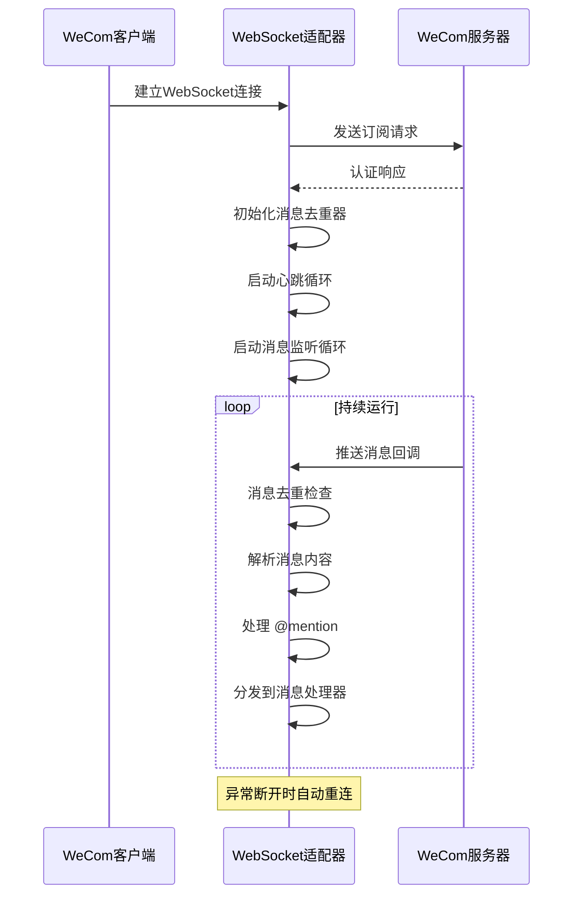
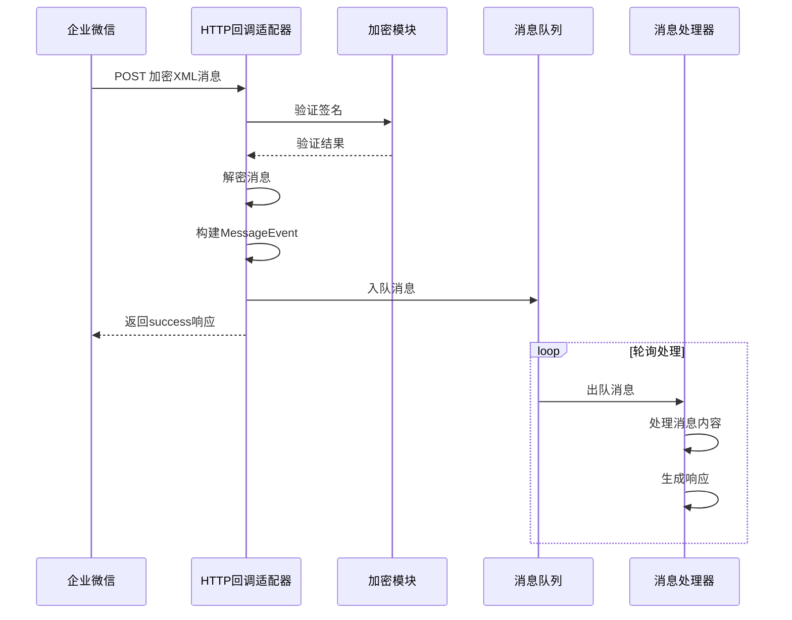
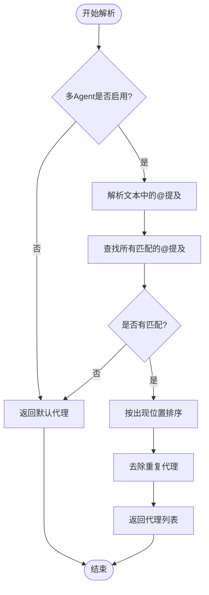
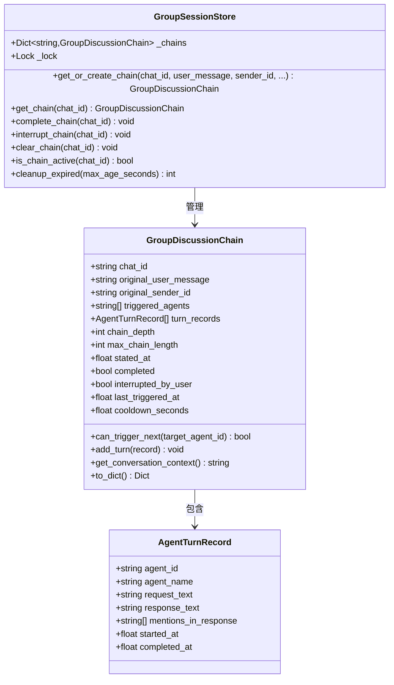

# 配置与部署

<cite>
**本文档引用的文件**
- [README.md](file://README.md)
- [wecom.py](file://wecom.py)
- [wecom_callback.py](file://wecom_callback.py)
- [wecom_crypto.py](file://wecom_crypto.py)
- [mention_router.py](file://mention_router.py)
- [group_session.py](file://group_session.py)
- [test_mention_fix.py](file://test_mention_fix.py)
- [bk/wecom1.py](file://bk/wecom1.py)
- [bk/mention_router.py](file://bk/mention_router.py)
- [bk/group_session.py](file://bk/group_session.py)
</cite>

## 目录
1. [简介](#简介)
2. [项目结构](#项目结构)
3. [核心组件](#核心组件)
4. [架构概览](#架构概览)
5. [详细组件分析](#详细组件分析)
6. [依赖关系分析](#依赖关系分析)
7. [性能考虑](#性能考虑)
8. [故障排除指南](#故障排除指南)
9. [结论](#结论)
10. [附录](#附录)

## 简介

WeCom 插件是 Hermes Agent 企业微信（WeCom）网关插件，提供了两种部署模式：WebSocket 模式和 HTTP 回调模式。该插件支持企业微信 AI Bot WebSocket 网关和自建企业应用的回调模式，具备多 Agent 群聊支持、消息去重、媒体文件处理等功能。

## 项目结构

```mermaid
graph TB
subgraph "核心插件文件"
A[wecom.py<br/>WebSocket 模式适配器]
B[wecom_callback.py<br/>HTTP 回调模式适配器]
C[wecom_crypto.py<br/>消息加解密模块]
end
subgraph "多 Agent 支持"
D[mention_router.py<br/>@mention 解析器]
E[group_session.py<br/>群聊会话管理]
end
subgraph "测试文件"
F[test_mention_fix.py<br/>@mention 修复测试]
end
subgraph "备份文件"
G[bk/wecom1.py<br/>WebSocket 模式适配器备份]
H[bk/mention_router.py<br/>@mention 解析器备份]
I[bk/group_session.py<br/>群聊会话管理备份]
end
A --> D
A --> E
B --> C
D --> E
```

**图表来源**
- [wecom.py:1-1774](file://wecom.py#L1-L1774)
- [wecom_callback.py:1-388](file://wecom_callback.py#L1-L388)
- [wecom_crypto.py:1-143](file://wecom_crypto.py#L1-L143)
- [mention_router.py:1-155](file://mention_router.py#L1-L155)
- [group_session.py:1-188](file://group_session.py#L1-L188)

**章节来源**
- [README.md:1-43](file://README.md#L1-L43)

## 核心组件

### WeCom WebSocket 适配器

WeCom WebSocket 适配器是插件的核心组件，负责与企业微信 AI Bot WebSocket 网关建立持久连接，处理双向通信。

**关键特性：**
- 持久 WebSocket 连接管理
- 自动重连机制
- 消息去重处理
- 文本批处理优化
- 多 Agent 群聊支持

**环境变量配置：**
- `WECOM_BOT_ID`: 企业微信机器人 ID
- `WECOM_SECRET`: 企业微信机器人密钥
- `WECOM_WEBSOCKET_URL`: WebSocket 服务器地址
- `WECOM_DM_POLICY`: 私聊策略（open/allowlist/disabled/pairing）
- `WECOM_GROUP_POLICY`: 群聊策略（open/allowlist/disabled）
- `HERMES_WECOM_TEXT_BATCH_DELAY_SECONDS`: 文本批处理延迟
- `HERMES_WECOM_TEXT_BATCH_SPLIT_DELAY_SECONDS`: 文本分割批处理延迟

**章节来源**
- [wecom.py:168-207](file://wecom.py#L168-L207)
- [wecom.py:172-178](file://wecom.py#L172-L178)
- [wecom.py:180-185](file://wecom.py#L180-L185)
- [wecom.py:198-201](file://wecom.py#L198-L201)

### WeCom HTTP 回调适配器

HTTP 回调适配器用于处理自建企业应用的消息回调，支持多应用配置和主动发送消息。

**关键特性：**
- HTTP 服务器监听
- 消息加解密处理
- 访问令牌管理
- 主动消息发送
- 应用映射管理

**配置参数：**
- `host`: HTTP 服务器主机地址
- `port`: HTTP 服务器端口
- `path`: 回调路径
- `apps`: 应用配置列表
- `cop_id`: 企业 ID
- `cop_secret`: 企业密钥
- `agent_id`: 应用 ID
- `token`: 回调 token
- `encoding_aes_key`: 编码 AES 密钥

**章节来源**
- [wecom_callback.py:56-72](file://wecom_callback.py#L56-L72)
- [wecom_callback.py:59-62](file://wecom_callback.py#L59-L62)
- [wecom_callback.py:82-97](file://wecom_callback.py#L82-L97)

### 消息加解密模块

提供与企业微信兼容的 AES-CBC 加解密功能，确保回调消息的安全传输。

**核心功能：**
- SHA1 签名验证
- AES-CBC 加密解密
- PKCS7 填充处理
- 随机数生成

**章节来源**
- [wecom_crypto.py:66-112](file://wecom_crypto.py#L66-L112)
- [wecom_crypto.py:84-112](file://wecom_crypto.py#L84-L112)

## 架构概览

```mermaid
graph TB
subgraph "企业微信平台"
A[WeCom AI Bot WebSocket]
B[WeCom 企业应用回调]
end
subgraph "插件适配层"
C[WebSocket 适配器]
D[HTTP 回调适配器]
E[消息加解密模块]
end
subgraph "多 Agent 支持"
F[@mention 解析器]
G[群聊会话管理]
end
subgraph "应用层"
H[消息处理器]
I[响应发送器]
end
A --> C
B --> D
D --> E
C --> F
C --> G
F --> H
G --> H
H --> I
```

**图表来源**
- [wecom.py:160-167](file://wecom.py#L160-L167)
- [wecom_callback.py:55-71](file://wecom_callback.py#L55-L71)
- [wecom_crypto.py:66-83](file://wecom_crypto.py#L66-L83)

## 详细组件分析

### WebSocket 连接生命周期



**图表来源**
- [wecom.py:212-247](file://wecom.py#L212-L247)
- [wecom.py:338-377](file://wecom.py#L338-L377)
- [wecom.py:378-396](file://wecom.py#L378-L396)

### HTTP 回调处理流程



**图表来源**
- [wecom_callback.py:247-276](file://wecom_callback.py#L247-L276)
- [wecom_callback.py:278-288](file://wecom_callback.py#L278-L288)
- [wecom_callback.py:293-300](file://wecom_callback.py#L293-L300)

### @mention 解析算法



**图表来源**
- [mention_router.py:102-118](file://mention_router.py#L102-L118)
- [mention_router.py:120-126](file://mention_router.py#L120-L126)

**章节来源**
- [mention_router.py:46-101](file://mention_router.py#L46-L101)
- [test_mention_fix.py:8-23](file://test_mention_fix.py#L8-L23)

### 群聊会话管理



**图表来源**
- [group_session.py:21-49](file://group_session.py#L21-L49)
- [group_session.py:96-103](file://group_session.py#L96-L103)

**章节来源**
- [group_session.py:96-158](file://group_session.py#L96-L158)
- [group_session.py:176-188](file://group_session.py#L176-L188)

## 依赖关系分析

```mermaid
graph TB
subgraph "外部依赖"
A[aiohttp<br/>异步HTTP客户端]
B[httpx<br/>异步HTTP客户端]
C[cryptography<br/>加密库]
end
subgraph "内部模块"
D[BasePlatformAdapter<br/>基础适配器]
E[MessageDeduplicator<br/>消息去重器]
F[MentionRouter<br/>@mention路由器]
end
subgraph "WeCom插件"
G[WeComAdapter<br/>WebSocket适配器]
H[WecomCallbackAdapter<br/>HTTP回调适配器]
I[WeComCrypto<br/>加密工具]
end
A --> G
B --> G
C --> I
D --> G
E --> G
F --> G
D --> H
I --> H
```

**图表来源**
- [wecom.py:46-60](file://wecom.py#L46-L60)
- [wecom_callback.py:22-40](file://wecom_callback.py#L22-L40)
- [wecom_crypto.py:18-20](file://wecom_crypto.py#L18-L20)

**章节来源**
- [wecom.py:108-111](file://wecom.py#L108-L111)
- [wecom_callback.py:51-53](file://wecom_callback.py#L51-L53)

## 性能考虑

### 连接管理优化

**WebSocket 连接池管理：**
- 最大重连退避时间：60秒
- 心跳间隔：30秒
- 连接超时：20秒
- 请求超时：15秒

**消息处理优化：**
- 文本批处理延迟：默认0.6秒
- 文本分割批处理延迟：默认2.0秒
- 消息去重缓存大小：1000条
- 媒体文件最大大小限制：
  - 图片：10MB
  - 视频：10MB
  - 语音：2MB
  - 文件：20MB

**章节来源**
- [wecom.py:90-105](file://wecom.py#L90-L105)
- [wecom.py:198-201](file://wecom.py#L198-L201)
- [wecom.py:96](file://wecom.py#L96)

### 内存管理

**群聊会话存储：**
- 使用内存存储讨论链状态
- 支持链状态清理过期记录
- 默认过期时间为300秒
- 支持并发访问锁保护

**章节来源**
- [group_session.py:96-103](file://group_session.py#L96-L103)
- [group_session.py:159-170](file://group_session.py#L159-L170)

## 故障排除指南

### 常见部署问题

**WebSocket 连接失败：**
1. 检查网络连接和防火墙设置
2. 验证企业微信机器人配置
3. 确认 WebSocket 服务器地址可用
4. 查看连接超时和重连日志

**HTTP 回调验证失败：**
1. 检查回调 URL 配置
2. 验证签名计算过程
3. 确认编码密钥长度为43字符
4. 验证企业 ID 和应用 ID 配置

**@mention 功能异常：**
1. 检查多 Agent 配置
2. 验证 @mention 模式正则表达式
3. 确认代理名称和 ID 配置
4. 查看消息解析日志

**章节来源**
- [wecom.py:214-246](file://wecom.py#L214-L246)
- [wecom_callback.py:232-245](file://wecom_callback.py#L232-L245)
- [test_mention_fix.py:26-77](file://test_mention_fix.py#L26-L77)

### 日志配置和调试

**日志级别设置：**
- 连接状态：INFO 级别
- 错误处理：ERROR 级别
- 调试信息：DEBUG 级别
- 性能监控：WARNING 级别

**调试模式启用：**
- 设置环境变量 `LOG_LEVEL=DEBUG`
- 启用详细的消息跟踪
- 检查网络连接状态
- 验证配置参数有效性

**章节来源**
- [wecom.py:236](file://wecom.py#L236)
- [wecom_callback.py:133-136](file://wecom_callback.py#L133-L136)

## 结论

WeCom 插件提供了完整的企业微信集成解决方案，支持两种部署模式以满足不同场景需求。WebSocket 模式适合实时交互场景，HTTP 回调模式适合自建应用集成。插件具备完善的多 Agent 支持、消息去重、媒体处理等高级功能，能够满足企业级应用的需求。

## 附录

### 配置文件示例

**YAML 配置结构：**
```yaml
gateway:
  platforms:
    wecom:
      enabled: true
      extra:
        bot_id: "your-bot-id"
        secret: "your-secret"
        websocket_url: "wss://openws.work.weixin.qq.com"
        dm_policy: "open"
        group_policy: "open"
        multi_agent:
          enabled: true
          default_agent: "default"
          agents:
            alpha:
              name: "Alpha助手"
              mention_patterns:
                - "@Alpha"
                - "@Alpha助手"
          cross_agent:
            enabled: true
            max_chain_length: 5
            chain_cooldown_seconds: 3
```

**章节来源**
- [README.md:23-38](file://README.md#L23-L38)

### 环境变量参考

**必需环境变量：**
- `WECOM_BOT_ID`: 企业微信机器人 ID
- `WECOM_SECRET`: 企业微信机器人密钥

**可选环境变量：**
- `WECOM_WEBSOCKET_URL`: WebSocket 服务器地址
- `WECOM_DM_POLICY`: 私聊策略
- `WECOM_GROUP_POLICY`: 群聊策略
- `HERMES_WECOM_TEXT_BATCH_DELAY_SECONDS`: 文本批处理延迟
- `HERMES_WECOM_TEXT_BATCH_SPLIT_DELAY_SECONDS`: 文本分割批处理延迟

**章节来源**
- [wecom.py:172-178](file://wecom.py#L172-L178)
- [wecom.py:180-185](file://wecom.py#L180-L185)
- [wecom.py:198-201](file://wecom.py#L198-L201)

### 安全配置检查清单

**企业微信集成安全：**
- ✅ 验证回调 URL 的 HTTPS 配置
- ✅ 确认编码密钥的正确性和长度
- ✅ 检查企业 ID 和应用 ID 的权限范围
- ✅ 验证访问令牌的有效期管理
- ✅ 确保消息加解密的完整性校验
- ✅ 配置适当的网络访问控制
- ✅ 设置合理的超时和重试策略

**数据保护措施：**
- ✅ 媒体文件的临时存储和清理
- ✅ 敏感信息的日志脱敏处理
- ✅ 连接的 TLS 加密传输
- ✅ 用户隐私数据的最小化收集

**章节来源**
- [wecom_crypto.py:66-112](file://wecom_crypto.py#L66-L112)
- [wecom_callback.py:364-387](file://wecom_callback.py#L364-L387)