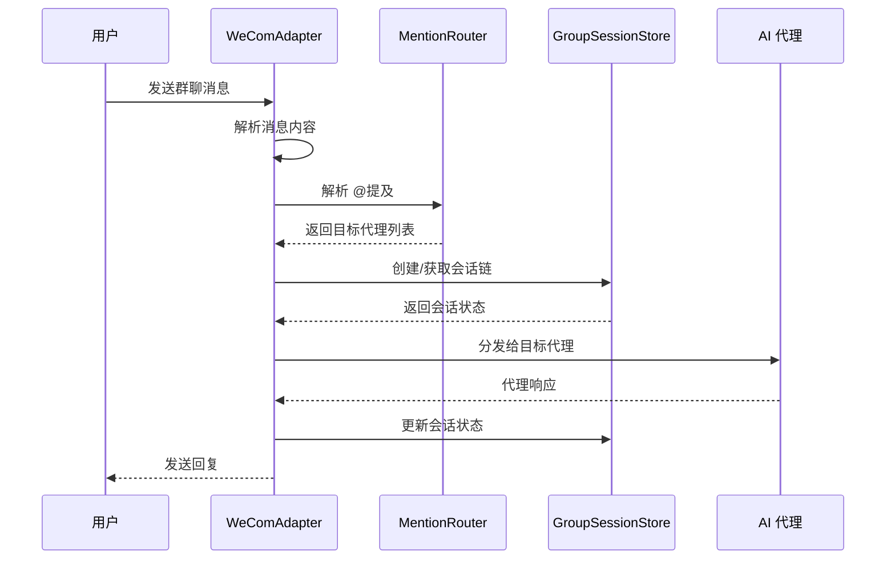
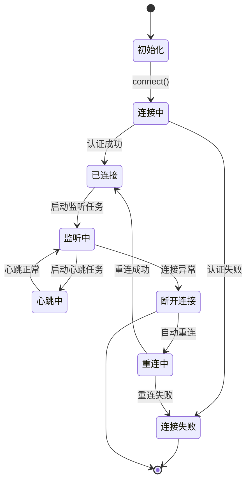
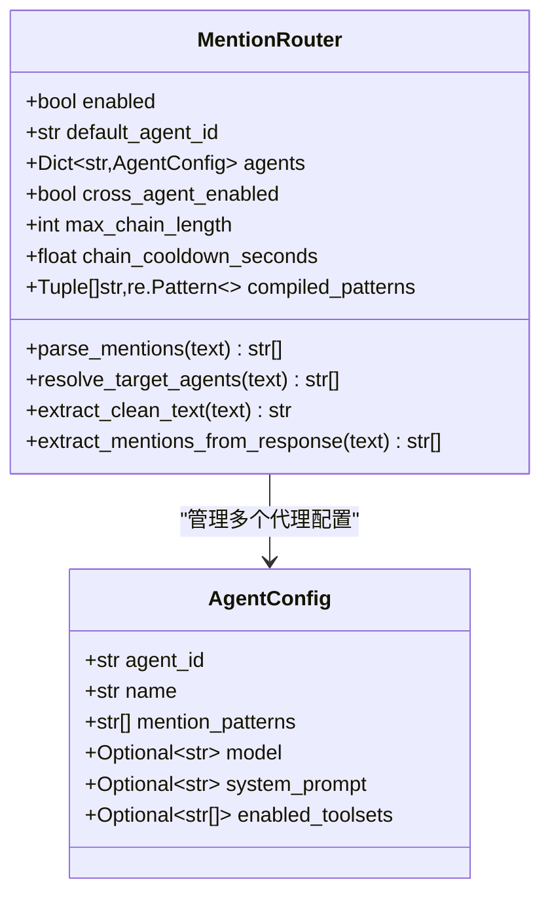
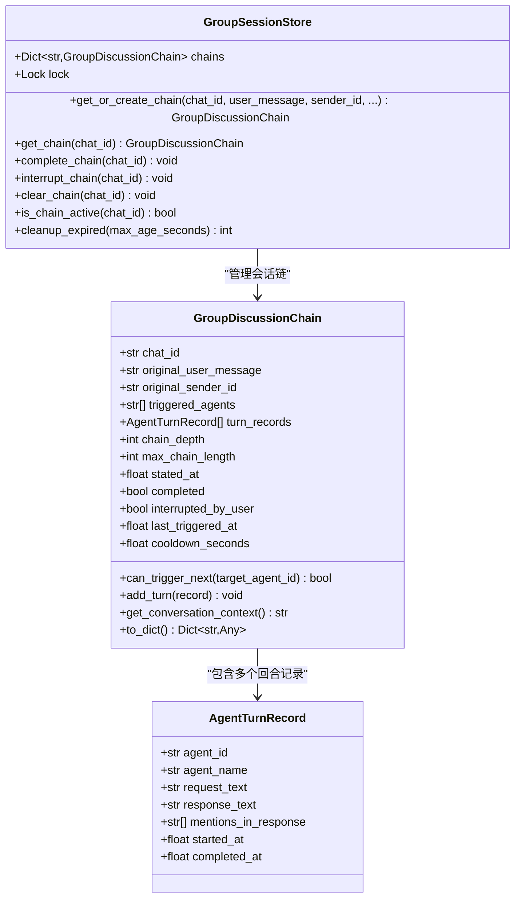
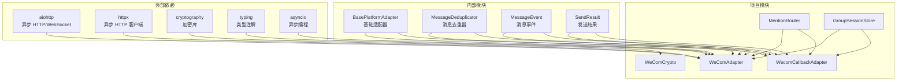

# 项目概述

<cite>
**本文档引用的文件**
- [README.md](file://README.md)
- [wecom.py](file://wecom.py)
- [wecom_callback.py](file://wecom_callback.py)
- [wecom_crypto.py](file://wecom_crypto.py)
- [mention_router.py](file://mention_router.py)
- [group_session.py](file://group_session.py)
- [test_mention_fix.py](file://test_mention_fix.py)
- [bk/fix_file.py](file://bk/fix_file.py)
- [bk/wecom_fixed.py](file://bk/wecom_fixed.py)
- [bk/wecom1.py](file://bk/wecom1.py)
- [bk/wecom_callback.py](file://bk/wecom_callback.py)
- [bk/wecom_crypto.py](file://bk/wecom_crypto.py)
</cite>

## 目录
1. [项目简介](#项目简介)
2. [项目结构](#项目结构)
3. [核心组件](#核心组件)
4. [架构总览](#架构总览)
5. [详细组件分析](#详细组件分析)
6. [依赖关系分析](#依赖关系分析)
7. [性能考虑](#性能考虑)
8. [故障排除指南](#故障排除指南)
9. [结论](#结论)

## 项目简介

WeCom 网关插件是一个专为企业微信（WeCom）平台设计的消息适配器系统，旨在为 Hermes Agent 提供企业微信的无缝集成能力。该项目实现了两种不同的适配模式：WebSocket 模式和 HTTP 回调模式，支持多代理协作系统，能够处理复杂的群聊 @提及解析和会话管理。

### 主要特性

- **双模式支持**：同时支持 WebSocket 实时通信和 HTTP 回调两种企业微信接入方式
- **多代理协作**：在群聊环境中实现多个 AI 代理的智能协作和链式对话
- **智能 @提及解析**：精确识别和解析群聊中的 @提及标记，支持多代理触发
- **会话状态管理**：维护多代理讨论链的完整上下文和状态
- **安全加密**：内置企业微信回调消息的加解密功能
- **高可用性**：具备自动重连、心跳检测和错误恢复机制

### 技术目标

该项目的核心目标是为企业微信平台提供一个稳定、可靠且功能丰富的网关插件，使企业能够在现有的企业微信生态中部署和管理 AI 代理服务，实现智能化的企业级沟通和协作。

## 项目结构

项目采用模块化设计，每个核心功能都封装在独立的模块中，便于维护和扩展。

```mermaid
graph TB
subgraph "核心适配器模块"
A[wecom.py<br/>WebSocket 适配器]
B[wecom_callback.py<br/>HTTP 回调适配器]
end
subgraph "辅助功能模块"
C[wecom_crypto.py<br/>消息加解密]
D[mention_router.py<br/>@提及解析器]
E[group_session.py<br/>群聊会话管理]
end
subgraph "测试和工具"
F[test_mention_fix.py<br/>@提及测试]
G[fix_file.py<br/>文件修复工具]
end
subgraph "备份文件"
H[bk/wecom_fixed.py]
I[bk/wecom1.py]
J[bk/wecom_callback.py]
K[bk/wecom_crypto.py]
end
A --> D
A --> E
B --> C
A --> C
```

**图表来源**
- [wecom.py:1-1774](file://wecom.py#L1-L1774)
- [wecom_callback.py:1-388](file://wecom_callback.py#L1-L388)
- [wecom_crypto.py:1-143](file://wecom_crypto.py#L1-L143)

**章节来源**
- [README.md:1-43](file://README.md#L1-L43)

## 核心组件

### WeComAdapter（WebSocket 适配器）

WeComAdapter 是项目的核心组件，负责与企业微信 AI Bot 网关建立持久的 WebSocket 连接，处理双向通信。

#### 主要功能
- **连接管理**：建立和维护 WebSocket 连接，支持自动重连机制
- **消息路由**：根据消息类型和命令进行智能路由
- **去重处理**：防止重复消息的处理
- **媒体处理**：支持图片、文件等多媒体内容的下载和缓存
- **策略控制**：基于配置的用户和群组访问控制

#### 关键特性
- 支持多种消息类型（文本、图片、文件、语音等）
- 实现消息分片合并机制，处理长文本消息
- 提供详细的错误处理和日志记录
- 支持配置化的消息长度限制和超时设置

**章节来源**
- [wecom.py:160-800](file://wecom.py#L160-L800)

### WecomCallbackAdapter（HTTP 回调适配器）

WecomCallbackAdapter 实现了企业微信标准回调模式，适用于自建应用的集成场景。

#### 主要功能
- **HTTP 服务器**：提供回调端点接收企业微信推送的消息
- **消息解密**：使用企业微信标准加密算法解密回调消息
- **应用管理**：支持多应用配置和访问令牌管理
- **异步处理**：采用队列机制异步处理消息，提高响应速度

#### 关键特性
- 支持多企业应用配置
- 实现访问令牌的自动刷新和缓存
- 提供健康检查和 URL 验证功能
- 兼容企业微信的事件通知

**章节来源**
- [wecom_callback.py:55-388](file://wecom_callback.py#L55-L388)

### MentionRouter（@提及解析器）

MentionRouter 负责解析群聊中的 @提及标记，实现多代理协作的核心功能。

#### 主要功能
- **模式匹配**：支持多种 @提及模式的正则表达式匹配
- **代理映射**：将 @提及映射到具体的代理配置
- **顺序解析**：保持 @提及出现的先后顺序
- **文本清理**：移除 @提及标记，提取纯文本内容

#### 关键特性
- 支持自定义提及模式
- 提供默认代理配置
- 实现跨代理链式调用
- 防止无限循环的链式长度限制

**章节来源**
- [mention_router.py:46-155](file://mention_router.py#L46-L155)

### GroupSessionStore（群聊会话管理）

GroupSessionStore 维护多代理讨论链的完整状态，确保会话的连续性和一致性。

#### 主要功能
- **链式状态**：跟踪多代理讨论链的完整历史
- **上下文构建**：为后续代理构建合适的对话上下文
- **防重复触发**：防止同一代理在同一条链中被重复触发
- **冷却机制**：实现代理触发的冷却时间控制

#### 关键特性
- 基于内存的会话存储
- 异步安全的并发访问
- 自动清理过期会话
- 支持中断和完成状态管理

**章节来源**
- [group_session.py:96-188](file://group_session.py#L96-L188)

## 架构总览

项目采用分层架构设计，将不同职责的功能模块清晰分离，形成高度内聚、低耦合的系统结构。

```mermaid
graph TB
subgraph "应用层"
A[业务应用]
end
subgraph "适配器层"
B[WeComAdapter<br/>WebSocket 模式]
C[WecomCallbackAdapter<br/>HTTP 回调模式]
end
subgraph "功能服务层"
D[MentionRouter<br/>@提及解析]
E[GroupSessionStore<br/>会话管理]
F[MessageDeduplicator<br/>消息去重]
end
subgraph "基础设施层"
G[aiohttp<br/>WebSocket 客户端]
H[httpx<br/>HTTP 客户端]
I[Cryptography<br/>加密库]
end
subgraph "企业微信平台"
J[WeCom AI Bot 网关]
K[WeCom 回调服务器]
end
A --> B
A --> C
B --> D
B --> E
B --> F
C --> D
C --> E
B --> G
C --> H
B --> I
C --> I
G --> J
H --> K
```

**图表来源**
- [wecom.py:60-70](file://wecom.py#L60-L70)
- [wecom_callback.py:38-41](file://wecom_callback.py#L38-L41)

### 数据流架构



**图表来源**
- [wecom.py:509-586](file://wecom.py#L509-L586)
- [mention_router.py:120-127](file://mention_router.py#L120-L127)
- [group_session.py:104-128](file://group_session.py#L104-L128)

## 详细组件分析

### WeComAdapter 详细分析

WeComAdapter 是整个系统的核心，实现了企业微信 WebSocket 模式的完整适配逻辑。

#### 连接生命周期管理



**图表来源**
- [wecom.py:212-278](file://wecom.py#L212-L278)

#### 消息处理流程

```mermaid
flowchart TD
A[收到 WebSocket 消息] --> B{消息类型判断}
B --> |回调消息| C[解析消息体]
B --> |心跳响应| D[更新心跳状态]
B --> |事件通知| E[处理事件]
C --> F{消息去重检查}
F --> |重复| G[忽略消息]
F --> |新消息| H{群聊消息?}
H --> |是| I{是否允许该群组?}
H --> |否| J{是否允许私聊?}
I --> |不允许| G
I --> |允许| K{是否 @提及?}
J --> |不允许| G
J --> |允许| L[创建消息事件]
K --> |是| L
K --> |否| M{@提及解析器启用?}
M --> |是| N{解析到目标代理?}
M --> |否| G
N --> |是| L
N --> |否| G
L --> O[发送到消息处理器]
O --> P[处理完成]
P --> Q[发送响应]
Q --> R[更新会话状态]
R --> S[结束]
```

**图表来源**
- [wecom.py:495-586](file://wecom.py#L495-L586)

**章节来源**
- [wecom.py:212-586](file://wecom.py#L212-L586)

### 多代理协作系统

多代理协作系统是项目的核心创新，实现了复杂的企业微信群聊场景下的智能代理调度。

#### @提及解析机制



**图表来源**
- [mention_router.py:46-155](file://mention_router.py#L46-L155)

#### 会话链管理



**图表来源**
- [group_session.py:21-188](file://group_session.py#L21-L188)

**章节来源**
- [mention_router.py:46-155](file://mention_router.py#L46-L155)
- [group_session.py:96-188](file://group_session.py#L96-L188)

### 加密解密模块

企业微信回调消息的安全性至关重要，项目提供了完整的加密解密解决方案。

#### 加密算法实现


**图表来源**
- [wecom_crypto.py:66-143](file://wecom_crypto.py#L66-L143)

**章节来源**
- [wecom_crypto.py:66-143](file://wecom_crypto.py#L66-L143)

## 依赖关系分析

项目依赖关系相对简单，主要依赖于 Python 异步网络库和加密库。



**图表来源**
- [wecom.py:46-70](file://wecom.py#L46-L70)
- [wecom_callback.py:22-41](file://wecom_callback.py#L22-L41)

### 核心依赖分析

| 依赖库 | 版本要求 | 使用场景 | 重要性 |
|--------|----------|----------|--------|
| aiohttp | >= 3.0 | WebSocket 连接、HTTP 请求 | 核心依赖 |
| httpx | >= 0.18 | 异步 HTTP 客户端 | 核心依赖 |
| cryptography | >= 3.0 | AES-CBC 加密解密 | 安全相关 |
| typing | Python 标准库 | 类型注解 | 开发工具 |

**章节来源**
- [wecom.py:46-59](file://wecom.py#L46-L59)
- [wecom_callback.py:22-37](file://wecom_callback.py#L22-L37)

## 性能考虑

项目在设计时充分考虑了性能优化，特别是在高并发场景下的表现。

### 连接池和资源管理

- **连接复用**：WebSocket 连接保持持久，避免频繁重建
- **异步处理**：完全基于 asyncio，非阻塞 I/O 操作
- **内存管理**：及时清理过期的会话和缓存数据
- **超时控制**：合理的连接超时和请求超时设置

### 消息处理优化

- **批量处理**：长文本消息的分片合并，减少处理次数
- **去重机制**：防止重复消息的处理，节省系统资源
- **背压控制**：消息队列的容量限制，防止内存溢出
- **并发控制**：异步任务的合理调度和取消

### 缓存策略

- **会话缓存**：内存中的会话状态，快速访问
- **媒体缓存**：下载的媒体文件本地缓存
- **令牌缓存**：企业微信访问令牌的短期缓存
- **配置缓存**：动态配置的缓存机制

## 故障排除指南

### 常见问题诊断

#### 连接问题

**问题症状**：无法连接到企业微信网关
**可能原因**：
- 网络连接异常
- 认证凭据错误
- 企业微信服务不可用
- 防火墙阻断

**解决步骤**：
1. 验证 bot_id 和 secret 配置
2. 检查网络连通性
3. 查看认证日志
4. 尝试手动重连

#### 消息处理问题

**问题症状**：消息丢失或重复
**可能原因**：
- 消息去重机制失效
- 会话状态异常
- 网络中断导致的消息丢失

**解决步骤**：
1. 检查 MessageDeduplicator 配置
2. 验证会话状态同步
3. 查看网络连接稳定性
4. 重启适配器服务

#### @提及解析问题

**问题症状**：@提及无法正确识别
**可能原因**：
- 正则表达式配置错误
- 代理名称配置不匹配
- 文本编码问题

**解决步骤**：
1. 验证 mention_patterns 配置
2. 检查代理名称大小写
3. 测试正则表达式匹配
4. 查看解析日志

**章节来源**
- [wecom.py:212-247](file://wecom.py#L212-L247)
- [test_mention_fix.py:26-133](file://test_mention_fix.py#L26-L133)

### 日志分析

项目提供了详细的日志记录，有助于问题诊断：

- **连接日志**：显示连接状态变化和认证过程
- **消息日志**：记录消息的接收、处理和发送过程
- **错误日志**：捕获异常和错误信息
- **性能日志**：监控处理延迟和吞吐量

## 结论

WeCom 网关插件项目是一个设计精良、功能完整的消息适配器系统，成功实现了企业微信平台的深度集成。项目的主要优势包括：

### 技术优势

1. **架构清晰**：模块化设计，职责分离明确
2. **功能完整**：支持双模式适配，覆盖企业微信主要使用场景
3. **扩展性强**：良好的接口设计，便于功能扩展
4. **性能优秀**：异步处理，高并发支持良好

### 应用价值

1. **企业级应用**：满足企业微信生态的集成需求
2. **AI 代理部署**：为 AI 代理提供稳定的消息通道
3. **多代理协作**：实现复杂的群聊场景下的智能协作
4. **安全可靠**：完整的加密解密和访问控制机制

### 发展建议

1. **监控增强**：增加更详细的性能监控指标
2. **配置管理**：实现动态配置热更新
3. **测试完善**：增加单元测试和集成测试覆盖率
4. **文档优化**：提供更详细的开发和部署文档

该项目为 Hermes Agent 生态系统提供了重要的企业微信集成能力，是企业级 AI 应用部署的理想选择。